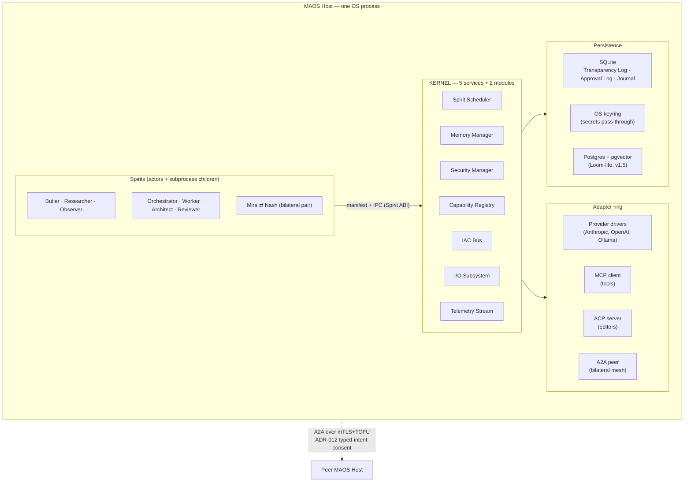

# MAOS — Modular Agentic Operating System

> A kernel that hosts LLM-backed agents the way an OS hosts processes:
> capability-isolated, auditable by construction, and vendor-neutral.

[](#license)
[](rust-toolchain.toml)
[](#project-status)

MAOS is a **substrate, not a product.** It is a small, invariant kernel on which
specialized agents — called **Spirits** — are loaded, swapped, and composed like
processes on a conventional operating system. The kernel exposes one stable
contract (the Spirit ABI) and a handful of services; Spirits supply behavior and
nothing else. The same primitives compose, *by configuration alone*, into a
single-user laptop assistant, a peer-to-peer team mesh, a diagnostic/architect
pair, or a continent-spanning enterprise deployment.

**One substrate, many shapes, infinite Spirits.**

---

## Table of contents

- [Why MAOS exists](#why-maos-exists)
- [The big idea](#the-big-idea)
- [Architecture at a glance](#architecture-at-a-glance)
- [The eight Foundational Commitments](#the-eight-foundational-commitments)
- [Constitutional invariants (I1–I14)](#constitutional-invariants-i1i14)
- [Pick your door](#pick-your-door)
  - [Run MAOS](#-run-maos)
  - [Write a Spirit](#-write-a-spirit)
  - [Understand MAOS](#-understand-maos)
- [Repository layout](#repository-layout)
- [The workspace: crates and Spirits](#the-workspace-crates-and-spirits)
- [Build discipline](#build-discipline)
- [Project status & roadmap](#project-status--roadmap)
- [Contributing](#contributing)
- [Security](#security)
- [License](#license)

---

## Why MAOS exists

The 2026 agent landscape is a fragmented archipelago. Claude Code, Codex, Gemini
CLI, Cursor — each is a competent agent, each a *closed* runtime. Teams that want
multi-agent collaboration must accept one vendor's lock-in, cobble together
brittle integrations, or roll their own kernel from scratch. Every existing
approach picks one of three failed answers to "what should the substrate be?":

| Approach | Example | What it costs you |
|---|---|---|
| **Vendor-monolithic** | Claude Code, ChatGPT app, Cursor | The agent and its runtime ship together. No model choice, no sandbox tier, no two agents that respect each other's boundaries unless one vendor built both. |
| **Cobble-it-yourself** | LangChain, AutoGen | The substrate is whatever you assembled this week. No durable transparency log, no capability tokens, no standard memory model. |
| **Roll your own kernel** | Bespoke in-house runtimes | Excellent within scope; none generalizes to "an agent class you haven't imagined yet." |

The shared failure: **trust is built on vendor promises, not substrate
guarantees.** A user installing a third-party agent has no kernel-level
enforcement that it cannot bypass approvals, leak secrets, exceed budgets, or
hallucinate confidently into production.

MAOS answers differently: **trust grounded in transparent mechanism.** When you
ask "what can this thing do?" the answer is read from its manifest against the
kernel's known capability surface — not from hoping its author is honest.

## The big idea

MAOS separates the **kernel** (invariant, small, ~20 KLOC core) from **Spirits**
(hot-swappable, manifest-declared, any language).

- **Spirits do behavior; the kernel does infrastructure.** A Spirit's binary
  contains lifecycle hooks, IAC handlers, decision logic, and a system prompt —
  and *nothing else*. No HTTP libraries, no LLM SDKs, no MCP clients, no socket
  code. Those are kernel-provided adapters. Every external call uniformly hits
  the audited Capability Registry path.
- **Human transparency is a kernel invariant, not an application choice.** "No
  invisible actions, no puppeting, no asymmetric knowledge" is enforced by the
  Transparency Log before any Spirit gets to author behavior. The kernel will not
  deliver a frame the Transparency Log refused to record.
- **The kernel learns nothing.** Patterns, fix templates, regression tests — all
  live in user-space. The kernel mediates and audits propagation; it never
  stores, indexes, or learns from the contents.
- **Epistemic halt is a first-class outcome.** When a Spirit's evidence is
  insufficient or contradictory, it *halts*; the user resolves with
  `provided_context`, `accepted_halt`, or `authorized_override`. Hallucination
  becomes a user-mediated, audit-trailed event — not a silent regression. No
  prior agent runtime makes "I don't know" a first-class result.

## Architecture at a glance

A **MAOS Host** is a single OS process running the kernel. The kernel exposes
five services plus two internal modules and one stable contract. Spirits run as
in-process Rust actors (v0.1) or subprocess binaries (the first
third-party-shippable form); a WASM-component form is planned for v2.0.



- **Hexagonal** for static structure (domain core / kernel services / adapter
  ring); the **actor model** on the runtime hot path (each Spirit is a
  Tokio-supervised actor with a bounded mailbox, no shared mutable state).
- **Same-Host** Spirits speak through the IAC mailbox. **Cross-Host** Spirits
  speak A2A over mTLS+TOFU in a bilateral two-host pre-pairing pattern.
- **Memory** has three namespaces: per-Spirit private, shared (this Host), and
  collective (Loom-lite). The **Telemetry Stream** is the perceptual organ; the
  Observer Spirit is its canonical consumer.

## The eight Foundational Commitments

These bind the substrate. Weakening any of them trips the `invariant-lock` CI
gate and forces a major-version bump (ADR-037). Full text in
[`architecture-maos-minimal-opus/06-foundational-commitments.md`](_bmad-output/planning-artifacts/architecture-maos-minimal-opus/06-foundational-commitments.md).

1. **Kernel/Spirit separation is enforced, not advisory.** Spirits never share
   address space without the IAC bus, never touch the filesystem outside Memory
   Manager namespaces, never spawn tools outside the Capability Registry.
2. **The kernel learns nothing.** All patterns and knowledge live in user-space.
3. **Human transparency is a kernel invariant.** Every IAC frame is logged
   *before* delivery; auto-responses are stamped; approvals capture intent.
4. **One Spirit form per phase.** Subprocess-only at v0.1; in-process Rust
   unlocks only via the §13 measurement gate and a superseding ADR.
5. **Every external call is mediated through the Capability Registry.**
6. **Capability tokens are unforgeable, short-lived, and Spirit-bound** (TTL ≤60s
   for high-privilege ops; no replay across processes).
7. **Epistemic halt is a Layer-1 capability.** Spirits compute their own scalars;
   the kernel compares via four universal predicates and never introspects Spirit
   cognition.
8. **Constitutional governance is structural, not procedural.** Invariant changes
   require the `invariant-lock` gate; per-crate KLOC ceilings enforced by `tokei`
   (≤20 KLOC kernel core, alarm at 16).

## Constitutional invariants (I1–I14)

Non-negotiable runtime guarantees, each mechanically gated. One file per
invariant lives under [`docs/invariants/`](docs/invariants/).

| # | Guarantee |
|---|---|
| **I1** | Spirits cannot bypass the Capability Registry |
| **I2** | Every IAC interaction is logged before delivery |
| **I3** | Auto-responses are always marked `[auto-sent]` on both sides |
| **I4** | Every approval captures intent, not just decision |
| **I5** | Memory scopes are kernel-enforced |
| **I6** | Hot-swap preserves Capability Tokens for in-flight tool calls |
| **I7** | Telemetry is broadcast; subscription is per-Spirit |
| **I8** | Cross-Host A2A interactions require explicit consent at both ends |
| **I9** | The kernel itself stores no secrets and learns no patterns |
| **I10** | Every Spirit lifecycle transition is journaled |
| **I11** | Persisted digests reference their raw source frames |
| **I12** | Every byte in Spirit context is traceable to a `log.recall` or inbound entry |
| **I13** | Digests carry intent provenance |
| **I14** | Hot-swap preserves halt continuity |

## Pick your door

Three entry points, depending on why you're here (mirrors the
[`docs/maos.dev/`](docs/maos.dev/) landing page).

### ▶️ Run MAOS

Build the kernel host (`maos`) and the operator CLI (`maosctl`):

```sh
cargo build -p maos-bin --release      # the `maos` Host executable
cargo build -p maos-cli --release      # the `maosctl` operator CLI
```

Initialize a Host and start the runtime daemon:

```sh
maos init            # scaffold ~/.maos (state home; override with MAOS_HOME)
maos run             # start the kernel daemon and serving loop
maos shell           # kernel-rendered REPL — talk to a Spirit with `@<spirit> <msg>`
maos audit query     # read the Transparency Log
```

Operate with `maosctl`:

```sh
maosctl install <spirit>          # admit a Spirit
maosctl start | stop | unload     # lifecycle
maosctl posture <cautious|assistive|autonomous-with-halt>
maosctl halt list | halt resolve  # epistemic-halt resolution surface
maosctl audit query               # query Transparency / Approval logs
maosctl skills queue | status     # skill-ecosystem admission queue
maosctl import --offline <bundle> # air-gapped registry import
```

→ [`docs/maos.dev/run-maos.md`](docs/maos.dev/run-maos.md)

### 🛠️ Write a Spirit

The 30-minute first-Spirit path. Scaffold from the official template:

```sh
cargo generate --git https://github.com/lunarpulse/maos templates/spirit-rust --name my-spirit
```

Implement one lifecycle hook (e.g. `on_idle`) in `src/lib.rs`. The `#[spirit]`
macro wires your `impl` block into the `SpiritVtable` the kernel calls. Run it
locally against a mock `Ctx` — **no kernel required**:

```sh
cargo test -p my-spirit
```

Your Spirit is "done" when it compiles against the published ABI, its smoke test
passes, and it behaves correctly against the Butler-class regression corpus.
See the worked reference in [`examples/example-spirit/`](examples/example-spirit/).

→ [`docs/maos.dev/write-a-spirit.md`](docs/maos.dev/write-a-spirit.md)

### 📚 Understand MAOS

- **Architecture** — kernel-as-service design + the Spirit ABI:
  [`_bmad-output/planning-artifacts/architecture-maos-minimal-opus/`](_bmad-output/planning-artifacts/architecture-maos-minimal-opus/)
- **Invariants** — what the substrate enforces and how it's gated:
  [`docs/invariants/`](docs/invariants/)
- **ABI stability** — the v1.0 compatibility guarantees:
  [`STABILITY.md`](STABILITY.md) · breaking-change log in [`BREAKING.md`](BREAKING.md)
- **Trust model** — capability mediation, sandbox tiers, ComplianceClaim:
  [`SECURITY.md`](SECURITY.md)
- **Decision records** — the contested calls with rationale:
  [`docs/adr/`](docs/adr/)

→ [`docs/maos.dev/understand-maos.md`](docs/maos.dev/understand-maos.md)

## Repository layout

```
maos/
├── crates/        # the kernel workspace — ~30 crates (domain, kernel-core, adapters, CLI)
├── spirits/       # the nine reference Spirits (Butler, Researcher, … Mira/Nash)
├── examples/      # worked example Spirits (Rust + TypeScript)
├── templates/     # cargo-generate Spirit templates (Rust + TS)
├── sdks/          # Spirit-author SDKs
├── schemas/       # JSON schemas (manifest, ComplianceClaim, gateway, halt registry)
├── wit/           # WebAssembly Interface Types (v2.0 WASM Spirit form)
├── docs/          # invariants, ADRs, dev-discipline, the three-door docs site
├── xtask/         # build-discipline gates run on every PR
├── fuzz/          # fuzz targets
└── _bmad-output/  # planning & implementation artifacts (PRD, architecture, epics, stories)
```

## The workspace: crates and Spirits

A Cargo workspace of **44 members** on Rust **1.88 (stable)**.

### Kernel & substrate crates

| Crate | Responsibility |
|---|---|
| `maos-domain` | Pure types, invariants, and pure functions (hexagonal domain core, ADR-010) |
| `maos-kernel-core` | Capability mediation, IAC bus, journal — the invariant heart |
| `maos-bin` | The `maos` Host executable (composition root + runtime daemon) |
| `maos-cli` | The `maosctl` operator CLI |
| `maos-shell` | J0 evaluator surface — `init`, REPL, audit query |
| `maos-capability` | Capability registry — token, policy, audit, working-memory types |
| `maos-iac` | Inter-Agent Communication bus — mailbox, transparency log, frame routing |
| `maos-audit` | Read-side SQLite query adapter for the Transparency & Approval logs |
| `maos-persistence` | Storage adapters for journal, transparency log, memory tiers |
| `maos-secrets` | OS keyring & secret-provider adapters (NFR-Sec-16) |
| `maos-manifest` | Spirit manifest parsing and validation |
| `maos-compliance` | ComplianceClaim semantic evaluator + execution-context drift |
| `maos-control` | `maosctl` orchestration & Host-management primitives |

### Spirit ABI, SDK & ecosystem

| Crate | Responsibility |
|---|---|
| `maos-spirit-abi` | The stable public ABI surface for cross-version compatibility |
| `maos-spirit-sdk` | Reference SDK for Spirit authors (ADR-002) |
| `maos-spirit-derive` | `#[spirit]` proc-macro — derives the Spirit trait + vtable |
| `maos-attrs` | `#[i9_exempt]` attribute for I9 structural-state lint exemptions |
| `maos-spirit-hello` | `hello-spirit` reference acknowledgement binary (FR58) |
| `maos-spirit-cli` | `maos-spirit publish` producer-side CLI (FR35) |
| `maos-skill` | Kernel-mediated `maos.skill.v1` ecosystem + admission queue (FR57) |
| `maos-registry` | Spirit Registry — MCP-Streamable-HTTP server + kernel client |

### Adapters & protocols

| Crate | Responsibility |
|---|---|
| `maos-providers` | Pluggable LLM provider drivers — Anthropic, OpenAI, Ollama (ADR-005) |
| `maos-mcp` | Model Context Protocol gateway and tool adapters |
| `maos-acp` | Agent Communication Protocol server (NDJSON over stdio, editor bridges) |
| `maos-a2a-core` | Transport-agnostic ADR-012 A2A protocol substrate |
| `maos-a2a` | In-process loopback A2A router |
| `maos-a2a-tcp` | Live cross-Host JSON-RPC-over-mTLS/TCP transport |
| `maos-notify-push` | Generic HTTP mobile-push notification adapter |

### Quality, evaluation & tooling

| Crate | Responsibility |
|---|---|
| `maos-eval` | Evaluation harness — corpora + measurement gates (halt-recall/precision) |
| `maos-corpus-gen` | Parameterized corpus generators (secret-redaction, red-team) |
| `maos-bench` | §13.1 measurement gate — J1 founder-loop IPC + J4 colocation latency |
| `maos-journey-test` | Journey-acceptance test harness (cassette/fixture replay) |
| `xtask` | Build-discipline gates (run via `cargo xtask <gate>`) |

### Reference Spirits

The nine Spirits in [`spirits/`](spirits/) prove the substrate generalizes —
each adds **zero kernel KLOC**:

| Spirit | Role | What it demonstrates |
|---|---|---|
| **Butler** | first cognitive Spirit | `on_idle` anticipatory reasoning — calendar-conflict detection, comms triage, morning digest |
| **Researcher** | second cognitive Spirit | participant-scoped `log.recall` walker + I11 distillate chain + literature survey |
| **Observer** | read-only perceptual Spirit | broad `scalar.tap` subscriber + pre-halt drift watchdog |
| **Orchestrator** | founder-loop coordinator | drains the FR20 buffer, builds distillate-fed `task.assign` dispatches |
| **Worker** | CliWrapper Spirit | a `[cli_wrapper]` manifest wrapping a real fixture-CLI binary |
| **Architect** | founder-loop Worker | proposes a design from a task spec (deterministic at v0.8) |
| **Reviewer** | founder-loop Worker | critiques the Architect's proposal |
| **Mira** | prod-edge diagnostic (v1.5) | diagnoses anomalies, halts at its confidence boundary, advises Nash over A2A |
| **Nash** | dev-environment architect (v1.5) | receives Mira's cross-Host advisory and proposes a fix |

## Build discipline

MAOS enforces its constitution mechanically. The `xtask` crate hosts gates that
run on **every PR** — these shipped *before* kernel code, by design:

- **`invariant-lock`** — any change to invariant files, the `lock.toml` mapping,
  or `maos-domain` invariant types requires a machine-checkable diff, a corpus
  delta, a phase-commitment update, and ≥2 maintainer sign-offs (ADR-037).
- **KLOC ceilings** — `tokei`-enforced per-crate budgets; ≤20 KLOC kernel core,
  alarm at 16.
- **ABI diff** — `cargo public-api` gates the frozen Spirit ABI; only additive
  changes pass without a version bump.
- **Service-boundary lint** — `check-service-boundary` enforces the
  domain/service/adapter separation.
- **Empty-kernel (I9) lint** — structural check that the kernel learns nothing.

Common commands:

```sh
cargo build --workspace            # build everything
cargo test --workspace             # run the test suite
cargo xtask --help                 # list the discipline gates
cargo fmt --all && cargo clippy --workspace --all-targets
```

> **Note:** never run `cargo fmt -p <crate>` here — it causes whole-crate
> collateral churn. Use `cargo fmt --all`.

## Project status & roadmap

**Status: v0.1-alpha, actively developed.** The kernel substrate, the Spirit
ABI, the adapter ring, and all nine reference Spirits are implemented; the live
runtime spine (`maos run`) fires real Spirit behavior through production wiring.
Work is organized as **12 epics**; the substrate and reference-Spirit epics
(0 through 8) have landed, with operator productionization and the v1.0 ship gate
ahead.

| Phase | Milestone | Target |
|---|---|---|
| **v0.1** | Architect Spirit drives a real coding task on a local repo, end-to-end with approvals | ~6 weeks |
| **v0.5** | Single user has working Butler, Researcher, Observer, Architect on a laptop | ~12 weeks |
| **v1.0** | 8-person team uses peer A2A mesh end-to-end; third parties author & ship Spirit binaries | ~20 weeks |
| **v1.5** | Mira–Nash diagnostic/architect pair closes a prod-to-fix loop in ~90 min | ~28 weeks |
| **v2.0** | Cortex deployment at small scale; WASM Spirit registry live with signing + trust tiers | ~18 months |

Detailed planning lives under
[`_bmad-output/planning-artifacts/`](_bmad-output/planning-artifacts/) — the
product brief, the architecture, and the 12-epic breakdown.

## Contributing

MAOS is built under the **BMad Method** — planning artifacts (PRD, architecture,
epics, stories) drive implementation, and discipline gates enforce the
constitution on every change. Before contributing:

1. Read the relevant ADRs in [`docs/adr/`](docs/adr/) and the invariant register
   in [`docs/invariants/`](docs/invariants/).
2. Run the full gate suite locally (`cargo xtask`, `cargo test --workspace`).
3. Changes to invariants, the ABI, or KLOC budgets carry extra review — see the
   [Build discipline](#build-discipline) section.

## Security

To report a vulnerability, see [`SECURITY.md`](SECURITY.md). The trust model —
capability mediation, sandbox tiers (T0–T3), the Transparency Log, trust tiers,
and ComplianceClaim envelopes — is documented there and in the architecture.

## License

Licensed under either of:

- Apache License, Version 2.0 ([`LICENSE-APACHE`](LICENSE-APACHE))
- MIT license ([`LICENSE-MIT`](LICENSE-MIT))

at your option. Unless you explicitly state otherwise, any contribution
intentionally submitted for inclusion in the work, as defined in the Apache-2.0
license, shall be dual-licensed as above, without any additional terms or
conditions.
