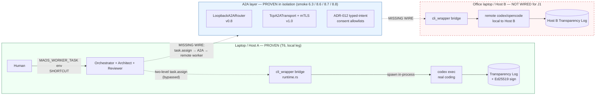
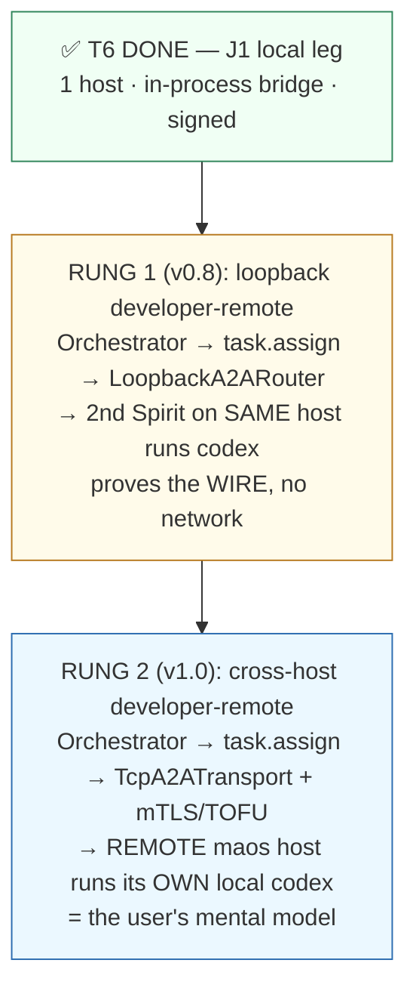

# Analysis Brief — J1 Cross-Host `developer-remote` Demo

> **Purpose & status.** This is a **course-correction feeder** — a grounded
> analysis authored by Paige (Technical Writer) to pre-stage context for the
> `bmad-correct-course` workflow. It is **NOT** a Sprint Change Proposal; it does
> not decide scope, epic placement, or story count. It supplies the *evidence*,
> *impact map*, and *option space* so the workflow's operator (Lunarpulse) can
> classify the change (Minor / Moderate / Major) and route it. Every claim below
> is grounded in a file:line or PRD anchor so a future planner needs no session
> history to act on it.

**Date:** 2026-07-16
**Author:** Paige (Technical Writer) · for `{user_name}` Lunarpulse
**Feeds:** `bmad-correct-course` → a future Sprint Change Proposal
**Trigger:** J1 Tier-2 signed live run (T6) CLOSED the **local leg** of J1
(`release-gate-8-12-tier-2-cli-wrapper.md`, 2026-07-16). The gate's own SCOPE
clause (lines 53–60) names the unclosed remainder — the **cross-host
`developer-remote` leg** — as "a separate A2A-peer-mesh story." This brief scopes
that remainder.

---

## Section 0 — TL;DR for the workflow operator

- **The gap is real and PRD-committed, not a defect.** J1's user journey has two
  worker legs. T6 proved the **local** leg (Orchestrator + real `codex` Worker on
  one host, audited + signed). The **remote** leg — *"my laptop delegates to a
  remote maos that runs its own local codex"* — was never exercised.
- **The remote leg is a `compose-existing`, not a `build-new`.** The cross-host
  A2A mechanism (loopback router, real TCP+mTLS transport, ADR-012 typed-intent
  consent, two-level `task.assign`) **already exists and is proven in isolation**
  (five `MAOS_ONE_SHOT` smoke demos + the cohort A2A daemon). What is missing is
  **wiring those proven halves into the J1 founder-loop `maos run` path.**
- **The PRD already phased this.** v0.8 = **loopback-only** A2A profile (per
  Winston); v1.0 = **cross-host mTLS+TOFU** (`user-journeys.md:326`). The user's
  mental model is the **v1.0** target; a v0.8 loopback proof is the cheaper
  stepping-stone.
- **Change scope: MODERATE — OQ-1 RESOLVED 2026-07-16 → ZERO-kernel-Δ.** The IAC
  mailbox that routes remote frames lives in `maos-iac`
  (`crates/maos-iac/src/adapter/mailbox.rs`), **not** the baseline-counted
  `maos-kernel-core/src`; it **already** holds `Option<Arc<dyn A2ARouter>>` and
  **already** routes `host_id.is_some()` frames through it; the router is installed
  at the composition root; and the cohort/J4 A2A daemon **already ships this
  ZERO-Δ.** So the cross-host wiring composes existing ports + adapters + topology —
  the kernel does not change (baseline **23202** untouched). Full evidence chain in
  §5.1.
- **Component readiness: ~10/12 building blocks individually proven; 2 integration
  items remain** — founder-loop run-path wiring + two-host audit stitching, both
  application-layer. Full matrix in §3.4.
- **Version verdict: J1 is fulfilled at v0.8 LOCAL composition only** (via T6). The
  v0.8 loopback-A2A "developer-remote" sub-leg and the **v1.0 cross-host** rung are
  **both unfulfilled** — a J3-pattern version/reality skew. See §4.0.

---

## Section 1 — What J1 Requires vs. What T6 Delivered

### 1.1 The J1 user journey has two worker legs

The PRD's J1 opening command (`user-journeys.md:116`) delegates to a **mixed
fleet**:

> `@orchestrator run epic-7. workers: developer-local, developer-remote (laptop
> in office); reviewer-local. halt-recall over halt-precision. wake me when in
> doubt.`

And the remote leg is described explicitly (`user-journeys.md:122`):

> *"Story 7-3 goes to a **remote** Developer Spirit on Lunarpulse's office laptop —
> the kernel's **A2A adapter ferries the same-shape `task.assign` frame across
> mTLS**, validates the ADR-012 typed-intent consent envelope
> (`intent: task.assign / development-task` is in the remote Host's allowlist),
> and the remote Spirit (an opencode session, Gemini provider) loads
> `bmad-dev-story` from its own filesystem mirror and executes. **Different host,
> different CLI, different provider, same protocol.**"*

**The user's model — "laptop → remote maos → that host's local codex" — IS the
`developer-remote` leg, verbatim.**

### 1.2 What T6 actually proved (the local leg)

| J1 requirement | T6 delivered? | Evidence |
|---|---|---|
| Real external agent CLI does real coding, kernel-mediated | ✅ | `codex exec` wrote `main.rs` + `NOTES.md` in `$DEMO`, exit 0, adapter-parsed completion (`release-gate…:30`) |
| Host-grant admission (T3) | ✅ | liveness-probe admission, attested_image=codex (`j1-tier2-capture.json`) |
| Full audit (Transparency Log) + Ed25519 signing | ✅ | 247-entry sealed bundle, `verify-bundle OK` (`release-gate…:49-51`) |
| Redaction of credential on the wire | ✅ | `count(*) … LIKE '%sk-proj-%'` over TL = **0** (`release-gate…:46-47`) |
| **Cross-host network hop to a remote maos** | ❌ | single host — see §2 |
| **A2A / mTLS transport of `task.assign`** | ❌ | founder-loop path never touches A2A — see §2 |
| **Orchestrator-decomposed two-level `task.assign`** | ❌ | task is operator-set via env — see §2.2 |

**T6 closed the hardest, most novel part of J1** (a real external CLI doing real
work under kernel mediation + signing). The remainder is a *topology* extension,
not a capability the substrate lacks.

---

## Section 2 — Grounded Gap Evidence (code + PRD)

### 2.1 The J1 `maos run` path is single-host and A2A-free

- **Topology** (`spirits/topologies/j1-founder-loop.toml`): four members —
  orchestrator, architect, reviewer, worker — **all on one host**. No `peer`,
  `a2a`, `mtls`, or `remote` directive. (`grep` for A2A across
  `spirits/topologies/` matches only the J4 `bilateral-2-host-mira-nash.toml`.)
- **Worker spawn** (`crates/maos-bin/src/main.rs:917`): the founder-loop worker is
  spawned **in-process** via `BridgeSpawnSpec { control_channel:
  config.posture.control_channel, … }` → the kernel-internal `cli_wrapper` bridge.
  No transport, no peer.
- **A2A lives in a different code path.** Every A2A entrypoint in `main.rs`
  (`run_cohort_a2a_daemon` @ ~7931, `smoke-a2a-*` @ 8165–8812) is a distinct
  `MAOS_ONE_SHOT` mode. **The founder-loop `maos run --live` path never dispatches
  into any of them.**

### 2.2 The task is operator-set, not Orchestrator-decomposed

`crates/maos-bin/src/main.rs:832-834`:

```rust
let worker_task =
    std::env::var("MAOS_WORKER_TASK").unwrap_or_else(|_| DEFAULT_WORKER_TASK.to_string());
let task_args = worker_cli.argv(&worker_task);   // → codex argv trailing arg
```

The PRD requires a **two-level `task.assign`** (`user-journeys.md:151`, ADR-013):
Human → Orchestrator at *epic* granularity; Orchestrator → Worker at *story*
granularity. T6 **shortcuts the upper level** — the operator injects the worker's
task directly via `MAOS_WORKER_TASK`, so the Orchestrator does not decompose or
delegate. Closing the remote leg makes this shortcut untenable: a *remote* worker
must receive a `task.assign` **frame**, not an env var inherited from a local
parent process.

### 2.3 PRD phase scoping (this is not a spec violation)

`user-journeys.md:326`:

> `Cross-Host A2A peer mesh + ADR-012 typed-intent consent | J1 (loopback only at
> v0.8), J3, J4, Reza | v0.8 (loopback-only profile per Winston) → v1.0
> (cross-host with mTLS+TOFU)`

And `:325` / `:355`:

> `Two-level task.assign … | v0.8 (introduced for Orchestrator+Worker) → v1.0
> (full A2A peer mesh)`
> `FR23a / FR23b … A2A peer mesh … v0.8 (loopback) → v1.0 (cross-host)`

**Conclusion:** the demo is faithful to J1's *v0.8 local composition*. The
cross-host leg the user pictures is explicitly the **v1.0** milestone. T6 is on-
plan; the remote leg is the next planned rung, not a missed requirement.

---

## Section 3 — The Decisive Planning Signal: A2A is Built, Not Missing

This is the single most important input for the workflow. Sizing the remote-leg
story hinges on whether A2A must be *constructed* (very large) or merely *wired*
(moderate). **It is the latter.**

### 3.1 Existing A2A infrastructure (crates)

| Crate | Provides | Key surface |
|---|---|---|
| `maos-a2a` | In-process loopback router | `LoopbackA2ARouter` |
| `maos-a2a-core` | Transport trait, config, consent, cohort | `A2ATransport`, `A2APeerConfig`, `A2AProfile`, ADR-012 `Allowlists` (`consent.rs`), `A2AIntent` grammar |
| `maos-a2a-tcp` | Real TCP + mTLS transport | `TcpA2ATransport`, `build_client_config` / `build_server_config`, `TcpTimeouts`, length-delimited codec |

The `task.assign` primitive itself already exists in the frame vocabulary:
`FrameKind::TaskAssign` / `TaskAssignPayload` / `TaskCompletePayload`
(`main.rs:7654`, `8302`).

### 3.2 Proven-in-isolation demos (each already green)

| `MAOS_ONE_SHOT` mode | Story | Proves | main.rs |
|---|---|---|---|
| `smoke-a2a-loopback-6-3` | 6.3 AC7 | **v0.8 target**: loopback A2A wedge — `LoopbackA2ARouter` ferries a `TaskAssign` frame host-A→host-B, TOFU pin store | 8349 |
| `smoke-a2a-tcp-8-6` | 8.6 | **v1.0 mechanism**: two independent `TcpA2ATransport` endpoints, genuine mTLS handshake + wire, `TaskAssign` over TCP | 8165 |
| `smoke-a2a-consent-vocab-8-7` | 8.7 | ADR-012 typed-intent consent vocabulary (send/accept allowlists) | 8617 |
| `smoke-a2a-fail-closed-8-8` | 8.8 | Fail-closed cross-host consent **denial** (confused-deputy defense) | 8812 |
| `smoke-orchestrator-fanout-6-2` | 6.2 | Orchestrator emits **10× `task.assign`** dispatches with distillate | 7649 |
| `cohort-a2a-daemon` (`run_cohort_a2a_daemon`) | J3/J4 | Production A2A daemon: `TcpA2ATransport::bind_with_cohort_wiring_and_digest`, peers, mTLS timeouts | ~7931 |

### 3.3 Current architecture — the two proven halves and the missing wire



**Read this diagram as the whole story:** the green box (local worker bridge) and
the blue box (A2A transport + consent) are both proven. The dashed red edges are
the entire remaining scope — connect the Orchestrator's `task.assign` through the
A2A layer to a *second host's* worker bridge, and ferry the completion + audit
back.

### 3.4 Full component readiness matrix

Sizing the remote-leg story hinges on how many building blocks must be
*constructed* vs merely *wired*. The answer: **~10 of 12 exist and are
individually proven**; the remaining two are integration, not construction.

| # | Component | Status | Evidence (file:line) |
|---|---|---|---|
| 1 | Orchestrator + Dev-Worker + Reviewer topology | ✅ exists | `spirits/topologies/j1-founder-loop.toml` |
| 2 | Two-level `task.assign` primitive | ✅ exists (primitive) | `TaskAssignPayload`; Orchestrator fanout `smoke-orchestrator-fanout-6-2` (main.rs:7649) |
| 3 | Real agent-CLI worker bridge | ✅ **T6-proven** | `release-gate-8-12…:23-51` (CLOSED 2026-07-16) |
| 4 | A2A loopback transport (v0.8 rung) | ✅ proven-in-isolation | `smoke-a2a-loopback-6-3` (main.rs:8349); `LoopbackA2ARouter` |
| 5 | A2A TCP + mTLS + TOFU (v1.0 rung) | ✅ proven-in-isolation | `smoke-a2a-tcp-8-6` (main.rs:8165); `TcpA2ATransport` |
| 6 | ADR-012 typed-intent consent | ✅ exists + fail-closed | `maos-a2a-core/src/consent.rs`; `smoke-a2a-consent-vocab-8-7` / `-fail-closed-8-8` |
| 7 | Distillation five-metric gate | ✅ enforced | `maos-eval/tests/distillate_five_metrics_floor.rs` (recall≥.90 / faith≥.98 / hedge≥.95, NFR-Aud-7) |
| 8 | IAC mailbox remote-routing seam (`host_id`→A2ARouter) | ✅ **already in code** | `maos-iac/src/adapter/mailbox.rs`; port `maos-domain/src/ports/a2a.rs:4-9` |
| 9 | Episodic memory (private tier) | ✅ exists | v0.3 private tier |
| 10 | Mobile / phone-push approval surface | ✅ component exists (**J4-wired**) | `maos-notify-push::MobilePushHttp` (`/j4-push`) — needs J1 re-wire |
| 11 | Morning-digest render | ✅ component exists (**J3-wired**) | Story 12.4b PTY render — needs J1 re-wire |
| **12a** | **Founder-loop run-path wiring** (`task.assign`→A2A→remote worker; un-shortcut `MAOS_WORKER_TASK`) | ❌ **build** | main.rs:832-834 env→argv shortcut; main.rs:917 in-process spawn |
| **12b** | **Two-host audit / signing reconciliation** (2 TLs → 1 verifiable bundle) | ❌ **build** | deferred `FOLLOWUP-J1-RESUME-SEAM` (`release-gate-8-12…:35`) |

**Read:** rows 1–11 are `wire-an-existing-proven-component`; rows 12a/12b are the
only genuine build work, both **application-layer (ZERO-kernel-Δ, see §5.1)**.
Rows 10/11 exist but are wired for J4/J3 and need re-pointing into the J1 path.

---

## Section 4 — Target State and the Two-Rung Phase Ladder

### 4.0 Version-reality skew — J1 is a J3-pattern hole

Read the PRD's phase definitions against shipped reality and a skew appears:

- **v0.8** (`project-scoping-phased-development.md:144-152`): the J1 wedge demo —
  Multi-Spirit IAC + **A2A loopback-only** + Orchestrator+Worker + full
  distillation. Validation milestone (`:146`): Orchestrator + multi-CLI Worker.
- **v1.0** (`:180`): **"Cross-host A2A peer mesh — lifted from loopback-only."**
  ← this clause is the user's mental model (laptop → remote maos → remote-local
  codex).

**Shipped reality:** epics have shipped **through v2.2** (E12 done; E13/E14 in the
v2.2 wave), yet **the J1 founder-loop `maos run` path never wired A2A at *any*
tier** — T6 used the kernel-internal `cli_wrapper` bridge, not even loopback A2A
(row 4 exists only in the standalone smoke-6-3, never in the J1 path).

This is **the same delta the PRD already flagged for J3** — `user-journeys.md:205`:
*"the v1.0 tag became dishonest when … Epics 1–11 never picked it up."* J1 carries
the identical hole, but **no J1 delta-note exists yet**. (A concrete artifact
follow-up: author the J1 analogue of the J3 `[DELTA-2026-07-06]` note on the v1.0
milestone so the PRD stops implying J1 cross-host shipped.)

**Version verdict:**

| J1 rung | PRD phase | Fulfilled? |
|---|---|---|
| Local composition (Orchestrator + local workers + real codex, signed) | v0.8 | ✅ **Yes** (T6, 2026-07-16) |
| loopback-A2A `developer-remote` sub-leg *in the J1 path* | v0.8 | ❌ No (proven only in standalone smoke-6-3) |
| Cross-host `developer-remote` (real 2 hosts, mTLS) | v1.0 | ❌ No (**the user's model**) |

"Fully fulfilling J1" = closing the v1.0 rung (and, en route, the v0.8 loopback
sub-leg in the J1 path). That is exactly the story set below.

### 4.1 The two-rung ladder

The PRD splits this into two shippable rungs. A future story set should honor the
split — the loopback rung de-risks the wiring before real-network complexity.



| | Rung 1 — loopback (v0.8) | Rung 2 — cross-host (v1.0) |
|---|---|---|
| Transport | `LoopbackA2ARouter` (reuse smoke-6-3) | `TcpA2ATransport` + mTLS (reuse smoke-8-6) |
| Hosts | 1 (two Spirits, in-process router) | 2 (real network) |
| Proves | the founder-loop **wire**: Orchestrator `task.assign` → A2A → worker bridge | the **user's model**: laptop → remote maos → remote-local codex |
| New risk vs T6 | task-routing wiring; two-level `task.assign` un-shortcut | + mTLS/TOFU provisioning; two-host audit stitching; two-host redaction |
| Signed artifact | one host, two TLs (local) | **two hosts, two TLs** — audit reconciliation |

---

## Section 5 — Impact Analysis (pre-staged for the workflow)

### 5.1 Artifact impact

- **PRD:** none required. J1 already commits both rungs (`user-journeys.md:326`,
  `:355`); FR23a/FR23b already scope the A2A peer mesh. **No new FR.** If the
  workflow chooses to author a demo runbook, that is a test-artifact, not a PRD
  change.
- **Architecture:** one interaction to record — the founder-loop run path gains a
  transport-selected delegation route. Confirm ADR-014's four-protocol commitment
  is honored (A2A is the existing protocol; **no fifth protocol** —
  `domain-specific-requirements.md:64`). Likely no new ADR; reuses ADR-012
  (consent), ADR-013 (two-level `task.assign`).
- **Kernel baseline:** current pin **23202** (post-J1-bridge merge on `epic-13`;
  the bridge spent one authorized +55 delta for the stdin-EOF fix).
  **OQ-1 — RESOLVED 2026-07-16 → ZERO-kernel-Δ.** The cross-host routing seam is
  already outside the baseline and already ships. Evidence chain:
  1. The baseline counts **only** `maos-kernel-core/src`
     (`xtask/kernel-core-baseline.toml:1` — "SINGLE SOURCE OF TRUTH for the pinned
     line count").
  2. The IAC mailbox that routes remote frames lives in **`maos-iac`**
     (`crates/maos-iac/src/adapter/mailbox.rs`), **not** `maos-kernel-core`. Per
     the port doc (`crates/maos-domain/src/ports/a2a.rs:4-9`) it "holds an
     `Option<Arc<dyn A2ARouter>>` and routes `host_id.is_some()` frames through it;
     absence fires `IacBusError::CrossHostNotConfigured`."
  3. `maos-kernel-core` does **not** depend on any `a2a` crate
     (`crates/maos-kernel-core/Cargo.toml` has only a comment). A grep of
     `maos-kernel-core/src` for `A2ARouter` / `route_outbound` /
     `CrossHostNotConfigured` returns **nothing** — the kernel core carries no A2A
     routing code.
  4. The concrete router is a `maos-a2a` adapter
     (`crates/maos-a2a/src/adapter.rs:110` impls `A2ARouter`); the error type is in
     `maos-domain` (`iac_bus_types.rs:31 CrossHostNotConfigured`); and the router
     is installed at the **composition root** in `maos-bin`
     (`build_a2a_tcp_daemon_router`, `main.rs:8130-8137`, which states verbatim:
     *"maos-kernel-core receives NO new public fn (this lives entirely in the
     composition root)"*).
  5. **Precedent:** the cohort / J4 A2A daemon already installs a router and routes
     cross-host `task.assign` this exact way, and shipped **ZERO-kernel-Δ**.
  - **Not a blocker:** `crates/maos-kernel-core/src/isolation/runner.rs:143`'s
    `CrossHostUnsupported` is the sandbox-isolation corpus (Sec-14b, v0.3-β test
    harness), a **separate** concern from IAC frame routing — it is not on the
    `A2ARouter` path.
  - **Residual preflight check (low risk):** confirm the two build items — the
    two-level `task.assign` un-shortcut and two-host audit stitching — also stay
    application-layer (they route through `maos-iac` + `maos-audit`/`maos-cli` by
    precedent; grep at story preflight to be certain no kernel API is needed).
  - **Consequence:** the wiring composes existing ports + adapters + topology at
    the composition root; **baseline 23202 untouched.** This confirms the Option A/B
    stories below are ZERO-Δ and fixes the change-scope classification at
    **Moderate** (not Major).
- **CI/CD:** the live/paid cross-host path **never runs in CI** (inherits the T6
  rule). A hermetic Tier-1 (loopback, fixture worker) can gate; the Tier-2
  cross-host signed run stays a human-owned release-gate artifact.

### 5.2 Technical impact & carried-forward risks

1. **Two-level `task.assign` un-shortcut.** The remote worker must receive a
   `TaskAssign` **frame** (not `MAOS_WORKER_TASK` env). The Orchestrator must
   decompose epic → story and dispatch. (`smoke-orchestrator-fanout-6-2` proves
   the Orchestrator *can* emit these; the founder-loop path must *use* it.)
2. **Two-host audit stitching.** T6 signed one host's TL. Cross-host yields **two**
   Transparency Logs (local Orchestrator + remote Worker). The evidence bundle
   must reconcile both — a referential-identity concern that echoes the deferred
   `FOLLOWUP-J1-RESUME-SEAM` (`release-gate…:35`). **Do not silently sign only one
   host's log.**
3. **Redaction across the wire.** The remote host injects its **own** codex
   `CODEX_API_KEY` **host-side** (as T6 did locally); the `task.assign` frame must
   carry **no credential**. A negative test must prove no secret crosses the A2A
   wire and none lands in either TL.
4. **ADR-012 consent policy authoring.** Host B's allowlist must *admit*
   `intent: task.assign / development-task` (`user-journeys.md:122`) and *exclude*
   write-back / mutation intents from untrusted peers (the confused-deputy class
   `smoke-a2a-fail-closed-8-8` already guards). Fail-closed on mismatch.
5. **mTLS + TOFU provisioning (Rung 2 only).** `PeerCertFingerprint` +
   `InMemoryTofuPinStore` exist (imported by `smoke-a2a-loopback-6-3`); a real
   two-host run needs real cert provisioning + a documented TOFU pin ceremony.
6. **Egress remains `declared-not-enforced`.** Unchanged from T6; still tracked by
   `FOLLOWUP-EPIC14-V2.0-PACKET-EGRESS-ENFORCEMENT`. Never claim "enforced."
7. **Signer discipline unchanged.** Operator audit (signing) key never enters any
   sandbox; distinct from the per-host LLM keys. Human (Lunarpulse) is the named
   signer for the cross-host bundle.

### 5.3 What is explicitly NOT in scope

- No new protocol (ADR-014 four-protocol ceiling).
- No change to the T6-proven local worker bridge (it is reused as-is on each host).
- No enforced egress (Epic-14 v2.0).
- No cohort/mesh topology (that is J3/Reza) — J1 remote leg is a **bilateral**
  Orchestrator↔remote-Worker delegation, not an N-host mesh.

---

## Section 6 — Option Space for `bmad-correct-course`

The workflow will pick and formalize; this brief only frames the choices.

- **Option A — Two stories, loopback-then-cross-host (RECOMMENDED framing).**
  - *Story 1 (v0.8, loopback):* wire Orchestrator `task.assign` → `LoopbackA2ARouter`
    → second in-process worker Spirit runs `codex`. Proves the founder-loop wire
    with no network. Hermetic Tier-1 gate feasible. Lower kernel-Δ risk.
  - *Story 2 (v1.0, cross-host):* swap the loopback router for `TcpA2ATransport` +
    mTLS/TOFU across two real hosts; two-host signed bundle. This is the user's
    model.
  - *Rationale:* mirrors the PRD's own v0.8→v1.0 ladder and de-risks wiring before
    network. Consistent with the "fewer, larger stories" preference (2 coherent
    end-to-end capabilities).
- **Option B — One combined cross-host story.** Collapse both rungs. Faster on
  paper, but bundles wiring risk + network/mTLS risk + two-host audit stitching
  into one review — higher chance of a fixture-masked gap surviving (the exact
  failure mode T6 caught four times). Not recommended unless the loopback rung is
  proven trivially reusable at preflight.
- **Option C — Defer.** Record the gap as a tracked follow-up
  (`FOLLOWUP-J1-CROSS-HOST-DEVELOPER-REMOTE`) and pull it into a later A2A-focused
  epic. Valid if Epic 13's tenant-wall work takes priority; the local leg is
  already shipped and signed, so J1's wedge demo is *presentable* today at v0.8
  scope.

**Change-scope classification input:** **OQ-1 is RESOLVED → ZERO-kernel-Δ** (§5.1),
so Option A/B are compose-existing stories that fit an existing epic → **Moderate**.
This would escalate to Major only if the workflow elects a brand-new epic (a
backlog-placement choice, OQ-4), not for any technical/kernel reason. Baseline
23202 is untouched either way.

---

## Section 7 — Open Questions for the Workflow

| ID | Question | Why it matters | Resolve at |
|---|---|---|---|
| ~~**OQ-1**~~ | ~~Does wiring A2A delegation touch `maos-kernel-core/src`?~~ | **RESOLVED 2026-07-16 → ZERO-kernel-Δ** (§5.1): routing seam lives in `maos-iac`; router installed at composition root; cohort/J4 daemon already ships it ZERO-Δ. Scope = Moderate. | — (closed) |
| **OQ-2** | Is the Rung-1 loopback wire cheap enough to fold into Rung 2, or does it earn a standalone story? | Option A vs B | Preflight, once OQ-1 known |
| **OQ-3** | How is the two-host signed bundle reconciled — one canonical bundle citing both TLs, or paired bundles with a cross-reference? | Prevents the single-host-log over-claim (risk §5.2.2) | Story AC design |
| **OQ-4** | Which epic owns this — a new A2A-founder-loop epic, or an existing one (e.g. after Epic 13 tenant-wall)? | Backlog placement | Workflow Section 2 |
| **OQ-5** | Worker CLI on the remote host — `codex` again, or exercise the "different CLI, different provider" claim (opencode/Gemini per `user-journeys.md:122`)? | Demo fidelity to "same protocol, different everything else" | Story scoping |

---

## Appendix A — Evidence Index (file:line)

- **Gap (single-host, A2A-free run path):** `spirits/topologies/j1-founder-loop.toml`;
  `crates/maos-bin/src/main.rs:832-834` (env→argv task), `:917` (in-process
  `BridgeSpawnSpec`).
- **A2A exists + proven:** crates `maos-a2a`, `maos-a2a-core`, `maos-a2a-tcp`;
  `main.rs` smoke modes `smoke-a2a-loopback-6-3` (8349), `smoke-a2a-tcp-8-6`
  (8165), `smoke-a2a-consent-vocab-8-7` (8617), `smoke-a2a-fail-closed-8-8`
  (8812), `smoke-orchestrator-fanout-6-2` (7649); `run_cohort_a2a_daemon` (~7931).
- **PRD J1 remote leg:** `_bmad-output/planning-artifacts/prd/user-journeys.md:116`
  (opening command), `:122` (remote Developer Spirit over mTLS), `:150-153`
  (capabilities: multi-protocol, two-level task.assign), `:325-326`, `:355` (phase
  ladder v0.8 loopback → v1.0 cross-host).
- **ADR anchors:** ADR-012 (typed-intent consent), ADR-013 (two-level
  `task.assign` / `log.recall`), ADR-014 (four-protocol commitment, no fifth) —
  `user-journeys.md:7`; `domain-specific-requirements.md:64`.
- **T6 local leg CLOSED + scope honesty:**
  `_bmad-output/test-artifacts/release-gate-8-12-tier-2-cli-wrapper.md:23-64`
  (Tier-2 CLOSED, SCOPE clause 53-60, deferred `FOLLOWUP-J1-RESUME-SEAM`);
  signed evidence `_bmad-output/test-artifacts/j1-tier2-evidence/`.
- **Current kernel baseline:** `xtask/kernel-core-baseline.toml` `src_lines = 23202`
  (post-J1-bridge, `epic-13`).

## Appendix B — How to feed this into `bmad-correct-course`

1. Launch the workflow; when it asks for the change trigger, cite this brief's
   **Section 1** (J1 remote leg unclosed) and **Section 3** (A2A already built).
2. For its Impact Analysis step, hand it **Section 5** (artifact + technical
   impact, pre-mapped).
3. For its Recommended Approach step, hand it **Section 6** (Options A/B/C) and
   **Section 7** (Open Questions) — especially **OQ-1**, which the workflow must
   resolve to classify scope.
4. The workflow's output (a Sprint Change Proposal like
   `sprint-change-proposal-2026-07-13.md`) supersedes this brief; this brief is
   input, not decision.
