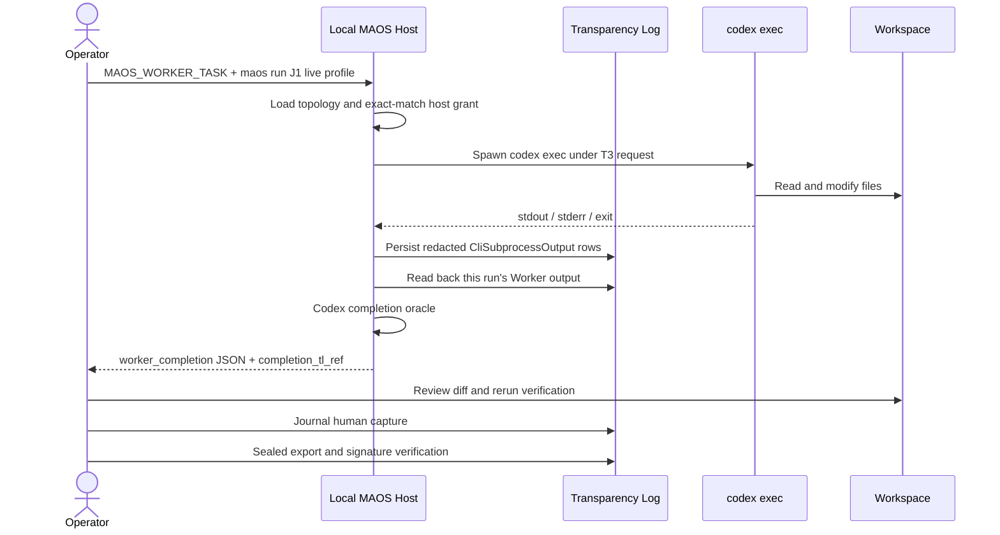
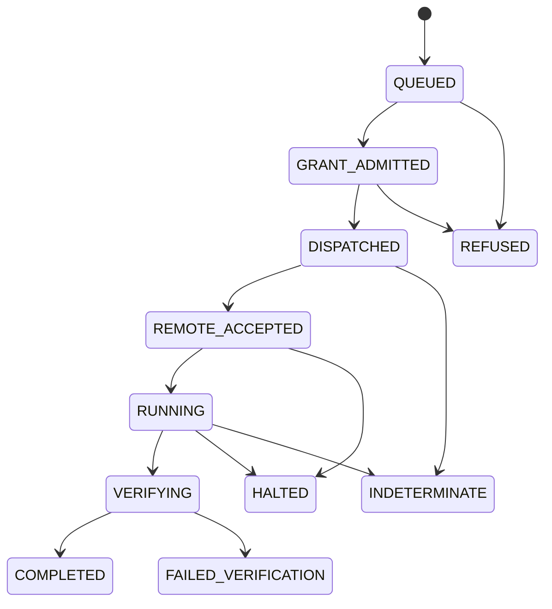

# MAOS Coding Delegation UX

## Purpose

This note answers four operator questions:

1. How can a person instruct local MAOS today?
2. How can local or remote MAOS delegate coding work to Codex?
3. How can the operator observe completion?
4. How can the operator review and approve the result?

It separates three claims that must not be conflated:

- **Execution:** an authorized coding CLI ran.
- **Completion:** the CLI satisfied its MAOS completion oracle.
- **Correctness:** the resulting code satisfies the task and its verification criteria.

## Executive answer

MAOS currently supports a **local, manually configured, audited Codex execution path** through `maos run`. It does not yet provide a complete coding-delegation product experience.

Today:

- The operator supplies the coding task through `MAOS_WORKER_TASK`.
- `maos run` loads an operator-local J1 Codex topology profile and launches a host-authorized local `codex exec` Worker; the committed topology still uses `worker-cli-fixture`.
- Worker stdout and stderr are persisted as Transparency Log rows.
- A Codex-specific adapter decides completion from journaled output rather than exit code alone.
- The operator reviews the workspace and reruns verification outside the orchestration surface.
- A human-authored capture can be journaled, sealed into an Ed25519-signed audit bundle, and verified.

Not yet available:

- `@orchestrator delegate ...` in `maos shell`.
- A durable task queue for the J1 founder loop.
- A production local-to-remote MAOS coding path.
- A stable `task_id` spanning instruction, execution, completion, patch, tests, and audit.
- A structured patch and deterministic verification receipt.
- A built-in review and approve/reject workflow.
- A web operator portal for delegation.

The current path is best described as **MAOS-mediated local agent-CLI execution with audit evidence**, not yet full Human → Orchestrator → Developer delegation.

## Current operator surfaces

| Surface | Current behavior | Coding-delegation value | Limitation |
|---|---|---|---|
| `maos shell` | Parses `@<spirit> <message>`; real inference is wired to `hello-spirit`; Butler supports a narrow option-pick prototype | Interactive entry point exists | No Orchestrator or Worker task dispatch |
| `maos run <manifest> [--live] [--once]` | Loads a Spirit or topology; a CLI-wrapper member can launch a local Worker CLI | Current local Codex execution path | Manifest- and environment-driven; no durable task object |
| `maosctl orchestrator queue/status` | Enqueues a natural-language instruction for `hello-spirit` into an in-process buffer | Demonstrates a director instruction primitive | Separate one-shot process, `hello-spirit` only, buffer is not durable, not connected to J1 |
| `maosctl audit query` | Reads the local Transparency Log with time, kind, intent, capability, and boot filters | Reviews persisted execution evidence | No task-centric projection; CLI output kind currently renders as `unknown` in the audit read model |
| `maosctl audit record-capture` | Validates and journals a human-authored run capture | Places operator attestation inside the signed audit window | Capture is manual; it is not an automatically generated correctness receipt |
| `sealed-export` / `verify-bundle` | Signs covered audit rows and verifies the signature | Tamper evidence and named accountability | Signature proves bundle integrity, not code correctness |
| ACP server | Editor-hosted NDJSON protocol for sessions, lifecycle verbs, halt resolution, and notifications | Potential future IDE integration seam | No task assignment, patch, test, or review frames |
| Terminal notifications | Output-only notification channel | Operator visibility | Not an input, review, or approval surface |
| Documentation site | Product and operator documentation | Learning surface | Not an operator portal |

### Why `maosctl orchestrator queue` is not the coding path

The command name suggests general Orchestrator control, but its current implementation is intentionally narrow:

- It accepts only `hello-spirit`.
- `maosctl` launches a new `maos` one-shot process.
- The process creates its own `OrchestratorBufferRegistry`.
- The buffer is in memory and disappears when that process exits.
- The J1 topology and CLI Worker do not consume it.

Using this command for J1 coding delegation would create a false success signal: the enqueue may be journaled even though no coding Worker can receive it.

## Current local coding flow



### Configuration contract

The committed canonical topology currently references `spirits/worker/manifest.toml`, whose command is `worker-cli-fixture`. A real Codex run therefore needs an operator-local live profile that replaces only the Worker manifest.

The Codex Worker manifest must request:

```toml
[cli_wrapper]
command = "codex"
argv_prefix = ["exec", "--sandbox", "workspace-write"]
output_shape_version = "1.0.0"
skill_bundle = ["maos-bridge"]
recovery_policy = "respawn_fresh"

[cli_wrapper.posture]
stdio_shape = "ndjson_over_stdio"
control_channel = "signals"
shutdown_signal = "SIGTERM"

[sandbox]
tier = "T3"

[author]
name = "OpenAI"
```

The host-managed grant must independently match the requested executable identity and author:

```toml
[[grant]]
attested_image = "codex"
signing_key_id = "OpenAI"
permitted_tier = "T3"
permitted_egress_destinations = ["api.openai.com"]
```

Current egress truth is `declared-not-enforced`. The grant records the intended destination but does not yet enforce packet-level egress.

### Invocation contract

```bash
export MAOS_WORKER_TASK='<bounded coding task and acceptance criteria>'
export CODEX_API_KEY="$OPENAI_API_KEY"
export ANTHROPIC_API_KEY='<class-Spirit provider key>'
export MAOS_LIVE_AGENT=1
export MAOS_HOST_GRANTS="$HOME/.maos/host-grants.toml"

cd "$WORKSPACE"
maos run /absolute/path/to/j1-founder-loop-codex.toml --live
```

Two independent switches are involved:

- `--live` selects a real inference provider for class Spirits.
- `MAOS_LIVE_AGENT=1` permits a real agent-CLI subprocess.

Codex reads `CODEX_API_KEY`; `OPENAI_API_KEY` alone does not authenticate the observed `codex exec` path. A live run is refused if the active home contains `.codex/auth.json`, because a subscription credential outside MAOS control cannot support a redaction claim.

The Worker inherits the launch working directory. The operator must therefore launch from the intended workspace. For bounded demonstrations, use a disposable directory and a working Codex `workspace-write` sandbox.

## What completion means today

The Codex adapter uses this oracle:

1. The process exited with code 0.
2. The journaled stdout contains a non-empty final line.

If both conditions hold, `maos run` prints:

```json
{
  "event": "worker_completion",
  "worker_cli": "codex",
  "completion": "completed",
  "completed": true,
  "completion_tl_ref": "<last-worker-stdout-frame-id>"
}
```

This is stronger than treating exit 0 as completion, but weaker than a correctness verdict. It does not prove that:

- every acceptance criterion was satisfied;
- the claimed tests were actually executed;
- the tests passed;
- the patch stayed within task scope;
- no unexpected file was modified;
- the final message accurately describes the workspace.

`worker_completion` is currently emitted to terminal stdout, not persisted as its own `TaskComplete` or completion-receipt row. `completion_tl_ref` identifies the last persisted Worker stdout row.

## How result review works today

### 1. Observe the run events

The operator watches for this sequence:

```text
host_grant_disposition
cli_wrapper_loaded
cli_wrapper_exit
worker_completion
```

These events answer different questions:

| Event | Question answered |
|---|---|
| `host_grant_disposition` | Was the requested executable identity granted? |
| `cli_wrapper_loaded` | Did a real child process start? |
| `cli_wrapper_exit` | How did the child terminate? |
| `worker_completion` | Did the adapter accept journaled output as completion? |

### 2. Inspect persisted Worker output

Use the intent filter rather than the frame-kind filter:

```bash
maosctl audit query \
  --range 1h \
  --intent-contains cli.subprocess.output \
  --format ndjson
```

The reason is a read-model gap: kernel frame discriminator 21 is persisted for `CliSubprocessOutput`, but `maos-audit::kind_to_string` does not currently map 21. The row therefore renders with `kind: "unknown"` while its intent remains `cli.subprocess.output`.

### 3. Review the workspace independently

The operator must use the normal repository review path to inspect:

- files created, modified, and deleted;
- the complete patch;
- changes outside task scope;
- generated or ignored files;
- dependency changes;
- focused build and test results;
- secret material or unexpected network configuration.

The verification command should be rerun by the operator or by a deterministic verifier. A model-authored sentence saying “tests passed” is evidence about the model's output, not evidence that the tests passed.

### 4. Journal and sign the review capture

A non-secret capture can record the reviewed outcome:

```json
{
  "signer": "<named human signer>",
  "live_agent_identity": "OpenAI Codex <version>; model <model>",
  "command_metadata": "codex exec --sandbox workspace-write <redacted task>",
  "host_grant_disposition": "exact-match codex/OpenAI T3 grant admitted",
  "audit_refs": ["<completion_tl_ref>"],
  "egress": "declared-not-enforced",
  "egress_followup": "FOLLOWUP-EPIC14-V2.0-PACKET-EGRESS-ENFORCEMENT",
  "redaction_result": "verified",
  "outcome": "<reviewed files and independently observed verification result>"
}
```

Then:

```bash
maosctl audit record-capture --capture ./coding-run-capture.json

maosctl audit sealed-export \
  --range 1d \
  --audit-key ~/.maos/keys/operator-audit.key \
  --output ./coding-run-bundle.json

maosctl audit verify-bundle \
  ./coding-run-bundle.json \
  --pubkey <64-hex-public-key>
```

The signature proves integrity of the covered audit rows and accountable signing. It does not transform a human assertion into an independently verified code-quality fact.

## Audit-review findings from the existing signed J1 artifact

Inspection of `_bmad-output/test-artifacts/j1-tier2-evidence/j1-tier2-bundle.json` on 2026-07-17 found 247 entries:

| Rendered kind | Count |
|---|---:|
| `unknown` | 159 |
| `capability.invocation` | 65 |
| `governance.event` | 21 |
| `run.capture` | 2 |

The `unknown` entries include `intent: "cli.subprocess.output"` rows from both unsuccessful and successful Codex attempts. The bundle also contains two host-level capture rows.

This exposes two review problems:

1. **Read-model loss:** CLI output has no correct rendered kind.
2. **Run-window overcapture:** `sealed-export --range 1d` can include multiple attempts and multiple captures because no stable task/run correlation key scopes the export.

A valid signature still proves the bundle was not modified. It does not make the bundle easy to interpret or isolate one delegation.

## Remote delegation status

The production J1 founder-loop path is currently single-host and A2A-free. The local Worker is spawned directly by the composition root. The task reaches it through `MAOS_WORKER_TASK`, not a routed `TaskAssign` frame.

The required integration work remains in backlog:

- `j1-crosshost-1-loopback-developer-remote-delegation`
- `j1-crosshost-2-cross-host-signed-run`

Until those stories land, the only operational remote workaround is to log into the remote host, run the local procedure there, retrieve its signed bundle, and verify it locally. That is remote administration, not MAOS cross-host delegation.

A local MAOS instance cannot yet:

- send a J1 coding assignment to a remote MAOS daemon;
- watch a shared task state across both hosts;
- know whether a lost completion means “not executed” or “executed but ACK lost”;
- prevent duplicate execution through a shared idempotency key;
- reconcile both hosts' audit trails into one automatically correlated result.

## Target task-centric experience

The next operator surface should be task-centric rather than topology-centric. A web portal can follow later; the first durable contract should be a CLI and wire model that other interfaces can reuse.

### Submit

```bash
maos task submit \
  --orchestrator founder \
  --worker codex \
  --host office-laptop \
  --workspace /work/project \
  --spec task.toml
```

Expected receipt:

```text
task_id: 01J...
state: QUEUED
audit_ref: ...
```

### Watch

```bash
maos task watch 01J...
```



`INDETERMINATE` is essential for partitions and lost completion acknowledgements. It must never render as completion or trigger automatic re-execution until reconciliation establishes whether mutation occurred.

### Review

```bash
maos task review 01J...
```

The review object should contain:

| Section | Required evidence |
|---|---|
| Task | `task_id`, original instruction, normalized acceptance criteria, instruction hash |
| Execution | host identity, Worker CLI/provider/model/version, sandbox, exact host-grant decision, start/end times |
| Changes | workspace before/after hash, files created/modified/deleted, canonical patch, patch hash, refused out-of-scope writes |
| Verification | commands run by a deterministic verifier, exit codes, output hashes, pass/fail/skip state |
| Audit | assign, accept, Worker output, completion, halt, and reconciliation references |
| Security | host-local credential disposition, wire schema credential absence, redaction result, egress enforcement truth |
| Integrity | local and remote signatures, bundle verification result |

### Decide

```bash
maos task approve 01J...
maos task request-changes 01J... --instruction "Handle empty input"
maos task reject 01J... --reason "Acceptance criterion 3 not satisfied"
```

Approval should be a new signed decision, not a mutation of the Worker completion record.

### Shell and IDE projections

Once the task contract exists, `maos shell` can become a thin projection:

```text
@orchestrator delegate story-13.1 to office-laptop/codex
@orchestrator status 01J...
@orchestrator review 01J...
```

ACP can project the same contract into an editor. Neither interface should invent a second lifecycle or evidence model.

## Recommended delivery order

### 1. Make the local path operable

- Commit a supported Codex Worker manifest and J1 live topology profile.
- Replace implicit environment-only task input with an explicit task document.
- Mint a stable `task_id` before admission.
- Persist terminal-only host-grant and completion decisions as typed audit rows.
- Correct the audit kind mapping for `CliSubprocessOutput`.

### 2. Make the result reviewable

- Capture a workspace snapshot before execution.
- Produce a canonical structured patch and content hashes.
- Run declared verification through a deterministic executor, not through model self-report.
- Persist a verification receipt tied to the same `task_id`.
- Add `task review`, `approve`, `request-changes`, and `reject`.
- Export exactly one correlated task rather than a broad host time window.

### 3. Wire real Orchestrator delegation

- Replace the `MAOS_WORKER_TASK` shortcut with Human → Orchestrator → Worker `TaskAssign`.
- Prove loopback routing and fail-closed behavior when no router is installed.
- Preserve the same task lifecycle and review object used by the local path.

### 4. Add cross-host execution

- Route the same `TaskAssign` over mTLS/TOFU.
- Keep credentials host-local and absent from wire schemas.
- Make assignment and completion duplicate-safe.
- Support `HALTED` and `INDETERMINATE` explicitly.
- Reconcile local and remote Transparency Logs under the shared `task_id`.
- Produce one signed review bundle with both-host evidence.

## Product acceptance test

The coding-delegation experience is complete only when an operator can perform this journey without editing manifests or reading raw audit rows:

1. Submit one bounded coding task to a named local or remote Worker.
2. Receive a stable task ID before execution.
3. Watch truthful state transitions, including halt and uncertainty.
4. Inspect the exact patch and independently executed verification.
5. Trace every result to host, CLI, provider, grant, audit, and signature evidence.
6. Approve, request changes, or reject without rewriting history.
7. Export and independently verify one task-scoped bundle.

Until then, the local J1 live run remains valuable evidence of the substrate, but it is not yet the final delegation UX.

## Source anchors

- `crates/maos-shell/src/lib.rs:139-273` — current shell dispatch.
- `crates/maos-cli/src/cli.rs:39-123,595-618` — operator and Orchestrator command surfaces.
- `crates/maos-cli/src/subcommands.rs:1317-1361` — Orchestrator queue/status execution.
- `crates/maos-bin/src/main.rs:225-285` — `maos run` parser.
- `crates/maos-bin/src/main.rs:683-1043` — local CLI Worker execution and completion.
- `crates/maos-bin/src/main.rs:4807-4898` — current one-shot Orchestrator buffer behavior.
- `crates/maos-bin/src/worker_cli.rs:84-147,207-228,283-330` — Worker CLI and Codex completion contracts.
- `crates/maos-audit/src/lib.rs:658-716` — audit kind read mapping.
- `crates/maos-acp/src/frame.rs:16-80` — current ACP frame vocabulary.
- `spirits/topologies/j1-founder-loop.toml` — current single-host topology.
- `spirits/worker/manifest.toml` — current fixture Worker.
- `_bmad-output/test-artifacts/runbook-j1-tier-2-signed-live-run.md` — proven local signed-run procedure.
- `_bmad-output/planning-artifacts/analysis-j1-cross-host-developer-remote-2026-07-16.md` — remote integration gap.
- `_bmad-output/implementation-artifacts/sprint-status.yaml:232-234` — cross-host backlog state.
