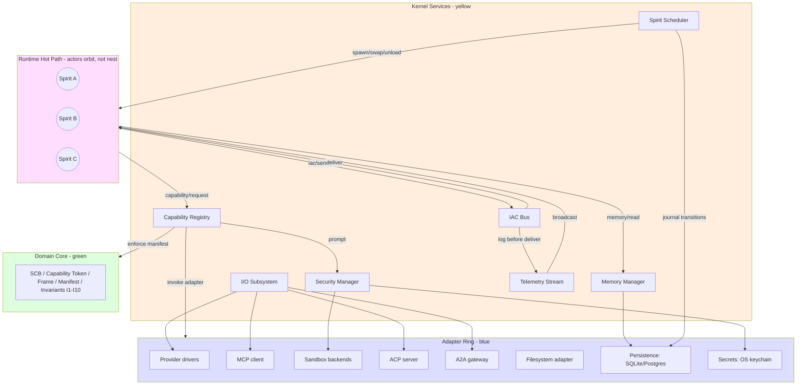

# MAOS — Modular Agentic Operating System

> **Working name.** "MAOS" tracks the project directory `~/dev_ws/maos` and reads naturally as "Modular Agentic Operating System". Final naming is not blocking.

> **📍 Phasing reconciled (2026-05-06).** §13 Phased Roadmap below has been rewritten to match the PRD Step 8 canonical 8-phase structure: **v0.1 Foundational** (placeholder Spirit only, no multi-Spirit, no A2A) → **v0.3 Butler** (anticipatory single-Spirit) → **v0.5 Researcher + Observer** (exploratory single-Spirit + first opt-in distillation) → **v0.8 Founder Loop wedge demo** (multi-Spirit Orchestrator+Worker; original v0.1 Architect demo lives here) → **v1.0 Team-ready** → **v1.5 Diagnostic-Architect** → **v2.0 (technical)** → **v2.5 (ecosystem-adoption)**. The PRD remains canonical for FRs/NFRs/ship-gate floors/journey-to-phase mapping; this document remains canonical for ADRs (28), invariants (14), kernel internal architecture, and architectural decision rationale.
>
> **📍 Journey-naming map (2026-05-06).** Inspirational Journey 10/11/12 references throughout this document predate the PRD Step 4 journey restructure. Read them as: **Journey 10 = J3 Marcus Team Nexus** (8-Host team peer-mesh, v1.0 anchor); **Journey 11 = J4 Elena Mira-Nash** (diagnostic-architect 2-Host pair, v1.5 anchor); **Journey 12 = Reza Cortex** (cross-team / cross-region, v2.0 technical / v2.5 ecosystem-adoption). The architectural decisions cited from these journeys are unchanged; only the user-journey numbering moved.

## 0. Executive Summary

> **The grand-theater metaphor (founder, 2026-05-06).** *"MAOS kernel and sub-modules are the grand theater. Spirits are actors in the play held in the MAOS grand theater. The user is the director of the play."* The user can let the play run autonomously — the founder eats dinner while the Orchestrator runs the BMAD loop overnight — or step in for important scenes, directing actors in detail when the moment demands creative authority. **This is the project's organizing metaphor**, and it informs every primitive in the kernel: the Approval Manager is the director's intervention surface; posture-shift commands are the director's notes to actors mid-scene; `task.assign` IAC frames are the director's blocking instructions; halt-and-resolve is the actor signaling back that they need direction; the Transparency Log is the production record the audience and auditors can replay. Theater provides conditions; actors perform; the director chooses the autonomy level scene by scene.

> **Substrate-positioning claim (v1.0 commitment).** **MAOS at v1.0 can host a hermes-class Spirit as a tenant, with full audit, revocation, and substrate-uninstall guarantees that hermes-as-application cannot itself provide.** This is the load-bearing distinction between substrate and application. Hermes is one excellent improv actor with her own travel kit — gifted, mobile, self-curated. MAOS is the theater she could perform in. A theater hosts many actors, including ones not yet written; provides rigging, lighting, audit trails no individual actor would build for themselves; and the test of a theater is not how good a single play is, but how many different plays can be staged on the same stage with the same safety guarantees. The v1.0 black-box external-author trial (per Murat's ship gate: 5 external authors, 14-day no-DM-support window, ≥4/5 produce a working signed Spirit) is the empirical test of this claim.

MAOS is **a substrate, not a product**. It is the invariant scaffolding on which specialized agents — *Spirits* — are loaded, swapped, supervised, and composed the way processes are on a conventional OS. The kernel exposes one stable contract — the **Spirit ABI** — and every "agent class" you care about (Butler, Researcher, Diagnostician, Architect, Enterprise, Observer, …) is just a different manifest plus a different posture against that contract.

The design rests on five foundational commitments:

1. **Kernel/Spirit separation is enforced, not advisory.** Spirits never share a process address space without going through the IAC bus, never touch the filesystem outside the Memory Manager's namespaces, and never spawn tools outside the Capability Registry. This is what makes "hot-swap a Spirit mid-session without dropping in-flight tool calls" achievable.
2. **Boring tech in the kernel; ambition in the contract.** Every kernel layer reuses something already battle-tested in the survey: MCP for tools, ACP for editor bridges, A2A for peer mesh, OS-native sandboxing primitives, SQLite for local state, Postgres for shared state, Wasmtime+WIT for tool capabilities. The novelty is the Spirit ABI itself — that's what nobody has standardized.
3. **The same primitives compose into single-user, team-mesh, and enterprise-cortex deployments.** Journeys 10, 11, and 12 are not three different products — they are three deployment topologies over one architecture, distinguished only by **how many** Spirits run, **where** they run, and **how the IAC bus is configured**.
4. **Human transparency is a kernel invariant, not an application choice.** "No invisible actions, no puppeting, no asymmetric knowledge" (Journey 10) is enforced at the kernel level by the Transparency Log and the Approval Manager, before any Spirit gets to author behavior. A Spirit cannot bypass this.
5. **The kernel itself learns nothing.** Patterns, ADRs, fix templates, regression tests — the *Loom-curated collective knowledge* (Journey 12) — live in user-space, not the kernel. The kernel only enables propagation; what gets propagated is the user's data, governed by the user's policy.

The remainder of this document is the technical realization of these commitments.

---

## 1. Reading Map

This document is long. Read it in this order:

| Section | What's in it | Read if you're |
|---|---|---|
| §2 — Architecture at a Glance | Two diagrams, one paragraph each | Skimming |
| §3 — Vocabulary & Invariants | Pin down terms and what cannot change | Implementing |
| §4 — Kernel Design | Seven layers, each with interface sketch | Implementing the kernel |
| §5 — Spirit ABI | The hot-swappable contract; manifest schema; lifecycle | Implementing the kernel or a Spirit |
| §6 — Reference Spirits | Six concrete Spirits as worked examples | Designing a new agent class |
| §7 — Inter-Agent Communication | Intra-host mailbox + A2A peer mesh + transparency | Designing multi-agent flows |
| §8 — Security & Approval Model | Sandbox tiers, capability tokens, approval classes | Threat-modeling |
| §9 — Memory & Knowledge | Per-Spirit, shared, collective; Loom curation | Building memory features |
| §10 — Journey Traceability | How Journeys 10–12 map to §4–§9 primitives | Validating the design |
| §11 — Deployment Topologies | Single-user → Team → Cortex | Sizing/operating |
| §12 — ADRs | Six contested decisions with rationale | Disagreeing with me |
| §13 — Phased Roadmap | What ships in v0.1 / v0.3 / v0.5 / v0.8 / v1.0 / v1.5 / v2.0 / v2.5 | Planning |
| §14 — Open Questions | Things I'm not sure about | Pushing back |

---

## 2. Architecture at a Glance

### 2.1 The two-paragraph version

A **MAOS Host** is a single OS process running the MAOS kernel. The kernel exposes seven services (Spirit Scheduler, Memory Manager, Security Manager, I/O Subsystem, IAC Bus, Capability Registry, Telemetry Stream) and one contract (the Spirit ABI). At any moment, the Host runs **N Spirits** scheduled co-operatively against shared resource budgets. A Spirit is a **manifest + cognitive profile + memory scope + posture**, loaded from disk or pulled from a registry. The kernel never introspects what a Spirit is "thinking"; it only dispatches messages, supervises lifecycle, and enforces capability and approval policy.

Spirits running on different Hosts speak A2A. Spirits running on the same Host speak through the IAC mailbox. Tools — including LLM providers, MCP servers, shell, file editors, CI/CD adapters — live behind the Capability Registry, which mediates every tool invocation through the Security Manager and the Approval Manager. The Memory Manager exposes three namespaces: **per-Spirit private**, **shared (this Host)**, and **collective (cross-Host, via Loom)**. The Telemetry Stream is the perceptual organ — every Spirit subscribes to it for situational awareness; the Observer Spirit class is just the canonical consumer.

### 2.2 The diagram

```
┌──────────────────────────────────────────────────────────────────────────┐
│                            HUMAN GOVERNANCE                              │
│           (decision gates, approval prompts, transparency log)           │
└──────────────────────────────────────┬───────────────────────────────────┘
                                       │
                          ┌────────────┴────────────┐
                          │                         │
                          ▼                         ▼
┌────────────────────────────────────┐    ┌────────────────────────┐
│              SPIRITS               │    │   USER-SPACE SERVICES  │
│  (hot-swappable, manifest-driven)  │    │                        │
│  ┌──────────┐  ┌──────────────┐   │    │  • Tool servers (MCP)  │
│  │  Butler  │  │  Researcher  │   │◀──▶│  • Editor bridges (ACP)│
│  ├──────────┤  ├──────────────┤   │    │  • A2A peer mesh       │
│  │Diagnostic│  │  Architect   │   │    │  • Loom (collective KB)│
│  ├──────────┤  ├──────────────┤   │    │  • Tool sandboxes      │
│  │Enterprise│  │   Observer   │   │    │  • Provider gateways   │
│  └──────────┘  └──────────────┘   │    └────────────┬───────────┘
│        ▲                           │                 │
│        │  Spirit ABI (§5)         │                 │
│        ▼                           │                 │
└────────────────────────────────────┘                 │
                          ▲                            │
        ╔═════════════════╧═════════════════╗          │
        ║              MAOS KERNEL          ║          │
        ║      (invariant; Rust+Tokio)      ║          │
        ║                                    ║          │
        ║  ┌─────────────┐  ┌─────────────┐ ║          │
        ║  │   Spirit    │  │   Memory    │ ║          │
        ║  │ Scheduler   │  │   Manager   │ ║          │
        ║  └─────────────┘  └─────────────┘ ║          │
        ║  ┌─────────────┐  ┌─────────────┐ ║          │
        ║  │  Security   │  │     I/O     │◀╬══════════╝
        ║  │   Manager   │  │  Subsystem  │ ║   stdio/JSON-RPC, MCP,
        ║  └─────────────┘  └─────────────┘ ║   ACP, A2A, HTTP/SSE/WS
        ║  ┌─────────────┐  ┌─────────────┐ ║
        ║  │     IAC     │  │ Capability  │ ║
        ║  │     Bus     │  │  Registry   │ ║
        ║  └─────────────┘  └─────────────┘ ║
        ║          ┌─────────────┐          ║
        ║          │  Telemetry  │          ║
        ║          │   Stream    │          ║
        ║          └─────────────┘          ║
        ╚════════════════╤══════════════════╝
                         ▼
        ┌────────────────────────────────────┐
        │       HOST OS PRIMITIVES           │
        │  Landlock+seccomp / Seatbelt /     │
        │  bwrap / Wasmtime / SQLite /       │
        │  Postgres / cgroups / namespaces   │
        └────────────────────────────────────┘
```

The same **single Host** scales out by configuration, not by changing the architecture:

- **Single-user** (Journey 10 baseline): 1 Host, N Spirits, no A2A, no Loom.
- **Team mesh** (Journey 10): 8 Hosts (one per teammate), full A2A peer mesh, optional shared Loom-lite.
- **Diagnostic-architect pair** (Journey 11): 2 Hosts (edge + dev), asymmetric postures, Loom optional.
- **Enterprise Cortex** (Journey 12): 28+ Hosts in three caste-shaped roles (Sentinel/Artisan/Loom), full A2A mesh, mandatory shared collective KB.

---

## 3. Vocabulary & Invariants

### 3.1 Vocabulary (read these definitions, then nothing in this doc is ambiguous)

| Term | Definition |
|---|---|
| **Host** | One OS process running the MAOS kernel. The unit of deployment. |
| **Kernel** | The seven invariant services (§4) that every Host exposes identically. |
| **Spirit** | A loaded, running agent. State = (Manifest + Cognitive State + Memory Pages + Posture + Capability Token Set). |
| **Spirit Manifest** | The declarative file (TOML/JSON) describing a Spirit class: identity, role, model, memory scope, capability requests, posture, hooks. The "spirit" in "the spirit is hot-swappable." |
| **Spirit Class** | A manifest type (e.g., `butler`, `mira-diagnostic`, `nash-architect`). Many *instances* of one class can be loaded simultaneously (e.g., 14 Sentinel instances in Cortex). |
| **Posture** | A Spirit's current autonomy stance: which approval class triggers a prompt, which sandbox profile is bound, which IAC peers are reachable. **Posture is mutable; Spirit class is not** (mid-life). |
| **Capability** | A typed tool surface — `bash.exec`, `fs.read`, `mcp.call(server, tool)`, `provider.complete(model)`, `a2a.send(peer)`, `git.commit`. Mediated by the Capability Registry. |
| **Capability Token** | An unforgeable ticket the kernel hands a Spirit when it requests a capability. Carries scope, expiry, and an audit ID. |
| **Approval Class** | One of six (§8.3): `readonly_scoped`, `readonly_search`, `mutating`, `exec_capable`, `control_plane`, `interactive`. Borrowed from openclaw's classifier. |
| **IAC** | Inter-Agent Communication. Two flavors: same-Host mailbox, cross-Host A2A peer mesh. |
| **Mailbox** | A bounded mpsc channel owned by a Spirit, addressable by Spirit ID, supervised by the kernel. |
| **A2A peer** | A remote Host advertising itself via `a2a.json`; reached over A2A protocol with consent gates. |
| **Loom** | A user-space service that curates patterns, ADRs, fix templates, regression tests across Spirits — the "collective" memory tier. From Journey 12. |
| **Transparency Log** | An append-only kernel-managed log of every IAC interaction, every approval decision, every capability use, and every retract. Personal to the user; not visible to peers. |

### 3.2 Invariants (these cannot change without a major-version bump)

These are the load-bearing rules. Every implementation choice in §4–§9 exists to enforce one or more of them.

| # | Invariant | Why it matters | Enforcement point |
|---|---|---|---|
| I1 | **Spirits cannot bypass the Capability Registry.** Every tool, network call, file op, sub-Spirit spawn goes through it. | Without this, sandboxing, approvals, and audit are decorative. | Kernel — Capability Registry is the *only* surface returned to Spirits at load time. |
| I2 | **Every IAC interaction is logged before delivery.** No ACK/NACK has ever been sent without an entry in the Transparency Log. | Journey 10's "no invisible actions" rule. Without this, peer trust collapses. | Kernel — IAC Bus writes log before it writes mailbox. |
| I3 | **Auto-responses are always marked `[auto-sent]` on both sides.** | Journey 10's "no puppeting" rule. | Kernel — IAC Bus stamps every message with `origin: human-authored \| spirit-auto \| spirit-drafted-human-approved`. |
| I4 | **Approvals are persisted with intent, not just decision.** | Reproducibility, retract, audit. | Kernel — Approval Manager stores `(actor, target, capability, intent, decision, ts)`. |
| I5 | **A Spirit's memory scope is declared in its manifest and enforced by the Memory Manager.** | Hot-swap requires knowing what to migrate vs. what to drop. | Kernel — Memory Manager rejects reads/writes outside declared scope. |
| I6 | **Hot-swap preserves Capability Tokens for in-flight tool calls; the new Spirit inherits the token, not the call.** Sub-clauses (per ADR-017): in-flight A2A frames at the predecessor are inherited by the successor under a drain-barrier (not dropped); in-flight distillation steps restart at the successor with the same `digest_refs` set (idempotent); Orchestrator-class user-input queues live in the Spirit's snapshot and survive swap; `working_memory_digest_refs` (I12) are inherited; the state-transfer wire format is CBOR + per-Spirit-class schema (ADR-017), and the kernel rejects swaps with incompatible schema versions. | Journey 11 — Mira escalates to Nash without losing diagnostic context; Journey 1 — Orchestrator survives kernel restart preserving epic state. | Kernel — Token Lifecycle Manager (§4.3.4); Hot-Swap Coordinator validates state-transfer schema compatibility (ADR-017) before successor activation. |
| I7 | **Telemetry is broadcast; subscription is per-Spirit.** No Spirit polls the OS directly. | Observability is a perceptual organ, not a privilege. | Kernel — Telemetry Stream. |
| I8 | **Cross-Host A2A interactions require explicit consent at both ends, scoped to the typed intent of the message (not just the channel).** | Journey 10's "peer-consent" rule; Journey 11's asymmetric trust; closes the confused-deputy gap where channel-consent does not imply transaction-consent (ADR-012). | Kernel — A2A Gateway enforces sender-side policy AND receiver-side acceptance with intent-class allowlist before delivery. |
| I9 | **The kernel itself stores no secrets and learns no patterns.** *Boundary clarification (DS-surfaced):* **caching is structural** (key→value, bounded TTL, no aggregation across keys, no parameter drift) and is permitted within `{Journal, TransparencyLog, CapabilityRegistry::tokens}` only. **Learning is statistical** (parameters that drift from observation distribution, model weights, frequency tables, recency-weighted scores) and is forbidden in any kernel-core crate. Capability-token TTL caches and IAC mailbox routing tables are caches; Mira's recency-weighted incident similarity score is learning and lives in Loom (user-space). Structurally enforced via `#[no_persistent_state]` lint on all kernel-core crates outside the three permitted state holders. | Auditability. The kernel is replaceable; the user's data is not. | Kernel — secrets pass through to OS keyring; KB lives in user-space (Loom); structural-state lint blocks new persistent fields outside the three permitted holders. |
| I10 | **Every Spirit lifecycle transition is journaled; crash recovery rehydrates from the journal.** | Reliability. Journey 12's "92-minute Cortex cycle" requires no incidents from Spirit crashes. | Kernel — Journal at the Spirit Scheduler. |
| I11 | **Persisted digests reference their raw source frames.** Every payload tagged `kind: digest` written to private/shared/collective memory carries non-empty `source_log_ref: [frame_id, ...]` (transitively flattened to original raw frames, not intermediate digests) and `distillation_depth: N` (raw=0). Kernel rejects malformed writes with `EDigestAuditChainMissing`. *Granularity (DS-surfaced concession, applied):* **Segment-level audit is the default contractual unit** — `source_log_ref` references a frame range (e.g., `[F100..F250]`) covering the segment of raw evidence the digest summarizes. Spirits processing 10K writes/sec rely on this default to keep CAS-on-journal-seq + fsync cadence within latency budget. **Write-level audit (per-frame `source_log_ref`) is opt-in** for forensic Spirits via manifest `[audit].granularity = "per-write"` declaration, gated behind a `forensic-audit` capability the operator must grant. The kernel preserves the audit chain at whichever granularity the Spirit declared. | Distillation is a substrate-level pattern (Orchestrator, Mira, Cortex, Loom — see §9.5). Without an audit chain back to raw, the Transparency Log becomes ceremonial. | Kernel — `fs.write` (private tier) and `memory.share` (shared/collective) validate the fields on every digest-tagged write at the declared granularity. Digest content is NOT validated (preserves I9). |
| I12 | **Spirit decision frames record their working-memory digest references.** When a Spirit emits a `decision.*` frame (consent, halt, dispatch, task.assign, task.complete), the kernel attaches `working_memory_digest_refs: [frame_id, ...]` populated from the Spirit's declared in-context digests. | Closes "the digest hid the critical finding → the agent never recalled raw → audit shows raw existed but the agent never reasoned over it." Without I12, audit can prove what raw + what digest, but not what the agent actually saw at decision time. | Kernel — Capability Registry tracks per-Spirit in-context digest set (declared via `log.recall`, ADR-013); attaches refs on emit of any `decision.*` frame. Frame_ids only — no content inspection (preserves I9). |
| I13 | **Digests carry intent provenance.** Every digest derived from input frames whose `intent` field is set carries `intent_lineage: [intent_class, ...]` — the union of intent classes of all input frames it summarizes. A consumer that operates under intent `Y` rejects digests whose `intent_lineage` is not contained in `allowed-promotion-set(Y)` (typed error `EIntentPromotionDenied`). | Closes consent-laundering through distillation: data received under `consult` cannot be silently re-purposed under `delegate` via a digest hop. Without I13, the typed-intent consent (ADR-012) leaks across the §9.5 distillation boundary. | Kernel — Capability Registry validates `intent_lineage` field on every digest write (extends I11 enforcement) and on consumer-side admission. Promotion sets are declared in Spirit manifests; kernel enforces structurally, never interprets. |
| I14 | **Hot-swap preserves halt continuity.** When a Spirit with a non-empty `halt_set` is hot-swapped, either every halt is drained (resolved before swap) OR every halt is migrated to the successor with full resolution-path state, and the successor's manifest declares `halt_protocol_compatibility = N` (matching the predecessor's halt-protocol version). Zero dropped halts; zero successor-confusion events (where the successor produces a resolution that doesn't match the halt's declared schema). | Closes the hot-swap × halt interaction gap — without I14, an in-flight halt can silently disappear during swap, dropping the user's clarification request and breaking trust in the halt mechanism (innovation #2 of Step 6). | Kernel — Hot-Swap Coordinator (ADR-017) checks `halt_set` before swap; if non-empty, requires either drain-completion or schema-compatible migration; rejects swap with `EHaltContinuityViolation` otherwise. |

If you find yourself bending one of these, you are not implementing MAOS — you are implementing something else. Stop and write a new ADR.

---

## 4. Kernel Design

The kernel is **one Rust+Tokio process** per Host. The choice of Rust and Tokio is not novel — it is the consensus of the survey: codex, ironclaw, and rustain all picked Rust+Tokio, and codex's in-process mailbox actor pattern is directly applicable. The kernel exposes seven services, internally arranged as Tokio tasks talking over typed channels, externally exposed to Spirits via the Spirit ABI (§5).

A Spirit, by contrast, may be implemented in **any language** that can speak the Spirit Wire Protocol (a thin JSON-RPC-over-stdio dialect modeled on ACP and codex's app-server). Reference Spirits will be Rust crates running in-process for performance; LLM-driven Spirits run as kernel-supervised subprocesses with stdio JSON-RPC pipes. **Both paths are first-class**; choice is per-Spirit-class.

### 4.0 Kernel Internal Architecture

Before walking the seven services individually (§4.1–§4.7), this section commits to **how the kernel is organized internally**: the architectural style, the layout of code, and how subsystems connect. Without this, a reader sees seven services and has no model for how they relate.

#### 4.0.1 Architectural style — hexagonal + actor + reactive (not Clean)

**Static structure: hexagonal (ports & adapters).** The kernel has a clear domain (Spirit lifecycle, capability mediation, IAC routing, journal) that we deliberately separate from concrete I/O. Multiple adapter implementations exist per port — provider drivers per LLM vendor, sandbox backends per OS, transport adapters per protocol. Hexagonal lets us test the kernel core without real LLM calls, swap adapters per deployment, and keep the rustain-style `domain / adapters / infrastructure` layering the cohort survey already validated. **Not strict Clean Architecture:** Clean's inward-only call discipline doesn't fit a runtime where the IAC Bus must invoke into Spirit-implemented handlers. We take Clean's separation discipline without its call-direction rigidity.

**Runtime hot path: actor model.** Each Spirit is an actor — mailbox-addressable, behavior-encapsulated, no shared mutable state with peers. This is codex's `AgentRegistry` + `Mailbox` pattern, adopted wholesale. It gives us four properties for free: backpressure via bounded mailboxes, no locks on the hot path (each actor owns its state), failure isolation via Tokio task supervision, and natural hot-swap (replace `behavior` while preserving `state` and `open_tokens`). The seven kernel services are *not* themselves actors — they're shared services that actors call into, with their own task pools.

**Operational properties: reactive, by emergence.** Responsive, resilient, elastic, and message-driven fall out of the choices above — cooperative scheduler + bounded mailboxes (responsive); journal-based recovery + Tokio supervision (resilient); scale by adding Spirits or Hosts (elastic); IAC and capability invocations all async (message-driven). We don't invoke the Reactive Manifesto by name; the properties are present because the lower-level choices are correct. ADR-010 and ADR-011 record the hexagonal and actor-model commitments respectively.

#### 4.0.2 The three-band layout



Three bands ordered by purity:

1. **Domain Core (green).** Pure data types, invariants, no I/O. The `SpiritControlBlock`, the `CapabilityToken`, the `IacFrame` schema, manifest types. Compiles without any async runtime, HTTP library, or database driver. Testable in isolation.
2. **Kernel Services (yellow).** The seven services from §4.1–§4.7. Each is a Tokio task pool with its own internal state. Depends on the domain core and on traits the adapter ring implements.
3. **Adapter Ring (blue).** Concrete implementations of ports defined by the kernel services. Provider drivers, MCP client, sandbox backends, persistence, secrets, ACP, A2A. Swappable per deployment.

**Spirits orbit, they don't nest.** Spirits are not "in" the kernel in the layering sense — they sit alongside the kernel services and call into them via the Spirit ABI. The kernel orchestrates them but does not contain their behavior. This is what makes the three Spirit forms (rust-inproc / subprocess / wasm) work — they're all peers to the kernel, just bound differently (function pointer / JSON-RPC pipe / WIT call).

#### 4.0.3 Service dependencies

The seven services are not equal peers — they have a layering relationship:

| Service | Depends on | Depended on by |
|---|---|---|
| **Spirit Scheduler** | Capability Registry (token revocation on unload), Memory Manager (archive on swap), Persistence (journal) | Control plane (load/swap/unload commands) |
| **Memory Manager** | Persistence, Capability Registry (scope validation) | Spirit Scheduler (archive), all Spirits (memory.read/write) |
| **Security Manager** | Sandbox backends, Secrets adapter, Approval rendering | Capability Registry (sandbox profile lookup) |
| **I/O Subsystem** | Concrete transport adapters (HTTP, stdio, mTLS) | All inbound clients; outbound calls from Capability Registry |
| **IAC Bus** | Telemetry Stream (logging), Persistence (Transparency Log), Spirit Scheduler (mailbox addresses) | All Spirits (iac.send), control plane (broadcasting) |
| **Capability Registry** | Security Manager, I/O Subsystem, Memory Manager, Telemetry Stream | Every Spirit interaction with the world |
| **Telemetry Stream** | nothing (pure broadcast) | Spirit Scheduler, IAC Bus, Capability Registry, all Spirits (subscriptions) |

**The Capability Registry is the busiest service** — every external call funnels through it. Performance-engineering attention concentrates here. **The Telemetry Stream is the simplest** — pure broadcast, no state, no I/O. It's the kernel's lung.

#### 4.0.4 Module layout (Rust workspace)

The three bands map to a concrete crate structure. Compressed view; the full layout is in the kernel implementation guide (forthcoming).

```
maos/                                  # workspace root
├── crates/
│   ├── maos-domain/                   # ★ DOMAIN CORE — pure types, no I/O
│   ├── maos-spirit-abi/               # the Spirit ABI (traits + wire schemas)
│   ├── maos-spirit-sdk/               # SDK Spirit authors depend on
│   ├── maos-kernel-core/              # ★ KERNEL SERVICES — seven submodules
│   │   ├── scheduler/                 #   Spirit Scheduler + journal + budget
│   │   ├── memory/                    #   tier dispatch + compaction + archive
│   │   ├── security/                  #   sandbox + ApprovalManager + trust tier
│   │   ├── io/                        #   inbound + outbound + streams
│   │   ├── iac/                       #   mailbox + Transparency Log + retract
│   │   ├── capability_registry/       #   tokens + enforcement + adapter dispatch
│   │   └── telemetry/                 #   topics + filtered subscriptions
│   ├── maos-spirit-runtime/           # ★ ACTORS — form-specific supervisors
│   │   ├── inproc.rs                  #   trait dispatch
│   │   ├── subprocess.rs              #   stdio JSON-RPC pump
│   │   └── wasm.rs                    #   Wasmtime + WIT (v2.0)
│   ├── maos-adapters/                 # ★ ADAPTER RING — one crate per port
│   │   ├── providers/                 #   anthropic, openai, google, ...
│   │   ├── sandbox/                   #   linux (bwrap+landlock+seccomp), macos (seatbelt), windows
│   │   ├── mcp/                       #   stdio + SSE + StreamableHTTP
│   │   ├── acp/                       #   stdio JSON-RPC server
│   │   ├── a2a/                       #   mTLS + TOFU + per-frame consent
│   │   ├── persistence/               #   sqlite + postgres
│   │   └── secrets/                   #   keyring + encrypted-file fallback
│   ├── maos-control-plane/            # operator surface (HTTP + Unix socket)
│   ├── maos-cli/                      # `maosctl`
│   ├── maos-bin/                      # ★ COMPOSITION ROOT — wires everything
│   └── reference-spirits/             # the six factory-default Spirits
└── wit/spirit.wit                     # WIT contract (v2.0)
```

Dependencies point inward (adapter ring → kernel services → domain core), with the explicit exception of kernel services calling into Spirit ABI traits — that's the inversion of control that makes Spirits hot-swappable. The composition root in `maos-bin/main.rs` is the only place that knows about all crates.

#### 4.0.5 Connections to subsystems

Three categories of connection. All three coexist in one Host process.

**Inbound — clients reaching the kernel:**

| Client | Transport | Adapter | Use case |
|---|---|---|---|
| `maosctl` (operator CLI) | Unix domain socket | `control-plane::unix_sock` | Load / swap / audit / publish |
| Browser UI | HTTP + SSE | `control-plane::http` | "What's happening" view; approval-prompt UX |
| Editor (Zed, VS Code) | stdio JSON-RPC (ACP) | `adapters::acp::server` | Editor-bridged Spirit invocation |
| Other Hosts (A2A) | HTTPS + mTLS (Streamable HTTP) | `adapters::a2a::peer` | Cross-Host Spirit communication |
| Mobile push (v2.0) | HTTPS back-channel | TBD | Approval prompts to phone |

**Outbound — kernel reaching the world:**

| Target | Transport | Adapter | Triggered by |
|---|---|---|---|
| LLM provider | HTTPS + SSE/Streamable | `adapters::providers::*` | `provider.stream` capability invocation |
| MCP server (tool / Loom / registry) | stdio / SSE / Streamable HTTP | `adapters::mcp::client` | `mcp.call` capability invocation |
| Spirit registry (per ADR-008) | MCP-Streamable-HTTP | `adapters::mcp::client` | `maosctl install` |
| A2A peer | mTLS HTTPS | `adapters::a2a::peer` | `a2a.send` capability invocation |
| OS keychain | platform native | `adapters::secrets::keyring` | Capability Registry just-in-time secret resolve |
| Sandbox runtime | Landlock/seccomp/Seatbelt/Wasmtime | `adapters::sandbox::*` | `bash.exec` capability invocation |
| OpenTelemetry collector (optional) | OTLP/HTTP | `kernel-core::telemetry::otlp_export` | Telemetry Stream subscription |

**Internal — kernel ↔ Spirit:**

| Form | Binding | Latency budget |
|---|---|---|
| `rust-inproc` | direct trait method calls | nanoseconds (function call overhead) |
| `subprocess` | JSON-RPC over stdio | tens of microseconds (serialization + pipe) |
| `wasm-component` (v2.0) | WIT-typed function calls | microseconds (component-model dispatch) |

All three forms speak the same logical Spirit ABI; only the marshaling differs. ADR-007 commits to all three forms over the v0.1 → v1.0 → v2.0 timeline.

#### 4.0.6 What's deliberately NOT in the kernel

Equally important — the architecture commits to what the kernel *doesn't* contain:

- **No LLM SDK code.** Provider drivers in the adapter ring wrap HTTP libraries. The kernel never imports `anthropic` or `openai`.
- **No HTTP routing logic.** Control plane and A2A endpoints translate wire format to typed Spirit ABI calls; no domain logic lives in routing.
- **No Spirit-class semantics.** The kernel never knows what "Researcher" means. It knows "this manifest declares these capabilities and these output predicates."
- **No Loom logic.** Loom is user-space (ADR-006). The kernel speaks MCP to it like any other tool server.
- **No model fine-tuning, eval suite execution, UI rendering.** Those are user-space concerns.

This is Invariant I9 made concrete: the kernel is **mediator and supervisor**, not knowledge accumulator.

#### 4.0.7 What the Kernel Does NOT Compute (founder principle, 2026-05-06)

> **"The kernel does no Spirit-specific calculation. It provides common infrastructure — typed slots, universal-arithmetic comparators, lifecycle hooks, audit trail — under which Spirits perform whatever cognition their authors wrote."**

This is the cognitive-side complement to §4.0.6's structural-side commitments. The principle, restated as a non-responsibility list:

| Concept | Spirit-side computation | Kernel role |
|---|---|---|
| **Variance** (statistical second-moment, IQR, custom dispersion) | Spirit computes using its preferred mathematical definition | Kernel reads Spirit-written scalar, compares to threshold |
| **Entropy** (Shannon, Rényi, cross-entropy) | Spirit computes using its preferred information-theoretic measure | Same |
| **Expected Free Energy (EFE)** (pragmatic + epistemic value) | Spirit computes using its preferred Active-Inference formulation | Same |
| **KL divergence**, **Wasserstein distance**, **JS divergence** | Spirit computes between distributions of its own choosing | Same |
| **Ensemble disagreement** | Spirit runs ensemble and computes disagreement metric | Same |
| **Confidence calibration** (ECE, Brier score) | Spirit measures against ground truth (Spirit-side eval) | Kernel only verifies output_shape predicate (structural) |
| **Cosine similarity**, **semantic similarity** | Spirit invokes embedding model + dot product | Same |
| **Moving averages**, **derivatives**, **rates of change** | Spirit maintains historical scalar values; computes diff | Kernel reads the Spirit-supplied rate-scalar |
| **Statistical tests** (t-test, KS, Mann-Whitney, χ²) | Spirit runs tests in its persona-skill code | Kernel reads the Spirit-supplied p-value or test-statistic |
| **Contradiction detection**, **conflict detection** | Spirit's reasoning logic detects; writes scalar | Kernel reads scalar |
| **Posture inference** (is the user busy? is the agent overloaded?) | Spirit reasons over telemetry | Kernel emits raw telemetry events |

**The kernel's role across all of these is identical:** it stores typed scalars (`(tag, value, timestamp, derived_from)` per ADR-022), compares scalars to thresholds via universal-arithmetic predicates (`on_value_above`, `on_value_below`, `on_value_within`, `on_value_outside`), and journals halt events with structured reasons. **The kernel never knows what variance "means."** It only knows how to compare a number to another number.

**Convenience-syntax legacy.** The original `[epistemic_policy]` schema (§5.1) included `on_confidence_below = X` and `on_evidence_conflict = true` predicates. These are **syntactic sugar** for universal-arithmetic operations over Spirit-written scalars: `on_confidence_below = X` desugars to `tag = <rule's bound tag>.confidence, on_value_below = X` where the Spirit writes the confidence scalar via `working_memory.set_scalar`; `on_evidence_conflict = true` desugars to `tag = <rule's bound tag>.evidence_conflict, on_value_above = 0.5` where the Spirit writes 1.0 if its detection logic finds a conflict, 0.0 otherwise. **The keyword `confidence` is a parser convenience; the kernel never computes confidence.** The Spirit defines what confidence means and writes the scalar accordingly. ADR-022's `on_value_above`/`below`/`within`/`outside` predicates are the canonical form; the convenience-syntax remains for ergonomics but desugars to the canonical form at parse time.

**Why this matters operationally:** if a future Butler wants belief-variance using a Wasserstein-distance-based dispersion measure, no kernel change is needed — the Butler computes the Wasserstein distance, writes the scalar, and the kernel compares it to the threshold the Butler-author declared. If a future Researcher wants confidence calibrated via temperature scaling on logits, no kernel change is needed — the Researcher computes the calibrated confidence, writes the scalar, and the kernel compares. **Theater stays neutral about acting methods.** The kernel is play-neutral; it works for any troupe with any play.

The seven kernel services are detailed in §4.1–§4.7 below. Read them in order — each builds on the previous.

### 4.1 Spirit Scheduler

**Responsibility:** Lifecycle management for all Spirits on this Host.

**State:**
- `Map<SpiritId, SpiritControlBlock>` — the OS-style PCB analog
- `Journal` — append-only on-disk log of all lifecycle transitions (for I10)
- `ResourceBudgets` — per-Spirit caps on tokens/min, $/hour, parallel tool calls

**Operations exposed to user-space (via control-plane API):**
- `load(manifest_path) → SpiritId`
- `start(SpiritId)`
- `pause(SpiritId)`
- `swap(SpiritId, new_manifest_path)` — hot-swap; preserves memory scope and in-flight Capability Tokens (I6)
- `migrate(SpiritId, target_host)` — A2A-mediated; serializes manifest + memory pages + token set
- `snapshot(SpiritId) → SnapshotId` / `restore(SnapshotId)`
- `unload(SpiritId)` — graceful shutdown via lifecycle hooks (§5.3)

**Scheduling discipline:** Cooperative, priority-weighted, **bounded by the Capability Registry's rate limits** (so a runaway Spirit can't starve peers via tool calls). LLM-bound Spirits yield naturally on streaming chunks; CPU-bound Spirits get a `tokio::task::yield_now` injection at sandbox boundaries. **In-process Tokio scheduling stays cooperative** — preemptive multitasking inside the runtime is a v2.0+ concern.

**OS-level CPU budget enforcement (DS-surfaced concession, applied):** subprocess-form Spirits (ADR-007) run inside Linux cgroups v2 with declared `cpu.max` and `memory.max` ceilings — kernel sets these at spawn, enforced by the OS, not by Tokio cooperation. macOS uses POSIX `setrlimit(RLIMIT_CPU, RLIMIT_RSS)` per child; Windows uses Job Objects with `JOB_OBJECT_LIMIT_PROCESS_TIME` and `JOB_OBJECT_LIMIT_PROCESS_MEMORY`. **The cooperative-yield assumption only holds inside a single Spirit's task pool; across Spirit processes the OS, not the runtime, is the floor.** Default ceilings declared in `[resources]` table of the manifest; kernel applies the strictest-of (manifest, operator policy) at spawn. Without this, a CPU-bound subprocess Spirit could starve peers regardless of Tokio yielding — exactly the failure mode DS flagged in round 3.

**Inspirations realized:**
- codex's `AgentRegistry` + `AgentMetadata` + depth-limited spawning ([snapshot above]).
- rustain's 7-state ToolCall FSM, lifted to the Spirit level (Loaded → Started → Running → AwaitingApproval → Suspended → Migrating → Snapshotted → Unloaded).
- The journal pattern from `RolloutRecorder` (codex) and the daily-rotated `rustain.log.YYYY-MM-DD` for resilient state.

**Trade-offs the Scheduler does NOT make:**
- It does not pick which Spirit handles a given user request. That's a user-space concern (the **Routing Spirit**, a default Butler-class instance, does it).
- It does not do auto-scaling, auto-replication, or HA. Those are deployment concerns (§11), not kernel concerns.

### 4.2 Memory Manager

**Responsibility:** Provide three named memory tiers to every Spirit, enforce scope from the manifest, support hot-swap and migration.

**Tiers:**

| Tier | Visibility | Backing store | Lifetime | Inspirations |
|---|---|---|---|---|
| `private` | One Spirit instance only | SQLite (per-Spirit DB file) + JSONL transcript | Spirit life | codex `RolloutRecorder` + claudian `~/.claude/projects/{vault}/*.jsonl` |
| `shared` | All Spirits on this Host | SQLite (Host-wide DB) + optional pgvector via embedded pg | Host life | rustain `~/.rustain/`; openclaw session store |
| `collective` | All Spirits in this Loom domain (cross-Host) | Postgres + pgvector + Loom indices | Loom domain life | ironclaw workspace + RRF; Journey 12 collective KB |

**Manifest declares scope.** Example fragment:

```toml
[memory]
private  = { transcript = "rolling-90-days", vector = false }
shared   = { read = ["project_context", "team_calendar"], write = ["scratchpad"] }
collective = { read = ["patterns.architectural", "adrs"], write = ["incidents.diagnosed"] }
```

**Compaction is per-Spirit, not kernel-wide.** A Spirit's manifest specifies its compaction strategy: `adaptive-chunk-ratio` (openclaw style), `head-tail-protected` (hermes style), or a custom callback. The Memory Manager exposes `compact_now(spirit_id)` as a control-plane API, not as Spirit-authored behavior, to keep compaction policy auditable.

**Tool_use / tool_result pairing repair** (openclaw's `compaction.ts:543-559` pattern) is built into the kernel as a transcript-integrity invariant — a Spirit's transcript is always handed to its provider in a paired state, even after compaction. This is one of the few places the kernel knows about LLM semantics.

**Memory file convention:** Every Spirit's `private` tier includes a writable `*.md` file at a fixed path (`agents/{spirit_id}/memory.md` by default). This is the cohort-wide convention from codex/gemini/claudian/openclaw/hermes — table stakes per the analysis. Gemini-CLI's `memory-manager-agent` pattern is reproducible: a Spirit class can be configured to autonomously curate its own or another Spirit's memory file via the Memory Manager API.

### 4.3 Security Manager

**Responsibility:** Sandbox enforcement, capability tokens, approval orchestration, secret materialization.

#### 4.3.1 Sandbox tiers

The survey produced a clear hierarchy. MAOS exposes all of them and lets the Spirit Manifest declare which it requires:

| Tier | Mechanism | Inherits from | When to use |
|---|---|---|---|
| **T0 — None** | Direct host exec | rustain, opencode default | Single-user dev; explicit user override |
| **T1 — Permission gate only** | Approval prompt before exec | hermes default | Single-user, fast iteration |
| **T2 — Container** | Docker/Podman, readonly rootfs, dropped caps | openclaw, ironclaw shell, paperclip | Host integrity, untrusted code generation |
| **T3 — OS-native** | Landlock+seccomp / Seatbelt / Windows restricted token | codex, gemini-cli | Workspace integrity, distrust of generated commands |
| **T4 — WASM capability** | Wasmtime + WIT capability tokens, fuel limits | ironclaw tools/channels | Untrusted third-party tool code |

**Default for v1.0:** **T3 OS-native + T2 container** stack — Linux uses bwrap+Landlock+seccomp inside a Docker container; macOS uses Seatbelt. **T4 WASM for third-party tools** is shipped from day one because that's the genuine differentiator; the survey shows nobody else does it well except ironclaw, and the WIT contract pattern is too good not to adopt.

A Spirit Manifest declares its `sandbox.profile`:

```toml
[sandbox]
profile = "t3-native"          # one of: t0, t1, t2-docker, t3-native, t4-wasm
network = "deny"               # "deny" | "allowlist" | "allow"
filesystem = ["read:repo", "write:.", "deny:/etc"]
syscalls = "default-deny-list"
```

The Security Manager refuses to load any Spirit whose declared profile cannot be satisfied by the Host. (E.g., a `t3-native` Spirit on a Host without bwrap fails fast at load, not at first tool call.)

#### 4.3.2 Capability Tokens

Every capability request — `bash.exec`, `provider.complete`, `mcp.call`, `git.commit`, `a2a.send` — returns a typed token:

```rust
pub struct CapabilityToken {
    pub id: TokenId,            // unguessable 128-bit
    pub spirit: SpiritId,
    pub capability: Capability, // typed enum
    pub scope: Scope,           // resource-specific limits
    pub expires_at: Instant,
    pub approval_class: ApprovalClass,
    pub issued_at: Instant,
    pub posture_at_issue: PostureSnapshot,
}
```

**Tokens are non-transferable** — they bind to the Spirit that requested them. **Hot-swap (I6)** preserves the token but rebinds the actor: when Spirit A is swapped to Spirit B, B inherits the in-flight tokens but its first action against any of them triggers a `posture_change` audit event. This is exactly the "Mira escalates to Nash with the diagnostic context" pattern from Journey 11 — Nash inherits the open Capability Token to read the thread dumps Mira already pulled, without re-requesting.

#### 4.3.3 Approval Manager

The Approval Manager is the kernel's only synchronous user-facing surface. Every action whose **Approval Class** matches the Spirit's posture's `prompt_on` set blocks until the human responds (or auto-decides per cached policy).

Approval Classes (from openclaw, generalized):

1. `readonly_scoped` — read this file, this URL, this MCP resource
2. `readonly_search` — grep/find/codebase-wide search
3. `mutating` — write file, edit file, modify shared memory
4. `exec_capable` — run a shell command, container, or arbitrary code
5. `control_plane` — spawn sub-Spirit, alter capability scope, modify posture
6. `interactive` — IAC `notify-and-wait` requiring peer ACK

A Spirit's posture maps each class to one of **five behaviors**: `silent_allow`, `notify_and_log`, `prompt`, `prompt_with_diff`, `deny`. **This set is closed by design**: new Spirit classes do not extend it. Every Spirit ever added must compose its policy from these five — keeping the kernel-known surface small is what prevents posture-feature creep.

The behaviors are interpreted **contextually per capability**: the "diff" in `prompt_with_diff` means *"a structured preview of what will change"*, and the rendering is the responsibility of the capability provider, not the kernel. For `fs.write`, the diff is a code patch; for `ci.deploy`, the diff is a rollout plan; for `mcp.call(opentrons, run_protocol, …)`, the diff is the predicted reagent consumption and runtime estimate; for `subspirit.spawn`, the diff is the child Spirit's manifest summary. **A new Spirit class chooses how its capabilities render diffs; it does not ask the kernel for a sixth behavior.**

If a future use case genuinely cannot be expressed within these five, that's a major-version-bump signal — not a manifest extension.

Three named posture presets ship by default — `cautious`, `assistive`, `autonomous` — and Journey-specific presets extend these:

- **Journey 11 Mira posture (`sre-diagnostician`):** `readonly_*` = `silent_allow`, `mutating` = `notify_and_log`, `exec_capable` = `prompt_with_diff` (revert, scale, flag-toggle, emergency-config), `control_plane` = `prompt`.
- **Journey 11 Nash posture (`principal-architect`):** `readonly_*` = `silent_allow`, `mutating` = `silent_allow` (within source repo), `exec_capable` = `prompt` (deploys gated), `control_plane` = `prompt`.

The Approval Manager's UX surface is **owned by the IAC Bus** — prompts can render in the local TUI, in the editor (via ACP), or as an A2A notification on a peer's Host (Viktor approving from his phone in Journey 11).

#### 4.3.4 Secrets

The kernel itself stores nothing (I9). Secrets are materialized just-in-time from:
- OS keychain (`security-framework` / `secret-service`+`zbus`) — primary
- Encrypted file with master key in env (`MAOS_SECRETS_MASTER_KEY`) — fallback
- Plug-in providers (Vault, AWS Secrets Manager, GCP Secret Manager) — enterprise

Materialized secret values are passed as **CapabilityScopedSecret** handles into Capability Tokens — never as raw strings into Spirit memory. The pattern is ironclaw's `secrecy`+keychain stack, generalized.

### 4.4 I/O Subsystem

**Responsibility:** All transports in and out of the Host.

**Inbound transports** (clients reaching the Host):
- **stdio JSON-RPC** (default) — for editor bridges, ACP clients, app-server SDKs.
- **HTTP + SSE** — for browser UIs, the local control plane, MCP-HTTP servers exposing Host capabilities.
- **WebSocket** — for live event streams, PTY mirroring (à la opencode), bidirectional chat.
- **Unix socket** — for in-machine daemon-to-daemon (e.g., Sentinel ↔ local Loom-cache).

**Outbound transports** (Host reaching the world):
- **MCP** (all three: stdio / SSE / **Streamable HTTP**) — for tool servers. Streamable HTTP is the future per the November 2025 spec update; we wire it from day one.
- **ACP client** — for being launched by Zed or another ACP host.
- **A2A** — for peer Host communication (§7.2).
- **Provider HTTP** — LLM provider streams (Anthropic, OpenAI, Google, etc.).

**Streaming model:** Backbone is `tokio::sync::broadcast` for fan-out, `mpsc` for fan-in. Provider streaming, MCP tool streaming, and Telemetry Stream all use the same primitive. SSE on the HTTP side is just a serializer over a broadcast subscription.

**Provider abstraction (the contested call — see ADR-005):** MAOS provides a `Provider` trait modeled on rustain's `StreamingProvider` and adapts both `rig-core`-style federation (ironclaw) and Vercel-AI-SDK-style federation (opencode) via two **first-party adapter crates** that ship with v1.0:
- `maos-provider-rig` — Rust trait federation
- `maos-provider-aisdk` — for Spirits implemented in Node/Bun, mirroring `@ai-sdk/provider`

Spirits implemented in Rust will mostly use `maos-provider-rig`. Spirits implemented in TS will use the AI-SDK adapter. This **deliberately accepts redundancy** to give multi-language Spirits a first-class path. (Winston's note: Rule of Three — once we have three Spirits in a third language, we'll add a third adapter; until then, two is enough.)

### 4.5 IAC Bus (Inter-Agent Communication)

This deserves §7 in full. Headline: **two flavors, one shape.**

- **Same-Host (mailbox):** mpsc + broadcast, addressable by `SpiritId`. Modeled on codex's `Mailbox`. Bounded queues; backpressure via the Spirit Scheduler.
- **Cross-Host (A2A peer mesh):** a small superset of `@a2a-js/sdk`-style A2A — JSON-RPC over HTTPS with mTLS by default, peer discovery via `a2a.json` files (Journey 10), consent gates per-message (§7.3).

**Critical kernel-side rule (I2, I3):** **Every IAC frame writes to the Transparency Log before delivery.** This is a kernel invariant, not a Spirit-authored behavior. Spirits cannot "send a message that wasn't logged" because they don't have access to the wire — they have access to the IAC API, which logs.

The IAC Bus also owns the **retract** primitive (Journey 10): a Spirit can issue `retract(message_id, reason)`; the kernel marks the original log entry as retracted, sends a structured `retract` frame to the peer, and the peer's IAC Bus surfaces it to its human. **Retract is not delete** — the Transparency Log is append-only.

### 4.6 Capability Registry

**Responsibility:** Mediate every Spirit→world interaction.

Capabilities split into **two layers**, and the distinction is load-bearing for the architecture's generality claim:

**Layer 1 — Kernel-primitive capabilities** are the kernel's interface to the world. They are a **closed enum**, finite, versioned with the kernel, and **adding a new primitive requires a major-version bump (Spirit ABI break)**. This is intentional: keeping this enum closed is what prevents every new Spirit class from quietly accreting kernel features.

The v1.0 kernel-primitive set:

- `provider.complete`, `provider.stream` — LLM provider calls (any provider; specific provider is a token-scope parameter, not a new capability)
- `mcp.call(server_id, tool, args)` — the universal escape hatch for domain capabilities (see Layer 2)
- `bash.exec` — shell exec under a sandbox profile
- `fs.read`, `fs.write`, `fs.glob`, `fs.grep` — filesystem
- `iac.send`, `iac.subscribe` — same-Host inter-agent
- `a2a.send`, `a2a.subscribe` — cross-Host inter-agent
- `memory.read`, `memory.write` — three-tier memory access
- `telemetry.subscribe` — broadcast event subscription
- `subspirit.spawn` — controlled child-Spirit creation
- `approval.request` — explicit human-in-the-loop checkpoint
- `posture.propose` — runtime posture change request
- `epistemic.halt` — declares "I cannot proceed confidently"; pauses the Spirit pending typed human resolution (§4.6.1)

**Layer 2 — Domain capabilities** (`git.commit`, `ci.deploy`, `robotic.move_arm`, `clinical.order_lab_test`, `legal.file_motion`, …) are **not** kernel primitives. They flow through `mcp.call(server, tool, args)` against an appropriate MCP server. **A new Spirit class needing a new domain verb does not require a kernel change** — it requires (or assumes) an MCP server that exposes the verb. The kernel sees `mcp.call(github, commit, …)` exactly the same as `mcp.call(opentrons, run_protocol, …)`; the MCP server is where the domain knowledge lives.

This boundary is the architecture's primary generality claim made mechanical: **the kernel is closed at Layer 1, open at Layer 2.** Future Spirits extend Layer 2 freely; Layer 1 grows only when MAOS itself does.

Capability **providers** register themselves at Host start (in-process) or runtime (out-of-process). Examples by layer:

- *Layer 1 providers:* LLM provider drivers (Anthropic, OpenAI, Google, …) bind to `provider.*`; sandbox backends bind to `bash.exec`; the I/O Subsystem binds to `iac.*` and `a2a.*`; the Memory Manager binds to `memory.*`.
- *Layer 2 providers:* MCP servers bind to `mcp.call`. Anything domain-shaped — `git`, `ci`, `linear`, `opentrons`, `adr-registry`, `pattern-library` — is an MCP server.

A Spirit Manifest declares the capabilities it requests:

```toml
[capabilities.required]
"provider.stream"  = { models = ["claude-opus-4-7", "claude-sonnet-4-6"] }
"fs.read"          = { roots = ["./src", "./docs"] }
"fs.write"         = { roots = ["./src", "./.maos/scratch"] }
"bash.exec"        = { profile = "t3-native", whitelist = ["git", "rg", "cargo"] }
"mcp.call"         = { servers = ["github", "linear"] }

[capabilities.optional]
"a2a.send"         = { peers = ["marcus-arch"] }   # only if peer accepts
```

The Registry is the **only** place where a tool is bound to a sandbox profile. This means the same MCP server can be exposed to two Spirits with different sandbox profiles, simply by issuing tokens with different bindings. (E.g., the GitHub MCP server is `t3-native` for the Architect Spirit but `t4-wasm` for an untrusted plugin Spirit.)

**Skill packs** (the `.opencode/skills/`, `.claude/skills/`, openclaw `.agents/skills/` convention) are first-class: a skill pack is just a manifest fragment that adds `mcp.call`, `prompt.template`, and `memory.read` capabilities to whichever Spirit activates it. Activation is a posture-modulating event, logged.

#### 4.6.1 Epistemic halt — declaring "I cannot proceed confidently"

A long-running failure mode in LLM-driven Spirits is *speculative output under insufficient evidence*: the Spirit hits a knowledge gap, doesn't recognize it as a gap, and produces plausible prose anyway (the well-known hallucination failure mode). The cohort survey shows partial mitigations — confidence scores in output, "Open Questions" sections, system-prompt instructions to flag uncertainty — but none of them make *"I cannot answer this confidently"* a **first-class outcome** that the kernel guarantees, logs, and surfaces typed.

`epistemic.halt` is that primitive — but it is **only one of three levels** of epistemic response, and getting this hierarchy right is what prevents the well-known failure mode of *halting on every uncertain message and rendering the agent useless*.

**The three levels of epistemic response.** Halt is the rarest of the three, and it is reserved for load-bearing claims where speculation would be costly. Most uncertainty belongs at the lower two levels:

| Level | What happens | Where it lives | When it fires |
|---|---|---|---|
| **Verbalize** | The Spirit hedges in its own prose (*"I'm not sure, but..."*, *"evidence is mixed"*). The kernel never sees this as a structured event. | Spirit output text only | Default for almost everything; the cheap, friction-free path |
| **Flag** | The output frame carries a structured `epistemic_marker`; the message is delivered; the conversation continues; the UI surfaces a "the agent is uncertain" indicator. | Frame metadata; logged to Transparency Log | Spirit decides per-claim; non-blocking |
| **Halt** | Spirit transitions to `EpistemicHalt`; in-flight tokens freeze; the conversation blocks until human resolution. | Kernel state machine | Only on load-bearing claims that genuinely require resolution |

**A Spirit configured well halts rarely.** A Researcher tagged correctly might emit fifty `verbalize_only` frames (conversational, observational, exploratory), a few `flag` frames (claims with non-trivial uncertainty), and one `halt` per session at most — when a load-bearing conclusion sits on contradictory or insufficient evidence. The halt is the alarm bell, not the doorbell.

The remainder of this section describes Halt mechanically, since it is the only level requiring kernel coordination. Verbalize is just prose; Flag is structured frame metadata enforced by the existing `output_shape` predicate (no new mechanism). The Spirit's `[epistemic_policy]` (§5.1) maps frame tags to one of the three levels.

**Mechanics.** A Spirit invokes `epistemic.halt(payload)`; the Capability Registry validates the payload shape; the kernel takes four actions atomically:

1. **Logs** the halt to the Transparency Log as a typed `epistemic_halt` entry, with the structured payload, the tasks/frames in flight, and the Spirit's confidence at halt time.
2. **Transitions** the Spirit to the `EpistemicHalt` lifecycle sub-state — distinct from `AwaitingApproval` (which gates Capability Tokens) and `Suspended` (which is a user-initiated pause). All in-flight Capability Tokens are *frozen*, not released — if the user provides resolution and the Spirit resumes, the tokens come back live (subject to expiry).
3. **Surfaces** the halt to the user via the kernel-rendered notification surface as a structured "I cannot answer this confidently" outcome — explicitly marked as a halt, not as failure or output. The notification displays the payload's `summary`, `gap_kind`, optional `evidence_so_far` reference, and any suggested `query_strategies`.
4. **Returns** a `halt_id` to the Spirit, which the Spirit retains for correlation when resolution arrives.

**Halt payload schema** (the kernel-known shape; v1.0 closed):

```jsonc
{
  "gap_kind": "evidence_conflict | evidence_insufficient | source_unreliable | beyond_capability | resource_unavailable",
  "summary": "human-readable, 1–2 sentences",
  "evidence_so_far": "optional reference: memory key, transcript range, or list of MCP-resource URIs",
  "query_strategies": ["optional", "list", "of", "concrete next steps the Spirit would take if given resolution"],
  "confidence_at_halt": 0.42  // optional float [0,1]
}
```

**Resolution.** The user (or another Spirit acting through the control plane) responds via `epistemic/resolve(halt_id, resolution)` (§5.2 wire protocol). Three resolution kinds:

- `provided_context` — additional evidence, sources, or instructions are attached. The Spirit's `epistemic/resolve` handler decides whether the new context closes the gap. If yes, the Spirit transitions back to `Running` with frozen tokens reactivated. If no, the Spirit may halt again (with a refined payload) or accept the halt.
- `accepted_halt` — the user agrees the Spirit cannot proceed. The Spirit transitions to `Unloaded` (or to a clean checkpoint, depending on its `on_unload` hook). The original task is marked `abandoned` in the Transparency Log; downstream consumers can route the work elsewhere.
- `authorized_override` — the user explicitly accepts the risk and tells the Spirit to proceed despite the gap. The Transparency Log records the override with the user's stated reason. The Spirit's subsequent output carries an `override_marker` (mandatory for `output_shape` predicates), so downstream consumers can see "this output proceeded past an acknowledged epistemic gap."

**Manifest policy (`[epistemic_policy]`, §5.1).** Spirits declare a set of **per-tag rules** that map output frame tags (e.g., `claim.load_bearing`, `claim.exploratory`, `speculation`, `conversational`, `diagnosis.root_cause`) to one of the three actions: `verbalize_only`, `flag`, or `halt`. Each rule may also specify `on_confidence_below` (numeric threshold) and `on_evidence_conflict` (boolean). Frames not matching any rule fall through to `default_action`, which itself defaults to `verbalize_only` — the kernel fails *open*, never closed. The Capability Registry intercepts emits on the path to the IAC Bus and enforces the rule for the frame's tag; Spirits cannot opt out of their own declared policy mid-task. The result: the Spirit author tags carefully (which it would do anyway for `output_shape` purposes), and the kernel converts a chosen subset of those tags into halts. Conversational turns, observations, and explicit speculation flow freely; load-bearing claims with insufficient evidence halt. **The schema is in §5.1; concrete defaults for the Researcher and Diagnostic Engineer appear in §6.2 and §6.3.**

**Why this is Layer 1, not user-space.** The pattern *could* be implemented in Spirit code as a typed IAC frame, with the Spirit voluntarily pausing itself. We chose Layer 1 because:

- The user-space approach is opt-in; halt remains a Spirit choice. Layer 1 lets the manifest mandate halt under defined conditions, with kernel enforcement.
- Audit guarantees: Layer 1 halts are logged before any user-facing surface renders the result, the same way IAC frames are (Invariant I2). User-space halts could be skipped or de-logged without the user noticing.
- Notification UX: a typed halt is rendered consistently across TUI / editor / mobile push, the same way approval prompts are. User-space halts would render as Spirit-authored prose, indistinguishable from regular output.
- Resolution lifecycle: kernel-tracked `halt_id` lets the user respond from a different surface (e.g., halt fires while user is in the editor, user resolves from the TUI an hour later). User-space halts would have to invent their own correlation.

**Halt detection strategy — explicit declaration (DS-surfaced concession, applied).** The kernel does NOT introspect Spirit-internal "uncertainty" — it cannot. There is no kernel-side LLM-state inspection, no Future-state probing, no statistical drift detector. Halt detection is a **three-layer composition**:

1. **Spirit-self-invocation (primary).** The Spirit calls `epistemic.halt(payload)` from its `[epistemic_policy]` manifest rules (per-tag thresholds + four universal-arithmetic predicates from ADR-022). This is the only path that produces a typed halt frame. **Trust model:** the Spirit is the authority on whether its own evidence is sufficient; the kernel only enforces the declared policy on emit.
2. **Budget-based timeout (secondary, kernel-side).** When a Spirit holds a `task.assign` and emits no progress IAC frame for >`timeout_no_progress` seconds (default 30s, configurable per manifest), the kernel emits a typed `task.stalled` event to the operator surface (per ADR-022 failure-semantics floor). This is NOT a halt — it is an *external-detected stall* — but it is the kernel's only mechanism for catching Spirits that are silently looping or wedged. Resolution is operator-mediated (kill, query, manual halt-resolve).
3. **Scalar trajectory tap (tertiary, instrumentation).** Per ADR-035 (round-2 corrective), Observer Spirits subscribe to a `scalar.tap` stream that emits every Spirit's `working_memory.set_scalar` write. This lets diagnostic Spirits *observe* pre-halt scalar drift, but the *halt decision* still belongs to the Spirit being observed — Observer cannot force a halt on a peer. This is mechanism for legibility, not cross-Spirit control.

**What the kernel deliberately refuses to detect:** semantic uncertainty inside an LLM call (model-internal); ensemble disagreement across providers (Spirit-side ADR-022 scalar); confidence drift over time (Spirit's own self-tuning halt per Butler journey). These are Spirit-side cognition per §4.0.7 — the kernel provides the surface, never the cognition.

**When this matters.** The Researcher (§6.2) and Diagnostic Engineer (§6.3) are the canonical consumers — both routinely face evidence gaps where speculation is the worst answer. The Negotiator and Tutor case studies in the design report can also benefit. **The architecture commits to this primitive now, ahead of Rule of Three, because the user has flagged a known second use case is imminent — laying the groundwork while the kernel surface is still v1.0 stable is cheaper than retrofitting later.**

### 4.7 Telemetry Stream

**Responsibility:** Be the perceptual organ.

Every measurable event in the Host — Spirit lifecycle transitions, capability invocations, approval decisions, IAC frames, MCP server health, provider latency, sandbox violations — emits a typed event onto the Telemetry Stream. Events are **broadcast**; Spirits subscribe with filters.

The Observer Spirit class is just the canonical consumer that runs by default in every Host. It:
- Renders the user-facing "what's happening" view in the TUI/UI.
- Feeds a per-Host `traces.jsonl` (rotated daily, à la rustain) for offline analysis.
- Optionally streams to OpenTelemetry collectors (`@opentelemetry/*`, the gemini-cli pattern).

In Journey 12's Cortex deployment, the Observer is *also* the Sentinel — same Spirit class, more aggressive posture, additional capabilities (telemetry from production services as well as from the Host). This is the literal proof that Sentinel is "the Observer with a different posture."

---

## 5. Spirit ABI

The contract between kernel and Spirit. Stable across kernel versions within a major.

### 5.1 Spirit Manifest schema

A Spirit class is **fully declared** in a single file. Implementation code lives elsewhere (a Rust crate path or a subprocess command).

**A Spirit's implementation is *behavior*, not *infrastructure*.** This is a load-bearing design rule and worth stating before the manifest example below: a Spirit's code contains lifecycle hook handlers, IAC frame handlers, telemetry handlers, decision logic, the system-prompt template, and (optionally) the output/explanation/epistemic predicate callbacks. **It does not contain HTTP libraries, LLM provider SDKs, MCP client implementations, socket code, or filesystem code.** All of that work flows through Layer 1 capabilities (§4.6) which the kernel implements. The Spirit calls `capability/invoke(token, args)` and receives a stream of typed events; the kernel does the actual HTTP, the actual SDK calls, the actual sandboxed exec, the actual MCP wire protocol.

**Why this matters in practice.** A Spirit binary therefore stays small (the Rust reference implementations target hundreds of KB to a few MB, not the multi-MB-with-bundled-Anthropic-SDK shape some readers might expect). Sharing a Spirit becomes cheap. Polyglot Spirit ecosystems become feasible — a TypeScript Spirit and a C# Spirit speak the same wire protocol because neither imports an HTTP library; both delegate to the kernel's adapters. And every provider call, every MCP invocation, every shell exec is uniformly audited via the Capability Registry — there is no "Spirit shortcut" path that bypasses the kernel by talking directly to an HTTP endpoint. **The Spirit author's job is to design behavior; the kernel's job is to be the substrate that behavior runs on.** This separation is what makes the v2.0 WASM-component Spirit form (§13) viable without redesigning the contract — a WASM Spirit imports the same kernel-provided capabilities and exports the same lifecycle hooks; only the binary form changes.

Example shorthand:

```toml
# spirits/butler.toml
[identity]
class      = "butler"
version    = "1.2.0"
display    = "Proactive Personal Agent"
icon       = "🎩"
maintainer = "Lunarpulse <lunarpulse@gmail.com>"

[implementation]
# Either an in-process Rust crate path, or a subprocess command.
runtime  = "rust-inproc"          # | "subprocess"
crate    = "spirit-butler"        # if rust-inproc
binary   = ""                     # if subprocess
spirit_wire_protocol_version = "1.0"

[cognitive]
# Provider/model selection. Multiple models for routing within the Spirit.
default_model    = "claude-sonnet-4-6"
escalation_model = "claude-opus-4-7"
system_prompt    = "spirits/butler.system.md"
prompt_caching   = true

[memory]
private    = { transcript = "rolling-30-days", vector = true }
shared     = { read = ["calendar", "inbox", "projects"], write = ["butler-scratchpad"] }
collective = { read = ["user.preferences"] }
memory_md  = "agents/butler/memory.md"

[capabilities.required]
"provider.stream" = { models = ["claude-sonnet-4-6", "claude-opus-4-7"] }
"fs.read"         = { roots = ["~/Documents", "~/Notes"] }
"fs.write"        = { roots = ["~/.maos/butler"] }
"telemetry.subscribe" = { topics = ["calendar.*", "inbox.*", "user.idle"] }
"iac.send"        = { peers = ["any"] }       # Butler can poke other Spirits

[capabilities.optional]
"mcp.call" = { servers = ["calendar-google", "gmail", "todoist"] }
"a2a.send" = { peers = ["any-by-consent"] }

[posture]
preset = "assistive"              # one of: cautious, assistive, autonomous
prompt_on = ["mutating", "exec_capable", "control_plane"]
silent_allow = ["readonly_scoped", "readonly_search"]
auto_response_marker = "[butler-auto]"

[sandbox]
profile = "t3-native"
network = "allowlist"
allowed_hosts = ["api.anthropic.com", "*.googleapis.com"]

[budget]
tokens_per_hour = 100000
spend_per_day_usd = 5.00
parallel_tool_calls = 3
# Warn the user (telemetry event + notification) at this fraction of any budget cap.
warn_at_pct = 0.80
# What the kernel does when a hard cap is hit:
#   "stop"     — refuse new capability invocations; in-flight invocations complete; Spirit transitions to AwaitingApproval pending a budget extension.
#   "throttle" — slow new invocations to a configurable rate; never refuse outright.
#   "log_only" — emit telemetry, do nothing else (research / sandbox use only).
on_breach = "stop"

[hooks]
# Lifecycle hooks (§5.3). Optional; unset means no-op.
on_load    = ["spirit-butler::hooks::on_load"]
on_idle    = ["spirit-butler::hooks::on_idle"]   # Butler's defining superpower
on_swap_in = ["spirit-butler::hooks::on_swap_in"]

[output_shape]
# Optional. Predicates run after the Spirit emits a tagged frame, before delivery.
# The kernel rejects frames that fail any declared predicate.
# Three predicate kinds ship in v1.0; new kinds are a major-version concern.
predicates = [
  # JSON-schema validation against a frame whose body is JSON.
  { kind = "json_schema", tags = ["butler.suggestion"], schema = "spirits/butler.suggestion.schema.json" },
  # Required substring/regex in a frame whose body is markdown.
  { kind = "regex_required", tags = ["butler.notification"], pattern = "\\[butler-(auto|drafted)\\]" },
  # Custom callback for in-process Rust Spirits, or a wire-protocol method for subprocess Spirits.
  { kind = "callback", tags = ["butler.daily_summary"], crate = "spirit-butler", fn = "verify_daily_summary" }
]

[explanation_shape]
# Required for Spirits whose posture allows proactive (origin = "spirit-auto") action.
# Every frame whose origin matches `required_for_origins` AND whose underlying
# capability class is in `required_for_classes` MUST carry a structured explanation
# satisfying `schema`. The kernel refuses delivery otherwise; the user-visible
# notification surface renders the explanation as the action's "because" line.
required_for_origins = ["spirit-auto"]
required_for_classes = ["mutating", "interactive", "exec_capable"]
schema = "spirits/butler.explanation.schema.json"
# A default schema (`maos.explanation.default.schema.json`) is shipped with the kernel
# and provides {evidence, rule, prior_preference} as a starting point. Override only
# when the Spirit's domain demands richer or differently-shaped justification.

[epistemic_policy]
# Optional. Declares per-frame-tag epistemic responses. See §4.6.1 for the three-level taxonomy
# (verbalize / flag / halt). Enforced by the Capability Registry between Spirit emit and IAC Bus
# delivery. Frames not matching any rule fall through to `default_action`.

# What to do when an authorized_override resolution arrives:
#   "proceed_with_marker" — Spirit continues; downstream output carries an override_marker (default).
#   "halt_again"          — Spirit halts a second time, forcing the user to confirm twice. Useful for
#                            high-stakes Spirits (clinical, legal, wet-lab).
on_override = "proceed_with_marker"

# Pre-written query strategies the Spirit can attach to an automatic halt's payload —
# saves the Spirit from regenerating the same "what would close this gap" suggestions every time.
default_query_strategies = "spirits/butler.queries.md"

# Frames whose tag does not match any rule below.
#   "verbalize_only" — never halt, never flag (the Spirit's own prose carries any hedging).
#   "flag"           — attach an epistemic_marker to the frame; deliver; log; UI surfaces uncertainty.
#   "halt"           — invoke epistemic.halt; freeze tokens; block until resolution.
default_action = "verbalize_only"

# Per-tag rules. Order does not matter — each rule keys off `tag`.
# Each rule MAY specify `on_confidence_below` (numeric) and/or `on_evidence_conflict`
# (boolean), each producing one of the three actions when triggered. A rule with no
# triggers but an explicit `action` sets the baseline behavior for that tag.

[[epistemic_policy.rules]]
tag = "claim.load_bearing"           # the Researcher's "this study found X"; Mira's diagnostic conclusion
on_confidence_below = 0.7
action = "halt"                       # serious — block on uncertainty
on_evidence_conflict = "halt"

[[epistemic_policy.rules]]
tag = "claim.exploratory"            # "one possible interpretation is..."
on_confidence_below = 0.3
action = "flag"                       # mark uncertain, deliver, log
on_evidence_conflict = "flag"

[[epistemic_policy.rules]]
tag = "speculation"                  # the Researcher's hypothesize-mode output; brainstorming
action = "verbalize_only"             # never halt — speculation is uncertain by definition

[[epistemic_policy.rules]]
tag = "conversational"               # chat turns, status updates, general dialogue
action = "verbalize_only"             # the model handles uncertainty in its own words; halting here would be hostile UX
```

**What `output_shape` is for.** Some Spirit classes have output guarantees that are load-bearing for downstream consumers — Mira's confidence scoring (§6.3), the Researcher's "Open Questions + Confidence Map" close (§6.2), the Diagnostic Engineer's evidence packet on every escalation. Rather than relying on the system prompt alone (LLMs sometimes regress), the manifest declares a verifiable shape, and the kernel refuses to deliver tagged frames that fail it. A Spirit with no output guarantees omits the section entirely.

**Where the predicate runs.** The Capability Registry, on the path between `iac/send` and the IAC Bus. Failures are surfaced back to the Spirit as a typed error with the predicate's identity — the Spirit can re-emit a corrected frame. Failures are logged to the Transparency Log; persistent shape failures are a telemetry signal worth alerting on.

**Generality.** Three predicate `kind`s in v1.0 (`json_schema`, `regex_required`, `callback`); `callback` is the escape hatch for arbitrarily complex predicates without expanding the kernel-known set. New predicate kinds are a major-version concern; the callback path is what keeps day-to-day Spirit authoring unblocked.

**Budget semantics, briefly.** Every cap in `[budget]` is enforced by the Capability Registry: every `capability/invoke` call accounts against the relevant counter (tokens for `provider.*`, dollars for any priced provider, parallel-tool-calls slots, etc.). At `warn_at_pct` (default 80%) the Scheduler emits a `budget.warn` telemetry event and a kernel-rendered notification to the user. At 100% the configured `on_breach` policy takes effect; the default `stop` is the safe choice (refuse new invocations, complete what's in flight, pause the Spirit pending a human-approved budget extension). This prevents the well-known agent failure mode of an LLM falling into a loop and burning the user's monthly budget in twenty minutes — the lesson Paperclip's hard-stop cap encodes.

**What `explanation_shape` is for.** Proactive Spirits — Butler, Tutor, anything with `origin: spirit-auto` actions — face a known UX failure: when an AI predicts well enough to act unprompted, users experience *self-threat* and *psychological reactance*, often disengaging from the system entirely. The mitigation is structured explainability: every proactive action carries a "because" payload that the kernel-rendered notification surface displays alongside the action itself. The user always sees *why*. This converts "the AI did something" into "the AI did something *because of these reasons*" — which is what makes proactive help feel like support rather than coercion.

**Where the explanation runs.** Same path as `output_shape` — the Capability Registry validates explanation presence before frame delivery. A frame missing its required explanation is rejected with a typed error; the Spirit must re-emit. There is no "best-effort" mode. The default schema ships {`evidence`: list of observed facts, `rule`: the heuristic or policy invoked, `prior_preference`: optional reference to the user's past choice or stated preference}; Spirits override only when their domain needs more (Mira-class might add `confidence_score`; Wet-Lab Coordinator might add `predicted_consumption`).

**Generality.** Same predicate-kinds as `output_shape` (JSON-schema today, callback escape hatch). Spirits whose posture never permits `silent_allow` or `notify_and_log` on the listed classes can omit `[explanation_shape]` entirely — there is no proactive surface to gate. New requirement-class triggers (e.g., extending `required_for_classes` to `readonly_search`) are a manifest-author choice; the matrix of (origins × classes) is itself fixed at the kernel boundary.

### 5.2 Spirit Wire Protocol

For subprocess Spirits, the kernel speaks a **JSON-RPC dialect over stdio** modeled on ACP and codex's `app-server`. Method calls in either direction. Critical methods:

**Kernel → Spirit:**
- `lifecycle/load(manifest)` — initialize
- `lifecycle/start(snapshot?)` — begin processing
- `event/inbound(frame)` — IAC frame arrived
- `event/telemetry(event)` — telemetry tick (filtered to subscriptions)
- `lifecycle/swap_in(predecessor_state)` — hot-swap, you inherit this state
- `lifecycle/snapshot() → state` — produce a serializable state blob
- `lifecycle/pause()` / `lifecycle/resume()`
- `lifecycle/unload()`
- `epistemic/resolve(halt_id, resolution)` — user (or control plane) responds to a prior `epistemic/halt`. `resolution` is one of `provided_context(payload)`, `accepted_halt`, or `authorized_override(reason)`. The Spirit's handler decides whether to resume (transition back to `Running` with tokens reactivated), halt again with a refined payload, or accept termination.

**Spirit → Kernel:**
- `capability/request(capability, scope) → token`
- `capability/invoke(token, args) → stream(events)`
- `capability/release(token)`
- `iac/send(target, frame, mode)` — `mode = sync | async | broadcast`
- `iac/retract(message_id, reason)`
- `memory/read(tier, key)` / `memory/write(tier, key, value)`
- `approval/request(class, intent, payload) → decision`
- `posture/propose(new_posture)` — Spirit can request a posture change; kernel decides
- `subspirit/spawn(manifest, scope) → SpiritId` — bounded by `max_subspirit_depth`
- `epistemic/halt(payload) → halt_id` — declares an epistemic gap per §4.6.1; transitions Spirit to `EpistemicHalt`; freezes in-flight tokens; logs to Transparency Log; surfaces typed to user.

**Kernel-internal (called by the kernel during frame delivery; not Spirit-callable):**
- `output_shape/verify(spirit_id, frame) → ok | violation(predicate_id, reason)` — invoked by the Capability Registry after `iac/send` and before IAC Bus delivery, against the Spirit manifest's `[output_shape]` predicates. For subprocess Spirits with `kind = "callback"` predicates, the kernel calls back into the Spirit via this method.

The wire dialect re-uses MCP JSON shapes wherever possible (per the ACP design principle), reducing impedance with MCP-native tools.

**Wire stability policy.** This method set is **stable across kernel minor versions within a major** — Spirits compiled against v1.x kernels run on v1.y kernels (y ≥ x). Adding a new method, removing a method, or changing a method's signature is **a major-version bump** (v1.x → v2.0) and an explicit ABI break. A Spirit's manifest declares `spirit_wire_protocol_version` so the kernel can refuse to load Spirits whose ABI requirements exceed what this kernel can satisfy. The kernel maintains **N–1 compatibility** within a major branch; older Spirit ABIs may be supported beyond that case-by-case but are not guaranteed.

In-process (Rust) Spirits get the same surface as a typed trait — `Spirit` and `SpiritHandle` — so the wire protocol exists for cross-language reach, not for Rust-to-Rust dogma.

### 5.3 Lifecycle hooks (the part that makes hot-swap possible)

| Hook | When fired | What it must produce |
|---|---|---|
| `on_load` | Manifest accepted, before any I/O | Runtime resource allocation; no side effects |
| `on_start` | Spirit becomes runnable | Optional kickoff message into its own mailbox |
| `on_idle` | No work for ≥ 30s (configurable) | Proactive opportunity (Butler!); else no-op |
| `on_swap_out` | Kernel about to swap this Spirit out | Final state blob; in-flight tokens enumerated |
| `on_swap_in` | Kernel just swapped this Spirit in | Optional predecessor state blob (I6) |
| `on_pause` | Suspended; tokens remain valid for `pause_tolerance` |  |
| `on_resume` | Resuming after pause |  |
| `on_unload` | Shutdown imminent | Final transcript flush; release tokens |

**`on_idle` is the hook that defines the Butler.** A Butler Spirit subscribed to calendar/inbox telemetry uses `on_idle` to scan upcoming meetings, check email digests, draft replies, and post `[butler-auto]` notifications — exactly the proactive-personal-agent vision. Other Spirits can leave `on_idle` unset.

### 5.4 Posture (mutable; class is not)

A Spirit's posture is a **runtime-mutable** projection over its manifest. The user can shift a Spirit from `cautious` to `autonomous` (or per-class custom postures like `sre-diagnostician`) without unloading and reloading. Posture changes:

1. Are logged to the Transparency Log.
2. Cannot exceed the manifest's declared capability ceiling. Posture restricts; it cannot expand.
3. Trigger a `posture/changed` event on the Telemetry Stream so peers (in mesh deployments) can update their consent rules.

This is what makes Journey 11's Mira/Nash setup natural: same manifest base, two postures (`sre-diagnostician`, `principal-architect`), no kernel-level distinction.

---

## 6. Reference Spirits

Six Spirits ship with v1.0. Each is a full manifest plus an implementation crate plus a system prompt. **What follows is the design intent and the manifest fragment that distinguishes each — not the full TOML.**

### 6.1 Butler — Proactive Personal Agent

**Class:** `butler`. **Identity:** Lives at idle, anticipates needs, pre-stages solutions.

**The thing that makes a Butler a Butler:** It is the only default-loaded Spirit whose primary input loop is **`on_idle` + telemetry subscriptions**, not user prompts. It runs at low priority, opportunistically, and surfaces drafts as `notify_and_log` items the user can promote with one keystroke.

**Cognitive profile:** Good at routing, calendar reasoning, prioritization. Not optimized for deep coding. Default model is mid-tier (Sonnet); escalates to Opus only when the user accepts an "elaborate this" prompt.

**Memory scope:** Broad read access (calendar, inbox, project list, recent files); narrow write access (its own scratchpad). Aggressive `memory.md` curation — the Butler is the first MAOS Spirit to use the `gemini-memory-manager-agent` pattern on **its own user's** memory file.

**Capabilities:** Read calendar/inbox/file-system; write notifications; send IAC to other local Spirits ("hey Architect, the user's about to start the design review they have at 14:00"); send A2A to peers only with consent.

**Posture:** `assistive` — silent on reads, prompts on mutations, never on `exec_capable` (the Butler does not run code).

**Failure mode to design against:** The Butler that nags. Mitigation: hard rate limit on user-facing notifications (`max_notifications_per_hour`), opt-in sources, transparency log so the user can audit "Butler suggested 12 things this week, I accepted 3" and tune.

**SPOF and recovery (Butler-as-Routing-Spirit).** The default-loaded Butler also serves as the Host's *Routing Spirit* — the Spirit that interprets ambiguous user input ("schedule a thing with Marcus") and dispatches to the right specialist. This puts the Butler on the critical path; a misclassification or a crash impacts every subsequent interaction. The architecture mitigates the SPOF risk in three layers, in order of cost:

1. **Crash recovery via the Scheduler journal (I10).** Butler crash → kernel reloads from the latest journal entry, working memory is reconstituted from the rollout, in-flight Capability Tokens are re-bound (subject to expiry). No user data lost; the only cost is the seconds it takes to rehydrate. This is the v1.0 default and sufficient for single-user deployments.
2. **Direct-invoke fallback via control plane.** The user can always bypass the Butler and address a specialist directly: `maosctl invoke researcher --prompt "..."` or, in the TUI, an explicit `/researcher ...` slash command. Routing is a *convenience layer*, never the only path. This is the v1.0 ergonomic safety net.
3. **Leader-election / multi-Butler high availability.** v2.0 / Cortex deployments may run two Butler instances with leader election (etcd-style or via a dedicated Loom-backed lock). The follower takes over within milliseconds on the leader's failure. **Not in scope for v1.0** — single-user deployments do not justify the operational complexity, and the journal-based recovery path is fast enough.

The general principle: **routing is a Spirit, not a kernel feature.** The kernel always knows how to talk to every Spirit directly; the Butler exists because most users don't want to. Treating Butler as optional convenience rather than mandatory infrastructure is what keeps Butler's failure from being catastrophic.

### 6.2 Insightful Researcher

**Class:** `researcher`. **Identity:** Conducts rigorous research, verifies sources, **proactively generates novel hypotheses**, proposes future directions.

**The thing that makes a Researcher a Researcher:** Not just synthesis. The Researcher Spirit's system prompt and tool surface are tuned to operate in two modes — `survey` (gather, cite, summarize) and `hypothesize` (extrapolate from gathered facts to non-obvious next questions, mark them clearly as conjectures). The `hypothesize` mode is gated by an explicit user toggle so the user knows when output stops being "what's known" and starts being "what's interesting if true."

This Spirit is **also the canonical caller of the `bmad-technical-research` skill** — it's the same workflow the user already invoked to produce the foundation document.

**Cognitive profile:** Deep model (Opus default). Heavy provider streaming (long outputs). Heavy MCP usage (web search, academic search, paper retrieval).

**Memory scope:** Per-research-project private space; collective access to a `research.findings` partition where prior research outputs live. Bibliography is durable (citations never get compacted out).

**Capabilities:** `provider.stream` (Opus), `mcp.call` (web-search, arXiv, semantic-scholar, github-search), `fs.write` (research output), `iac.send` (escalates to Architect when an idea "wants to become a thing").

**Posture:** `assistive` for surveys; `autonomous` for hypothesis exploration when the user has opted in (and only on a scratchpad — hypotheses never auto-publish).

**Output format invariant:** Every Researcher output ends with an `Open Questions` section and a `Confidence Map`. This is in the system prompt, but it's also enforced by a kernel-side post-process check (the Researcher Spirit's manifest declares an output-shape predicate; the Capability Registry refuses to emit "researcher output" tagged frames that fail it).

**Epistemic halt as first-class outcome.** The Researcher is a canonical consumer of `epistemic.halt` (§4.6.1). Its manifest declares `[epistemic_policy]` with **per-tag rules**: `claim.load_bearing` halts on `confidence_below = 0.7` or evidence conflict; `claim.exploratory` flags (delivers with an `epistemic_marker`) at `confidence_below = 0.3`; `speculation` and `conversational` are `verbalize_only` — the Spirit hedges in its own prose, the conversation flows. The result: a Researcher session emits dozens of `verbalize_only` and `flag` frames as it surveys, but only halts when a *load-bearing conclusion* sits on contradictory or insufficient evidence. **Halts are alarms, not doorbells.** When a halt does fire, the user resolves with `provided_context` (more sources), `accepted_halt` (the question is genuinely unanswerable from available evidence), or `authorized_override` (proceed with explicit risk acknowledgment, output marked accordingly). This is the architectural mechanism that converts "hallucination" from a Spirit failure mode into a user-mediated, audit-trailed event — *without* turning every uncertain message into a hostile blocking experience.

### 6.3 Diagnostic Engineer (Mira-class)

**Class:** `diagnostic-engineer`. **Identity:** Production-edge SRE; observes, hypothesizes, contains; never deploys permanent changes alone.

**The thing that makes Mira Mira:** The asymmetry from Journey 11. **Read-only on source; read-write on production runtime knobs.** This is enforced by the Capability Registry, not by Spirit-side discipline. Specifically:
- `fs.read` allows `/proc`, log paths, k8s-config paths.
- `fs.read` does **NOT** include source-code roots — refused at token-issue time.
- `bash.exec` whitelist contains `kubectl`, `journalctl`, profile dumps, restart/scale commands, feature-flag toggles.
- `bash.exec` whitelist does **NOT** include compilers, linters, test runners.

**Cognitive profile:** Mid-tier model with optional Opus escalation when a hypothesis confidence drops below a configurable threshold. **Mandatory confidence scoring** in every diagnostic output (the system prompt produces it; the Spirit's output-shape predicate verifies).

**Memory scope:** Heavy collective read on `patterns.detection-library`; heavy collective write on `incidents.diagnosed`. Private memory is rolling 14-day incident history.

**Capabilities:** Telemetry firehose subscription (the perceptual organ is fully open to Mira); restricted production exec; A2A escalation to Nash-class; A2A telemetry-query response handler (Nash can ask Mira for additional production data).

**Posture:** `sre-diagnostician` — silent on reads; `notify_and_log` on production mutations (revert, scale, flag); `prompt_with_diff` on emergency config patches; **`prompt` on every escalation message that goes to Nash** (because Nash will then act in dev). The escalation prompt shows the human the evidence packet before it's sent.

**Failure mode to design against:** Mira sending too many escalations and overwhelming Nash. Mitigation: rate-limited escalation channel; auto-deduplication on identical hypothesis classes within configurable window; Loom-mediated cross-correlation in Cortex deployments.

**Epistemic halt for ambiguous diagnostics.** Mira's `[epistemic_policy]` is sharper than the Researcher's, reflecting the higher stakes of production diagnosis. **Per-tag rules:** `diagnosis.root_cause` halts on `confidence_below = 0.6` or evidence conflict — when telemetry is consistent with multiple incompatible root-cause hypotheses, Mira does not pick the most plausible; she invokes `epistemic.halt(gap_kind: "evidence_conflict", evidence_so_far, query_strategies)` (§4.6.1). `diagnosis.observation` is `verbalize_only` — observations of metrics or thread dumps don't need confidence gating; the data is what it is. `containment.action` (proposed restarts, scaling moves, flag toggles) halts on `confidence_below = 0.5` — Mira would rather block on an uncertain containment plan than execute one and worsen the incident. The halt surfaces to the on-call human (Elena, Viktor, or the configured Approval Manager target) as a typed "ambiguous diagnostic" with the alternative hypotheses listed and concrete telemetry queries that would disambiguate. This converts "Mira guessed wrong, the rollback didn't help" into "Mira flagged ambiguity, the human picked which hypothesis to test first." The halt is correlated by `halt_id` so resolution can come from a different surface (phone, Slack-bridged ACP frame, etc.) without losing context.

### 6.4 Senior Architect (Nash-class)

**Class:** `senior-architect`. **Identity:** Principled, deliberate, owns code quality, testing, deployment, ADRs.

**The thing that makes Nash Nash:** **Read-only on production; read-write on source.** Inverse of Mira. Plus, **the post-deploy feedback loop is closed by IAC** — Nash subscribes to a topic on the IAC Bus where Mira-class Spirits publish post-deploy validation results. If a deploy from Nash triggers a Mira-detected anomaly within `feedback_window`, the IAC frame routes back to Nash, who decides whether to roll back, hot-patch, or open an ADR-revision.

**Cognitive profile:** Opus default. Long-context heavy (multi-file edits, ADR drafts). Prompt caching aggressive.

**Memory scope:** Per-repo private memory (the user's coding style guide, prior decisions, ADRs). Collective read on `architectural-standards`, `fix-templates`, `regression-tests` (Cortex propagates these). Collective write on the same partitions when a fix produces a reusable pattern.

**Capabilities:** Full source-code RW, full test runner, CI/CD orchestration (`ci.deploy`, `ci.rollback`, `ci.canary`), full git, MCP for issue trackers and code review tools. Notable: **`provider.stream` allowed for sub-Spirits** — Nash can spawn an `apply-patch` sub-Spirit for parallel multi-file edits, codex-style.

**Posture:** `principal-architect` — silent on source mutations within a configured workspace, prompts on every deploy (the human gate Journey 11 makes load-bearing), uses the **Granular** approval mode (codex-style) for fine-grained "yes to this PR but not the next one" control.

**Codex's mailbox sub-agent pattern is realized here.** Nash spawns sub-Spirits for parallel work (apply patches across N files; run tests across N suites; cross-search the repo for a pattern) and consumes their results via the IAC mailbox. The kernel makes this efficient by using the in-process trait variant for these tightly-scoped sub-Spirits.

**Failure mode to design against:** Nash autonomously deploying something subtly wrong because the test suite has gaps. Mitigation: deploys always go through the Sentinel-validated canary protocol from Journey 12 (pattern available in single-Host deployments by colocating an Observer Spirit with `sentinel` posture).

### 6.5 Enterprise Spirit

**Class:** `enterprise`. **Identity:** Operates within organizational policy, identity, compliance.

**The thing that makes the Enterprise Spirit different:** Not the prompt — it's the **policy substrate**. The Enterprise Spirit binds to an external **Policy Decision Point** (OPA, Cedar, or a Vault-style service) and queries it before exercising any capability whose approval class is `mutating`, `exec_capable`, or `control_plane`. The PDP can:
- Block an action outright ("data residency: this repo cannot be accessed from this region")
- Add an additional approval layer (a manager's IAC notify-and-wait)
- Tag the action with compliance metadata for the audit log

**Cognitive profile:** Provider selection is **policy-controlled** — the manifest declares `provider.stream`, but the actual model resolved per call goes through PDP (Anthropic-residency rules, Bedrock vs OpenAI vs Vertex, on-prem vs cloud).

**Memory scope:** Private memory **encrypted at rest with org KMS**. Collective access only to org-published partitions.

**Capabilities:** Identical surface to other Spirits, but every token issuance hits the PDP. **Identity** is bound to enterprise SSO/OIDC — the Spirit's `posture` carries an `identity_assertion` (signed JWT or SAML); the kernel refuses to issue tokens without a valid assertion.

**Posture:** `compliance-bound` — appears as one of the named presets but is in fact a wrapper that delegates posture decisions to the PDP. The user-visible UX is that prompts can include policy reasoning ("Your manager Alex must approve before this PR merges to `main`").

**Cross-team workflows:** A2A peers in an enterprise mesh are **role-bound**, not person-bound. The peer URL `https://enterprise.example.com/agents/security-review` resolves to whichever human currently holds the `security-review` role; A2A frames go to the role queue, the on-call human picks them up. This is enforced by the Enterprise Spirit's A2A capability scope.

**Failure mode to design against:** PDP outage blocking the entire Spirit. Mitigation: cached policy with a configurable TTL and an explicit user-visible degraded mode ("Operating in cached-policy mode; some actions deferred").

### 6.6 Observer / Sentinel

**Class:** `observer`. **Identity:** The perceptual layer. Default-loaded.

**The thing that makes an Observer an Observer:** It is the only Spirit that does **not** primarily talk to a provider. Its job is to consume the Telemetry Stream, render perception, and surface anomalies. Provider calls are used only for **anomaly explanation** (when the user asks "why?") — never for the basic perception loop, which is rule-driven.

In a single-user Host, the Observer renders the local "what's happening" view. In a Cortex deployment (Journey 12), the **same Spirit class** with a `sentinel` posture and broader telemetry capabilities (production traces, not just Host events) becomes the per-site observer that escalates to Artisan-class Spirits.

**Cognitive profile:** Mostly rule-driven. Optional Haiku for anomaly summarization when the rules trigger. **Cheap by design** — the Observer should be the Spirit you can leave running 24/7 without thinking about cost.

**Memory scope:** Heavy collective access for Cortex deployments (`patterns.detection-library`); modest private memory (rolling 7-day anomaly journal).

**Capabilities:** `telemetry.subscribe(*)` — the only Spirit allowed an unrestricted firehose subscription; `iac.send` (broadcast); for Sentinel postures, `bash.exec` with a whitelist of containment actions (revert, scale, flag-toggle).

**Posture:** `passive-observer` (default), `sentinel` (Cortex), `compliance-monitor` (Enterprise).

### 6.7 Extensibility — defining a new Spirit class

A new Spirit class is **just a new manifest**. There is no kernel change required to support, e.g., a `data-scientist` Spirit, a `tutoring` Spirit, a `negotiation` Spirit. The recipe:

1. **Decide the cognitive profile** — model selection, prompt strategy, output shape.
2. **Decide the memory scope** — private/shared/collective tiers and which keys.
3. **Decide the capability surface** — what tools, providers, MCP servers, A2A peers.
4. **Decide the posture preset** — start from `cautious`, `assistive`, or `autonomous`; tune.
5. **Decide the sandbox profile** — t0–t4 per §4.3.1.
6. **Implement the `on_*` hooks** — what does this Spirit do at idle? On swap-in? On unload?
7. **Write the manifest, write the system prompt, ship it.**

The Capability Registry, IAC Bus, Memory Manager, Approval Manager all already work. The only thing that varies between Spirit classes is what's in the manifest, the system prompt, and the (optional) implementation crate.

**This is the "Rule of Three" applied to Spirits.** The six reference Spirits exist because three of them (Mira, Nash, Cortex castes) come pre-loaded from the journeys, two more (Butler, Researcher) cover the canonical personal/intellectual axes, and one (Enterprise) covers the compliance axis. **A seventh Spirit class is added when a real use case demands it — not preemptively.**

---

## 7. Inter-Agent Communication (IAC)

### 7.1 Same-Host: the mailbox

Every Spirit on a Host has exactly one inbox (typed mpsc channel) and an unlimited number of outbox sends. The kernel's IAC Bus owns both the routing and the logging.

**Frame shape:**

```rust
struct IACFrame {
    id: FrameId,
    sender: SpiritId,
    recipient: Recipient,    // SpiritId | RoleQuery | Broadcast
    kind: FrameKind,         // request | response | notification | escalation | retract
    payload: serde_json::Value,
    intent: Option<String>,  // human-readable, mandatory for cross-class IAC
    sent_at: Instant,
    response_to: Option<FrameId>,
    origin: FrameOrigin,     // human-authored | spirit-auto | spirit-drafted-human-approved
    capability_token: Option<TokenId>, // if this frame carries a capability handoff
}
```

**On `FrameKind` and orchestration semantics.** The five kinds (`request`, `response`, `notification`, `escalation`, `retract`) are for **routing and notification UX** — they tell the kernel how to deliver and how to render. **They are deliberately not an orchestration vocabulary.** Pattern-specific semantics — a market-based "bid" or "award", a Cortex "knowledge dividend" or "pre-deploy block", a tutoring "spaced-repetition tick" — live in `payload` (typed by `intent` + a payload schema convention), not in new `FrameKind` variants. This keeps the kind set closed across major versions; orchestration patterns evolve in user-space without forcing kernel changes.

**Delivery guarantees:**
- At-least-once within Host (broadcast is best-effort with subscriber bookkeeping).
- **Per-(sender, recipient) FIFO** — frames from one sender to one recipient are delivered in the order they were sent.
- **Across-sender ordering is arrival-interleaved**, not deterministic. If three peers send to one recipient at roughly the same time, the recipient sees them interleaved by their actual delivery moment at the IAC Bus; there is no global serialization order across senders. Spirits that need cross-sender ordering must impose it themselves (e.g., via timestamps in `payload`, or a "session counter" carried in `intent`). This mirrors openclaw's "single-writer per session" pattern, which the Spirit author opts into when they need it — not a kernel-imposed cost on every recipient.
- Frames over the configured `max_frame_size` are spilled to a temp file and replaced with a token in-channel — keeps the mailbox cheap.

**Backpressure:** If a recipient's mailbox is full, the sender's `iac/send` blocks until space. The Spirit Scheduler records this as a `mailbox_pressure` telemetry event so the user can see queue buildup.

### 7.2 Cross-Host: A2A peer mesh

A2A is the natural fit per the survey. We adopt `@a2a-js/sdk`-equivalent semantics with three opinionated additions:

1. **mTLS by default.** Peer URLs in `a2a.json` carry a fingerprint or certificate; first-contact requires explicit user confirmation (TOFU pattern).
2. **Frame-level consent gates.** Even if the transport handshake succeeds, every frame goes through both ends' Approval Manager (sender-side outbound policy; receiver-side inbound policy) before delivery to a Spirit.
3. **Role queries.** The recipient field can be a role (`role: "architect"`); the receiving Host resolves it locally via its current Spirit roster. This makes Journey 10's "ask the architect" pattern survive role rotation without breaking the message.

**A2A is JSON-RPC over HTTPS** (Streamable HTTP for streamed responses, mirroring the MCP November 2025 update). The transport choice is deliberate — it's the same wire as MCP-Streamable-HTTP and ACP-remote, so a single TLS-terminating reverse proxy serves all three.

**Discovery** uses the `a2a.json` file pattern from Journey 10. Hosts can also advertise themselves on the local network via mDNS (the opencode pattern) for zero-config team setups.

### 7.3 Transparency Log (the human invariant)

The Transparency Log is **a kernel-managed, append-only SQLite database** at `~/.maos/transparency/log.db`. Every IAC frame writes an entry **before** the kernel attempts delivery. Every entry has:

- `event_id`, `ts`
- `direction` (in/out)
- `peer` (local SpiritId or remote A2A URL)
- `intent` (human-readable)
- `origin` (human-authored / spirit-auto / spirit-drafted-human-approved)
- `outcome` (delivered / refused / retracted / pending)
- `payload_hash` (truncated frames spill to `~/.maos/transparency/frames/<hash>.jsonl`)

**Visibility:** Only to the owning user. **Not** visible to peers (Journey 10 invariant: `transparency_log_visible_to_others = false`).

**The retract primitive** writes a *new* entry referencing the original (it does not mutate the original). Receivers' UIs surface "this auto-response was retracted" as a banner; the original message is greyed out, never deleted.

### 7.4 Notification UX (kernel-rendered)

The IAC Bus exposes **three notification levels** — `immediate`, `queue`, `digest` — exactly per Journey 10. **These are kernel-rendered, not Spirit-rendered.** A Spirit cannot bypass the user's notification policy by just emitting a different kind of event; the kernel intercepts every IAC frame whose recipient is the human and routes it through the configured notification surface.

This is why **the same primitive serves a TUI banner, a desktop notification, an editor toast, or a phone push**: the kernel owns the rendering shim, not the Spirit.

---

## 8. Security & Approval Model

### 8.1 Threat model

We design against:

| Threat | Mitigation |
|---|---|
| Compromised LLM provider returning malicious tool-call args | Sandbox tier on every exec; arg validation at Capability Registry; approval prompts on `exec_capable` and `mutating` |
| Compromised MCP server running arbitrary code on the Host | T4 WASM capability sandbox for untrusted MCP; T2 container for less-untrusted; allowlist for first-party |
| Prompt-injection via tool output (e.g., a search result containing instructions) | Output redaction (hermes pattern), `Sanitizer`/`Validator`/`LeakDetector` (ironclaw `ironclaw_safety` pattern), explicit "tool output is data, not instructions" framing in system prompts |
| Malicious peer Host in A2A mesh | mTLS + explicit consent on first contact + per-frame approval gates |
| Spirit escalating its own posture beyond manifest ceiling | Posture changes are kernel-managed, manifest sets a hard ceiling, posture restricts only |
| Spirit reading another Spirit's private memory | Memory Manager namespace enforcement (I5) |
| Spirit silently exfiltrating data | Transparency Log (I2) — every IAC frame logged before delivery; user can audit |
| Approval prompt fatigue → user clicks through | Approval batching; remember-this-decision with explicit scope; `prompt_with_diff` makes the cost of cleanup visible before approval |
| Capability token replay | Tokens are bound to (Spirit, Host, expiry); kernel-side token registry; cross-Host transfer requires re-issuance |

We **do not** design against:

- Ring-0 host compromise (out of scope for the kernel; that's the OS's job).
- Side-channel timing attacks against the LLM (out of scope).
- Adversarial model fine-tunes producing specific bad behaviors (out of scope; framework can't fix model alignment).

**Fuzz duration commitment (DS-surfaced concession, applied).** The PRD's NFR-Sec-5 / NFR-Sec-6 commit to **24h `cargo-fuzz`** for manifest-parser and wire-protocol adversarial-input fuzz at v1.0 ship-gate. That floor is the *minimum per-commit gate*. **Pre-GA cumulative continuous fuzzing must reach ≥168 hours (7 days) wall-clock across nightly OSS-Fuzz-style runs** before v1.0 ship — equivalent to ≥168 corpus iterations of the libFuzzer/AFL surface on the (manifest, wire, replay-trace-shape) targets. Single 24h runs are valid for catching shallow bugs; 168h-cumulative is what catches the deep state-machine bugs that emerge after the easy seeds are exhausted. The `fuzz/` crate ships with this cadence declared; CI tracks cumulative wall-clock across nightly runs and gates v1.0 release on the 168h floor. **DS's claim that 24h is "decorative" is half right** — 24h is the per-commit floor, not the GA floor. Both numbers ship.

### 8.2 Sandboxing — re-cap of §4.3.1

OS-native primitives + WASM capability for tools. For v1.0:
- Linux: bwrap + Landlock + seccomp inside Docker. Codex's `linux-sandbox` crate is the prior art to mine.
- macOS: Seatbelt with `.sbpl` profiles. Codex's `seatbelt_base_policy.sbpl` and `seatbelt_network_policy.sbpl` are the prior art.
- Windows: restricted-token sandbox (codex's `windows-sandbox-rs`).
- Tools (third-party): Wasmtime + WIT (`near:agent@0.3.0` is a starting reference; we will extend to a `maos:agent@1.0` package).

### 8.3 Approval class taxonomy — re-cap of §4.3.3

`readonly_scoped`, `readonly_search`, `mutating`, `exec_capable`, `control_plane`, `interactive`. Lifted from openclaw because it's the most expressive taxonomy in the survey and because openclaw has already proven it scales to 100+ tool types.

### 8.4 Audit

The Transparency Log is the personal audit trail. The **Approval Decision Log** is a separate kernel-managed SQLite table that records every approval prompt's `(actor, target, capability, intent, decision, reasoning_if_any)`. Both logs are queryable via a control-plane API; both can be exported for compliance.

In Enterprise deployments, both logs additionally stream to the org's SIEM via OpenTelemetry — the perceptual organ extends beyond the Host.

---

## 9. Memory & Knowledge

### 9.1 The three tiers — re-cap

| Tier | Visibility | Backing |
|---|---|---|
| `private` | One Spirit instance | SQLite + JSONL |
| `shared` | All Spirits on this Host | SQLite (Host) + optional pgvector |
| `collective` | All Spirits in this Loom domain | Postgres + pgvector + Loom |

### 9.2 Memory file (`memory.md`)

Every Spirit's `private` tier includes a writable `memory.md`. Contents are author-controlled (the Spirit decides what to write). Read on every load; appended on Spirit-authored events. Compaction strategy (when the file gets long) is per-Spirit.

The `gemini-memory-manager-agent` pattern — a dedicated Spirit that maintains another's memory file — is realized as a **trivial Spirit class** (`memory-curator`) that runs on a cron tick and operates on a configured target Spirit's `memory.md`.

### 9.3 Loom — the collective tier

Loom is **a user-space service**, not a kernel feature. It runs as a separate process (Rust+Postgres+Tokio, can scale independently) and is reachable over MCP-Streamable-HTTP from any Host.

Loom's responsibilities (from Journey 12):

| Responsibility | Substrate |
|---|---|
| **Pattern library** — detection patterns, fix templates | Postgres tables + pgvector for semantic search |
| **ADR registry** | Postgres + version-controlled markdown export |
| **Cross-incident correlation** — find that the Singapore latency spike and the Frankfurt fraud-detection outage are the same architectural vulnerability | RRF over (recent incident embeddings) + (pattern library) |
| **Knowledge dividend propagation** | A2A broadcast + per-recipient consent gate |
| **Pre-deployment scanning** — match deploy diffs against pattern library | An MCP tool exposed to Architect-class Spirits |

**Loom is single-instance per domain in v1.0**, but the API is designed so multi-instance Loom (regional, per-tenant) is a deployment concern, not a re-architecture.

**Loom's authority is advisory, never binding.** Spirits *can* skip Loom. The kernel doesn't force Loom integration. This keeps the architecture honest about where the kernel ends and applications begin.

### 9.4 Memory hot-swap

When a Spirit is hot-swapped (`swap` operation in §4.1):

1. Predecessor's `on_swap_out` hook produces a state blob (manifest-declared scope + kernel-tracked Capability Tokens).
2. Memory Manager *retains* the predecessor's `private` tier as `archive/<predecessor_spirit_id>` (default 30 days; configurable per manifest).
3. Successor's `on_swap_in` is called with the predecessor state blob. It chooses what to import (typically, in-flight token references and the immediate task context; rarely the full transcript).
4. Capability Tokens are rebound atomically — a `posture_change` audit event fires per token.

This is the precise mechanism for "Mira escalates to Nash inheriting the diagnostic state" without a full message-passing handoff. (In practice, Journey 11 *does* use full message-passing handoff because Mira and Nash are on different Hosts; but on a single-Host configuration where they are postures of one instance, hot-swap is the path.)

### 9.5 Distillation Pattern (substrate-level)

Spirits that aggregate from many peers — the Orchestrator running an epic loop, Mira ingesting telemetry from many production sub-services, a Cortex node coordinating reports from peer institutions, Loom curating signals across a federation — face a common failure mode: naive append of raw peer results into the Spirit's LLM context overflows the model's context window long before the work completes. The substrate's answer is a documented pattern, not a kernel feature. The kernel provides primitives (Transparency Log + I11 + I12 + `log.recall`); Spirit authors compose the pattern.

**Reference implementation cited:** [hermes-agent's `trajectory_compressor.py`](https://github.com/NousResearch/hermes-agent/blob/main/trajectory_compressor.py) is the canonical reference for distillation-after-execution. Its compression strategy — protect first turns (system, human, first gpt, first tool), protect last N turns (final actions and conclusions), compress only middle turns, replace compressed region with single human summary message — is the shape MAOS distillation Spirit-authors should adopt. The hermes implementation also models effective-temperature tuning per compressor model, target-token-budget enforcement, and percent-sample compression for long trajectories. Spirit-authors are expected to adopt this anchoring discipline; the kernel does not enforce it (per ADR-006), but Murat's v0.5 ship-gate test for §9.5 distillation uses hermes' compressor as the comparison baseline — §9.5 digest-recall must be ≥ 0.90 of hermes baseline on the 100-trajectory test corpus, or §9.5 ships hermes' compressor wrapped.

**The pattern, step by step:**

1. **Raw frame lands in the Transparency Log.** Invariant I2 — the kernel does this regardless of distillation.
2. **Spirit-side LLM distillation** compresses the raw payload into a decision-relevant digest. The Spirit chooses the summarization model, the prompt, the token budget, and the redaction policy. Loom-class user-space concern per ADR-006; the kernel takes no position on content.
3. **Digest is written to working memory** (in-process Spirit state — no kernel involvement). Optionally elevated to **episodic memory** (`fs.write` to private namespace) for cross-session retention or **shared/collective memory** (existing `memory.share` capability) for inter-Spirit dissemination. Per Invariant I11, every persisted digest carries `source_log_ref` and `distillation_depth`; the kernel rejects digest writes that lack these fields.
4. **Active LLM context** contains digests + decisions + recent I/O + queued external input. Raw payloads are *not* in active context.
5. **Raw is recalled on demand** via `log.recall` (ADR-013) when a downstream decision needs full evidence. Recall is auditable (recall-of-recall chain).
6. **Decisions record their digest grounding.** Invariant I12 — every `decision.*` frame the Spirit emits carries `working_memory_digest_refs` so post-hoc audit can prove which summaries the agent actually reasoned over.
7. **User-input queuing.** Human-originated frames arriving during in-flight work are buffered by the Spirit's persona logic and processed at safe sequence points (between task completions, before new dispatches) — preventing preemption of in-flight delegations.

**Multi-hop generalization (Cortex-class).** Digests of digests compound information loss. Per ADR-014, `source_log_ref` flattens transitively at write time so any digest at any hop references the *original raw frames*, not intermediate digests. Auditors and Spirits walk a single hop from any digest back to raw evidence. `distillation_depth` is monotonic; Loom patterns may decide policy on max acceptable depth (e.g., halt-and-escalate at depth 3+).

**First-turn / last-turn anchoring (hermes-informed Spirit-author convention).** Distillation-shipping Spirits SHOULD preserve the original task statement (the first turn that initiated the work) and the final output (the closing turn that delivered the result) uncompressed in the digest. Compress only the middle. This is a Spirit-author convention — the kernel does not enforce it (per ADR-006, kernel takes no position on prompt structure) — but the v0.5 ship-gate test corpus (Murat's 100-trajectory benchmark) measures task-preservation via cosine-similarity ≥ 0.95 between the digest's task-statement section and the original task statement. A digest that fails task-preservation is structurally broken regardless of digest-recall metrics.

**Target token budget (hermes-informed Spirit-author convention).** Distillation-shipping Spirits SHOULD declare `target_max_tokens` per distillation invocation; default `max(2048, 0.15 × original_tokens)`, overridable per Spirit class via manifest `[distillation].target_max_tokens`. The kernel does not enforce the budget (it would require the kernel to count tokens, which is provider-specific); the Spirit's persona skill respects the budget when constructing the compression prompt. Compression ratios outside `[0.05, 0.25]` (relative to original) indicate either a compressor that's dropping content (too aggressive) or not compressing (too conservative); the v0.5 ship-gate flags both.

**Compressor model class (hermes-informed Spirit-author convention).** Distillation reliability is downstream of compressor model quality. Spirit-author convention: the compression LLM call SHOULD use a model class ≥ Sonnet-tier or 70B+ open-weights, with temperature ≤ 0.3. Spirit-authors writing distillation-shipping Spirits do not get to compress with a 7B model and call it distillation. The kernel does not enforce the model class (it would require the kernel to interpret provider configurations); the Spirit-author guide specifies the convention and the v0.5 ship-gate's digest-recall floor (≥ 0.90 of hermes baseline) effectively enforces it via outcome.

**Intent provenance across distillation (I13, ADR-018).** Every digest also carries `intent_lineage: [intent_class, ...]` — the union of `intent` field values from all input frames it summarizes. Consumers operating under intent `Y` admit the digest only if `intent_lineage ⊆ allowed-promotion-set(Y)` declared in their manifest (typed error `EIntentPromotionDenied` on rejection). This closes consent-laundering through distillation: data received under `consult` cannot be silently re-purposed under `delegate` via a digest hop. Distillation pipelines MUST union `intent_lineage` from input frames; the kernel rejects digest writes that omit the field.

**Acceptance criteria for distillation-shipping Spirits.** Aggregating Spirits MUST meet, across a corpus appropriate to the Spirit's domain (with at least 10 hedge-preservation cases, 10 contradiction cases, and 10 planted-secret cases):

| Metric | Floor | Test |
|---|---|---|
| **Digest-recall** (decision-equivalent recall) | ≥ 0.90 | Held-out replicator LLM, given only the digest, replicates the ground-truth decision in ≥ 90% of corpus cases. |
| **Digest-faithfulness** (no-contradiction rate) | ≥ 0.98 unflagged contradictions | Judge-LLM (different model family from the distiller) checks (raw, digest) pairs for contradictions. Flag rate above 2% blocks ship. |
| **Digest-hedge-preservation** | ≥ 0.95 | Hedged statements in raw ("possibly," "60% confident," "needs verification") survive into the digest, not flattened to certainty. **Measurement requires an Inter-Annotator-Agreement (IAA) ≥ 0.85 gold corpus per NFR-Meta-1 (DS-surfaced dependency, applied)** — the floor 0.95 is unfalsifiable without the gold corpus, since "did the hedge survive" is a judgment call that needs ≥2 independent annotators agreeing. v0.5 ship-gate is conditional on gold-corpus production: 200-trajectory corpus, dual-annotated, IAA ≥0.85 by Cohen's kappa on the hedge-preservation label set, content-addressed hash committed in the test corpus before metric becomes load-bearing. |
| **Digest-traceability** | 100% (kernel-enforced) | Per I11; structural, not benchmarked. |
| **Digest-secret-leakage** | 0% (zero-tolerance, kernel-mediated pre-write redaction) | Corpus of 10⁵ synthetic frames containing planted secrets (API keys, capability tokens, mTLS private key bytes). The kernel's pre-write redaction filter (Capability Registry secret-pattern detector) must catch 100%; in addition, distillates of secret-bearing raw must not contain secret content. Any false negative is a P0 ship-blocker. |

These thresholds are uniform across all distillation-shipping Spirits (Orchestrator, Mira, Cortex, Loom). The corpus per Spirit may differ (Mira uses telemetry, Orchestrator uses Worker `task.complete` payloads, Loom uses cross-institutional reports); the metrics and floors do not.

**No kernel summarizer.** Per ADR-006 and I9, the kernel does not provide a built-in distillation service. Heterogeneity across use cases (50-token edge digests vs. 500-token cross-team digests vs. signal-extraction across institutions), cost asymmetry (someone has to pay the LLM bill), and pattern lock-in all argue against it. Distillation is a published Loom pattern in user-space, possibly several patterns (Orchestrator-distill, Cortex-distill, Edge-distill).

---

## 10. Journey Traceability

### 10.1 Journey 10 — Team Nexus

| Journey capability | MAOS primitive |
|---|---|
| Peer A2A team topology | A2A peer mesh (§7.2); `a2a.json` discovery |
| Consent-based sharing | Frame-level consent gates (§7.2 #2); per-peer + per-frame-type policies in posture |
| No invisible actions | Transparency Log (I2) + kernel-rendered notifications (§7.4) |
| No puppeting | `auto_response_marker` (manifest); `origin` field on every frame (§7.1); retract primitive |
| Notification levels (immediate/queue/digest) | Kernel-rendered notifications (§7.4) |
| Story distribution with acknowledgment tracking | Multi-recipient A2A frame + receipt-tracking (kernel writes Transparency Log entries with `outcome: pending → ack-received`) |
| Architecture conflict surfacing | Architect-class Spirit subscribed to `iac/inbound` + `mcp.call(adr-registry)`; conflict notifications go to the architect's *own user* first (Journey 10 Act 1) — kernel routes through the local notification surface, not directly to peers |
| Cross-role consultation (dev↔architect, dev↔UX, dev↔QA) | A2A frames with role queries (§7.2 #3); each peer's posture defines `notify-and-wait` vs `notify-and-draft` |
| Privacy-preserving status reports | Capability scope on `iac.send` per-peer + per-info-type; Aisha's manifest declares "I auto-share story-status to architects, not browsing-history to anyone" |
| Group policies with individual override | Posture preset hierarchy: team posture sets the floor (declared in shared `team-policy.toml`), individual posture overrides upward only (§5.4 invariant: posture restricts, never expands) |
| Retrospective generation with opt-in data | Researcher Spirit on facilitator's Host queries each peer's `iac.send(retro_data, scope: opt-in)`; each peer's IAC Bus rejects fields outside the per-peer consent declaration |

**Net design observation:** Journey 10 needs **no kernel changes** beyond v1.0. The "human transparency" guarantees are kernel invariants, not Nexus features. **Nexus is what happens when 8 Hosts run the v1.0 kernel and configure A2A peering.**

### 10.2 Journey 11 — Mira & Nash

| Journey capability | MAOS primitive |
|---|---|
| Peer A2A topology with asymmetric profiles | Two Spirit Manifests, two postures (`sre-diagnostician`, `principal-architect`) — same Spirit ABI |
| Agent-to-agent escalation with evidence payloads | A2A frame `kind: escalation` with attached `payload` containing thread dumps, metrics, deployment diffs |
| Confidence scoring on hypotheses | System-prompt-enforced + manifest output-shape predicate (§6.3) |
| Cross-environment telemetry queries | Mira's `iac/inbound` handler accepts `kind: query`, scope-checks against posture, returns telemetry slice; kernel logs every query |
| Pattern detection library with auto-learning | Loom collective tier (§9.3); pattern publishes happen on incident close |
| ADR auto-drafting and enforcement | Architect Spirit's tool surface includes `mcp.call(adr-registry)`; kernel doesn't know what an ADR is, the Architect Spirit and the ADR-registry MCP server do |
| CI/CD integration with deploy gating | `ci.deploy` capability, gated by `exec_capable` approval class — Elena's "approve from phone" is just an approval prompt routed via A2A to her personal Host |
| Post-deploy validation with auto-rollback | Sentinel-postured Observer subscribed to deployment telemetry; on threshold breach, fires an `iac.send(target=architect, kind=rollback-recommendation)`; architect's posture gates rollback approval |
| Agent learning propagation | Loom A2A broadcast on incident-close; recipient kernels deliver to all Architect-class Spirits |

**Net design observation:** Journey 11 is **two Hosts running v1.0 with bespoke postures and Loom enabled.**

### 10.3 Journey 12 — The Cortex

| Journey capability | MAOS primitive |
|---|---|
| Multi-agent mesh topology with castes (Sentinel/Artisan/Loom) | 28 Hosts running v1.0; Sentinel = Observer with `sentinel` posture; Artisan = Architect class; Loom = the user-space Loom service. **No new Spirit classes needed.** |
| Loom pattern weaving across independent incidents | Loom service (§9.3) running multiple instances (one per region); cross-instance via Loom-to-Loom A2A |
| Collective knowledge base with cross-agent propagation | Loom + A2A broadcast + per-recipient ingest into `collective` memory tier |
| Pre-deployment diff scanning against pattern library | `mcp.call(loom, scan_deploy_diff)` — the Architect Spirit (or a CI bot) calls this during the deploy pipeline |
| Proactive deployment blocking with fix template attachment | Loom returns `(verdict: block, fix_template_id)`; CI's MCP server respects the verdict and surfaces the fix template |
| Parallel implementation across distributed dev centers | Each dev center is a separate Host; Architect Spirits coordinate via A2A frames typed `kind: coordination`; each Spirit owns its own commit/test/deploy cycle |
| Sentinel-validated canary deployments | Same as Journey 11's auto-rollback, generalized to multi-region |
| Compound learning (each fix makes next fix faster) | Loom's RRF + reusable fix templates; the kernel just enables propagation, the value is in the curation |
| 90-day self-assessment with learning velocity metrics | Aggregations over the Approval Decision Log + Telemetry Stream + Loom incident database; the Researcher Spirit can run them on demand |

**Net design observation:** Journey 12 is **28 Hosts running v1.0 with three posture presets and a clustered Loom service.** It is *not* a separate "v2.0 Cortex platform" — it is the same kernel, scaled out by configuration.

This is the load-bearing claim of the architecture: **one substrate, three deployment shapes, six reference Spirits** — and the journeys emerge.

---

## 11. Deployment Topologies

### 11.1 Single-user (Journey baseline; Butler + Researcher + Architect on a laptop)

- 1 Host on the user's machine.
- Default Spirits: `observer` (passive), `butler`, `researcher`, `senior-architect`.
- Memory: SQLite + JSONL. No Loom. No A2A.
- Notifications: TUI banner + native desktop notifications.
- Sandbox: T3-native + T2-container for shell exec; T4-WASM for any third-party MCP.

This is the **default install**. Journey-10-Lite (a single user using all four Spirits) is the v1.0 happy path.

### 11.2 Team Mesh (Journey 10 — Nexus)

- 8 Hosts (one per teammate's machine).
- Each Host runs `observer`, `butler`, plus role-specialized Spirits (`product-owner`, `architect`, `developer`, `qa`, `ux-designer`).
- A2A peering via shared `a2a.json`; team-policy.toml sets posture floors.
- Optional: a single shared Loom-lite (maybe a Postgres on the team's shared infra) for ADR registry. Not required for v1.0 ship.
- Per-team transparency logs remain on each user's local machine.

### 11.3 Diagnostic-Architect Pair (Journey 11)

- 2 Hosts: `mira-host` on a production edge node; `nash-host` in the dev environment.
- `mira-host` runs an `observer` (sentinel posture) + a `diagnostic-engineer`.
- `nash-host` runs a `senior-architect`.
- Loom optional but recommended.
- Approval surface for the human (Elena) is on her personal Host (a third Host, or an A2A-mediated mobile UI).

### 11.4 Enterprise Cortex (Journey 12)

- 14 Sentinel Hosts (one per production site) + 10 Artisan Hosts (across 4 dev centers) + 4 Loom service instances + N Enterprise Spirits as needed.
- Mandatory Loom cluster with cross-region replication.
- Mandatory PDP integration on every Host.
- Per-region Transparency Logs aggregate to a central SIEM via OpenTelemetry.
- Human governance via a dedicated control-plane UI that reads Approval Decision Log + Telemetry Stream across all Hosts.

### 11.5 What's the same across all four?

The kernel. The Spirit ABI. The Capability Registry. The IAC frame shape. Even the system prompts of the reference Spirits.

What changes: **how many Hosts, where they run, which Spirits each loads, what Loom exists, whether a PDP is wired.** All of these are configuration, not code.

---

## 12. Architecture Decision Records

I'm calling out six contested decisions explicitly. Each has a rationale and a "what would force me to revisit this."

### ADR-001 — Kernel language is Rust + Tokio

**Decision:** The kernel is implemented in Rust with the Tokio runtime.

**Alternatives considered:** Go (faster team velocity, weaker type system); TypeScript on Bun (matches opencode, shares language with TS Spirits, but loses Rust's safety guarantees on the kernel's invariants); Python (paperclip-style orchestration; rejected because this is a kernel not a workflow tool).

**Rationale:** The survey is unanimous on the agent-substrate sweet spot — codex, ironclaw, and rustain all picked Rust+Tokio. Strict type guarantees on the kernel's invariants (capability tokens, frame integrity, sandbox boundaries) are load-bearing. Tokio's mailbox primitives (`mpsc`, `broadcast`, `watch`) directly model codex's actor pattern.

**What would force a revisit:** A kernel-implementer with deep Rust expertise unavailable; or evidence that Spirit subprocess overhead matters more than kernel safety.

### ADR-002 — Spirits can be in-process Rust crates *or* subprocess

**Decision:** Both. Manifest declares which.

**Alternatives:** All-subprocess (paperclip pattern; clean isolation but hot-swap is heavier); all-in-process (codex pattern; fast but couples Spirit lifetime to kernel).

**Rationale:** Different Spirit classes have different latency budgets. The Observer (telemetry rule loop) wants in-process. A Researcher running long Opus contexts and shelling out to web search wants subprocess for crash isolation. **Letting the manifest declare it** lets us tune per-class without architectural revolution.

**What would force a revisit:** Discovery that the wire protocol overhead is significant for high-frequency Spirits (would push toward in-process for everyone); or discovery that hot-swap of in-process Spirits leaks state (would push toward subprocess for everyone).

### ADR-003 — IAC topology is mailbox-on-Host + A2A-cross-Host (not gateway-only)

**Decision:** Same-Host = direct mpsc mailbox; cross-Host = A2A. **No central gateway.**

**Alternatives:** openclaw-style central gateway (every cross-Spirit message goes through a gateway daemon); Erlang-style location-transparent mailbox (everything is A2A even on the same Host).

**Rationale:** The gateway pattern adds an SPOF and a bottleneck for hot in-Host paths (e.g., codex sub-Spirit mailboxes). Pure-A2A everywhere wastes round-trips and cert overhead for in-process traffic. The hybrid is the most pragmatic; the IAC API hides the difference from Spirits, so they don't care.

**What would force a revisit:** Multi-tenant deployments where Spirits on the same Host belong to different security domains (would push toward A2A even intra-Host); or evidence that the dual-path implementation has more bugs than the gateway pattern.

### ADR-004 — Sandbox stack is OS-native + container + WASM (not pick-one)

**Decision:** Ship all three. Manifest declares per-Spirit profile (T0–T4).

**Alternatives:** Container-only (openclaw; loses OS-native depth); OS-native only (codex; loses untrusted-tool isolation).

**Rationale:** The survey shows the OS-native projects (codex, gemini-cli) have the strongest security posture for shell exec, and ironclaw's WIT/WASM is the strongest posture for tool plugins. **Composing them is the right answer** — they protect different things. The only "expensive" tier is T4 (Wasmtime + WIT generation), and we get it because the journey vision needs untrusted-tool support (Loom-published fix templates from arbitrary peer Hosts).

**What would force a revisit:** Wasmtime maturity regressions; or evidence that WIT-bindgen overhead in the hot path (every WIT call) is unacceptable for the Spirit classes we ship.

### ADR-005 — Provider abstraction ships two adapters (Rust + AI-SDK)

**Decision:** First-party adapters for `rig-core` (Rust Spirits) and `@ai-sdk/provider` (TS Spirits). Other languages add their own.

**Alternatives:** One language only (forces all Spirits to that language); a bespoke provider trait (re-invents what rig-core / ai-sdk already do); pick a single SDK across both (hard to keep current with both ecosystems).

**Rationale:** The survey makes the trade-offs visible — opencode's 18+ providers via ai-sdk is the most complete TS surface; ironclaw's rig-core is the cleanest Rust surface. Either can lag a release behind upstream model launches; that's the cost of federation. **Two adapters maximize Spirit-language freedom** at the cost of two release cadences. Acceptable.

**What would force a revisit:** rig-core or ai-sdk going unmaintained; or a sufficiently dominant provider releasing a new feature that lands in one but not the other.

### ADR-006 — Loom is user-space, not kernel

**Decision:** Loom (collective KB, pattern library, cross-incident correlation) runs as a separate user-space service, not as a kernel module.

**Alternatives:** Embed Loom in the kernel (faster, simpler deployment; loses isolation, makes Loom upgrades coupled to kernel upgrades); make Loom a Spirit class (intriguing but circular — the curator of the collective shouldn't be subject to the same lifecycle constraints as the things it curates).

**Rationale:** Per I9, the kernel **stores no state and learns no patterns.** Loom is the user's data; the kernel mediates access. This separation keeps kernel upgrades non-disruptive to accumulated knowledge, lets enterprises swap Loom for an internal equivalent (Confluence-backed, S3-backed, vendor-backed) without forking the kernel, and makes "the kernel itself is auditable / replaceable" a real claim.

**What would force a revisit:** Discovery that Loom API latency on the kernel's hot path is unacceptable (would push toward embedded Loom); or a regulatory environment where the user wants kernel-level provenance over the collective KB.

### ADR-007 — Three Spirit forms on a v0.1 → v1.0 → v2.0 timeline

**Decision:** Spirit implementations ship in three forms, introduced over three kernel milestones. **`rust-inproc`** (an in-process Rust crate) is the only form in v0.1 and v0.5 — used by the six factory-default Spirits. **`subprocess`** (any-language binary speaking the Spirit Wire Protocol over stdio) arrives in v1.0 — the first form a third party can ship without contributing to MAOS itself. **`wasm-component`** (a WASM component conforming to the `maos:spirit@1.0` WIT contract) arrives in v2.0 — capability-isolated by construction; single portable artifact. All three forms share the same TOML manifest, the same lifecycle hooks, and the same Layer-1 capability surface; only the binding differs.

**Alternatives considered:** Single form (Rust-only) — locks the ecosystem to Rust authors; rejected because the architecture's generality claim demands a polyglot Spirit ecosystem. All three forms from v0.1 — adds toolchain surface before v0.1 is provable; rejected because v0.5 must stay focused on six default Spirits + sandbox + approval UX, not Spirit-form proliferation. Subprocess only, skip WASM — loses capability isolation at the binary level and caps the ecosystem's trust ceiling; rejected because the public-untrusted trust tier (ADR-009) needs a binary form that's safe by construction, and that's WASM.

**Rationale:** The three forms map cleanly to three distinct trust/distribution contexts. `rust-inproc` is the factory-default form for Spirits compiled into the kernel binary — implicit trust, highest performance, Rust-only. `subprocess` is the practical third-party form — any language with a JSON-RPC client, process-isolated, ships as per-platform binaries. `wasm-component` is the future ecosystem form — single portable artifact, capability-isolated by WIT, the substrate that makes a public registry of untrusted Spirits safe to install. Phasing them avoids scope creep at each milestone: v0.5 doesn't have to also debug subprocess hot-swap; v1.0 doesn't have to also integrate Wasmtime.

**What would force a revisit:** WIT toolchain regressions making WASM Spirits impractical at v2.0 (would push WASM to v2.x or beyond). Evidence that subprocess overhead is unacceptable for hot-path Spirits like the Architect spawning many apply-patch sub-Spirits (would push toward broader rust-inproc usage). A fourth form emerging — for example, a kernel-supervised eBPF-style Spirit for low-overhead observability, or a deno-style sandboxed JS Spirit — would warrant a new ADR rather than extending this one.

### ADR-008 — Spirit registry exposed as MCP server over Streamable HTTP

**Decision:** The Spirit registry exposes its API as **an MCP server** running on **MCP-Streamable-HTTP** (the November-2025 transport, already required by the kernel's I/O subsystem). Endpoints are MCP tools: `registry.search`, `registry.manifest`, `registry.artifact`, `registry.verify`, `registry.publish`, `registry.deprecate`. The kernel pulls Spirits via the same code path it uses to fetch tool catalogs from MCP servers and to talk to Loom.

**Alternatives considered:** Bespoke HTTP REST API — adds a separate transport, separate client code in the kernel, separate auth flow; rejected for operational redundancy. OCI registry (Docker-style) — excellent ecosystem precedent for signed artifacts and content-addressable storage but unfamiliar surface for non-DevOps Spirit authors; deferred (worth revisiting at v2.x once WASM Spirits make OCI's content-addressing more natural). Static file server (Cargo-style) — simpler operationally but loses server-side search and discovery; rejected because Spirit selection is a discovery-heavy workflow, not a "I know exactly which version I want" workflow.

**Rationale:** The kernel already has an MCP-Streamable-HTTP client. Exposing the registry as an MCP server costs zero additional kernel code and gives Spirit authors a surface they understand without learning a second protocol. Operationally, a single TLS-terminating reverse proxy can front ACP-remote, MCP-remote tool servers, A2A peers, AND the Spirit registry — one trust boundary instead of four. The MCP tool surface also lets the registry evolve its endpoints additively (new MCP tools) without breaking older clients.

**What would force a revisit:** OCI ecosystem maturity surpassing MCP for artifact distribution (the v2.x WASM Spirit milestone is when this becomes most attractive). MCP transport layer evolving to a simpler primitive that supersedes Streamable HTTP — the registry would migrate. Federation across registries (one consumer pulling from many independent registries with cross-cert) — the MCP surface accommodates this naturally but the registry-side schema would need extension.

### ADR-009 — Trust tiers + sandbox-floor enforcement

**Decision:** Spirits carry one of four trust tiers at load — **`local`**, **`org-internal`**, **`public-untrusted`**, **`public-vetted`**. The kernel applies the **strictest of (manifest's declared, tier's enforced)** for sandbox profile and posture preset. Public-untrusted Spirits are forced to T2 sandbox minimum and cautious posture regardless of what their manifest declares. Vetting is decentralized: a `public-vetted` tier requires a vetting attestation signed by an authority the user's Host trusts.

**Alternatives considered:** Trust the manifest unconditionally — equivalent to the npm-style ecosystem where typo-squatted packages exfiltrate credentials; rejected because the worst-case bad-Spirit blast radius is unacceptable. Central review of every public Spirit (App Store model) — doesn't scale, gates ecosystem growth, concentrates power; rejected because the architecture's generality claim demands the substrate welcome Spirits we haven't imagined. Binary trusted/untrusted split — loses gradient; an org-internal Spirit reviewed by the team gets the same treatment as a random-internet Spirit; rejected because real ecosystems have intermediate trust contexts.

**Rationale:** The strictest-of-floor rule bounds the worst case without bottlenecking the best case. A malicious manifest claiming `posture.preset = "autonomous"` with `sandbox.profile = "t0"` and `bash.exec` capability gets clamped to T2 + cautious if it carries the `public-untrusted` tier — the user must consciously approve every action, the malicious behavior surfaces in the Transparency Log instead of running silently. Decentralized vetting (anyone can be a vetting authority via attestation signing; users choose which to trust) avoids the central-gate failure mode while still letting reviewed Spirits earn looser sandbox/posture defaults. This is what makes a public Spirit registry safe to enable by default.

**What would force a revisit:** Industry-wide artifact-signing standards (Sigstore transparency logs, in-toto attestations) maturing enough to absorb the trust-tier responsibility — the kernel might delegate tier classification to a standardized provenance layer. A regulatory environment requiring a fifth tier (e.g., "regulator-attested" for clinical or financial contexts where attestations carry legal weight). Discovery that the strictest-of-floor rule is too coarse — for example, if a `public-untrusted` Spirit needs T2 sandbox but `assistive` posture (not the forced `cautious`), we'd need finer-grained per-(tier, capability-class) policy. This is a real risk and worth watching.

### ADR-010 — Hexagonal architecture for the kernel's static structure (not Clean)

**Decision:** The kernel's static module organization follows the **hexagonal (ports & adapters)** pattern. Three concentric bands — pure domain core (types, invariants, no I/O), kernel services (the seven of §4.1–§4.7), and the adapter ring (concrete I/O implementations behind trait-defined ports). Dependencies point inward (adapter ring → kernel services → domain core), with the explicit exception of kernel services calling into the Spirit ABI traits the runtime ring implements — the inversion that makes Spirits hot-swappable. The composition root (`maos-bin/main.rs`) is the only place that knows about all crates.

**Alternatives considered:** Strict Clean Architecture (Robert Martin) — Clean's inward-only call discipline doesn't fit a runtime kernel where the IAC Bus *must* invoke into Spirit-implemented handlers; Clean would force dependency-injection theatre that adds layers without value. Layered architecture (n-tier with strict horizontal layers) — easier to explain but loses the multi-adapter-per-port benefit hexagonal gives us. Onion architecture (similar to Clean but more lenient) — practically indistinguishable from hexagonal for our purposes; we picked the more recognizable name.

**Rationale:** The cohort survey (rustain in particular) validated the `domain / adapters / infrastructure` layering hexagonal produces. The kernel needs multiple adapter implementations per port — provider drivers per LLM vendor, sandbox backends per OS, transport adapters per protocol — and hexagonal makes that natural. Testability is the second win: the kernel core compiles and tests without any HTTP library, LLM SDK, or sandbox runtime, because all I/O is behind trait ports. Operationally, this means we can swap the entire provider stack (e.g., for an air-gapped enterprise deployment with a custom on-prem LLM) without touching kernel-services code.

**What would force a revisit:** Discovery that the trait-port indirection has measurable hot-path cost (would push toward direct concrete-type calls in select services). A regulatory regime requiring a single fixed configuration (would reduce the value of swappable adapters). The emergence of a more pragmatic architectural pattern that subsumes hexagonal — currently I see no candidate.

### ADR-011 — Actor model on the runtime hot path

**Decision:** Each Spirit is implemented as a **Tokio-supervised actor** with a bounded mailbox, encapsulated state, and message-passing as the only inter-Spirit communication mechanism. No shared mutable state between Spirits; no locks on the IAC hot path. This is codex's `AgentRegistry` + `Mailbox` pattern (validated in the cohort survey) adopted as MAOS's runtime model. The seven kernel services are **not** actors — they're shared services with their own task pools that actors call into via the Spirit ABI.

**Alternatives considered:** Shared-memory threading with locks (classic threadpool + mutex pattern) — high cognitive overhead, lock-ordering bugs at scale, doesn't compose well with bounded mailboxes for backpressure; rejected. Event-loop with continuations (Node.js-style) — fits async but loses the natural fault-isolation of independent task supervision; rejected. CSP-style channels everywhere (Go-style) — close to actors in practice but loses the "actor identity" abstraction that maps cleanly to `SpiritId`; rejected. Pure async/await with global state — works for small kernels but breaks down once you have 30+ concurrent Spirits with cross-Spirit IAC; rejected.

**Rationale:** Actors give us four properties for free that we'd otherwise have to build: backpressure via bounded mailboxes (a flooding peer can't blow up a recipient's heap), no locks on the hot path (each actor owns its state; cross-actor coordination is via messages), failure isolation (a panicking Spirit takes itself down via Tokio task supervision; the kernel survives), and natural hot-swap (replace the `behavior` while preserving `state` and `open_tokens` — the swap operation in §5.3). The codex precedent is strong evidence the pattern scales to real kernel workloads in Rust+Tokio. Performance is acceptable: mailbox dispatch is a `tokio::sync::mpsc` send; broadcast is `tokio::sync::broadcast`; both are zero-allocation on the hot path.

**What would force a revisit:** Discovery that bounded mailbox backpressure causes deadlock-prone fan-in patterns we can't refactor (would push toward a different IPC primitive — perhaps async-channel-style multi-producer-multi-consumer). A new Rust async-runtime pattern that subsumes actors with better ergonomics (currently no credible candidate). Hard performance pressure showing actor-message overhead is the bottleneck for high-frequency Spirit classes (would push toward direct in-process function-call dispatch for select Spirit pairs, breaking the actor abstraction selectively).

### ADR-012 — Typed-Intent Consent for A2A Frames (amends I8)

**Decision:** A2A frames carry a typed `intent` field drawn from a Spirit-declared intent vocabulary. Consent under I8 is revised from `(peer-identity)` to `(peer-identity, intent-class)`. The kernel's A2A Gateway and IAC adapter reject any frame whose declared intent is absent from the receiver's spawn-time consent policy. The kernel does NOT interpret intent semantics; it enforces structural presence and allowlist membership only. I8 is amended accordingly; I1 (capability mediation) is unchanged.

**Alternatives considered:** Capability attenuation by sender-receiver intersection per frame — rejected: requires the kernel to interpret payload semantics (violating band separation), and has no coherent answer when the payload is a plan rather than an invocation. Status quo + Spirit-author duty to verify incoming intent — rejected: makes I8 advisory and leaves the confused-deputy gap unacknowledged in the invariant set. Drop A2A entirely for cross-posture pairs — rejected: breaks Journey 11 (Mira-Nash) and removes the substrate's headline collaboration capability.

**Rationale:** The confused-deputy scenario in Journey 11 demonstrated that consent-to-channel is strictly weaker than consent-to-transaction when payloads can encode actions across asymmetric capability boundaries. Mira (read-only on production) emitting a payload that, when Nash (full RW in dev) processes it, causes Nash to take a write Mira herself wasn't authorized for technically satisfies channel-consent (I8) and capability-mediation (I1), but violates the *intent boundary*. Typed-intent consent provides a structural mediation hook the kernel can enforce cheaply (one allowlist check per frame), while leaving semantic vocabulary in user-space where it belongs. Spirit authors still owe due diligence on payload contents, but the kernel now provides a real mediation hook instead of a channel-only check.

**What would force a revisit:** An intent-class taxonomy emerges that the ecosystem treats as de-facto standard — consider whether the kernel should ship it. A second confused-deputy class is found that intent-typing does not cover (e.g., timing-channel exfiltration) — revisit whether capability attenuation is warranted after all. Loom or another tier accumulates intent vocabularies that need cross-Spirit interop — consider a registry adapter.

### ADR-013 — `log.recall` as Kernel-Mediated Spirit ABI Capability

**Decision:** The kernel exposes a new Spirit ABI capability `log.recall(filter, limit, cursor) -> [frame_header]` and `log.fetch(frame_id) -> frame_payload`, scoped strictly to frames in which the calling Spirit is a participant (sender, receiver, or addressed by role). For A2A frames, the kernel additionally validates the ADR-012 typed-intent consent envelope before returning the frame; frames whose consent did not permit participant-recall are omitted, and frames whose consent permitted only header-recall return with payload elided. The capability is read-only, self-scoped (no cross-Spirit recall, no admin override, no "audit mode" for Spirits), and recall queries are themselves logged as IAC frames, producing a recall-of-recall chain. Permission gated by a new scope `log:recall:self` granted by default to all Worker, Orchestrator, and Cortex roles; revocable per-deployment.

**Alternatives considered:** `fs.read` on the Transparency Log file directly — rejected: violates I5 (memory scope) and I8 (A2A consent), gives any Spirit panopticon access to all frames on the host. Per-Spirit log partitions read via `fs.read` — rejected: either duplicates frames across partitions (storage and consistency cost) or destroys the single-totally-ordered-journal property that makes audit reconstruction tractable. An out-of-process audit daemon proxying queries — rejected: more LOC than kernel-side, adds a new trust boundary. No recall at all; Spirits keep everything they need in working memory — rejected: forces unbounded working-memory growth and contradicts the distillation pattern's premise.

**Rationale:** The Transparency Log is the substrate's audit spine (I2). It must be readable by participants for them to reason about their own history, but it must NOT be freely browseable by all Spirits sharing a host. Only the kernel knows the full participant graph and consent state, so only the kernel can scope recall correctly. The cost — one new ABI verb, ~200 LOC, one new permission scope — is small compared to the invariant erosion of the alternatives. The recall-of-recall chain ensures that even the audit access pattern is itself auditable. This primitive is foundational for the distillation pattern (§9.5): the Spirit can write digests to working memory and recall raw frames on demand for high-stakes decisions. Auditors are humans operating outside the Spirit sandbox — they read the log file directly with the operator's filesystem credentials. The kernel ABI never grants cross-Spirit recall; that keeps the blast radius bounded.

**What would force a revisit:** Per-frame consent envelopes evolve to include richer policies than typed-intent (ADR-012) supports — recall-policy may need its own envelope. Cross-host recall becomes a common operation and operators want a federated recall protocol — would warrant a new ADR rather than extending this one. The recall-of-recall chain produces unbounded log growth in practice — may need a "recall queries above tier-N are logged in compressed form" exception. A Spirit role legitimately needs cross-Spirit recall (e.g., a kernel-internal observability daemon) — handle by carving a separate capability, not by relaxing this one.

### ADR-014 — Distillation Audit-Chain Invariant (introduces I11)

**Decision:** Add invariant I11: any payload written to private, shared, or collective memory tiers and tagged `kind: digest` (or any subtype thereof) MUST carry two fields — `source_log_ref: [frame_id, ...]` (non-empty, pointing to raw Transparency Log frames, transitively flattened so digest-of-digests references the original raw frames not intermediate digests) and `distillation_depth: N` (integer, monotonically increasing from raw=0). The kernel validates these fields on the existing `fs.write` (private tier) and `memory.share` (shared/collective tier) code paths and rejects writes that violate them with a typed error `EDigestAuditChainMissing`. The invariant applies regardless of which Spirit is writing, which tier is targeted, or which Loom pattern produced the digest. The kernel does NOT validate the *content* of the digest, the choice of summarization model, the prompt, or the redaction policy — those remain Spirit-side / Loom-pattern concerns per ADR-006. The kernel only enforces that the audit chain back to raw evidence is structurally intact.

**Alternatives considered:** Make audit-chain a Loom-pattern convention rather than a kernel invariant — rejected: conventions decay; the moment one Spirit ships without it, the audit chain is silently broken and audit-bypass becomes structural. Validate digest content (model used, prompt used) — rejected: violates ADR-006, kernel becomes pattern-aware. Store raw + digest as a single linked structure in the log itself — rejected: conflates the journal (immutable, append-only) with memory (mutable, Spirit-owned), and forces the kernel to track digest lifecycle. Allow digest-of-digests to reference only the immediate parent digest — rejected: makes audit traversal O(depth), painful at Cortex tiers; flattening at write time costs tens of bytes and gives O(1) audit lookup forever.

**Rationale:** Distillation is a substrate-level pattern (Orchestrator running an epic loop, Cortex node aggregating peer reports, Mira at the edge ingesting telemetry, Loom curating cross-institutional patterns — see §9.5). The pattern's value depends on the audit chain remaining intact across compression hops; if it breaks, the Transparency Log becomes ceremonial — every decision is grounded in a digest whose provenance is unverifiable. Enforcing the chain at write-time, in the kernel, is the only place where it can be enforced uniformly. The enforcement is mechanical (field presence + non-emptiness + type check), pattern-agnostic, and cheap. It earns its keep against the alternative of audit-rot.

**What would force a revisit:** A legitimate use case emerges for digests with no log-frame source (e.g., digests of pre-MAOS external corpora) — may need a `source_external_ref` variant with operator-attested provenance. `distillation_depth` proves insufficient and Spirits need richer lineage metadata (DAG instead of depth) — extend the field rather than removing the invariant. The flatten-on-write cost becomes painful at very high fan-in (a digest unioning thousands of source frames) — may need a content-addressed compression of the ref list, but the invariant stays.

### ADR-015 — Decision-Context Recording (introduces I12)

**Decision:** Add invariant I12: when a Spirit emits any frame typed `decision.*` (consent grant/deny, halt, task.assign, task.complete, dispatch), the kernel records the set of digest frame_ids that the Spirit had in working memory at that moment as a `working_memory_digest_refs: [frame_id, ...]` field on the emitted frame. Spirits declare their in-context digests via prior `log.recall` calls (ADR-013); the Capability Registry tracks this state per Spirit. The kernel does NOT inspect digest content — it records only frame_ids, preserving I9. The set may be empty (if the decision was not grounded in any digest); it is never null.

**Alternatives considered:** Spirit-author duty: every decision-emitting Spirit must self-declare its working-memory state — rejected: makes I12 advisory; the moment one Spirit forgets, the operational audit chain breaks and the failure is silent. Snapshot Spirit memory on every decision — rejected: privacy violation (working memory may contain unredacted PII), I9 violation (kernel now stores Spirit content), and prohibitively expensive at scale. Defer to v1.0 — rejected: without I12 in v0.1, the distillation pattern's audit story is incomplete; retrofitting later is a breaking change for any Spirit relying on decision-context replay.

**Rationale:** I2 (raw-preserved-in-log) and I11 (digest-traces-to-raw) together prove what evidence existed and what summary was produced — but they do not prove *which summary the agent actually reasoned over* at decision time. A digest could have been recomputed, swapped, or context-window-evicted between distillation and decision. I12 closes that gap structurally without violating I9: the kernel tracks frame_id references (cheap, opaque), not content (forbidden). The cost is bounded — one extra field per decision frame, populated from state the Capability Registry already maintains for `log.recall` scoping. Audit-bypass via "digest-hid-the-finding-and-agent-never-recalled-raw" becomes mechanically detectable: an auditor can see exactly which digests the agent had at decision time, recall those digests' raw via ADR-013, and verify whether the digest faithfully represented the raw.

**What would force a revisit:** Working-memory-digest-refs cardinality regularly exceeds practical bounds (e.g., thousands of digests per decision in deep Cortex aggregations) — may need a Merkle-root commit instead of a flat frame_id list. A Spirit class legitimately needs to make decisions outside the digest-grounded pattern (raw-only, or non-textual modalities) — broaden the working_memory_refs field to accommodate mixed digest/raw/other-typed-frame references. Kernel state-tracking overhead measured at >2% of hot-path latency — consider sampling or aggregating.

### ADR-016 — Token-Budget Accounting as First-Class Kernel Concern

**Decision.** The kernel's Capability Registry tracks per-Spirit *context-token budget* alongside its existing per-Spirit financial budget (§5.1). Three new fields per Spirit: `context_window_size` (the model's hard cap, declared at Spirit spawn), `context_used` (current working-memory token estimate, updated on every IAC frame deliver and every `log.recall` materialization), and `context_pressure_threshold` (default 80% of `context_window_size`). The kernel emits a typed `ContextPressure` IAC frame to the Spirit when usage crosses the soft threshold (default 80%) and a `ContextLimit` frame when it crosses the hard threshold (default 95%); the Spirit's persona logic decides whether to distill, hand off, or halt. Above 100%, the kernel refuses new tool calls (returns typed `EContextExhausted`); the Spirit cannot recover except by distillation or hot-swap. The kernel does not estimate token counts from content — it accepts the Spirit's self-reported usage on every operation, and clamps to the model's reported usage when a provider exposes that information.

**Alternatives considered.** Push token-budget tracking entirely to Spirits — rejected: makes the Orchestrator's distillation deadline pattern (§9.5) brittle, because there's no kernel-mediated signal for "you're about to run out." Track tokens at the provider driver (ADR-005) — rejected: providers don't share a context-window concept; tracking belongs at the Spirit boundary. Skip context-window enforcement entirely — rejected: distillation-shipping Spirits have unbounded growth modes that the substrate must catch.

**Rationale.** Context tokens are agent-infrastructure's analog of OS memory: bounded, expensive, and the failure mode of running out is silent regression rather than a clean OOM. Track them. The kernel's contribution is structural (counters + thresholds + typed frames); the policy (when to distill, what to drop) lives in the Spirit. This is symmetric with how the financial budget already works (§5.1's `[budget]` table — token caps, dollar caps, parallelism caps with `on_breach` actions).

**What would force a revisit:** Provider APIs evolve to give reliable per-call token-usage feedback at sub-100ms latency — could simplify accounting. A Spirit class emerges whose context-window is unbounded (very-large-context experimental providers) — the soft/hard threshold model needs to handle "no hard cap" cleanly. The `ContextPressure` frame becomes a hot-path overhead in tight Orchestrator loops — sample or coalesce.

### ADR-017 — Hot-Swap State-Transfer Wire Format

**Decision.** Hot-swap state transfer between predecessor and successor Spirit uses a typed, versioned, schema-evolved wire format: CBOR-encoded payloads conforming to a per-Spirit-class schema declared in the manifest (`[hot_swap]` table, with `state_schema_uri` pointing to a versioned schema document and `state_schema_version` an integer). Schemas are registered at Spirit-class registration time; the kernel rejects swap operations where the predecessor's schema version is not declared compatible (forward or backward) by the successor's manifest. The kernel does NOT interpret state contents — it ferries the typed payload from the predecessor's `snapshot()` ABI method to the successor's `on_swap_in(predecessor_state)` (§5.3). Compatibility rules: predecessor schema version ≤ successor schema version is forward-compat (successor must accept predecessor's older shape); predecessor > successor is rejected with `ESwapSchemaMismatch`. Spirit-class schema migrations follow a Cargo-style major-version contract: minor version = additive fields (forward-compat); major version = breaking change (no implicit migration; requires either an explicit migrator Spirit or hot-swap refused).

**Alternatives considered.** `serde-json` without schema — rejected: textual JSON fails forward-compat silently, breaks at version boundaries, and gives no kernel mechanism to refuse incompatible swaps. Protobuf with explicit field numbers — strong contender, similar properties, but heavier toolchain footprint than CBOR for v0.1; revisit at v1.5 if CBOR ergonomics break down. Untyped opaque blob — rejected: makes hot-swap a demo trick rather than a production guarantee. Defer to a Spirit-author convention — rejected: convention decay leaks into kernel correctness.

**Rationale.** Hot-swap correctness (Invariant I6) depends on predecessor and successor agreeing on the meaning of the state blob. CBOR + per-class schema gives us: typed encoding, compactness, language-neutrality (subprocess/WASM Spirits in any language), and a kernel-mediated compatibility check at swap-time. It is the difference between hot-swap working in production and hot-swap shipping as a demo that breaks in week one. The complexity cost (schema authoring per Spirit class) is borne by the Spirit author, where it belongs. ADR-017 also commits the I6 sub-clauses for hot-swap state semantics: in-flight A2A frames are inherited by the successor under a drain-barrier (not dropped); in-flight distillation steps restart with the same `digest_refs` set; user-input queues (Orchestrator-class Spirits) live in the Spirit's snapshot and survive swap; I12 `working_memory_digest_refs` are inherited.

**Saga compensation for `on_swap_out` failure (DS-surfaced concession, applied).** A predecessor Spirit's `on_swap_out` lifecycle hook can fail (timeout, error result, panic, subprocess SIGKILL — see ADR-033 for the subprocess crash matrix). The kernel's Hot-Swap Coordinator implements a **saga-style compensating transaction**: every successful sub-step taken before the failure is rolled back in reverse order. Specifically: (1) if the predecessor's `snapshot()` ABI method fails, the kernel emits typed `EHotSwapSnapshotFailed`, restores the predecessor to `Running` state, replays journaled IAC frames buffered during the swap window from the drain-barrier, and emits `HotSwapAborted{reason: snapshot_failed}` to the operator. (2) If snapshot succeeds but the successor's `on_swap_in(predecessor_state)` fails, the kernel discards the successor instance, restores the predecessor with the original `open_tokens` set, and emits `HotSwapAborted{reason: successor_init_failed}`. (3) If both succeed but the successor's first post-swap action produces an invariant violation (I6/I11/I12/I13/I14 check fails), the kernel auto-reverts within 30s per NFR-Rel-5, predecessor inherits any halts the successor had partially emitted (preserving I14), and the failing successor binary is journaled for forensic analysis. **No silent rollback.** Every saga step writes to the Transparency Log; an operator can replay the swap-attempt sequence post-hoc. This closes the "what if `on_swap_out` itself fails" gap DS surfaced — the kernel's hot-swap is not a single transaction, it is a journaled sequence with compensating actions.

**What would force a revisit:** A Spirit-class evolution pattern emerges that CBOR + schema doesn't cover (e.g., embedded streaming-state with seek points) — may need binary-format extensions. Performance pressure on swap-time schema validation in latency-critical Spirits — consider pre-validation at manifest-load time. The protobuf ecosystem evolves a meaningfully simpler authoring story — revisit the format choice.

### ADR-018 — Intent Provenance Preservation Across Distillation (introduces I13)

**Decision.** Add invariant I13: every digest carries `intent_lineage: [intent_class, ...]` — the union of `intent` field values from all input frames the digest was distilled from (per ADR-012). Consumers of digests operate under a declared intent `Y`; the kernel admits the digest only if `intent_lineage ⊆ allowed-promotion-set(Y)` declared in the consuming Spirit's manifest. The kernel does NOT interpret intent semantics — it enforces set-containment over typed identifiers. Distillation pipelines MUST union `intent_lineage` from all input frames and propagate it into the output digest's frame header (extending the I11 audit-chain fields). Promotion sets are flat allow-lists declared per consuming Spirit class; transitive promotion (X → Y → Z without explicit X → Z) is not implied.

**Alternatives considered.** Make intent_lineage advisory (Spirit-author duty) — rejected: makes I13 advisory; consent laundering becomes silent the moment one Spirit forgets to propagate. Carry intent_lineage but skip the consumer-side admission check — rejected: closes the producer side but not the consumer side; an attacker exploits asymmetric enforcement. Define a canonical intent-promotion lattice in the kernel — rejected: violates ADR-006 (kernel stores no patterns); the promotion lattice is policy. Track intent_lineage at the IAC bus layer for ALL frames, not just digests — considered: more uniform, but explodes header overhead for frames that never cross consent boundaries (~99% of frames). Restricted to digests where the cost is justified by the §9.5 distillation pattern's load-bearing role.

**Rationale.** The §9.5 distillation pattern compresses input frames into digests for downstream decision-making. Without intent_lineage, the typed-intent consent envelope (ADR-012, I8) leaks across the distillation boundary: data received under `consult` from peer A can be re-emitted under `delegate` to peer B via a digest hop, with neither A's nor B's consent policies catching the laundering. I13 closes that gap structurally. The cost is bounded — one extra field per digest, set-containment check at admission. The benefit is that ADR-012's confused-deputy guarantee survives the distillation pattern, which the substrate's audit story (Step 5 Risks 2 and 10) depends on.

**What would force a revisit:** A workload pattern emerges where intent_lineage cardinality grows pathologically (very-large-fan-in distillates uniting thousands of distinct intent classes) — may need a content-addressed compression of the lineage list. The intent-class taxonomy crystallizes into a lattice with implicit transitive promotions — consider whether the kernel should enforce the lattice rather than flat allow-lists. A Spirit class legitimately needs to operate under "any intent" (e.g., a system-wide audit Spirit) — define an explicit `wildcard` admission rule rather than weakening the invariant.

### ADR-019 — Halt Continuity Across Hot-Swap (introduces I14)

**Decision.** Add invariant I14: when a Spirit with a non-empty `halt_set` is hot-swapped (predecessor → successor), the kernel's Hot-Swap Coordinator checks that one of two conditions holds — (a) **drain-before-swap**: every halt in `halt_set` is resolved (via `epistemic_resolve`) before the swap is applied; or (b) **migrate-with-compatibility**: every halt is migrated to the successor with full resolution-path state, AND the successor's manifest declares `halt_protocol_compatibility = N` (an integer matching the predecessor's halt-protocol version). If neither condition holds, the kernel refuses the swap with typed error `EHaltContinuityViolation`. Halt-protocol versioning follows the same Cargo-style major/minor convention as ADR-017's state-transfer schema. Migration metadata travels in the same CBOR-encoded snapshot payload (ADR-017).

**Alternatives considered.** Always drain before swap — rejected: forces operators to wait on user resolution before applying urgent kernel updates (e.g., security patch on a halted Orchestrator); too restrictive in practice. Always migrate without compatibility check — rejected: silent successor-confusion events are exactly the failure mode I14 exists to prevent; a successor that doesn't understand the predecessor's halt schema produces incoherent resolution attempts. Drop halts on swap as an explicit policy — rejected: breaks the user trust contract that "I asked the agent a question; the agent will answer me." Defer to v1.0 — rejected: hot-swap × halt interaction is a v0.5 ship gate the moment hot-swap and halt both ship, which is v0.5.

**Rationale.** Innovation #2 (epistemic halt as Layer-1 kernel capability) and ADR-017 (hot-swap state-transfer wire format) are independently designed but operationally entangled. An in-flight halt represents a user's open question; if hot-swap silently drops it, the substrate's halt-resolution-path-completeness claim collapses. I14 makes the kernel structurally responsible for the entanglement: either drain (resolve first) or migrate (preserve and verify schema compatibility), never silent drop. The cost is bounded — one check at swap-time, one ABI marker, snapshot-payload reuse for migration. The benefit is the substrate's halt mechanism remaining trustworthy across operational events.

**What would force a revisit:** A halt-protocol evolution pattern emerges that requires more nuanced compatibility (e.g., "successor accepts predecessor's halt format but with constrained resolution semantics") — may need a per-halt-class compatibility declaration rather than a single Spirit-level flag. Drain-before-swap latency becomes operationally unacceptable in production patching scenarios — may need a "graceful drain with deadline + forced migration" hybrid policy. Halts cardinality grows pathologically (a Spirit accumulating hundreds of unresolved halts) — review whether a Spirit-author guardrail (`max_open_halts` in manifest) is needed.

### ADR-020 — Hot-Swap Migration Policy

**Decision.** Hot-swap migration policy is encoded as a four-cell decision tree based on (schema-evolution-class × persistent-state-class):

| Schema evolution | No persistent state | With persistent state |
|---|---|---|
| Same major, additive | Auto-migrate (no migrator needed) | Auto-migrate (additive fields preserve existing state) |
| Same major, breaking | **Forbidden** — breaking changes require a major bump | **Forbidden** — breaking changes require a major bump |
| Cross-major, predecessor archives absent | Swap permitted; predecessor's archives refused | N/A |
| Cross-major, predecessor archives present | Migrator Spirit required | Migrator Spirit required |

Manifest field `migrates_from = ["1.x", "2.x"]` declares which predecessor versions a Spirit can hot-swap from. Cross-major migration with persistent state requires a `migrate(predecessor_state) -> Result<successor_state, Error>` entry point in the Spirit. Kernel refuses load if predecessor archive exists and no migrator is declared (typed `EMigratorMissing`). Predecessor's historical journal stays in cold storage addressed by `(class, version, instance_id)`; successor reads via capability but does not own. Live working set migrates with the Spirit (subject to migrator transformation).

**Alternatives considered.** Auto-migrate across majors via best-effort reflection — rejected: silently lossy; "successor rewrites history" failure mode. Refuse all cross-major migration — rejected: too restrictive for substrate-class projects with multi-year evolution. Make migration policy Spirit-author-declared without kernel enforcement — rejected: same convention-decay problem as ADR-014's audit-chain debate; some Spirit will ship without it and silently break I10.

**Rationale.** Hot-swap is high-trust; cross-major hot-swap is highest-trust. The decision tree forces Spirit authors to declare intent (`migrates_from`) before the kernel will accept the swap; the migrator entry point is the explicit migration authority. Kernel's contribution is structural (allow-list check, migrator presence check); migration logic itself is Spirit-author concern. Predecessor's archive isolation prevents successor from rewriting predecessor's audit history — preserves I10 lifecycle journaling across version boundaries. ADR-017 supplies the wire format; ADR-019 supplies halt continuity; ADR-020 supplies the migration *policy* that knits them.

**What would force a revisit:** Spirit-class evolution patterns emerge requiring more than per-version migration (e.g., conditional migration based on instance state) — may need predicates in `migrates_from`. Performance pressure on migrator execution at swap time — consider async migration with deadline (similar to ADR-016 `DigestPending` shape). Cortex-scale fleet upgrades expose multi-version-coexistence requirements not in scope of single-Host hot-swap — separate ADR likely.

### ADR-021 — CliWrapperSpirit Output-Shape Adapter Contract

**Decision.** CLI-wrapper Spirits (Path A migration per ADR-014) MUST declare an `output_shape_version: "<semver>"` field in their wrapper config, asserting the agent CLI's expected output format version. The kernel-builtin `CliWrapperSpirit` class queries the wrapped CLI's reported version on startup (via CLI-specific capability negotiation, e.g., `claude --version --output-shape-protocol`). If the CLI's reported shape does not match the declared `output_shape_version`, the wrapper **refuses to start** and emits typed error `EOutputShapeAdapterMismatch{declared, observed}`. Wrappers cannot fall back to "best-effort parsing" when the CLI reports an unrecognized shape — the contract is **fail-loud, never silent**. Output-shape adapter implementations are versioned per CLI class, registered in the Spirit registry as `cli-wrapper-template:<cli-name>:<shape-version>`, and the kernel selects the appropriate adapter per-wrapper-Spirit at load time.

**Alternatives considered.** Best-effort parsing with degraded journaling on shape mismatch — rejected: silently incomplete I10 lifecycle journal and I3 capability accounting are exactly the failure modes the substrate's audit story (Steps 5/6) cannot tolerate. Spirit-author-duty-only (let the wrapper fail downstream when something breaks) — rejected: failures manifest hours/days later as audit drift, not at startup; recovery cost is hours of forensic work. Pin to exact CLI version (no shape-version negotiation) — rejected: forces Spirit authors to update wrapper configs on every CLI patch, defeating the wrap-and-forget value proposition. Defer to v1.5+ — rejected: v0.5 ships the CLI-wrapper Spirit form per ADR-014; the contract must land at the same time or audit guarantees are invalid from day one.

**Rationale.** Path A's promise is "30 minutes, your existing CLI is a Spirit" with the substrate's full audit guarantees intact. Without an output-shape contract, wrappers parse free-form stdout and silently miss tool calls when CLI updates change format — kernel journals "no tool calls observed" while the CLI is happily making them. This breaks I10 (lifecycle journaling) and I3 (capability accounting) without typed errors, leaving the operator to discover drift months later. **Fail-loud is the only honest contract**: when the CLI updates, the wrapper either has a registered adapter for the new shape (graceful) or refuses to start with a clear error (loud). The PRD-level commitment is the kernel-enforced invariant `output_shape_version` declaration; the per-CLI adapter implementations are operational deliverables.

**What would force a revisit:** A CLI ecosystem standardizes on a single output-shape protocol (analogous to LSP for editors or ACP for agents) — could simplify the per-CLI adapter to a single shared implementation. Output-shape negotiation overhead measured at >100ms wrapper startup — consider caching shape-version on first contact. A CLI provider deprecates output-shape stability altogether (e.g., switches to opaque binary protocol) — that CLI's wrapper becomes unmaintainable; falls back to ADR-014 alternative `(a)`, the per-CLI native Rust wrapper crate.

### ADR-022 — Tagged-Scalar Working-Memory Slot with Epistemic-Policy Binding

**Decision.** The kernel exposes two new Spirit ABI primitives: `working_memory.set_scalar(tag: str, value: f64, derived_from: [frame_id])` and `working_memory.get_scalar(tag) -> Option<(f64, timestamp, [frame_id])>`. The kernel stores `(tag, value, timestamp, derived_from, writer_session)` as typed metadata; it does NOT store the underlying belief representation, distribution, or model — those live in the Spirit's working-memory text/JSON blob and are the actor's craft. `[epistemic_policy]` rules reference `tag = self.<scalar_tag>` with **four universal arithmetic comparison predicates**: `on_value_above(threshold)`, `on_value_below(threshold)`, `on_value_within(low, high)`, `on_value_outside(low, high)`. Halt events triggered by these rules carry `halt_reason: { tag, value, threshold, policy_id, derived_from }` as a strengthening of I12. The tagged-scalar primitive is the smallest typed surface needed for the kernel's epistemic-policy halt mechanism to compare numbers to thresholds without parsing Spirit-authored prose.

**What the kernel does NOT do (load-bearing non-responsibility list, founder principle 2026-05-06):** The kernel does NOT compute *variance*, *entropy*, *expected free energy (EFE)*, *KL divergence*, *ensemble disagreement*, *cosine similarity*, *moving averages*, *derivatives or rates of change*, *statistical tests*, or *any other Spirit-specific cognitive measure*. These are all Spirit-side computations. If a Spirit wants to halt on belief-variance crossing a threshold, the Spirit computes the variance using its preferred mathematical definition (second moment? interquartile range? something custom?), writes the scalar via `set_scalar("self.belief_variance", computed_value, derived_from=[obs_refs])`, and the kernel compares the *number* against the threshold via `on_value_above`. The kernel never knows what "variance" *means* — it only knows how to compare a number to another number. **The kernel stays neutral about acting methods. Spirit-specific features are not smeared into the kernel.**

**Alternatives considered.** Kernel-side belief tracker (POMDP primitive) — rejected: forces a probabilistic model class on every Spirit; turns the kernel into a Bayesian engine; god-node trap. No kernel primitive — Spirit handles everything in working-memory blob — rejected: the `[epistemic_policy]` halt mechanism needs *something* typed and queryable to compare against thresholds; a free-text blob is not queryable without parsing, and we don't want the kernel parsing Spirit-authored prose. Generalize to tagged-vector or tagged-tensor — rejected for v0.3: scalar is enough; if a Spirit needs a vector, it decomposes into multiple tagged scalars. Speculative generality is scope creep. Predicate language extension (`on_variance_above`, `on_change_rate_above`, etc.) — **rejected: smears Spirit-specific cognitive concepts into kernel vocabulary; violates the kernel-stays-neutral principle.** A Spirit that wants change-rate computes the derivative itself from its own historical scalar values and writes the result as a new scalar `self.belief_variance_rate`. The kernel sees only the rate-scalar and compares it to the threshold via `on_value_above` — no derivative computation in kernel code.

**Rationale.** Per the theater/actor/director metaphor: the theater (kernel) provides shape, slots, hooks, witnesses; the actor (Spirit) provides cognition; the director (user) intervenes at halts. The tagged-scalar slot is the smallest theater-side primitive that lets the actor's epistemic state become legible to the kernel's halt mechanism without the kernel knowing what the actor is reasoning about. **Theater-side primitive: minimal** — one typed slot, two APIs, four universal-arithmetic predicate forms. **Actor-side responsibility: total** — Spirit decides what to track (variance, entropy, ensemble disagreement, KL, EFE, custom proxy — Spirit's free choice), how to compute it (mathematical formula of Spirit's choice), when to update it. **Composes with existing invariants:** I12 strengthening covers halt-with-evidence; I11 covers cross-session continuity if the Spirit chooses to digest the scalar history into episodic memory; I13 unchanged. **Generalizes beyond Butler:** Researcher writes `tag = research.confidence` (Spirit-computed via Spirit's calibration method) and halts on `on_value_below = 0.4`; v0.8 Orchestrator+Worker writes `tag = worker.fan_out_count` (Spirit-computed via Spirit's parallelism counter) and halts on `on_value_above = 8`. The primitive is play-neutral. **The kernel does no Spirit-specific arithmetic.**

**What would force a revisit:** A Spirit class genuinely needs a vector or tensor belief representation that cannot be decomposed into multiple scalars without losing semantic structure (e.g., a continuous probability distribution where the Spirit needs the kernel to detect threshold crossing across multiple correlated dimensions) — investigate decomposition into multiple scalars first; if truly needed, consider `working_memory.set_vector(tag, values, derived_from)` with universal-arithmetic comparators (e.g., `on_norm_above` where the Spirit defines what norm — and even here, the Spirit would compute the norm itself and write it as a scalar). The tagged-scalar storage overhead becomes significant at very high update frequencies — consider sampling at the Spirit boundary (Spirit-side decision, not kernel-side throttling). A predicate is needed that genuinely requires kernel-side multi-scalar arithmetic (e.g., comparing two scalars to each other rather than to a constant threshold) — extend the predicate language with universal-arithmetic operators only (`on_a_above_b(tag_a, tag_b)`), never with cognitive concepts.

### ADR-023 — Trajectory Export Format

**Decision.** The kernel exposes a `journal.export(filter, redaction_policy) -> ExportBundle` operator-side capability that produces a versioned, cryptographically-sealed trajectory bundle in JSONL format conforming to a published schema (`maos.trajectory.v1`). The export bundle contains: (1) the filtered set of IAC frames in totally-ordered append form, (2) accompanying capability-token issuances and lifecycle events, (3) ComplianceClaim envelopes attesting the runtime context at export time, (4) an Ed25519 signature over the bundle by the operator's audit key, (5) a redaction-applied flag indicating which frames were elided per `redaction_policy`. The kernel does NOT interpret frame content during export — it applies the operator-supplied redaction policy as a structural filter (regex pattern matching against the §9.5 secret-redaction filter; tag-class allowlists; subject-identity matches per Mary's Step-5 role-distinct query primitives) and seals the result. Spirit-side trajectory compression (§9.5 distillation pattern) is orthogonal to this export — `journal.export` produces raw or filtered raw, not distillates. Distillates flow through the §9.5 pipeline and reference exported raw via `source_log_ref`.

**Alternatives considered.** No export capability — operators read the SQLite Transparency Log file directly. Rejected: leaks every frame to anyone with filesystem access, has no signed-export guarantee for regulator-ready submission, and conflates "audit query" with "audit export." Spirit-side export — each Spirit writes its own trajectory file. Rejected: violates I2 (single totally-ordered journal), fragments audit, and lets Spirits redact their own audit trail. Operator-curated export via a separate audit daemon. Rejected: more LOC than kernel-side, adds new trust boundary, recreates the I2 single-source-of-truth question.

**Rationale.** Trajectory export is universal infrastructure — every actor benefits from being able to export their performance for replay, compliance submission, training data generation, or post-mortem. Hermes-agent ships `trajectory_compressor.py` for the training-data use case; MAOS' export is the substrate counterpart that produces the *raw* trajectories hermes' compressor (or any equivalent) operates on. The kernel's role is structural: filter by operator-supplied policy, seal with operator audit key, version the schema. **The kernel does not interpret trajectory content** (no semantic compression, no relevance scoring, no quality filtering — those are Spirit-side or hermes-side concerns). Composes with existing primitives: ComplianceClaim provides the runtime-context attestation; Ed25519 signing chain matches Spirit-package and Revocation List signing; redaction policy reuses the §9.5 secret-pattern filter; JSONL schema versioning matches the ABI/manifest_schema versioning triple per §14 #4.

**What would force a revisit:** A regulatory regime emerges requiring real-time export (streaming rather than batch) — could extend with a `journal.subscribe_export` capability operating on the same schema but stream-shaped. The trajectory schema proves insufficient for cross-Host trajectory replay (e.g., A2A frames need richer per-host metadata) — extend the schema, version-bump. An auditor wants signed sub-bundles (export of a subset of frames sealed independently for selective disclosure) — consider a `journal.export.partial(frame_ids, redaction_policy)` variant.

### ADR-024 — Spirit-Authored Skill Packages

**Decision.** Spirits MAY author skill packages dynamically and write them to their own skill search path under a new capability scope `skill.author.self`. The kernel provides three things: (1) write-capability scope enforcement (Spirit can write only to `~/.maos/skills/<spirit-class>/<spirit-instance-id>/` — never to system or other-Spirit skill paths), (2) provenance journaling (every skill-creation event is journaled to Transparency Log with `kind: skill.authored`, `source_session`, `derived_from` motivating frames, `manifest_hash`), (3) operator-admission gating (Spirit-authored skills land in a `pending` directory; kernel refuses to make them discoverable to other Spirits or to the same Spirit on next boot until the operator explicitly admits via `maosctl skill admit <skill-id>` or until the Spirit's manifest declares `auto_admit_self_authored: true` for trusted classes). The kernel does NOT validate skill content, rank skills, curate skills, or enforce skill quality. Spirit drafts; operator approves; kernel admits.

**Alternatives considered.** No Spirit-authored skills — Spirit authors maintain skill libraries by hand. Rejected: forecloses the hermes-style self-improving-loop pattern at the substrate level (every Spirit author would re-build skill-authoring as a custom feature; substrate forfeits the pattern). Auto-admission of all Spirit-authored skills — rejected: cargo-culting risk; LLM-generated skills entering the library without operator review is exactly the failure mode Murat flagged. Kernel-mediated skill quality scoring — rejected: kernel doesn't know what "skill quality" means; that's Spirit-author / operator concern; god-node trap. Skills shareable across Spirits via IAC at v0.5 — rejected: skill *sharing* requires the multi-Spirit IAC bus, which is v0.8; skill *authoring* (write-to-own-path) is a v0.5 single-Spirit capability.

**Rationale.** Per the theater/actor metaphor: actors learn from each performance; the theater hosts the rehearsal-script library but does not write the play. The substrate provides the write-capability scope, the provenance journal, and the admission gate; the Spirit handles authorship style, content design, validation logic; the operator (director) approves what enters the library. Three roles cleanly separated. **The kernel does not interpret skill content.** Skill markdown is opaque to the kernel just as Spirit working-memory blobs are opaque. This complements ADR-006 (kernel hosts no patterns) by extending the same principle to skill authorship — kernel hosts the *registry mechanism*, never the *registry semantics*. Composes with: filesystem skill discovery (existing convention); Ed25519 signing (Spirit-authored skills can be signed by the Spirit's ephemeral identity, with the parent Spirit's manifest providing the trust chain); operator-admission UX (`maosctl skill admit` reuses the approval-pattern from `maosctl install`).

**What would force a revisit:** Spirit-authored skills accumulate at scale and operators want kernel-mediated bulk-admission (e.g., "admit all skills authored by Spirits with public-vetted trust tier"). Spirits start authoring skills that meaningfully alter their own posture (a Spirit drafts a skill that lifts its own capability scope) — needs a constitutional commitment that capability-scope-altering skills require *manifest-edit* admission, not just `skill admit`. Cross-Spirit skill sharing (v0.8+) reveals admission-policy gaps when one Spirit imports another's authored skill — extend the admission flow with cross-Spirit consent envelopes per ADR-012.

### ADR-025 — Proactive Scheduling Hook (`on_schedule`)

**Decision.** The kernel adds a third Spirit lifecycle hook alongside `on_idle` and `on_load`/`on_start`/etc.: `on_schedule(ctx, schedule_id, payload)`. The Spirit declares scheduled invocations in its manifest's `[schedule]` table with `cadence` (cron-style or ISO-8601 duration), `schedule_id`, optional `payload`, and `on_breach.action` (what kernel does if the Spirit fails to acknowledge the scheduled fire within a deadline). The kernel fires `on_schedule` at the declared cadence. **Each scheduled invocation is rate-limited per Spirit** (manifest `[schedule].max_per_hour`), **ComplianceClaim-stamped** (the Spirit's runtime context at schedule-fire time is recorded), **principal-revocable** (the operator can disable scheduled invocations via `maosctl spirit unschedule <spirit-id>`), and **side-effect allowlisted** (`[schedule].side_effects = ["notify", "fs.read.scoped"]` declares which capability scopes the scheduled invocation may use, narrower than the Spirit's full capability scope). Side-effects outside the allowlist trigger kernel rejection with `EScheduledSideEffectViolation`. The kernel does NOT compute scheduling decisions ("should the Butler check now?") — it fires the hook at the declared cadence and the Spirit decides whether to act, defer, or no-op.

**Alternatives considered.** No proactive hook — Spirits poll `on_idle` and check wall-clock themselves. Rejected: conflates reactive (idle-triggered) with proactive (time-triggered) failure modes; the latter has different security posture (a scheduled invocation runs without user-presence context) and different audit needs. External cron + `task.assign` IAC frames — Spirit treats schedule fires as task assignments. Rejected: works but bypasses the manifest declaration; operator can't see Spirit's scheduled work without inspecting external cron configs. Kernel-side cron daemon as a separate kernel service. Rejected: same effect as `on_schedule` lifecycle hook but heavier; lifecycle hook is the right shape.

**Rationale.** Time-based triggering is universal infrastructure — cron is a primitive every OS needs. Hermes-agent ships `cronjob_tools.py` for cross-platform delivery; MAOS' `on_schedule` is the substrate counterpart. The hook design parallels `on_idle` (kernel calls into Spirit; Spirit decides what to do), preserving the theater/actor split: kernel provides the conditions (time has passed, your declared cadence has fired); actor decides what to do (proactively check, prefetch, summarize, no-op). The five constraints (rate-limit, ComplianceClaim-stamp, principal-revocable, side-effect allowlist, manifest-declared cadence) make the proactive surface auditable and revocable per the substrate's transparency invariants. Without the side-effect allowlist, scheduled Spirits become a backdoor to silent action. Composes with: ADR-022 (Spirit can write scheduled-decision-confidence scalars that gate `on_schedule` action via universal-arithmetic predicates); I10 lifecycle journaling (every `on_schedule` fire and Spirit response is journaled); ComplianceClaim (operator can gate scheduled invocations to specific runtime contexts).

**What would force a revisit:** A Spirit class genuinely needs sub-second scheduling (high-frequency telemetry sampling) — extend the cadence vocabulary or consider streaming hook. Schedule cadences need to be conditional on Spirit state (e.g., "fire every 30 minutes when Butler is in `cautious` posture, every 5 minutes when in `assistive`") — extend `[schedule]` with state-conditional cadence rather than baking state-awareness into the hook. Cross-Spirit scheduled coordination (e.g., "fire Butler and Mira at the same wall-clock time") — needs A2A schedule-synchronization primitives, defer to v1.0.

### ADR-026 — Principal Memory Namespace with Redaction-Aware Operations

**Prior art:** the principal-scoped memory model is informed by hermes-agent's principal-namespaced memory pattern lifted into a kernel-allocated contract. Hermes-as-application demonstrated the operational shape (per-principal scoping, principal-aware curation, redaction-on-export); MAOS lifts it into a kernel primitive so the substrate can offer the contract uniformly to any Spirit-author, not just hermes-class Spirits. This is consistent with the v1.0 hermes-tenant positioning claim — the substrate gives every Spirit author the principal-namespace primitive that hermes pioneered as application code.

**Decision.** The kernel adds a typed namespace within the existing private-tier memory: `principal:<principal_id>:<spirit-author-defined-schema>`. Writes to this namespace are tagged as principal-related data and inherit three kernel-mediated operations:

1. **Subject-access query** (`maosctl audit subject-access --principal <id>`) returns all principal-tagged entries across all Spirits with provenance (which Spirit wrote what, when, derived from which observations). DPO/data-subject use case per Step 5 role-distinct query primitives.
2. **Right-to-be-forgotten** (`maosctl forget --principal <id> [--reason <legal-hold>]`) removes all principal-namespace entries; the deletion event itself is journaled (preserves I10), but the principal data is gone. GDPR Article 17 compliance.
3. **Redaction-on-export** (per ADR-023 trajectory export) — operator-supplied redaction policy can elide principal-namespace entries while keeping non-principal frames intact.

**The kernel does NOT interpret principal-namespace content** (per §4.0.7). Schema is entirely Spirit-author-declared (Honcho-style hypotheses, structured RDF triples, just-vibes Markdown — Spirit's choice). The kernel only knows that data tagged `principal:<id>:*` is subject to the three operations above. This complements ADR-022 (tagged-scalar) — a Spirit can write principal-related scalars under `principal:<id>:self.belief_variance` and the scalar inherits both ADR-022's epistemic-policy binding and ADR-026's principal-namespace operations.

**Alternatives considered.** First-class user-model primitive (typed kernel-side schema for hypotheses/preferences/observations) — rejected: violates §4.0.7's kernel-stays-neutral principle; forces a model class on every long-running Spirit; god-node trap. Just use existing private-tier memory without principal-namespace tagging — rejected: GDPR right-to-be-forgotten requires the kernel to know which data is principal-related; without the namespace tag, the kernel can't surgically remove principal data without nuking the Spirit's entire memory. Defer principal-namespace tagging to v1.0 (after compliance partners arrive) — rejected: GDPR-class compliance is a real concern at v0.3 (Sandra in J-Butler is plausibly EU-resident; Lunarpulse's working assumption includes EU users); landing the namespace at v0.5 is cheaper than retrofitting after v1.0 ships. Honcho-style first-class dialectic primitive — rejected: dialectic-update semantics are Spirit cognition, not substrate work; Mary's gap closes at the substrate level via the namespace + redaction-aware ops, not via dialectic semantics.

**Rationale.** This is the substrate-side complement to Spirit-side user-modeling cookbook craft. The kernel provides the redaction-and-subject-access namespace without ever knowing what a "user model" is — the Spirit writes whatever schema it likes, the kernel honors the namespace tag for compliance operations. Mary's "user-model durability" gap (Step 8 round) closes structurally: Butler at week 12 demonstrably knows things week-1 Butler did not because the principal-namespace persists across sessions; the *content* of what Butler knows is Spirit-side cookbook craft (per the future `maos-cognitive-frameworks.md`). Composes with: ADR-023 trajectory export (principal-namespace redaction policy is one filter); Step 5 role-distinct query primitives (subject-access surfaces this namespace); ADR-024 Spirit-authored skills (skills can declare which principal-namespace entries they read); ADR-022 tagged-scalar (a Spirit can write principal-related scalars in the namespace and they inherit both invariants).

**What would force a revisit.** A regulatory regime emerges requiring kernel-side principal-data validation (e.g., "the kernel must verify principal-tagged entries don't exceed retention windows") — extend with retention-policy operations rather than content validation. Cross-Host principal-data coordination (the same principal shown to multiple Spirit instances on different Hosts) — extend the namespace with cross-host identity resolution per A2A consent envelopes. A Spirit wants to share principal data with another Spirit (Honcho-style cross-Spirit user-modeling) — needs explicit consent envelope per ADR-012 typed-intent and additional principal-consent semantics; revisit at v1.0+.

### ADR-027 — Skill Package Format and External-Standard Interop (Adapter via Spirit)

**Decision.** MAOS native skill package format is MAOS-native — filesystem-discovered markdown with TOML frontmatter, Ed25519-signable, conforming to the published `maos.skill.v1` schema. **External-standard interop (agentskills.io and others) is via a Spirit-authored bidirectional adapter; the kernel hosts no built-in importers/exporters.** The native format spec is published at v1.0 with a stable contract; community can author adapter Spirits that read external-standard skills and emit MAOS-native skills (and vice versa). v0.3/v0.5 ship with no compatibility claim regarding agentskills.io. v1.0 publishes the native spec; v1.5+ may see community adapter Spirits with measurable round-trip fidelity claims.

**Alternatives considered.** Adopt agentskills.io as the native MAOS format — rejected: inherits compatibility constraints forever; foreign decisions in MAOS' substrate; agentskills.io evolves on Nous Research's cadence, not MAOS'. Ignore agentskills.io entirely — rejected: ecosystem fragmentation; new Spirit authors choose between MAOS-native and agentskills.io and the choice becomes a moat rather than an interop opportunity. Build a kernel-side bidirectional adapter — rejected: violates ADR-006 (kernel hosts no patterns); compatibility claims must be tested-not-asserted (Paige's discipline); kernel grows a surface for every external standard that emerges. Stay silent until v1.0 — rejected: doesn't actually answer the question; Spirit-authors need an explicit position now (per Mary's Tier-2 ADR demand). Document the position via Spirit-authored adapter — accepted: pushes interop work to user-space per ADR-006; community-paced; round-trip lossiness can be measured by adapter authors before any compatibility claim is made.

**Rationale.** Kernel hosts the *format-discovery mechanism* (filesystem skill search per ADR-024, manifest validation, signature verification); Spirit-authors handle *external-standard interop*. The native format is MAOS-native because we don't inherit foreign decisions; community adapter Spirits provide bidirectional translation when there's empirical demand. This aligns with the substrate-vs-application split that grounds the kernel-stays-neutral principle: MAOS provides theater amenities (skill registry mechanism, native format spec); applications and adapters live in user-space. A real adapter Spirit, when authored, can carry a measurable round-trip-fidelity claim (e.g., "this adapter achieves 0.95 round-trip fidelity on a corpus of 100 representative skills") — at that point, adopting the external standard as a co-equal native format becomes a real option. Until then, silence about agentskills.io is honest. Composes with: ADR-024 Spirit-authored skill packages (an adapter Spirit can author MAOS-native skills from agentskills.io packages and write them via `skill.author.self`); Spirit registry (adapter Spirits ship in the public registry like any other Spirit, signed by their author with a clear "this is an adapter, not native" tier-tag); ComplianceClaim (adapter Spirits can carry attestations about round-trip fidelity from accredited assessors).

**What would force a revisit.** A Spirit-author writes a non-trivial bidirectional adapter and demonstrates measurable round-trip fidelity ≥ 95% on a corpus of 100 representative skills — at that point, adopting agentskills.io as a co-equal native format becomes a real option (vs. import-only). agentskills.io's spec evolves in ways that make adapter authorship structurally lossy (e.g., they add capability-scope semantics that don't map to MAOS' manifest schema) — adapter Spirit accepts the lossy round-trip and documents it; users choose adapters with eyes open. A new external standard emerges (from Anthropic, OpenAI, or a foundation) that MAOS users want to interop with — the adapter pattern generalizes. The community converges on agentskills.io as the de facto skill-package lingua franca and MAOS' native format becomes a niche dialect — v2.0+ revisit whether to adopt natively (vs. continue the adapter pattern indefinitely).

### ADR-028 — Replay Determinism Primitive

**Decision.** The kernel exposes a `replay(receipt-chain, redaction-policy) -> ReplayResult` operator-side capability that produces a deterministic re-execution of a journaled session over the receipt chain's causal structure. Replay determinism is over the **shape of the trace** — IAC frame ordering, capability-token issuances, halt events, decision-frame emission — NOT over redacted payload content. Redacted slots replay as `<REDACTED:type=<class>, len=<bytes>, hash=<sha256-prefix>>` placeholders carrying the same structural shape (type tag, length, content-hash) as the original; this preserves causal-structure determinism while honoring NFR-Sec-4's secret-redaction floor. Wall-clock timestamps and RNG outputs are captured in the original receipt chain at the point of generation; replay reads those values from the receipts (does not re-roll), giving identical trace output. External-CLI subprocess outputs (per FR52 wedge-critical) are journaled at original execution; replay does not re-invoke the external CLI but reads the journaled output from the receipts.

**Alternatives considered.** Re-execution from source (no receipt chain) — rejected: cannot preserve external-CLI output, RNG, wall-clock; effectively a different run, not a replay. Replay over content (no redaction) — rejected: violates NFR-Sec-4 zero-secret-leakage; replay must work on redacted exports for regulator submission. Replay only on un-redacted operator-internal copies — rejected: bifurcates the audit trail; regulator can only verify via a trust-the-operator chain, defeating the externally-verifiable property. Replay as a Spirit-side primitive (no kernel involvement) — rejected: replay is a property of the *substrate's* journaled state, not a Spirit's working memory; without kernel-mediated replay, two implementations of "the same Spirit" can diverge on replay outcomes and the determinism claim collapses.

**Rationale.** Right-to-explanation (NFR-Aud-5) and deterministic replay (NFR-Aud-3) together make MAOS' audit story externally-verifiable — a regulator can take a sealed-export bundle (per ADR-023), invoke replay against an independently-built kernel binary (matching the recorded kernel-version + abi-version + manifest-schema-version triple), and obtain bit-identical trace output. This is the property that defends the v1.0 hermes-tenant positioning sentence's "audit guarantees" claim against an audit, not just a marketing pass. Determinism over shape (not content) reconciles with NFR-Sec-4's redaction floor; the receipt chain's ordering + redaction-placeholder structure carries enough information for shape-replay without any secret content surviving export. The kernel's role is mediating the replay operation; the external-CLI nondeterminism is captured at original-execution time and read back during replay (not re-invoked); LLM stochasticity is captured the same way (responses are journaled). This is the WAL+MVCC pattern from databases applied to the agent-runtime layer.

**What would force a revisit.** A regulatory regime emerges requiring re-execution from source rather than replay over receipts (e.g., "we don't trust your receipt journal; reconstruct from the manifest") — would require a deeper attestation chain and likely a separate ADR. Replay performance becomes operationally unacceptable at scale (e.g., a 30-day session takes 14h to replay) — consider chunked replay or replay-from-snapshot primitives. The receipt-chain format proves insufficient to capture all sources of nondeterminism (e.g., a new I/O class emerges that must be journaled but isn't yet) — extend the receipt format, version-bump.

---

## 13. Phased Roadmap

This is the canonical 8-phase structure (rewritten 2026-05-06 to match PRD Step 8). Treat as a sequence anchored at validation milestones, not a calendar. **The PRD's Step 8 is canonical for FRs/NFRs/ship-gate floors/journey-to-phase mapping**; this section captures the architectural-decision phasing (which kernel primitives ship at which phase).

| Phase | Scope (architectural primitives) | Validation milestone |
|---|---|---|
| **v0.1 — Foundational** | Kernel skeleton (Scheduler + Memory + Capability Registry + IAC mailbox — basic single-Spirit routing, no fan-out), Spirit ABI v0.1 (machine-checked frozen via CI ABI-diff), single-Spirit subprocess form (Spirit Wire Protocol over JSON-RPC; one Spirit instance per kernel), one placeholder Spirit (`hello-spirit` — proof of life only, not a working agent), local SQLite persistence, Anthropic provider driver only, T0/T1 sandbox only, Transparency Log (I2 — log-before-deliver), capability tokens (I1), lifecycle journaling (I10), `maosctl` basic (`install`, `uninstall`, `audit query`, `spirit invoke`), accessibility flags (`--plain`, `NO_COLOR`, `TERM=dumb`), clean uninstall, `SECURITY.md` + disclosure pipeline. **No multi-Spirit IAC bus. No A2A. No Loom. No reference Spirits beyond placeholder.** Hard cap: 6–8 calendar weeks for one founder. | Kernel boots; loads `hello-spirit`; receives a trivial `task.assign` IAC frame from the user; returns a structured response with capability scope + posture + halt-tags introspection; clean install + clean uninstall both work; audit trail captures every step. **Foundational proof-of-life demonstrating the kernel's big-picture readiness.** (J0 evaluator path.) |
| **v0.3 — Butler** | Adds: **Butler Spirit** (first reference cognitive Spirit; anticipatory reasoning per design report ¶154–¶168), `on_idle` lifecycle hook, narrow per-Spirit Telemetry Stream subscription (I7), `[epistemic_policy]` per-tag rules with `verbalize_with_options` / `verbalize_only` / `flag` / `halt` actions, output_shape predicate enforcement at Capability Registry, MCP integrations (Calendar / Slack / Linear / Figma), posture-shift command, sandbox tier T2 (Landlock+seccomp narrow), episodic memory (private tier), hot-swap mechanism (ADR-017 wire format), contributor #2 onboarded, advisor council formed, `RFC_TEMPLATE.md` + `GOVERNANCE.md` drafted. **Still single-Spirit; no IAC fan-out, no A2A.** | J-Butler journey reproducible — Sandra's 7 PM scene runs end-to-end including the self-tuning halt three weeks later. Notification precision ≥0.85, recall ≥0.7; halt-precision ≥0.85; **30-Min First Spirit Validation Gate (NFR-Onb-1)** as v0.3 release criterion (N=12 stratified, ≥10/12 succeed). |
| **v0.5 — Researcher + Observer + foundational hardening** | Adds: **Researcher Spirit** (survey-mode; exploratory cognitive surface), **Observer Spirit** (passive Telemetry Stream broadcast subscriber — first multi-Spirit-aware Spirit, but via Telemetry Stream not IAC Bus), broad MCP capabilities (web/arXiv/GitHub/citation-graph), parallelism in tool dispatch (≤8 concurrent), adaptive-chunk-ratio summarization (openclaw pattern; hermes-informed per §9.5), sandbox tier T3 (containerized), per-Spirit resource isolation via cgroups v2, **distillation pattern (single-Spirit opt-in deployment)** with five-metric gate (digest-recall ≥0.90, faithfulness ≥0.98, hedge-preservation ≥0.95, traceability=100%, secret-leakage=0%), `log.recall` capability (ADR-013), I11 audit-chain enforcement on memory writes, I12 decision-context recording, I13 intent_lineage propagation, pre-write secret-redaction filter (Mary's gap closed), multi-provider LLM drivers (≥3 providers tested in CI), Spirit registry basic (MCP-Streamable-HTTP, Ed25519 signing), `maosctl audit query` family, Approval Manager prompt UX, Transparency Log persistence (90-day retention), ACP server (Zed + VSCode), full v0.5 onboarding artifacts (`CODE_OF_CONDUCT.md`, `BREAKING.md`, `LOCALES.md`, `TRADEMARK.md`, `PRIVACY.md`, namespace grammar ADR locked), sustainability vehicle (Open Collective minimum). **Still no multi-Spirit IAC bus; no A2A.** | J-Researcher journey reproducible — Hannah's 2-hour LLM-judge survey delivers structured findings + Open Questions + Confidence Map + Bibliography in ≤90 minutes; Researcher halts on contradictory findings; output_shape predicate satisfied. Plus: Observer reads multi-Spirit Telemetry Stream showing live activity for the Butler + Researcher pair. |
| **v0.8 — Founder Loop wedge demo** | Adds: **Multi-Spirit IAC bus** (kernel-internal Spirit↔Spirit routing on same Host), **A2A peer mesh — loopback-only profile** (`127.0.0.1`-bound, mTLS with self-signed certs, TOFU pinning, no cross-host), two-level `task.assign` typed-intent IAC primitive (ADR-013), ADR-012 typed-intent consent enforcement, ADR-016 token-budget accounting (`ContextPressure` / `ContextLimit` / `EContextExhausted`), ADR-017 hot-swap state-transfer wire format (CBOR + per-class versioned schema), ADR-020 hot-swap migration policy (`migrates_from` + `EMigratorMissing`), ADR-021 CliWrapperSpirit output-shape adapter contract (`output_shape_version` + fail-loud), **ADR-022 failure-semantics floor** (crash detection ≤2s, `task.orphaned` NACK ≤5s, journaled crash transition with exit-cause), **Orchestrator Spirit + Developer-Worker + Reviewer-Worker** (skill-package overlays on agent CLI processes — Claude Code / opencode / gemini-cli / kimi-cli with `maos-bridge` + persona skills loaded), full distillation pattern (§9.5) deployed multi-Spirit, multi-CLI Worker parallelism (3+ concurrent), halt-recall and halt-precision benchmarks per Spirit class published in registry, **cross-Spirit memory isolation corpus (NFR-Sec-14, 200 scenarios)** as gate before v1.0 hermes-tenant positioning sentence is allowed in marketing. | J1 Founder's Loop reproducible — Lunarpulse runs Epic-7 BMAD loop end-to-end with Orchestrator + multi-CLI Worker pattern; halts on AC ambiguity at 6:23 PM; closes laptop at 8:40 PM; wakes to completed digest at 6 AM. **The substrate's "moment of full ambition observable in one demo."** |
| **v1.0 — Team-ready, third-party Spirits ship** | Adds: **Architect (Nash-class) + Reviewer reference Spirits** (6 reference Spirits total: Butler / Researcher / Architect / Worker / Reviewer / Observer + Orchestrator); **cross-host A2A peer mesh** with full mTLS + TOFU + ADR-012 consent (lifted from loopback-only); Spirit registry v1.0 full (`registry.search` / `manifest` / `artifact` / `publish` / `deprecate`; four trust tiers; strictest-of enforcement); sandbox tier T4 WASM (tools, not Spirits yet); **ComplianceClaim envelope + admission-time verification (first-class kernel object)**; vetter trust model documented (accreditation, revocation semantics, conflict resolution); audit sealed-export (Ed25519-signed regulator-ready bundle); HSIS ≥95% pass rate per Spirit class with zero invariant violations; CCAC N=600 with per-class N=30 floor ≥27/30; black-box third-party trial N=12 stratified ≥10/12; manifest fuzz + wire fuzz (24h, zero crashes); external pen-test report with zero P0/P1 findings; typed error catalog at `https://docs.maos.dev/errors/<ERR_NAME>` (CI-enforced metadata per variant); GDPR right-to-be-forgotten; cascade erasure receipt (NFR-Aud-12); cost-attribution accuracy ≥98%; region-pinning primitive (PIPL §40); model-provenance manifest field; crypto-module pluggability (FIPS-validated default option); air-gapped deployment validation; multi-operator primitive-reservation (full implementation v1.5+); 1-year LTS announced (2-year at v1.5); first cohort interop demonstration. | J3 Marcus Team Nexus (8-Host team peer mesh) reproducible end-to-end on a real team in parallel with a 30-day synthetic-shadow run (zero substrate-invariant violations, zero unauthorized cross-Spirit data flow, halt-recall preserved within ±0.03 of v0.8 baseline). J6 Diego validated via black-box external-author trial. **A third party authors and ships a Spirit binary independently of the MAOS source tree.** First cohort interop. |
| **v1.5 — Diagnostic-architect pair, Loom-lite** | Adds: **Diagnostic Engineer Spirit class (Mira)** with full asymmetric capability gates; per-tag epistemic policy at production fidelity (`diagnosis.root_cause` halts at confidence_below=0.6 or evidence conflict; `containment.action` halts at confidence_below=0.5); post-deploy feedback IAC topic (Architect-class subscribes); **Loom-lite** (single-instance Postgres-backed pattern library, exposed as MCP-Streamable-HTTP); `maos-persistence` Postgres support; MAOS-mediated provider proxies; asymmetric postures (sre-diagnostician vs principal-architect); mobile-friendly approval surface (HTTP push); JetBrains plugin-bridge; mTLS cert rotation chaos test passes; revocation latency median ≤60s p99 ≤5min; ADR-023 capability-token TTL + bind-to-PID; cross-form rust↔subprocess Semantic equivalence ≥90%; skill-format conformance (NFR-Test-10); deterministic replay hard target (per ADR-028); 2-year LTS commitment; localization JA + ZH; DB migration test (SQLite→Postgres). | J4 Elena Mira-Nash 90-min loop reproducible on 50-scenario synthetic prod-incident corpus; ≥45/50 close in ≤90 min; ≥48/50 uphold typed-intent consent envelope. |
| **v2.0 — Technical: WASM Spirits + Cortex precursor** | Adds: **WASM-component Spirit form** (third-party ecosystem capability-isolated by construction; WIT contract `maos:spirit@1.0`); Spirit registry v2.0 (vetting attestations; community-vetting authorities; OSS-style RFC process); **Enterprise Spirit class** with PDP integration (OPA / Cedar / Vault); SSO/OIDC; encrypted-at-rest memory with org KMS; SIEM telemetry export; **multi-instance Loom** with cross-region replication; Sentinel-validated canary auto-rollback; pre-deployment scanning against pattern library; native push notifications; optional skill registry; FKCS-infrastructure (diff oracle, test harness, kernel-frozen-vN.0 commit-tagging); 25-host Cortex churn test (cost-compressed); ADR-024 sandbox-escape detection; cross-form any-rust↔wasm equivalence ≥75%; `loom-threat-model.md` drafted. **Technical phase cannot gate on third-party adoption — that ships at v2.5.** | Reza Cortex 3-region pilot at small scale (≥10 agents) with technical validation. FKCS protocol passes infrastructure validation. WASM Spirit registry live with Ed25519 signing + four trust tiers operational. |
| **v2.5 — Ecosystem-adoption (parallelizable from v1.5)** | Parallel workstream from v1.5 onward, staffed by DevRel + BD function (not engineering). Adds: First third-party ComplianceClaim issued against a reference Spirit by an accredited assessor; public registry of ComplianceClaims (≥3 certification bodies); ≥20 external Spirits in registry; ≥3 protocol citations from independent agent projects; ≥1 cohort project formally citing MAOS as substrate; multi-locale doc site (KO + JA + ZH shipped); FKCS-populated (3 future Spirits implemented by external authors); 100-host Cortex churn full test; RTL layout support; vetter ecosystem maturity; multi-operator full implementation. | Cortex consortium target case study published (per v0.3 lock — Reza-class single-org cross-team is leading candidate); first auditor or regulator references a MAOS Transparency Log frame or ComplianceClaim in a published finding. |

Three principles guide phasing:
- **Each phase has a single observable validation milestone.** "We have v0.5" means the milestone is met, not that the to-do list is empty.
- **No phase ships without ADR review.** If a phase forces a revisit of any architectural ADR (001..006, 010..017, 020, 022), the phase boundary moves.
- **Phasing is invariant-preserving.** Every phase ships a working subset of the fourteen invariants; no phase ships a relaxed version of any invariant. v0.1 ships I1–I10 enforced at the foundational kernel layer; v0.5 adds I11/I12/I13 enforcement (digest audit-chain, decision-context, intent provenance); v0.8 adds I14 (halt continuity); v1.0+ exercises invariant interactions at scale.

---

## 14. Open Questions

These are the genuine "I'm not sure" items. They are **not** blockers for v0.1 — they are signals for where the design will need to learn.

1. **Spirit hot-swap semantics for in-flight LLM streams.** Mid-stream, the predecessor's `on_swap_out` fires. What happens to the partial response? Drop it (waste a half-completion of Opus, but keep semantics simple)? Hand it to the successor as a `partial_response` input (clean but every successor must know what to do)? Stash it in `private` memory for later retrieval (easy but never actually used)? **Lean: drop it, log it, charge the user, keep semantics simple.** Revisit if cost data says the dropped completions are material.

2. **Approval prompt fatigue.** Every survey project has it. We have the substrate (`prompt_with_diff`, persistent allow, posture presets). What we don't have yet is **the heuristic** for "this looks like the same kind of thing the user has approved before, batch it." Possible answers: per-(Spirit, capability, target-fingerprint) cached decisions; an LLM-mediated batcher (codex's "guardian review path"); plain-English summary of "the next 10 things the agent wants to do" as a single approval. **Probably need real usage data to pick.**

3. **A2A trust establishment.** TOFU + mTLS is the v1.0 plan. For Journey 12's 28-Host mesh, this becomes operationally painful. We probably need a Cortex-scale **org-internal CA + per-Host certificate** flow, but that's enterprise infrastructure work, not architecture. **Defer to v2.0.**

4. **Spirit class portability across kernels — committed to a triple.** Compatibility is `(kernel_version, abi_version, manifest_schema_version)` — a triple, not a pair. `abi_version` governs the `Spirit`/`KernelHandle` vtable + capability ID space (SemVer; major break = vtable layout or capability semantics change). `manifest_schema_version` governs the TOML surface independently. `kernel_version` is product-facing and includes both as a compatibility set. **Rule:** Spirit declares `abi`; kernel adapts down via `Compat` shim layer; N-1 supported, N-2 hard refusal with typed `EAbiTooOld`. **Deprecation:** 2 minor releases of warning, 1 major to remove (Spirit-side `kernel.deprecation_warnings()` channel surfaces them in `spirit-test`). The live version-compatibility matrix lives in `STABILITY.md` (separate doc, grows over time without re-approving the architecture). v0.5→v1.0 transition is breaking by design; documented in CHANGELOG with migration path.

5. **Loom contention.** When 14 Sentinels are simultaneously fetching the latest detection patterns and 10 Artisans are simultaneously publishing fix templates, Loom is a hot service. Pgvector at scale, A2A broadcast fan-out, cross-region replication — all solvable, none zero-effort. **The Cortex deployment milestone in v2.0 will reveal the right partitioning strategy.**

6. **Where does the Researcher's "novel hypothesis" mode live operationally?** A Researcher Spirit running on a corporate Host with `Enterprise` constraints needs to know what's allowed for hypothesis generation (data-residency for the source material; provider selection for the cogitation; collective tier writes for the conjectures). Probably resolved by the Enterprise Spirit's PDP wrapping. **Mark as PDP-integration test in v2.0.**

7. **The "Cortex blocks a deployment" UX.** Journey 12 Act 6 has Loom block a deploy and offer "Apply fix automatically" / "Override" / "Assign to Artisan." That's three Spirit interactions plus a CI integration. **Workable, but worth a UX prototype before v2.0 commits.**

8. **Kernel-managed notification rendering across surfaces.** TUI, editor (ACP), browser, mobile push. For v1.0 we ship TUI + ACP + native desktop. Editor banners can lean on ACP's existing diff-display. Mobile push (Viktor approves from his phone) needs a phone client; **deferred to v2.0**.

9. **Prompt-injection defense at the tool-output boundary.** ironclaw's `LeakDetector`/`Sanitizer` is the closest prior art. The kernel can host a generic post-tool-output filter, but the **content** of the filter (what's a leak? what's instruction injection?) is data, not code. Ship a default rule pack; let Spirits add to it. **Won't be perfect; aim for "raises the bar."**

10. **What's the smallest viable Loom?** v1.5 wants Loom-lite. Postgres + pgvector + a single MCP server is enough. But v2.0 wants cross-region. The shape of the Loom data model needs to be sharding-friendly from day one even if v1.5 doesn't use it. **One serious schema review before v1.5 ships.**

---

## Appendix A — Cohort prior-art map

For each major design decision, here's the project we mined it from. Useful when reviewing.

| MAOS feature | Survey project | Why we picked it |
|---|---|---|
| In-process Spirit mailbox | codex `core/src/agent/{registry,mailbox}.rs` | Cleanest actor model in the cohort; supervised, depth-limited |
| WASM/WIT tool capability | ironclaw `wit/tool.wit`, Wasmtime fuel limits | Only true capability sandbox; secret-exists never reads |
| Approval class taxonomy (6 classes) | openclaw `src/acp/approval-classifier.ts` | Most expressive taxonomy; battle-tested |
| 7-state ToolCall FSM | rustain `src/domain/services/tool_scheduler.rs` | Cancellation as first-class state |
| Sandbox primitives (Landlock+seccomp / Seatbelt / Win) | codex `codex-rs/sandboxing/` + `linux-sandbox/` | Only project shipping all three OS-native |
| ACP server NDJSON stdio | openclaw `src/acp/server.ts`, opencode `acp/agent.ts`, hermes `acp_adapter/server.py` | Convergent; ratified by Zed |
| MCP all-three transports (stdio / SSE / Streamable HTTP) | opencode `mcp/index.ts:3-5` | Future-compatible (Nov-2025 spec update) |
| A2A peer mesh with consent | gemini-cli `@a2a-js/sdk` + Journey 10 design | Only project wiring A2A; +Lunarpulse's transparency rules |
| Headless server + thin TUI | opencode | Clean split; mDNS optional discovery |
| Sub-Spirit `delegate_task` with depth cap | hermes-agent `tools/delegate_tool.py` | Recursion safety pattern |
| `*.md` memory file convention | universal in cohort | Table stakes |
| Loom curation pattern | openclaw + ironclaw vector workspaces, generalized | The collective tier is the user's, not the kernel's |
| Hot-swap with token rebinding | codex's `SpawnAgentForkMode` lifted to whole-Spirit | Preserves in-flight context across role changes |
| Streamable HTTP for A2A | mirror of MCP November 2025 update | Reuse the same TLS frontend for ACP-remote, MCP-remote, A2A |
| Provider hot-swap via `ArcSwap` | rustain `src/infrastructure/startup.rs:117-119` | Live provider replacement is non-trivial |
| Hexagonal `domain/adapters/infrastructure` for the kernel layout | rustain `CLAUDE.md:22-52` | Survives kernel evolution |
| Approval Decision Log + Transparency Log split | openclaw audit suite + Journey 10 design | Two distinct audit needs |
| `cargo-deny`-style dep policy + SBOM/provenance | openclaw `docker-release.yml` + ironclaw `deny.toml` | Supply chain hygiene from day one |
| Daily-rotated journal for crash recovery | rustain `rustain.log.YYYY-MM-DD` | Cheap durability |
| Posture preset hierarchy (presets + custom) | gemini-cli `ApprovalMode` enum + openclaw classifier | Composable |
| In-kernel notification rendering (TUI + ACP + native + push) | new — no precedent in survey | Required by Journey 10 transparency rules |

---

## Appendix B — Glossary diff vs. the survey

Where MAOS terms diverge from common cohort usage. (Useful for newcomers.)

| MAOS term | Cohort common term | Why we renamed |
|---|---|---|
| **Spirit** | "agent", "subagent", "agent class" | "Agent" is overloaded (process? persona? class?). "Spirit" disambiguates the *role + cognitive profile + posture* abstraction from a running process. |
| **Host** | not standardized (codex single binary, opencode server-plus-TUI, ironclaw multi-binary) | We need one word for "an OS process running the kernel" |
| **Posture** | "approval mode", "permission preset" | Posture is broader — it's the autonomy stance, of which approval policy is one component |
| **Capability Token** | not standardized; ad-hoc per project | Bringing OS-style explicit token semantics |
| **Loom** | "collective KB", "pattern library", "shared memory" | Direct lift from Journey 12 — it's already named |
| **IAC frame** | "message", "event", "RPC" | Frame is closer to wire-format reality; doesn't conflate with LLM "messages" |

---

## Appendix C — What this document deliberately is NOT

To save reviewer time later:

- **Not a UI spec.** TUI/editor/mobile shells are application-level work. The kernel's notification primitives are documented; the visual designs are not.
- **Not a benchmark plan.** Performance targets are out of scope until v0.5 ships and we have real numbers to optimize against.
- **Not a marketing document.** No tagline. No one-pager. Those are downstream.
- **Not a project plan.** §13's roadmap is sequence + validation milestones, not Gantt-able tasks.
- **Not a security audit.** §8 is a threat model and mitigation summary. A real audit happens before v1.0 ships.
- **Not the final answer on names.** "MAOS", "Spirit", "Loom", "Host", "Posture" — all are working names. Renaming is cheap before v0.1.

---

*Winston signing off. Architecture is the practice of arranging trade-offs so future-you can change your mind without burning everything down. Twenty-eight ADRs, fourteen invariants, fourteen open questions. ADRs 012–015 anchor the distillation pattern. ADRs 016–017 anchor the kernel's role in long-running aggregating Spirits. ADRs 018–019 close two operational gaps. ADRs 020–021 supply the developer-tool contracts. ADR-022 supplies the tagged-scalar primitive that lets Spirit cognition bind to the kernel's halt mechanism under §4.0.7's principle. ADRs 023–027 are the full Mary-suggested set (Trajectory Export, Spirit-Authored Skills, Proactive Scheduling, Principal Memory Namespace, Skill Package External-Standard Interop). ADR-028 supplies the Replay Determinism Primitive that anchors NFR-Aud-3 deterministic replay and reconciles the replay-vs-redaction architectural tension — replay is deterministic over the *shape* of the trace, not over redacted payload content; the WAL+MVCC pattern from databases applied to the agent-runtime layer. Together they keep the kernel small while making the substrate's promises mechanically defensible across Spirit-class evolution, operational change, the cognitive-frameworks ambition that single-Spirit Butler (v0.3) and Researcher (v0.5) need to succeed, and the v1.0 substrate-positioning claim that **MAOS at v1.0 can host a hermes-class Spirit as a tenant, with the audit, revocation, and substrate-uninstall *primitives* that hermes-as-application cannot itself provide** (third-party attestation ecosystem matures through v2.5 — see PRD NFR-Comp-2 vetter accreditation and v2.5 milestone for first accredited-issuer ComplianceClaim). That sentence is the load-bearing positioning claim; if it survives the v1.0 black-box external-author trial (Murat's N=12 stratified gate) and the cross-Spirit isolation corpus (NFR-Sec-14, 200 scenarios at v0.8), the substrate has earned its theater.*
