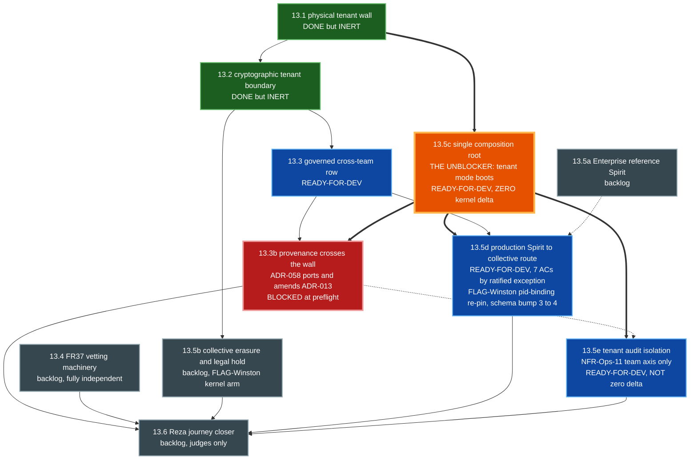

# Dependency DAG

Story-level dependency graph (cross-epic only — intra-epic ordering covered per-epic). Forward dependencies must be resolved by either (a) ordering the dependency before the dependent in sprint plan, or (b) a documented stub interface (`MockHaltResolver`-style pattern).

```
                    E0 Quality Substrate
                    ├──→ ALL EPICS (CI gates run on every PR)
                    └──→ Story 0.4 ComplianceClaim adversarial review BLOCKS Story 1b.4 schema freeze

E1a Workspace Bootstrap + Skeleton
├──→ E1b (workspace + ABI types must exist)
├──→ E2 (Spirit ABI types must exist)
└──→ Story 1a.1 → ALL: starter-template flag

E1b Evaluator Path + Audit Spine
├──→ E2 (manifest schema frozen)
├──→ E3 (IAC bus skeleton, Approval Decision Log, Transparency Log)
├──→ E4 (Memory Manager + Capability Registry runtime)
└──→ E5 (lifecycle hooks + sandbox infrastructure)

E2 Spirit ABI + Developer SDK
├──→ E3 (Spirit ABI lifecycle hooks)
├──→ E4 (halt-protocol Spirit-side declarations)
├──→ E7 (full SDK extends E2 seed)
└──→ Story 2.3 thin cargo-generate slice → Story 7.5b NFR-Onb-1 v0.3 gate execution

E3 Director's Surface — IAC Bus, Task Assignment, Posture
├──→ E4 Story 4.1 (halt-resolution UX surface — MockHaltResolver pattern allows unit isolation but integration gates on Story 3.3 shipping)
├──→ E6 (IAC bus skeleton)
└──→ Story 3.4 kernel log-composition primitives → Story 8.1 Butler morning-digest implementation

E4 Halt Protocol + Memory + Cognition (SINGLE HALT OWNER)
├──→ E5 Story 5.2 (halt-continuity-across-hot-swap I14 enforcement)
├──→ E5 Story 5.3 (halt-receipt production rate measurement)
├──→ E8 (cognitive primitives consumed by reference Spirits)
└──→ INTRA-E4 ORDERING: Story 4.5 (HSIS corpus 100 scenarios) MUST precede Story 4.1 AC4 (halt-recall/precision measurement)

E5 Lifecycle + Hot-Swap + Multi-Provider
├──→ E6 (lifecycle triggers + crash supervision required for A2A peers)
├──→ E7 (Spirit registry over MCP-Streamable-HTTP)
└──→ INTRA-E5 ORDERING: §13.1 measurement gate (Story 5.5e) MUST be last in E5 (go/no-go on rust-inproc)

E6 Multi-Spirit + A2A
├──→ E7 (CCAC cross-Spirit scenarios require A2A)
├──→ E8 (Orchestrator + Workers require IAC bus full features; Mira+Nash requires A2A cross-Host)
└──→ E9 (cross-Spirit memory isolation 200-corpus and GDPR cascade depend on multi-Spirit runtime)

E7 Spirit Ecosystem
├──→ E8 (reference Spirits published via registry)
├──→ E10 (CCAC corpus authored here, cross-validated in Story 10.1)
└──→ Story 7.5b (NFR-Onb-1 v0.3 gate execution) DEPENDS ON: Story 2.3 (thin cargo-generate from E2) + Story 8.1 (Butler reference Spirit from E8). Forward-resolved by slicing Story 2.3 forward to v0.3 sprint.

E8 Reference Spirits
├──→ E9 (audit queries validated against reference-Spirit production traces)
├──→ E10 (Butler/Researcher/Orchestrator+Workers/Mira+Nash gate the v1.0 + v1.5 ship)
├──→ Story 8.6 (live maos-a2a-tcp cross-Host transport, over a new maos-a2a-core seam; workspace 39→41 — corrected 2026-06-04 from 37→39 pre-8.5-merge framing) DEPENDS ON: Story 8.5 (loopback-simulated pair) + Story 6.3 (A2A mesh). Split from 8.5 (2026-06-04): live two-process mTLS/TCP transport, own security-critical risk class; introduces maos-a2a-core by extraction (resolves maos-a2a 1500-LOC overage + the transport-trait seam in one move).
├──→ Story 8.7 (fine-grained typed-intent consent enforcement, against the extracted maos-a2a-core; zero new crate, workspace stays 41, maos-kernel-core byte-identical) DEPENDS ON: Story 8.6 (maos-a2a-core seam). Registered 2026-06-05 (Direct Adjustment) — closes the epic-8 §AC-A6 "Noted gap"; ships fine-grained-when-present as transitional + mandatory cross-Host sender population + deletes the dead A2AConsentEnvelope fail-open. Forks decided by team consensus (Winston+Murat+sec-redteam).
├──→ Story 8.8 (fail-closed-for-cross-Host A2A consent — DENY cross-Host frames with absent/unrecognized intent_class; closes audit gap G7) DEPENDS ON: Story 8.7 + Story 8.9 (RE-PARENTED 2026-06-06: fail-closed is moot while peer identity is forgeable — G8; 8.9 binds identity AND its AC3 envelope/valid_until_ns population delivers 8.8's sender-completeness precondition) + the NEW sender-completeness discipline gate (GREEN-at-HEAD: universal router-entry-seam population + fail-closed-readiness of a1_security_regression_guards). Registered 2026-06-05; end-state from 8.7's Q2 consensus (8.7 AC9). Never flipped-while-red; shrinks to a policy-flip + gate-green after 8.9. STILL REQUIRED (G7 survives 8.9 — 8.9 fixes identity/granter/expiry, not the fallback policy).

   ── Epic 8 Completion Delivery (registered 2026-06-06 via party-mode implementation audit; CHARTER AMENDED to "reference Spirits AND their live runtime" — see epic-8 md) ──
├──→ Story 8.9 (A2A trust-binding & consent integrity hardening — closes audit gaps G1·G2·G3·G4·G5·G6·G8·G9·G10; charter-safe, maos-a2a-core + maos-a2a-tcp, NO kernel-core delta) DEPENDS ON: Story 8.6 + Story 8.7. Binds router peer identity to the TLS-verified cert (G8 — verifier.rs:177 discards the verified peer; intake re-derives from attacker-controlled frame.from.host_id → confused-deputy on the live wire) + enforces consent granter/expiry (G1/G10 — prepare_outbound never populates valid_until_ns today). UNBLOCKS Story 8.8. [Phase 1, charter-safe]
├──→ Story 8.10 (kernel-enforced invariant closure + Butler AC2 halt remediation — I11 citer-auth + Distillate write-chokepoint, I12 content wiring, Observer NaN/Inf fail-safe, pub-field bypass class) DEPENDS ON: none (independent). Touches maos-iac + maos-domain + spirits/{butler,observer}; verify maos-kernel-core byte-identical. AC1 = P0 correct-course of the 'done' Story 8.1 (production on_idle never writes the scalar / fires the halt; review marked the fix applied — it was not). [Phase 1]
├──→ Story 8.11 (live runtime spine — `maos run` daemon composition root + Inference Port live-LLM path + runtime budget enforcement + 5-metric real scoring; KEYSTONE) DEPENDS ON: Story 8.10. CHARTER-AMENDED kernel delta — a NEW pinned maos-kernel-core baseline retires 8.4's 15505 byte-identical assertion for this story (FLAG-Winston). Replaces the 54 env-gated MAOS_SMOKE_* arms as the production run surface. [Phase 2, ⚠ kernel]
├──→ Story 8.12 (live CliWrapper subprocess stdio bridge — implement lifecycle/cli_wrapper/runtime.rs; Worker spawns real claude/opencode/gemini/kimi; founder-loop over real CLIs → J1 real) DEPENDS ON: Story 8.11. The bridge 8.4 explicitly deferred as "kernel work, not Spirit work". CHARTER-AMENDED kernel delta. [Phase 2, ⚠ kernel]
├──→ Story 8.13 (cross-host live pair — Spirit→TCP binding + real mobile push → J4 end-to-end; Mira::diagnose()/advisory() output rides the live maos-a2a-tcp wire via the daemon, where 8.6 sends a hand-built literal today) DEPENDS ON: Story 8.9 + Story 8.11. NEW maos-notify-push crate (HTTP push replaces MobilePushCapture). Closes the "8.5 logic + 8.6 wire never meet" gap. [Phase 2]
├──→ Story 8.14a (J0 evaluator surface + runtime CLI — hello-spirit real impl + `maos init`/kernel-rendered shell + `maos audit query`; NEW maos-cli crate) DEPENDS ON: Story 8.11 + Epic 9.1 (cross-epic back-edge). SPLIT from 8.14 (2026-06-06) to shorten the Butler path; provides the `maos spirit add`/`maos run` shell surface both single-Spirit journeys need. [Phase 3]
├──→ Story 8.14b (Butler MCP driver set — real Calendar/Slack/Linear/Figma; NEW maos-mcp crate, replaces fixture-replay provider butler/src/lib.rs:76-77) DEPENDS ON: Story 8.11 + 8.14a. With 8.10·AC1, the LAST story on the shortest J-Butler-experienceable path. [Phase 3]
├──→ Story 8.14c (Researcher MCP driver set — real web/arXiv/GitHub/citation-graph, parallelism 8; extends maos-mcp) DEPENDS ON: Story 8.11 + 8.14a. Completes the shortest J-Researcher path. [Phase 3]
└──→ Story 8.15 (TEST TRACK — journey-acceptance harness + red-phase "watch-it-work" suites for ALL Epic-8 journeys; NEW dev-only maos-journey-test crate: PTY+vt100 + ReplayInferenceProvider + MockMcp + tokio virtual time, reusing 8.6 H1–H6 guards; Tier-1 hermetic <2s/journey + Tier-2 nightly --live re-record + cassette-age gate) DEPENDS ON: Story 8.11 (run-surface seam) + 8.14a. ATDD red-phase authored 2026-06-06; per-journey slices flip green as 8.14b/8.14c/8.12/8.13 land. Relocates the harness sub-AC formerly in 8.11·AC5. LAST in Epic 8, before Epic 9. [Test track]

E9 Audit + Compliance + Operator Productionization
├──→ E10 (multi-operator tenancy primitive-reservation declared here; full impl v1.5+ in Story 10.4)
└──→ Story 9.1 (maosctl audit subcommands) → Story 8.14a (J0 `maos audit query` surface) — cross-epic BACK-EDGE added 2026-06-06: Epic 8 completion-delivery's J0 surface consumes Story 9.1; pull Story 9.1 forward into the completion-delivery sprint or 8.14a forward-resolves with a stub.

E10 v1.0 Ship Gate + v1.5 Collective Tier
└──→ Coordination epic — consumes corpora authored in E4 (HSIS 100), E5 (HSIS 200), E7 (CCAC 600), E9 (red-team 80→640 generator), E0 (secret-redaction generator)
```

**Sprint-plan invariants (must hold for above DAG to be coherent):**

1. **v0.3 sprint:** Story 0.4 → Story 1a.1 → Story 1b.4 (schema freeze) → Story 2.3 (cargo-generate) → Story 3.3 (halt UX) → Story 3.4 (digest primitives) → Story 4.1 (halt mechanism) → Story 4.5 (HSIS 100 corpus) → Story 8.1 (Butler) → Story 7.5b (NFR-Onb-1 gate execution)
2. **v0.5 sprint:** Stories 5.1–5.4 → Story 5.5e (§13.1 go/no-go) → Stories 8.2, 8.3 (Researcher, Observer)
3. **v0.8/v0.9 sprint:** Story 5.2 (HSIS 200 corpus) → Stories 6.1–6.5 → Story 8.4 (Orchestrator + Workers)
4. **v1.0 sprint:** Stories 7.1–7.5a → Story 7.3 (CCAC 600) → Story 9.6 (red-team 80→640 generator) → Story 10.1 (HSIS verification + CCAC cross-validation + pen-test) → Story 10.2 (third-party trial + adversarial red-team execution) → Story 10.3 (export-control + manifest fuzz + wire fuzz + Korean docs)
5. **v1.5 sprint:** Story 10.4 (Postgres Loom-lite + Mira+Nash + SQLite→Postgres migration) → Story 10.5 (skill-format conformance + JetBrains + Windows + 2-year LTS + Japanese/CN-S i18n) → Story 8.5 (Mira+Nash safety-critical corpus 150 + κ≥0.7) → Story 8.6 (live maos-a2a-tcp cross-Host two-process mTLS/TCP transport) → Story 8.7 (fine-grained typed-intent consent vocabulary over maos-a2a-core) → Story 8.8 (fail-closed-for-cross-Host consent — see invariant 6 for the re-parented ordering)
6. **Epic 8 completion-delivery sprint (charter-amended 2026-06-06; takes Epic 8 from fixture-proven substrate to presentable journeys):**
   - **Phase 1 — trust restoration (charter-safe):** Story 8.10·AC1 (Butler halt — P0 correct-course hotfix, land first) → Story 8.9 (A2A trust-binding, security-critical) → Story 8.10 (invariant closure) → Story 8.8 (fail-closed consent, now gated on 8.9).
   - **Phase 2 — live runtime spine (kernel-amended):** Story 8.11 (daemon + Inference Port — KEYSTONE; everything below blocks on it) → Story 8.12 (CLI bridge → J1) ∥ Story 8.13 (live pair + push → J4, also needs 8.9).
   - **Phase 3 — journey surface (split per journey 2026-06-06 to quicken Butler):** Story 8.14a (J0 surface + CLI, needs Epic 9.1) → Story 8.14b (Butler MCP) ∥ Story 8.14c (Researcher MCP).
   - **Per-journey "presentable" gate:** J0 = 8.14a + 9.1 · J-Butler = 8.10·AC1 + 8.11 + 8.14a + 8.14b · J-Researcher = 8.11 + 8.14a + 8.14c · J1 = 8.11 + 8.12 · J4 = 8.9 + 8.11 + 8.13. (J3/Reza/Diego remain out of Epic 8 scope.)
   - **Shortest "watch-it-work" path (Butler):** 8.10·AC1 → 8.11 → 8.14a → 8.14b (Story 8.15 harness asserts it). Researcher: 8.11 → 8.14a → 8.14c.
   - **Test track:** Story 8.15 (journey-acceptance harness + red-phase suites, ATDD-authored) DEPENDS ON 8.11 + 8.14a; authored RED early, each journey story flips its slice green. Owns the harness relocated out of 8.11·AC5. Last in Epic 8, before Epic 9.

---

## Epic 13 — Reza Cortex (v2.2) — intra-epic DAG

Added 2026-07-18 after the epic was rescoped 8 → 11 stories (`sprint-change-proposal-2026-07-18.md`). Epic 13 warrants an explicit intra-epic graph because two of its edges were **stale or wrong** until this pass: the old 13.5c dependency row predated the H1 split and never listed 13.3b, and `13.5a → 13.5d` turned out to be a **hard** precondition rather than the advisory ordering the epic implied.



**Reading it** *(legend refreshed 2026-07-19 — the three preflights changed both edges and colours)*: **thick arrows** are the critical path through 13.5c, which now feeds **three** stories (13.3b, 13.5d, 13.5e). **Dotted arrows are soft, and the two are soft for different reasons** — `13.5a ⇢ 13.5d` is an **advisory** dependency (reversed from HARD: researcher hosts the port, so 13.5d is not gated on an unwritten story), while `13.3b ⇢ 13.5e` is an **ABSENT-leg constraint** (13.5e's *label-only team identity* leg stays ABSENT until 13.3b lands). **Colours are preflight verdicts:** green = shipped-but-inert, **orange = the unblocker**, blue = `ready-for-dev`, **red = blocked at preflight**, grey = backlog. 13.1 and 13.2 are INERT because `MAOS_LOOM_HOME_TEAM` is a hard boot failure until 13.5c — both walls exist in code and run in no bootable configuration. **13.3b is the epic's only blocked story:** its AC1 and AC5 contradict each other (AC1 demands a live two-region proof; `check-cross-region-consensus` provisions no Postgres). 13.1 and 13.2 are marked INERT because `MAOS_LOOM_HOME_TEAM` is a hard boot failure until 13.5c — both walls exist in code and run in no bootable configuration.


**The three edges this pass corrected or discovered:**

1. **`13.1 → 13.5c` is the epic's real critical path, not `13.2 → 13.3`.** 13.5c depends only on 13.1, and until it lands `MAOS_LOOM_HOME_TEAM` is a hard boot failure (`main.rs:2286`) — so 13.1's and 13.2's walls are **inert in every bootable configuration**. Two shipped stories currently do nothing at runtime.
   - ⚠ **CORRECTED by the 13.5c preflight (2026-07-19): "13.5c makes the walls live" is TOO STRONG.** Two findings bound it. **D17:** `TenantMapAdapter::register_spirit` has **zero production callers**, so after 13.5c tenant mode *boots* and then every collective read/write/scan fails `TenantSpiritUnmapped` — fail-closed and correct scope, but **"boots" ≠ "serves"**; **13.5d owns `register_spirit`**. **D18:** `tenant_map_for_store` sits inside the `MAOS_LOOM_POSTGRES` arm, so `TenantMapAdapter` is **never constructed hermetically** — the first production construction is reachable **only on the live Postgres leg**, and with the substrate absent the claim is **UNMEASURED, not green**. The honest statement: **13.5c makes the tenant map constructible and boot-reachable in production for the first time; the wall does not SERVE until 13.5d.**
2. ~~**`13.5a → 13.5d` is HARD, not advisory.**~~ ⚠ **REVERSED 2026-07-19 by the 13.5d preflight (D26). The edge is ADVISORY.** The premise ("no reference Spirit touches memory") is **true**, and its conclusion is a **non-sequitur**: 13.5a's own AC sketch never mentions memory either, so 13.5a has no memory surface to hang a port on. The decisive test is which Spirit is **constructed at the composition root** — `researcher` is (`main.rs:3815`); 13.5a's Enterprise Spirit is constructed nowhere and sits at `backlog` with no story file. `researcher` also supplies the trait shape, the enterprise runtimes, and a `provider.complete` block that **discharges fork L2 outright**. `sprint-change-proposal:117` and `epic-13:52` were already right; this DAG line was the outlier. **Consequence: the epic's critical path is shorter than drawn, and 13.5d is not gated on an unwritten story.**
3. **`13.3b → 13.6` and `13.3b ⇢ 13.5e`.** The old 13.5c AC5 restated 13.3b's deliverable list verbatim; it moved to 13.3b, and 13.5e's *label-only team identity* leg emits **ABSENT** until 13.3b lands. The pre-split dependency row never recorded either edge.

### Three more edges, from the 2026-07-19 preflights of 13.3b / 13.5d / 13.5e

4. **NEW HARD EDGE: `13.5c → 13.3b`.** Found by the 13.3b preflight. 13.3b's AC3 injects consent into `log.recall`, but `LogRecallAdapter::new` is at `main.rs:2417` and `CohortManifestState::load` at `main.rs:8031` — **5 614 lines apart**; 13.5c closes that to `:2268`. **No cycle**: 13.5c depends only on 13.1 and is already `ready-for-dev`. Note the edge is **consent-layer-only** — 13.3b's leaf/store layer needs nothing from 13.5c, because 13.1's live legs construct `LoomLiteStore` directly (`tenant_wall_live.rs:144`). That asymmetry is why three artifacts missed it.
5. **NEW INVERTER EDGE: `11.4b ⇢ 13.5e`.** 13.5e's dead-wire negative names 11.4b as an inverter alongside 13.5d and 13.5b — `Detector::detect` is a dead-wired fifth read surface with zero production callers, owned by 11.4b. Not previously drawn.
6. **MERGE-ORDER CONSTRAINT (not a dependency, but it bites the same way).** **Three** stories now rewrite the same 4-element array `ABSENT_SUCCESSORS` in `xtask/src/check_multi_tenant_loom.rs`: 13.5c (mandated by its closed preflight), 13.3b, and 13.5e. **Whichever lands second must rebase, not merge.** ⚠ Citation correction: 13.5c's story file cites the array at `:21`; it is at **`:22`** — 13.5e's citation is the correct one.

**Also corrected on the diagram:** node labels now carry real preflight verdicts (13.3b **BLOCKED**, 13.5d **NEEDS-REWORK**, 13.5c/13.5e **READY-FOR-DEV**) instead of the uniform `drafted` they were generated with.
