# MAOS — 설계 보고서

> **글쓴이의 한 마디.** 본 보고서는 아키텍처 문서의 *대체*가 아니라 *동반* 문서입니다. Winston의 아키텍처가 **무엇을 왜 만드는가**를 말한다면, 본 보고서는 **각 부분 뒤에 있는 추론**을 설명하여 MAOS를 처음 접하는 독자도 한 번 읽고 이해할 수 있도록 합니다. 두 문서는 서로 모순되지 않습니다. 다만 역할이 다를 뿐입니다. **직관**이 필요할 때는 본 보고서를, **결정**이 필요할 때는 아키텍처 문서를 읽으십시오.

---

## 본 보고서를 읽는 법

본 보고서는 여섯 장(章)과 코다(coda)로 구성됩니다. 각 장은 하나의 질문에 답합니다.

| # | 장 | 질문 |
|---|---|---|
| 1 | 인지 프레임워크 | *각 Spirit은 어떻게 다르게 사고하는가, 그리고 커널은 그것을 어떻게 허용하는가?* |
| 2 | 메모리 아키텍처 | *Spirit은 무엇을 알고, 무엇을 기억하며, 스왑(swap)에서 무엇이 살아남는가?* |
| 3 | 다중 에이전트 오케스트레이션 패턴 | *Spirit들은 어떻게 협업하며, 커널은 그들이 어떻게 패턴을 고르도록 두는가?* |
| 4 | 보안 및 신뢰 모델 | *기반(substrate)을 희망이 아니라 구조로 안전하게 만드는 방법은?* |
| 5 | 모듈성 및 핫스왑(hot-swap) 메커니즘 | *Spirit이란 기계적으로 무엇이며, 어떻게 손상 없이 들고 나는가?* |
| 6 | 개발 방법론 | *새로운 Spirit을 책임감 있게 만드는 방법은?* |
| ☼ | 아직 존재하지 않는 세 Spirit | *아키텍처는 우리가 아직 상상하지 못한 에이전트도 환영하는가?* |
| ⌘ | 일관성(Coherence) | *여섯 주제는 서로를 보강하는가?* |

**장은 어떤 순서로 읽으셔도 됩니다.** 각 장은 한 문장의 주장과 도식으로 시작하고, **수용한 트레이드오프** 절로 마무리하여 검토자가 어디에 이의를 제기할 수 있는지 알 수 있도록 합니다. 분량이 긴 장에는 박스 처리된 사례가 들어 있고, 짧은 단락은 도식을 소개합니다. 도식이 무거운 일을 합니다.

본 보고서의 시각적 관례는 다음과 같습니다.

- **박스 처리된 인용문**은 여정(journey) 중 하나(Nexus, Mira & Nash, Cortex)에서 가져온 구체적인 시나리오를 소개합니다.
- *기울임꼴 용어*는 처음 등장 시점에 끝부분 용어집(glossary)에서 정의됩니다.
- `mermaid` 코드 펜스는 도식입니다. 만약 독자가 Mermaid를 렌더링하지 못한다면, 적어도 텍스트로 명확히 읽혀야 합니다.

---

## 1장 — 인지 프레임워크 (Cognitive Frameworks)

> *Spirit은 한 가지 방식으로만 사고하지 않습니다. 커널은 그 방식을 선택하지 않습니다. Spirit의 매니페스트(manifest), 시스템 프롬프트, 도구 표면(tool surface)이 함께 사고에 대한 자세(posture)를 선택합니다 — 그리고 그 자세가 곧 "인지 프레임워크"입니다.*

### 1.1 네 가지 추론 패턴

인지과학자들은 오래전부터 **"좋은 사고"의 의미는 무엇을 하려고 하느냐에 달려 있다**는 사실을 알고 있었습니다. 친구의 생일을 예측하는 추론은 자동차가 시동이 걸리지 않는 이유를 진단하는 추론과 같지 않습니다. 관련 논문을 검색하는 일은 새로운 아키텍처를 작성하는 일과 같지 않습니다.

MAOS는 Spirit의 추론을 **두 축**을 따라 분류하고, **사분면당 하나씩 네 가지 패턴**을 인정합니다.

**두 축:**

- **반응적(Reactive) ↔ 선제적(Proactive).** Spirit이 트리거(trigger)될 때 응답하는가, 아니면 조건이 갖춰지면 스스로 시작하는가?
- **수렴(Convergent) ↔ 발산(Divergent).** Spirit이 단일 답으로 좁혀 가는가, 아니면 여러 가능성으로 열어 가는가?

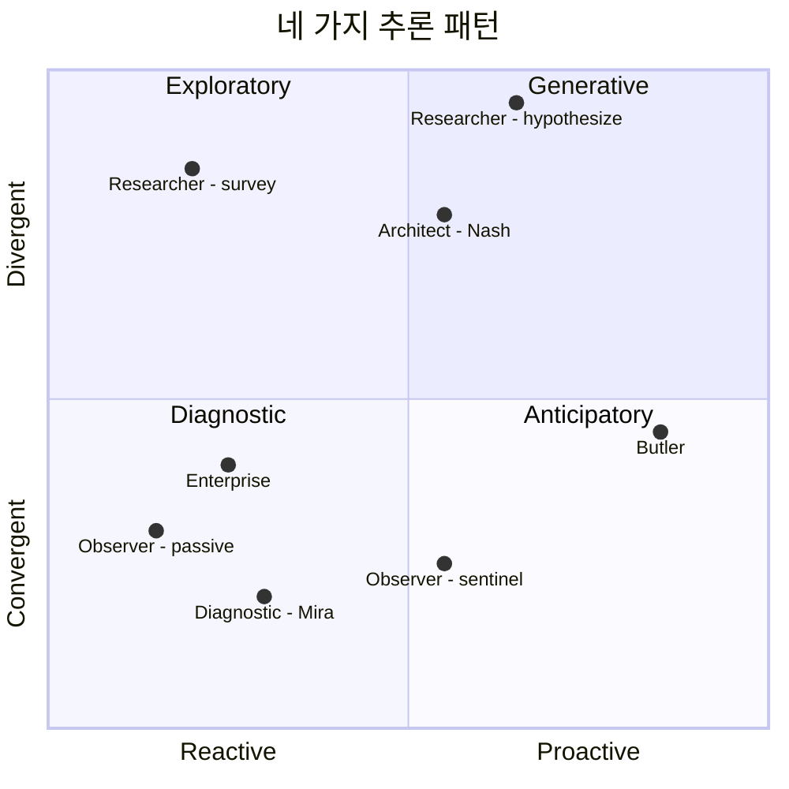

이 지도 위 각 Spirit의 위치는 **영구적인 거주지가 아니라** — 기본 자세가 자리한 곳입니다. 세션 도중의 자세 전환은 Spirit을 한 사분면에서 다른 사분면으로 옮길 수 있습니다. (Researcher가 가설(hypothesize) 모드로 토글하면 Exploratory에서 Generative 쪽으로 이동합니다. Observer가 자세를 `sentinel`로 격상하면 Reactive에서 Proactive 쪽으로 이동합니다.)

### 1.2 각 패턴이 실제로 의미하는 것

각 패턴을 호기심 많은 친구에게 설명하듯 풀어 드리겠습니다.

**선제적(Anticipatory)** *(반응적→선제적, 수렴)*은 다음과 같이 묻습니다: *"내가 보고 있는 것을 고려할 때, 곧 필요해질 가능성이 가장 높은 것은 무엇인가?"* 사흘 연속으로 사용자가 18시 이후까지 일하는 것을 알아차리고는, 사용자가 떠올리기 전에 조용히 19시 저녁 약속을 취소하는 좋은 집사의 추론입니다. **수렴합니다** — 고려할 만한 필요는 소수이고, Spirit의 임무는 가장 가능성 높은 것을 고르는 것입니다. **선제적입니다** — 아무도 묻지 않았습니다.

Butler의 `on_idle` 라이프사이클 훅(lifecycle hook)은 커널이 *"그렇다, 선제적 사고는 허용된다 — 여기가 그 시점이다"*라고 말하는 방식입니다. 이 훅이 없다면 선제적 추론은 거주할 곳이 없으며, Spirit은 그저 프롬프트를 기다리며 앉아 있을 뿐입니다.

**탐색적(Exploratory)** *(반응적, 발산)*은 다음과 같이 묻습니다: *"내가 알아야 할 무엇이 저기 바깥에 있는가?"* Researcher가 서베이(survey) 모드로 작동하는 방식입니다 — 주제가 주어지면 출처들을 가로질러 펼쳐 가며 수집·중복 제거·요약합니다. **발산합니다** — 다수의 출처, 다수의 관점, 무게를 잡아야 할 다수의 증거. **반응적입니다** — 사용자가 질문했습니다.

커널은 Researcher Spirit에게 폭넓은 MCP 캐퍼빌리티(웹 검색, 학술 검색, github 검색)와 도구 디스패치의 높은 병렬성을 부여함으로써 탐색적 추론을 지원합니다. 인지의 *스타일*은 시스템 프롬프트에 살고, 인지의 *용량*(병렬성, 회상 깊이)은 매니페스트에 삽니다.

**진단적(Diagnostic)** *(반응적, 수렴)*은 다음과 같이 묻습니다: *"이 모든 증거를 설명하는 가장 작은 가설은 무엇인가?"* 이것이 Mira의 추론입니다. 스레드 덤프, 메트릭, 배포 디프(diff), 시간 상관관계가 주어지면, 진단적 Spirit은 가장 절약적인 단일 원인으로 좁혀 갑니다. **수렴합니다** — 오컴의 면도날(Occam's razor); 목표는 서베이가 아니라 하나의 근본 원인입니다. **반응적입니다** — 텔레메트리가 조사를 촉발했습니다.

커널은 진단적 추론을 다음과 같이 지원합니다. **Telemetry Stream**(Spirit이 지각을 가짐), **프로덕션 런타임에 대한 읽기 전용 캐퍼빌리티 범위**(망가뜨리지 않고 조사 가능), 그리고 Mira의 매니페스트에 있는 **필수 신뢰도 점수(confidence-scoring) 출력 술어(predicate)**(Spirit의 출력 형식이 모호한 "...처럼 보인다" 식의 손짓 대신 명시적 가설 진술을 강제).

**생성적(Generative)** *(선제적, 발산)*은 다음과 같이 묻습니다: *"이 문제를 해결할 새로운 산출물은 무엇인가?"* Nash가 ADR이나 새 패턴을 작성할 때의 추론입니다. **발산합니다** — 고려해야 할 다수의 가능한 설계, 다수의 트레이드오프. **선제적입니다** — Spirit은 즉각적인 필요를 앞서가며, 아직 존재하지 않는 문제를 위해 설계합니다.

커널은 긴 컨텍스트 윈도(Opus 기본), 적극적인 프롬프트 캐싱(초안 반복이 저렴), 그리고 **집단 메모리 쓰기**(산출물이 Spirit 세션을 넘어 — Loom에 — 살아남도록)를 통해 생성적 추론을 지원합니다.

### 1.3 커널은 어떻게 패턴을 조합하는가

Spirit은 하나의 추론 패턴이 *아닙니다*. 실제 Spirit은 한 세션 안에 여러 패턴을 조합합니다.

> **Mira & Nash, 여정 11, 3막** — Nash가 Mira의 에스컬레이션을 받습니다. 그는 **Diagnostic** 모드로 시작합니다(Mira가 찾은 버그를 확인). **Exploratory** 모드로 전환합니다(같은 패턴을 코드베이스에서 검색). 다시 **Diagnostic**으로 돌아갑니다(휴면 패턴이 중요한가?) — 그는 Mira에게 텔레메트리를 요청합니다. 그러고 나서 **Generative**로 전환합니다(수정 작성, 회귀 테스트 작성, ADR 초안 작성).

한 세션 안의 네 패턴. 커널은 그 어느 것도 알지 못합니다. 커널이 *아는* 것은 다음과 같습니다.

- 각 패턴은 서로 다른 캐퍼빌리티를 필요로 합니다. Nash의 Diagnostic 단계는 소스에 대한 `fs.read`가 필요합니다. Exploratory 단계는 리포지토리 횡단 검색이 필요합니다. Generative 단계는 `fs.write`, `git.commit`, `mcp.call(adr-registry)`가 필요합니다.
- 각 패턴은 서로 다른 출력 형식을 가집니다. Diagnostic에서는 신뢰도 점수, Exploratory에서는 인용, Generative에서는 테스트된 코드.
- 각 패턴은 메모리와 다르게 상호작용합니다. Diagnostic은 많이 읽고 적게 씁니다. Generative는 많이 쓰며, 종종 집단(collective) 계층에 씁니다.

**커널의 역할은 같은 Spirit 세션 안에서 네 가지 모두를 저렴하고 안전하게 만드는 것입니다.** 커널은 다음을 통해 이를 수행합니다.

1. *세션*이 아니라 *행위*의 입자도(granularity)에서 캐퍼빌리티를 발급합니다. Nash의 `fs.write`는 그가 이번 수정에서 편집하는 파일들로 범위가 좁혀지며, "언제든 어떤 파일이든"이 아닙니다.
2. Spirit의 매니페스트가 **출력 형식 술어(output shape predicate)**를 선언하고, Capability Registry가 타입이 지정된 프레임을 발신하기 전에 이를 검사하도록 합니다 — Mira의 신뢰도 점수 요건, Researcher의 "Open Questions + Confidence Map" 마무리 등.
3. 일상적인 하위 단계에 대해 프롬프트 캐싱과 작은 토큰 모델 라우팅을 통해 패턴 전환을 저렴하게 합니다.

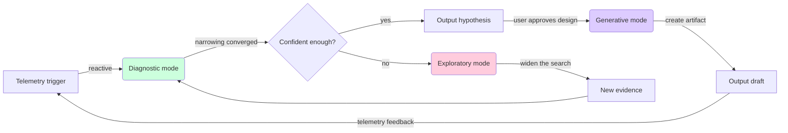

같은 삼중주 — Diagnostic → Exploratory → Generative —는 대부분의 소프트웨어 엔지니어링 작업을 묘사합니다. 대부분의 에이전트 클래스는 이 루프 안에서 대부분의 시간을 보냅니다.

Butler의 루프는 다릅니다 — `on_idle → Anticipatory → 알림 → 사용자 응답 → 보관`이며, 따라서 도식 모양도 다릅니다. 그러나 모드 간 전환을 위한 커널 메커니즘은 동일합니다. Spirit의 시스템 프롬프트가 지금 무엇을 하는지 명명하고, Capability Registry가 그 모드에서 허용된 것을 강제하며, Telemetry Stream이 무슨 일이 있었는지 보고합니다.

### 1.4 수용한 것과 거부한 것

**수용한 것:**
- 인지 스타일은 **매니페스트 + 프롬프트 + 도구 선택**이며, 커널 기능이 아닙니다. `KernelCognitiveSelector::pick(reasoning_pattern)` API는 없습니다. 검토했고 — 거부했습니다. 커널이 인지 패턴을 알도록 강제하면 모든 새 패턴이 커널 변경이 됩니다.
- Spirit은 매니페스트를 통해 출력 형식을 자체 선언해야 합니다. Spirit 작성자에게는 작은 세금이지만 다운스트림 소비자(피어, 사용자, 평가 스위트)에게는 큰 이득입니다. 진단의 신뢰도 점수, 연구의 인용, 생성의 테스트된 코드 — 모두 커널 경계에서 강제됩니다.

**거부한 것:**
- 패턴을 자동으로 섞는 "추론 컴포저(reasoning composer)" 추상화. 아키텍처의 범용성 주장이 살아남는 이유는 Spirit을 불투명한 사고자(opaque thinker)로 두기 때문입니다. 만약 그 사고를 원시(primitives)로부터 조립하려 한다면, 모든 새 에이전트 클래스가 우리에게 원시를 확장하라고 강요할 것입니다.

---

## 2장 — 메모리 아키텍처

> *MAOS에서 메모리는 인지과학과 시스템 엔지니어링이 만나는 2×4 행렬입니다 — 네 종류 × 세 계층 × 스왑 연산자. 스왑에서 살아남는 것은 살아남도록 계획된 것입니다.*

### 2.1 메모리의 네 종류

인지과학은 네 가지 광범위한 메모리 시스템을 구분합니다. 여기서 유용한 까닭은 각각이 서로 다른 접근 패턴, 서로 다른 수명, 그리고 Spirit 스왑에서 일어나야 할 서로 다른 일을 갖기 때문입니다.

**작업 기억(Working memory)**은 능동적인 스크래치패드입니다 — 지금 이 순간 LLM 컨텍스트 윈도에 있는 것, 그리고 Spirit이 현재 실행 중인 작업 상태, 그리고 열려 있는 캐퍼빌리티 토큰. *빠르고*, *작고*, *부서지기 쉽습니다*: 명시적으로 스냅샷되지 않으면 스왑에서 사라집니다.

**일화 기억(Episodic memory)**은 특정 사건의 시간 도장이 찍힌 로그입니다 — "14:32에 이 명령을 실행했고, stdout은 이러했고, 나는 이렇게 해석했다." 보통 JSONL 트랜스크립트와 롤아웃(rollout)으로 뒷받침됩니다. 큼직하고, 추가 전용(append-only)이며, 질의 가능합니다.

**의미 기억(Semantic memory)**은 사실 형태의 지식입니다 — "프로덕션 데이터베이스는 eu-west-2에 있다, 팀 스탠드업은 화요일 10시이다, 아키텍처는 직접 JDBC 연결을 금지한다." 쓰는 데는 느리고 읽는 데는 빠르며, Spirit 사이에서 트랜스크립트보다 훨씬 더 자주 공유됩니다.

**절차 기억(Procedural memory)**은 "어떻게(how to)" 지식입니다 — "서비스를 배포하려면 X를 실행하고, 이어서 Y를, 그리고 Z를 지켜본다." 스킬, 슬래시 명령, 런북. Spirit 시작 시 로드되고, 세션 도중에 정제되기도 하지만, 실시간으로 처음부터 작성되는 일은 드뭅니다.

### 2.2 세 계층, 네 종류 — 그 행렬

MAOS에는 세 메모리 계층(사적/공유/집단; private / shared / collective)이 있습니다. 네 종류와 교차하면 12칸 행렬이 됩니다. **대부분의 칸은 채워져** 있지만, 강도는 매우 다릅니다.

| 메모리 종류  | 사적(Private, Spirit 1개)             | 공유(Shared, Host 1개)                              | 집단(Collective, Host 횡단, Loom)                |
|---|---|---|---|
| **작업(Working)**   | 가득 — 컨텍스트 윈도, 작업 상태       | 없음 — 결코 Spirit 경계를 넘지 않음                  | 없음 — 결코 Host 경계를 넘지 않음                |
| **일화(Episodic)**  | 가득 — 트랜스크립트, 롤아웃 JSONL     | 일부 — 브로드캐스트 이벤트, IAC 프레임               | 일부 — 인시던트 아카이브, 회고 데이터            |
| **의미(Semantic)**  | 일부 — `memory.md`, 스크래치패드      | 묵직 — 프로젝트 컨텍스트, 캘린더, ADR                | 묵직 — 패턴, 수정 템플릿, 표준                   |
| **절차(Procedural)**| 일부 — Spirit 고유 루틴               | 묵직 — 스킬, 슬래시 명령                              | 묵직 — Loom이 큐레이션하는 팀 횡단 스킬           |

이 표가 분명히 보여 주는 몇 가지:

- **작업 기억은 항상 사적입니다.** 두 Spirit이 작업 기억을 공유한다면 사실상 두 Spirit이 아닙니다. (IAC를 통해 *일화* 노트를 공유할 수는 있지만 그것은 다른 이야기입니다.)
- **의미 기억과 절차 기억은 대부분 Spirit 바깥에 삽니다.** 이것은 긍정적인 설계 선택입니다. 사실과 절차는 어떤 개별 Spirit 인스턴스보다도 오래 살아남아야 합니다. 그것들은 핫스왑을 흥미롭게 만드는 기반입니다.
- **일화 기억에는 프라이버시 스펙트럼이 있습니다.** Spirit의 전체 트랜스크립트는 사적이고, IAC 프레임으로 브로드캐스트된 특정 이벤트는 공유이며, Loom 아카이브에 들어간 해소된 인시던트는 집단입니다.

### 2.3 어디에 무엇이 사는가 — 구체적으로

코호트 서베이를 토대로: 하나의 Host에 있는 각 Spirit은 다음과 같은 디렉터리 트리를 갖습니다.

```
~/.maos/
├── transparency/
│   ├── log.db                   # 모든 IAC, 승인, 캐퍼빌리티 (커널 전역)
│   └── frames/                  # 스필된 큰 프레임
├── shared/
│   ├── shared.db                # 공유 메모리 계층, Host 전역
│   └── pgvector/                # 임베디드 벡터 (선택)
└── spirits/
    ├── butler-001/
    │   ├── manifest.toml
    │   ├── memory.md            # 의미, Spirit 작성
    │   ├── private.db           # 일화 트랜스크립트, 작업 상태, 스크래치패드
    │   ├── rollout.jsonl        # 추가 전용 일화 로그
    │   └── snapshot/<id>/       # 핫스왑용 스냅샷 번들
    └── architect-007/
        ├── ...
```

Host 횡단 **집단 계층**은 다른 곳에 삽니다 — 대개 공유 인프라 위에서 동작하는 Loom 서비스(Postgres + pgvector + Loom 인덱스).

```
loom-server/
├── postgres/
│   ├── patterns                 # 탐지 패턴, 수정 템플릿, 회귀 테스트
│   ├── adrs                     # 아키텍처 결정 기록 (ADR)
│   ├── incidents                # 보관된 인시던트 체인 (Mira→Nash 에스컬레이션)
│   └── pgvector indices
└── api/                         # MCP-Streamable-HTTP 엔드포인트
```

### 2.4 영속화 — 무엇이 언제 기록되는가

서로 다른 메모리 종류는 서로 다른 트리거에서 영속화됩니다.

**작업 기억**은 RAM과 커널 자신의 작업 상태에 삽니다. **스냅샷 시에만 영속화**됩니다. Spirit은 스냅샷 없이 일시 정지될 수 있고(작업 기억은 RAM에서 살아남음), 스냅샷 없이는 마이그레이션이나 핫스왑이 될 수 없습니다(목적지가 상태 블롭(blob)을 필요로 함).

**일화 기억**은 *지속적으로* 영속화됩니다 — 모든 LLM 라운드 트립, 모든 도구 호출, 모든 IAC 프레임이 JSONL 한 줄을 쓰고 롤아웃 SQLite 인덱스를 갱신합니다. 이는 codex/claudian 패턴이며, 크래시 복구에 핵심적입니다. 죽고 재시작하는 커널은 모든 Spirit을 그 롤아웃에서 재구성할 수 있습니다.

**의미 기억**은 Spirit이 작성한 쓰기에서 영속화됩니다. Spirit은 `memory.md`를 갱신할 시점을 스스로 선택합니다(보통 작업 종료 시 또는 영속적인 무언가를 학습했을 때). 공유 의미 기억(프로젝트 컨텍스트, ADR)은 쓰는 Spirit이 선택하는 어느 일정에서든 영속화됩니다. 커널은 신선도(freshness)를 보장하지 않습니다.

**절차 기억**은 *공개 시점*에 영속화됩니다 — 스킬, 명령, 런북이 레지스트리에 추가될 때입니다. Spirit은 절차 기억을 읽습니다. 거기에 쓰는 일은 드물고, 쓸 때는 보통 마찰이 큰 경로를 거칩니다(예: "이 스킬은 팀 라이브러리에 추가되어야 한다 — 검토를 위해 팀의 큐레이터 Spirit에게 A2A 요청을 보낸다").

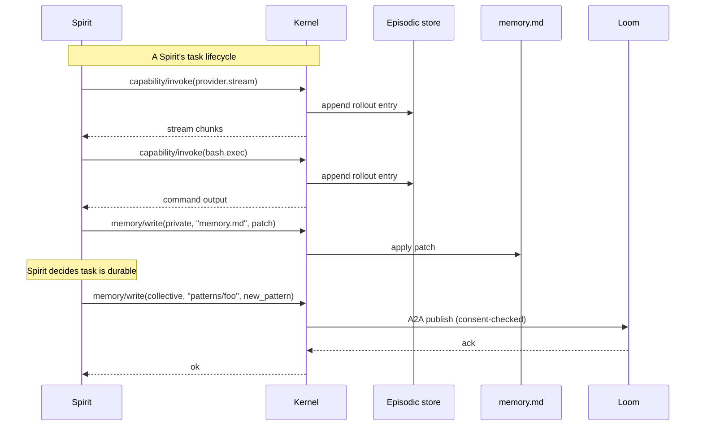

### 2.5 회수(Retrieval) — Spirit은 어떻게 메모리를 다시 가져오는가

회수는 *풀 기반(pull-based)*이며 *계층화*됩니다. Spirit이 Memory Manager에게 필요한 것을 묻고, Memory Manager는 무언가를 반환하기 전에 Spirit의 매니페스트 범위를 검사합니다.

새 작업에서 일반적인 Spirit이 메모리 계층을 두드리는 순서:

1. **memory.md**가 Spirit 시작 시 로드됩니다. 작고 영속적입니다 — "나는 회사 X의 시니어 아키텍트이다; 시스템 코드에는 Go보다 Rust를 선호한다; 팀의 설계 원칙은 다음과 같다"의 등가물입니다.
2. **최근 일화 기억** — 롤아웃의 마지막 N개 항목. "세 턴 전에 무엇을 했는지 기억"에 유용합니다.
3. **공유 의미 기억** — 필요할 때만, Spirit이 프로젝트 컨텍스트나 캘린더 정보를 필요로 할 때. 매니페스트의 읽기 범위가 매개합니다.
4. **집단 의미 기억** — Spirit이 어려운 문제에 부딪힐 때. Architect Spirit은 MCP 호출을 통해 Loom에게 *"이에 대한 패턴이 있는가?"*를 묻습니다. 내부적으로 pgvector + 상호 순위 융합(reciprocal-rank-fusion)이 동작하지만, Spirit은 그것을 모릅니다.

회수는 **결코 프롬프트 주입을 통해 자동화되지 않습니다**. 커널은 메모리를 Spirit의 컨텍스트에 조용히 밀어 넣지 않습니다. Spirit은 Memory Manager API를 통해 메모리를 명시적으로 요청해야 합니다. 이는 여정 10의 투명성에 핵심적입니다 — 피어가 자신의 Spirit이 *정확히* 무엇을 언제 회수했는지 감사할 수 있습니다.

### 2.6 스왑 가로지르기 — 무엇이 살아남는가

여기가 어려운 부분입니다. 스왑은 Spirit A를 빼고 Spirit B를 넣습니다. B는 무엇을 상속받는가?

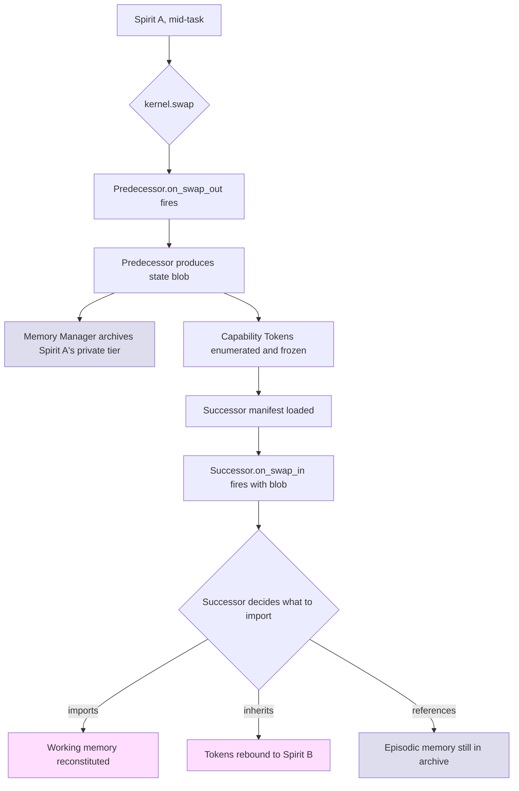

세 단계의 상속, 각각 다릅니다.

- **작업 기억**은 상태 블롭을 통해 *건네집니다*. 후임자는 전체 컨텍스트 윈도를 가져올지, 다이제스트만 가져올지 스스로 결정합니다. 교대 시 의사 인계와 비슷하다고 생각하면 됩니다 — 새 의사는 전체 차트가 아니라 요약을 받습니다.
- **캐퍼빌리티 토큰**은 *재발급되지 않고 재바인딩(rebound)*됩니다. 후임자는 Spirit A의 열린 토큰을 상속하고, 어느 토큰이든 처음 사용할 때 `posture_change` 감사 이벤트가 기록되어 사람이 "Spirit B가 Spirit A가 획득한 토큰을 사용했다"는 사실을 볼 수 있습니다.
- **일화 기억**은 *가져오는 것이 아니라 참조됩니다*. Spirit A의 전체 트랜스크립트는 구성된 보존 기간(기본 30일) 동안 `archive/spirit-a-001/`에 남습니다. 후임자는 (매니페스트 범위에 따라) 이 아카이브를 읽을 수는 있지만, 자신의 메모리로 로드하지는 않습니다. 두 Spirit이 같은 트랜스크립트를 자기 것으로 주장하는 일은 결코 없습니다.

**의미 기억과 절차 기억**은 보통 스왑 시점 처리가 필요 없습니다 — 공유 또는 집단 계층에 살기 때문입니다 — 매니페스트가 허용하면 두 Spirit 모두 같은 `memory.md`를 읽을 수 있습니다. 예외는 Spirit 사적 의미 기억(맞춤 스크래치패드)이며, 이는 일화처럼 처리됩니다 — 보관, 참조 가능, 조용한 이전 없음.

> **Mira → Nash 핫스왑, 자세히.** 잠시 Mira와 Nash가 한 Spirit의 두 자세였다고 상상해 봅시다(단일 Host 구성에서). "스왑"은 더 정확히는 자세 변경이지만, 기계적으로는 다음과 같습니다. Mira의 작업 기억(현재 조사, 열린 가설들)이 캡처됩니다. Mira의 열린 캐퍼빌리티 토큰(스레드 덤프 파일에 대한 읽기 전용 핸들, 텔레메트리 질의)은 동결됩니다. `principal-architect`로의 자세 변경이 트리거됩니다 — Nash는 토큰을 상속하고, 소스 코드 읽기-쓰기 캐퍼빌리티를 얻으며, 프로덕션 변경 캐퍼빌리티를 잃습니다. Nash의 `on_swap_in`이 어느 작업 기억을 가져올지 결정합니다(원시 스레드 덤프가 아니라 진단 결론). 투명성 로그가 모든 단계를 기록합니다. **Mira의 조사는 Nash라는 이름 아래 매끄럽게 이어집니다.**

여정 11의 실제 Host 횡단 사례에서는 메커니즘이 다릅니다 — 에스컬레이션은 스왑이 아니라 A2A 프레임입니다 — 그러나 그 밑의 원시는 동일합니다: 상태 블롭 + 토큰 상속 + 매니페스트 범위 가져오기. 동일 Host냐(저렴, 인프로세스) Host 횡단(A2A 매개, mTLS 보호)이냐는 배포 세부 사항입니다.

### 2.7 컴팩션(Compaction) 문제

LLM 컨텍스트 윈도는 유한합니다. 일화 기억은 무한히 자라납니다. 조만간 Spirit은 **컴팩션**해야 합니다 — 오래된 것을 요약하고, 최근 것은 보존하며, 구조를 보존합니다.

MAOS는 컴팩션 전략을 Spirit의 매니페스트에 맡기지만, 커널은 한 가지 불변량을 강제합니다: **컴팩션 출력에서 tool_use 블록과 tool_result 블록은 항상 짝지어 나옵니다.** 이는 openclaw가 어렵게 얻은 교훈입니다. `tool_use` 짝이 없는 `tool_result`(또는 그 반대)를 보는 LLM은 혼란스러워하고 회복이 느립니다. Memory Manager의 컴팩션 서비스는 이 제약을 알고 있으며, 짝짓기를 깨뜨리는 압축된 트랜스크립트의 발신을 거부합니다.

v1.0과 함께 세 가지 참조 컴팩션 전략이 출시되며, 각각 다른 Spirit 클래스에 적합합니다.

- **`adaptive-chunk-ratio`** — openclaw 스타일 적응적 요약. 요약되는 청크의 크기에 대해 요약 상세도를 균형 잡습니다. Researcher와 Architect의 기본값.
- **`head-tail-protected`** — hermes 스타일. 첫 N개와 마지막 M개 턴은 그대로 보호되고 중간만 요약됩니다. Diagnostic Engineer의 기본값(초기 가설과 가장 최근 증거 모두가 핵심이기 때문).
- **`journal-only`** — LLM 요약 없음; 오래된 턴은 그저 마커와 함께 정리됩니다("turns 1-50 archived to rollout.jsonl"). Observer의 기본값(저렴; 긴 컨텍스트 추론을 필요로 하지 않음).

Spirit 클래스는 자체 구현 크레이트(crate)에서 사용자 지정 컴팩터(custom compactor)를 노출함으로써 직접 구현할 수도 있습니다. Memory Manager는 타입 지정된 트레이트(trait)를 통해 그것을 호출합니다. 커널은 "좋은 요약"이 무엇인지 모릅니다. 단지 짝짓기 무결성 가드를 제공하고, 나머지는 Spirit이 결정하도록 둘 뿐입니다.

### 2.8 수용한 것과 거부한 것

**수용한 것:**
- 작업 기억은 Spirit별이고, 스왑마다 재구성됩니다. 커널 수준 "공유 작업 기억"을 검토했지만 격리를 깨뜨렸습니다 — 두 Spirit이 컨텍스트 윈도 할당을 조정해야 했고, 그 조정이 정확히 IAC 메일박스가 하는 일입니다.
- 스왑인(swap-in) 시 무엇을 가져올지는 Spirit이 결정합니다. 커널이 컨텍스트 전이를 영리하게 처리하려 시도할 수 있지만, 검토한 모든 영리한 휴리스틱은 Spirit 작성자를 놀라게 했습니다.

**거부한 것:**
- 전임자 작업 기억의 자동 가져오기. 후임자가 *자동으로* 전임자의 전체 컨텍스트를 얻는다면, Spirit이 피어의 비밀을 조용히 상속하는 일에서 한 발짝 떨어져 있을 뿐입니다. 명시적 가져오기의 마찰이 신뢰 모델을 선명하게 유지합니다.

---

## 3장 — 다중 에이전트 오케스트레이션 패턴

> *Spirit들은 모두 같은 방식으로 협업하지 않습니다. 커널은 작은 원시 집합을 제공하고, 오케스트레이션 패턴은 애플리케이션이 그 원시들을 조합하는 방식입니다. 올바른 패턴을 고르는 일은 에이전트보다 작업에 더 달려 있습니다.*

### 3.1 네 가지 고전 패턴, 하나의 기반

오케스트레이션 문헌은 (대체로) 네 가지 패턴을 인정합니다. MAOS는 같은 원시들 — IAC 메일박스, A2A 피어 메시(peer mesh), 캐퍼빌리티 범위, 메모리 계층 — 로 네 가지 모두를 지원하고, 애플리케이션이 선택하도록 둡니다.

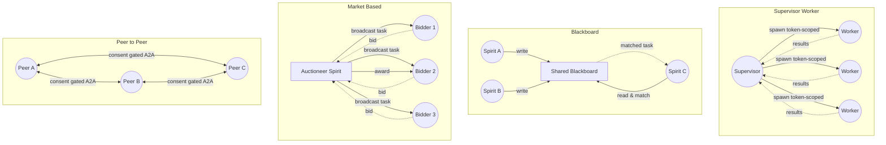

각각을 평이한 한국어로 차례로 설명하겠습니다.

### 3.2 슈퍼바이저 / 워커 (Supervisor / Worker)

**패턴.** 한 Spirit(슈퍼바이저)이 문제를 하위 문제로 쪼개고 그것들을 종속 Spirit들에게 디스패치합니다. 워커들은 입력을 받고, 병렬로 작업하며, 결과를 반환합니다. 슈퍼바이저가 합성합니다.

**적합한 곳.** (a) 책임 계층이 명확하고 (b) 하위 작업이 *대체로* 독립적인 작업. 표준 사례는 codex 다중 에이전트 패턴입니다: Architect Spirit이 N개 파일에 걸쳐 apply-patch 서브 Spirit들을 펼쳐 각각 한 파일을 편집하고 모두 보고하는 식입니다.

**사용되는 커널 원시:**

| 필요 | MAOS 원시 |
|---|---|
| 제한된 범위로 서브 Spirit 생성 | 아키텍처 §5.2의 `subspirit/spawn(manifest, scope)` |
| 하위 작업 디스패치 | IAC 메일박스 |
| 재귀 제한 | hermes 스타일로 매니페스트의 `max_subspirit_depth` |
| 서브 Spirit 작업의 토큰 범위 | 슈퍼바이저보다 좁은 범위로 발급된 캐퍼빌리티 토큰 |

**강점.** 명확한 권한. 각 워커는 작은 토큰 표면(자신의 하위 작업에 필요한 만큼만)을 가집니다. 슈퍼바이저가 워커를 깔끔하게 취소할 수 있음 — 토큰 폐기는 원자적입니다.

**약점.** 슈퍼바이저가 합성의 병목입니다. 슈퍼바이저의 추론이 잘못되면 워커들은 아름답지만 헛된 작업을 합니다. **슈퍼바이저는 워커들보다 똑똑해야 합니다** — 적어도 나쁜 하위 결과를 알아볼 줄 알아야 합니다.

### 3.3 블랙보드 (Blackboard)

**패턴.** 공유된 구조화 메모리("블랙보드"). Spirit들은 그것을 비동기로 읽고 씁니다. Spirit은 블랙보드의 현재 상태에 대해 매칭을 시도하고, 자발적으로 행동을 결정할 수 있습니다. 누구도 블랙보드를 소유하지 않으며, 누구도 책임자가 아닙니다.

**적합한 곳.** 중복 또는 보완적 전문성을 가진 다수의 전문가; 분해가 미리 알려져 있지 않은 문제. Loom이 블랙보드입니다. 집단 메모리 계층 — 패턴, ADR, 수정 템플릿 — 이 블랙보드입니다.

**사용되는 커널 원시:**

| 필요 | MAOS 원시 |
|---|---|
| 공유 구조화 메모리 | 집단 계층(Loom) 또는 공유 계층(Host) |
| 비동기 쓰기/읽기 | 계층에 대한 `memory/write`와 `memory/read` |
| 행동을 트리거하는 패턴 매칭 | Spirit이 메모리 쓰기에 대한 텔레메트리 이벤트를 구독; 매니페스트 매처 |
| 발견 — "내가 할 수 있는 작업이 있는가?" | Spirit이 특정 블랙보드 파티션을 폴링하거나 구독 |

**강점.** 재설계 없이 새 전문가를 추가합니다. 새 Spirit 클래스는 "나는 이 블랙보드 파티션들에서 읽고, 저것들에 쓴다"고 선언할 뿐 — 끝입니다. 회복 탄력적: Spirit이 죽어도, 막 하려 했던 작업은 가시적으로 남습니다.

**약점.** 조정이 암묵적입니다. 두 Spirit이 같은 작업을 처리하려 경쟁할 수 있습니다. 해법은 보통 블랙보드 파티션의 토큰 기반 잠금(Loom의 "이 인시던트를 클레임" 의미론)을 수반하며, 복잡도를 더합니다.

### 3.4 시장 기반 (Market-based)

**패턴.** 조정자(경매인)가 작업 디스크립터를 브로드캐스트합니다. 자격 있는 Spirit들이 입찰(bid)로 응답합니다 — 보통 (비용, 기대 품질, ETA). 경매인이 승자를 고릅니다. 선택적으로, 병렬 작업을 위해 다수의 승자.

**적합한 곳.** 서로 다른 전문화나 부하 수준을 가진 이질적 Spirit들. 일부 Host는 한가하고 다른 일부는 과부하인 Host 횡단 시나리오. 에이전트 용량을 공유하는 조직 연합체.

**사용되는 커널 원시:**

| 필요 | MAOS 원시 |
|---|---|
| 작업 브로드캐스트 | A2A 피어 메시, 역할(role) 질의, `kind: auction` IAC 프레임 |
| 입찰 응답 | 응답 IAC 프레임 |
| 낙찰과 디스패치 | 승리한 피어에 대한 표준 A2A 프레임 |
| 정산 / 책임 추적 | 경매를 문서화하는 투명성 로그 항목 |

**강점.** 이질성을 자연스럽게 다룹니다. Host들은 잘할 수 있는 작업의 입찰에 옵트인합니다. 부하에 적응 — 바쁜 Host는 불리하게 입찰하여 자동으로 작업을 넘깁니다.

**약점.** 작업이 작을 때는 경매 오버헤드가 중요해집니다. 입찰 품질을 평가하기 어렵습니다(Spirit이 과대 약속할 수 있음). 신뢰할 수 없는 연합체에서 "입찰 링" 취약 — 세 Spirit이 서로에게 유리하게 입찰하기로 담합.

v1.0에서는 시장 기반 참조 Spirit 클래스를 출하하지 않습니다. **기반은 지원합니다** — 필요한 모든 원시가 이미 존재합니다 — 그러나 기본 제공으로 추가하기 전에 "삼의 법칙(Rule of Three)"을 기다립니다. (실제 고객 셋이 용량 인지 연합을 원할 때 추가하겠습니다. 그때까지는 필요한 사람이 기반 위에 직접 만들 수 있습니다.)

### 3.5 피어 투 피어 (Peer-to-peer)

**패턴.** 동등한 Spirit들이 위계 없이 협업합니다. 통신은 동의 게이트가 있습니다 — 모든 피어 횡단 메시지는 양쪽이 허용해야 합니다. 중앙 조정자 없음.

**적합한 곳.** **여정 10**입니다. **Mira & Nash**이기도 합니다(비대칭 캐퍼빌리티에도 불구하고 피어). 모든 사람의 에이전트가 그 사람을 대표하고, 누구의 에이전트도 다른 사람의 에이전트를 소유하지 않는, 인간 팀 증강을 위한 지배적인 패턴입니다.

**사용되는 커널 원시:**

| 필요 | MAOS 원시 |
|---|---|
| 인증된 피어 통신 | TOFU와 함께 mTLS 위의 A2A, `a2a.json` 발견 |
| 동의 게이트 | 송신자와 수신자 모두에서의 프레임 수준 승인 |
| 역할 기반 주소 지정 | 현재 Spirit 명단에 대한 역할 질의 |
| 투명성 | 전달 전 투명성 로그 쓰기; retract(철회) 원시 |
| 무성(無聲) 행동 금지 | 커널이 렌더링하는 알림 표면 |

**강점.** 자율성을 최대로 존중. 인간 팀 구조에 자연스럽게 들어맞음. 회복 탄력적 — SPOF 없음. 프라이버시 친화적 — 모든 피어가 노출 범위를 통제.

**약점.** 조정 오버헤드 — 스프린트 업데이트 브로드캐스트는 N개의 동의 게이트를 의미합니다. 대량 작업에는 더 느립니다. 집단 산출을 최적화하려 한다면 무임승차 문제에 취약합니다.

### 3.6 패턴 고르기 (작은 결정 트리)

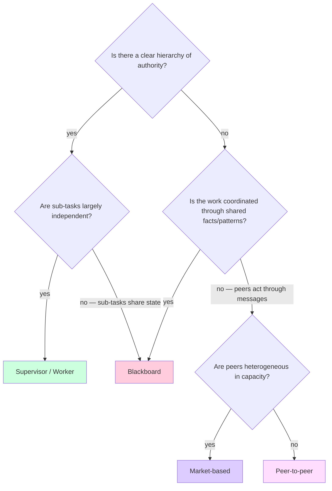

실제로는 실제 시스템이 패턴을 조합합니다. **Cortex**(여정 12)는 근본적으로 피어 투 피어(A2A 메시 안의 28개 Host)이고, 블랙보드 오버레이가 위에 얹혀(Loom이 패턴을 큐레이션) 있으며, 슈퍼바이저/워커 포켓이 들어 있습니다(Artisan 클래스 Spirit이 파일들 횡단으로 apply-patch 서브 Spirit들을 펼침). 셋이 공존합니다.

### 3.7 커널은 어떻게 조정하는가

**조정하지 않습니다.** 그것이 핵심입니다.

커널은 원시 — IAC, 캐퍼빌리티 토큰, 메모리 계층, 텔레메트리 — 를 제공하고, 애플리케이션이 어느 오케스트레이션 패턴을 쓰는지에 대해 중립을 지킵니다. 주어진 Host는 다음과 같이 동작할 수 있습니다.

- 어떤 *오케스트레이션도 없는* Butler Spirit (단일 Spirit 작업).
- apply-patch 서브 Spirit들을 감독하는 Architect (*슈퍼바이저/워커*).
- 프로젝트 컨텍스트 갱신을 위해 공유 메모리 계층을 구독하는 Observer (*블랙보드*).
- 다른 Host의 Architect와 A2A로 피어링하는 Diagnostic Engineer (*피어 투 피어*).
- 동시에.

각 패턴은 같은 커널 원시들을 다르게 사용합니다. 커널은 그것들 사이를 조정하지 않습니다 — 선택할 일이 없기 때문입니다 — Spirit들은 공존하고, 그들의 오케스트레이션 패턴들도 공존합니다.

**커널이 조정하는 단 한 곳**은 패턴들이 자원에서 충돌할 때입니다. 두 패턴이 모두 워커를 생성하려 하고 Host의 `parallel_subspirit_cap`에 도달하면, 커널은 큐잉합니다. 두 패턴이 모두 같은 A2A 메시에 브로드캐스트하려 하고 대역폭 예산에 도달하면, 커널은 율 제한합니다. 이는 스케줄링 관심사이지 오케스트레이션 관심사가 아니며, 균일하게 적용됩니다.

### 3.8 수용한 것과 거부한 것

**수용한 것:**
- 패턴 선택은 애플리케이션의 일입니다. 커널의 중립성은 기능입니다.
- 하이브리드 패턴이 예외가 아니라 표준입니다. 기반은 모든 패턴을 충분히 저렴하게 만들어 섞는 데 부담이 없도록 해야 합니다.

**거부한 것:**
- 패턴을 자동으로 고르는 "커널 오케스트레이터 서비스". 머릿속으로 프로토타이핑했더니, 사용자가 실제로 원하는 어떤 패턴이든 그것의 더 나쁜 버전이 되는 경향이 있었습니다. 오케스트레이션 패턴을 아는 커널은 새 패턴에 저항하는 커널이 됩니다.

---

## 4장 — 보안 및 신뢰 모델

> *기반을 희망이 아니라 구조로 안전하게 만든다. 캐퍼빌리티 토큰은 선택적인 장식이 아닙니다 — Spirit이 행동하는 유일한 방법입니다. 샌드박스가 바닥이고, 승인이 천장입니다. 모든 단계는 성공하기 전에 감사 항목을 씁니다.*

### 4.1 캐퍼빌리티 기반 권한

Spirit이 취하는 모든 행동 — 파일 읽기, 프로바이더 호출, IAC 프레임 발신, 서브 Spirit 생성 — 은 **캐퍼빌리티 토큰**을 통과합니다. 다른 길은 없습니다.

하나의 캐퍼빌리티의 라이프사이클은 4단계 춤입니다.

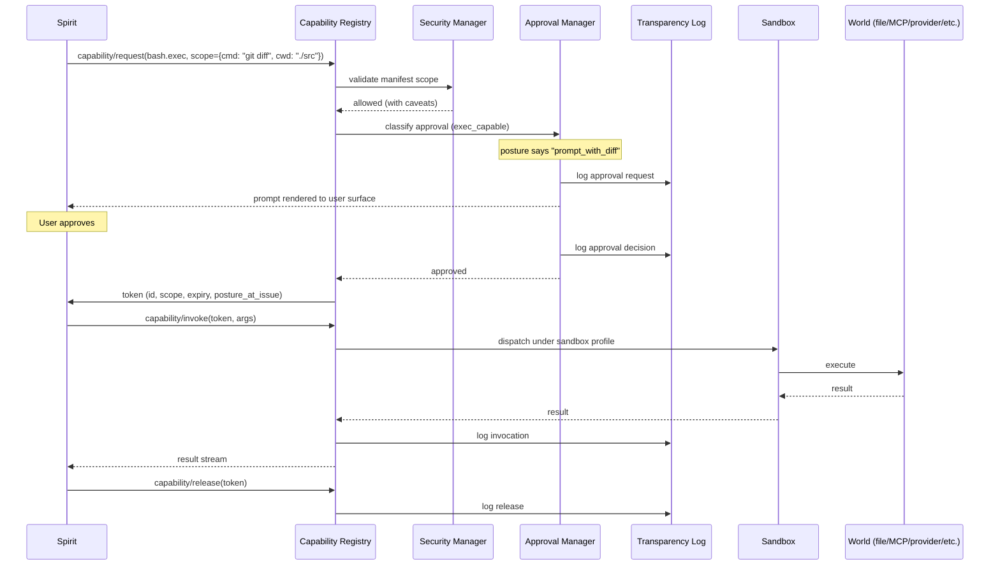

이 도식이 강제하는 다섯 가지:

1. **토큰은 위조 불가능합니다.** 추측 불가능한 128비트 ID를 가지며, 커널이 서명하고, 그것을 요청한 Spirit에 바인딩됩니다.
2. **범위는 입자도가 미세합니다.** 토큰은 "Spirit이 셸 명령을 실행할 수 있다"고 말하지 않습니다. "이 토큰은 `./src`에서 `git diff`의 실행 한 번을 인가하며, 60초 후 만료된다"고 말합니다.
3. **승인은 호출이 아니라 발급 앞에 위치합니다.** 토큰이 일단 존재하면 Spirit은 (토큰의 만료 한도 안에서) 재프롬프트 없이 사용할 수 있습니다. 모든 호출에 재프롬프트하면 승인 피로가 생기고, 명시적 범위로 사전 승인하면 같은 안전 문제를 해결합니다.
4. **모든 단계는 전달 전에 투명성 로그를 씁니다.** 거부된 승인도 항목을 남깁니다. 로그가 감사 추적이며, 사후 재구성될 수 없습니다.
5. **세계는 샌드박스가 통과시키는 것만 봅니다.** Capability Registry는 결코 원시 파일 핸들이나 프로세스 통제를 Spirit에게 건네지 않습니다 — 항상 샌드박스 프로필로 감쌉니다.

### 4.2 여섯 승인 클래스

승인은 여섯 클래스로 구분되며, openclaw의 분류기에서 들어 올렸습니다.

| 클래스 | 예시 | 커널이 프롬프트하는 시점 |
|---|---|---|
| `readonly_scoped` | 이 파일·이 URL·이 MCP 자원 읽기 | 자세가 `prompt`라고 말할 때만 (드뭄) |
| `readonly_search` | grep / glob / 리포 전역 검색 | 자세가 `prompt`라고 말할 때만 (드뭄) |
| `mutating` | 파일 쓰기·편집, 공유 메모리 수정 | `cautious` 자세에서는 `prompt` 기본; 선언된 범위 안의 `autonomous` 자세에서는 `silent_allow` |
| `exec_capable` | 셸 명령·컨테이너·임의 코드 실행 | `cautious`에서는 `prompt_with_diff` 기본; `assistive`에서는 `prompt`; 알려진 안전 화이트리스트의 `autonomous`에서만 `silent_allow` |
| `control_plane` | 서브 Spirit 생성·캐퍼빌리티 범위 변경·자세 수정 | 거의 항상 `prompt`; 좁게 한정된 컨텍스트에서 명시적으로 신뢰된 Spirit에서만 `silent_allow` |
| `interactive` | 피어 ACK가 필요한 IAC 프레임 | 피어의 자세로 라우팅; 송신자 측은 보통 `silent_allow` |

자세는 투영(projection)입니다. 각 클래스가 `silent_allow`, `notify_and_log`, `prompt`, `prompt_with_diff`, `deny` 중 하나로 매핑됩니다. Spirit의 매니페스트가 자세 프리셋을 선언하고, 사용자는 매니페스트의 천장 안에서 런타임에 자세를 바꿀 수 있습니다.

이로써 커널은 Spirit이 *무엇을 위한 것인지* 알지 않고도 "이 Spirit 클래스는 더 자율적이다" 또는 "이 Spirit 클래스는 더 신중하다"고 말하는 깔끔한 방법을 얻습니다. **범용성이 살아남습니다** — 미래의 Spirit 클래스는 같은 6 클래스 분류에서 자세를 고르며, 커널 변경은 필요 없습니다.

### 4.3 샌드박스 계층

다섯 계층(T0–T4)을 출하합니다. Spirit의 매니페스트가 프로필을 선언하면, 선언된 프로필을 충족시킬 수 없는 Spirit의 로딩을 Security Manager가 거부합니다.

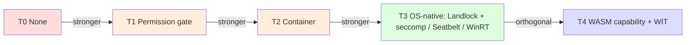

T3와 T4는 엄밀하게 순서 매겨지지 않습니다 — 보호 대상이 다릅니다. T3는 손상된 생성 명령으로부터 호스트 파일시스템과 프로세스 공간을 보호합니다. T4는 손상된 도구 플러그인(악의적인 MCP 서버, 제삼자 스킬 팩)으로부터 보호합니다. **v1.0 기본 스택은 T3 + T4** — 셸을 위한 OS 네이티브 샌드박스, 도구 플러그인을 위한 WASM 캐퍼빌리티 샌드박스입니다.

### 4.4 에이전트 간 인증

동일 Host와 Host 횡단은 매우 다른 신뢰 모델을 가지며, 커널은 각각 다른 메커니즘을 사용합니다.

**동일 Host: 커널 매개.** Host의 Spirit들은 같은 커널이 로드합니다. 커널은 모두를 압니다. 모든 IAC 메일박스 발신은 커널이 내부적으로 서명한 발신자의 `SpiritId`를 가집니다. 와이어 위에는 암호화가 없습니다 — 와이어가 없기 때문입니다 — `tokio::sync::mpsc::Sender`이기 때문입니다.

**Host 횡단: mTLS + TOFU + 프레임당 동의.** Host 사이의 A2A 트래픽은 상호 TLS를 사용합니다. 첫 접촉은 TOFU(Trust-on-First-Use)를 사용합니다. 사용자가 한 번 피어의 인증서 지문을 확인하고, 커널이 그것을 핀(pin)합니다. 모든 A2A 프레임은 양쪽의 Approval Manager(송신자 측 발신 정책, 수신자 측 수신 정책)를 거친 뒤에 전달됩니다.

> **CA가 아니라 TOFU인 이유?** v1.0에서 MAOS는 중앙 PKI가 과한 단일 사용자 및 팀 메시 배포를 겨냥합니다. v2.0의 엔터프라이즈 Cortex 배포는 조직 내부 CA를 도입하겠지만, 그것은 엔터프라이즈 인프라이지 아키텍처가 아닙니다. TOFU는 "Marcus의 노트북이 Lena의 노트북과 통신하려 한다"의 정답이고, CA는 "모든 직원의 노트북이 회사의 인증 기관을 신뢰해야 한다"의 정답입니다.

**역할 질의.** 프레임의 수신자 필드는 SpiritId 대신 *역할*(`role: "architect"`)일 수 있습니다. 수신 Host가 그 역할을 로컬에서 해석합니다 — 그 역할을 현재 보유한 Spirit이 누구이든 프레임을 받습니다. 이로써 여정 10의 "아키텍트에게 묻기" 패턴은 아키텍트가 바뀌어도(휴직, 신규 입사) 주소를 재배포하지 않고도 작동합니다.

### 4.5 감사 추적

감사 로그는 둘입니다. 서로 다른 목적을 가집니다.

**투명성 로그(Transparency Log)** *(개인용, IAC에 대해 커널 강제).* 모든 IAC 프레임, 모든 승인 프롬프트, 모든 캐퍼빌리티 호출, 모든 retract — 행동이 성공하기 전에 추가 전용 항목이 기록됩니다. 소유 사용자에게만 보입니다. "이번 주 내 Host에서 일어난 모든 일을 알고 싶다"고 사용자가 말할 수 있게 해 주는 일지입니다.

**승인 결정 로그(Approval Decision Log)** *(더 깊고, 질의 가능).* 모든 승인 프롬프트의 `(actor, target, capability, intent, decision, reasoning_if_any)`. 분석과 컴플라이언스를 위해 질의 가능합니다. 엔터프라이즈 배포에서는 OpenTelemetry를 통해 조직 SIEM에 스트리밍됩니다.

v1.0에서 둘 다 SQLite 데이터베이스입니다. 둘 다 보관용 JSONL로 내보낼 수 있습니다. **둘 다 커널 관리이며 Spirit 관리가 아닙니다.** Spirit은 어느 로그도 삭제하거나 변경할 수 없으며, 추가만 가능합니다(그리고 간접적으로, 프레임을 retract하는 방식 — retract 자체가 원본을 참조하는 새 추가 항목입니다).

왜 둘 대신 하나가 아닌가? 질의 방식이 다르기 때문입니다. 투명성 로그는 *"무슨 일이 있었나?"*를 묻습니다. 승인 결정 로그는 *"왜 그것을 허용했나?"*를 묻습니다. 합치면 양쪽 질의 모두를 흐릿하게 만듭니다.

### 4.6 휴먼 인 더 루프(Human-in-the-loop) 체크포인트

시스템에 대한 사용자의 신뢰는 **언제 자신의 주의가 필요하고 언제 필요하지 않은지를 아는 것**에 달려 있습니다. MAOS는 세 체크포인트 표면을 노출합니다.

1. **승인 프롬프트.** 그 클래스가 Spirit 자세의 `prompt` 집합과 일치하는 캐퍼빌리티 요청에 의해 트리거됩니다. 동기적입니다. Spirit은 사용자가 응답할 때까지(또는 자세 캐시 결정이 적용될 때까지) 차단됩니다. TUI에, 에디터에(ACP 경유), 또는 사용자의 선호 Host(예: 휴대폰)로의 A2A 푸시로 렌더링됩니다.
2. **알림.** `notify_and_log` 행동에 의해 트리거됩니다. 비동기적입니다. 행동은 진행되지만, 사용자가 안내됩니다. 여정 10에 따라 세 긴급도 수준(즉시/큐/다이제스트)이 있습니다.
3. **retract.** 사용자가 자기 이름으로 무엇이 발신되었는지 알아차리고 그것을 되돌리고 싶어 할 때 트리거됩니다. 커널이 수신자에게 구조화된 retract 프레임을 보냅니다. 수신자의 UI는 retract된 메시지를 그렇게 표시합니다.

기반은 또한 덜 논의되는 네 번째 표면을 노출합니다: **자세 전환.** 사용자는 자기 Butler에게 "다음 한 시간은 더 신중하게 굴어"라고 말할 수 있습니다 — Butler의 자세가 바뀌고, 커널이 전환을 로그하며, 그 이후 캐퍼빌리티 요청은 평소라면 프롬프트하지 않았을 것을 프롬프트합니다. 이는 "감독 모드"의 런타임 등가물입니다.

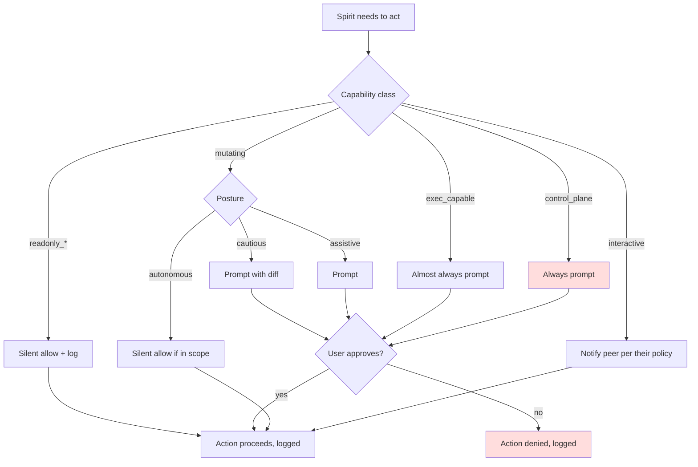

### 4.7 수용한 것과 거부한 것

**수용한 것:**
- 모든 것에 대해 캐퍼빌리티 토큰이 필수입니다. "Spirit 자신의 스크래치패드"라 할지라도 Capability Registry를 건너뛰는 빠른 경로는 없습니다. 이는 오버헤드를 더하지만, 감사·보안 주장을 신뢰할 만하게 만듭니다.
- 승인 프롬프트는 사용자를 피로하게 할 수 있고, 메커니즘만으로 그 문제를 완전히 해결할 수는 없습니다. 우리는 완화합니다(`prompt_with_diff`, 범위별 영구 허용 목록, 자세 캐시 결정) 그러나 근본 문제는 제품 설계이지 아키텍처가 아닙니다.

**거부한 것:**
- 우회 권한을 가진 "신뢰된 Spirit". 모든 Spirit은 같은 게이트를 거칩니다. Spirit 작성자는 다수의 항목에 `silent_allow`인 자세를 사전에 선언할 수 있지만, 사용자에게는 항상 무엇이 일어났는지 검증할 감사 추적이 있습니다.
- A2A의 지문 전용 인증(동의 게이트 없음). 동의 게이트가 없으면 인증된 피어가 무엇이든 보낼 수 있고, 그것이 여정 10의 "비대칭 지식 없음" 보장을 깨뜨립니다.

---

## 5장 — 모듈성 및 핫스왑 메커니즘

> *Spirit은 매니페스트와 상태입니다. 매니페스트가 Spirit을 클래스로 만들고, 상태가 인스턴스로 만듭니다. 핫스왑은 클래스를 교환하면서 스왑 너머로 살아남아야 할 상태 부분을 보존합니다. 합성(composition)은 같은 커널 위에서 다수의 Spirit이 공존하는 것입니다.*

### 5.1 Spirit이란 무엇인가, 기계적으로

"Butler를 로드한다"고 말할 때 커널 안에 기계적으로 나타나는 것은 다음과 같습니다.

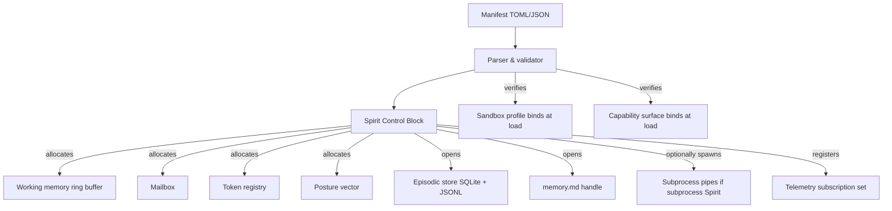

Spirit Control Block(SCB)은 OS 식의 PCB 등가물입니다. Spirit 인스턴스당 하나의 구조체로, 커널이 소유하며, 스케줄링·감독·스냅샷·언로드에 필요한 모든 상태를 담습니다. SCB는 **결코 Spirit 자신에게 보이지 않습니다**. Spirit은 Spirit ABI를 통해 자기 핸들만 봅니다.

Spirit의 *클래스*(Butler, Architect, Mira-class)는 로드 시점에 고정됩니다. Spirit의 *자세*는 가변입니다 — Butler는 `assistive`에서 `cautious`로 옮겨갈 수 있지만, 언로드와 재로드 없이는 Architect가 될 수 없습니다. **클래스 정체성은 커널 불변량이고, 자세 정체성은 그렇지 않습니다.**

### 5.2 라이프사이클 상태

Spirit은 여덟 상태를 거칩니다. 전이는 저널링(I10 불변량)되어 커널 재시작이 중단된 지점부터 다시 살아날 수 있습니다.

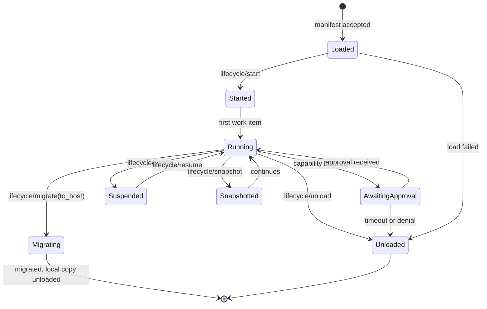

표시할 만한 몇 가지 세부:

- **Loaded ≠ Started.** Loaded는 매니페스트 파싱, 캐퍼빌리티 범위 검증, 메모리 핸들 열기입니다. Started는 Spirit이 실행 가능 상태가 되는 지점입니다. 이 분리로, Spirit이 토큰을 발급하기 전에 커널은 "당신의 매니페스트는 이 Host에서 의미가 없다"를 감지할 수 있습니다.
- **Suspended ≠ Snapshotted.** Suspended는 작업 기억을 RAM에 보존(재개 저렴; 커널이 클린 셧다운된 경우에만 커널 재시작에서 살아남음)합니다. Snapshotted는 작업 기억을 디스크로 직렬화(영속, 더 비쌈, 마이그레이션에 필요)합니다.
- **AwaitingApproval은 일시적이 아니라 진짜 상태입니다.** 커널은 Spirit이 사람을 기다리며 일시 정지된 것을 알고, 그에 맞춰 예산을 책정합니다.

### 5.3 핫스왑 연산

핫스왑은 동일 Host 위에서 상태를 보존하면서 Spirit A를 빼고 Spirit B를 넣습니다. 기계적으로:

```mermaid
sequenceDiagram
    participant U as User / Control plane
    participant K as Kernel (Scheduler)
    participant A as Spirit A
    participant TR as Token registry
    participant MM as Memory Manager
    participant B as Spirit B

    U->>K: kernel.swap(spirit_id=A_id, new_manifest=B.toml)
    K->>K: validate B's manifest
    K->>K: confirm capability surface compatibility
    K->>A: lifecycle/swap_out
    A->>K: state blob (working mem + open token IDs)
    K->>TR: freeze tokens (no new invocations)
    K->>MM: archive A.private to archive/A_id/
    K->>K: instantiate Spirit B (Loaded state)
    K->>B: lifecycle/start
    K->>B: lifecycle/swap_in(predecessor_blob)
    B->>K: import decisions (which working mem, which tokens)
    K->>TR: rebind tokens to B (audit posture_change events)
    K->>U: swap complete, swap_id logged
    Note over A,B: A is fully unloaded; B continues
```

커널이 보장하는 세 가지:

1. **A의 swap_out과 B의 첫 가져오기 사이에 스왑된 토큰에서는 어떤 작업도 일어나지 않습니다.** 그 간격 동안 토큰은 동결됩니다. 동결된 토큰은 누구도 사용할 수 없으며, B가 집어 들기 전에 만료되면 사라지고, B는 다시 요청해야 합니다.
2. **B의 가져오기 결정은 저널링됩니다.** B가 무엇을 상속하기로 선택했는지 감사 추적에 남습니다. 사용자는 Nash 클래스 Spirit B가 Mira 클래스 Spirit A의 진단 컨텍스트를 상속했는지, 아니면 백지부터 시작하기로 선택했는지 검증할 수 있습니다.
3. **A의 보관된 메모리는 구성된 TTL 동안 보존됩니다.** 기본 30일. B(또는 미래의 Spirit)는 매니페스트 범위에 따라 Memory Manager API를 통해 그것을 읽을 수 있습니다.

**핫스왑이 *하지 않는* 일:**

- 진행 중인 LLM 스트림을 전송하지 않습니다. 스왑이 발사될 때 A에 부분 응답이 진행 중이면, 그 부분 응답은 폐기됩니다(그리고 로그됩니다). B는 새로 시작합니다.
- 역사를 다시 쓰지 않습니다. `archive/A_id/` 안의 A의 트랜스크립트는 불변입니다.
- Host의 다른 Spirit들을 바꾸지 않습니다. 핫스왑은 한 번에 한 Spirit입니다.

### 5.4 합성: 다수의 Spirit이 공존

Host는 여러 Spirit을 동시 실행합니다. 그들은 커널 자원을 공유하지만 메모리나 토큰은 공유하지 않습니다.

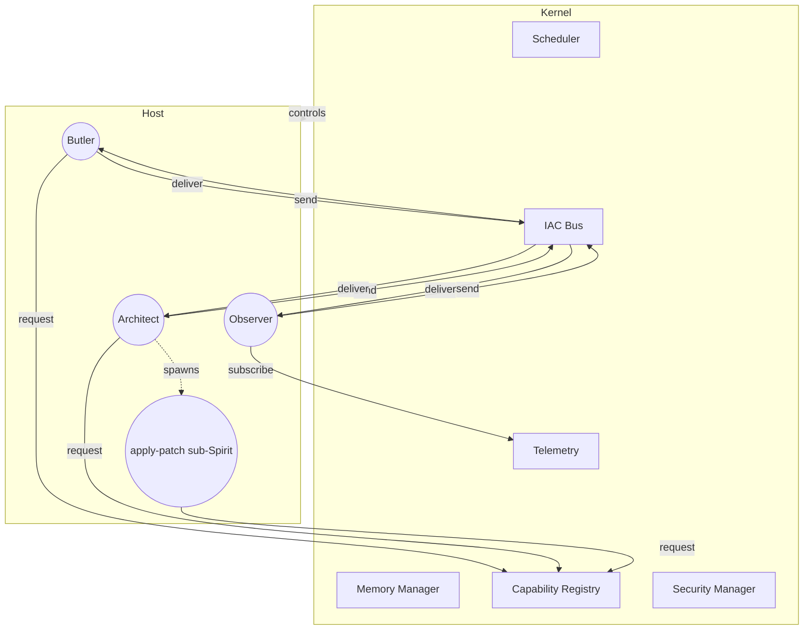

도식이 구체화하는 몇 가지 점:

- **모든 Spirit은 하나의 IAC 버스를 공유합니다.** Host 내부의 메일박스 라우팅은 저렴합니다. Spirit 횡단 메시지에는 암호화 오버헤드가 없습니다.
- **모든 Spirit은 하나의 Telemetry Stream을 공유합니다.** 구독자는 토픽으로 필터링합니다. Observer는 광범위하게 구독하고, Butler는 좁게(캘린더/인박스/유휴), Researcher는 거의 구독하지 않습니다.
- **서브 Spirit은 부모보다 *더 좁은* 캐퍼빌리티 범위를 상속합니다.** Architect의 apply-patch 서브 Spirit들은 각자 한 파일의 `fs.write`만 받고, `provider.stream` 없음, `mcp.call` 없음. 커널이 좁아짐을 강제합니다.
- **각 Spirit은 자신의 사적 메모리를 가집니다.** Spirit 횡단 정보 공유는 공유/집단 계층이나 IAC 프레임을 통해 일어나며, 결코 직접 메모리 접근을 통하지 않습니다.

### 5.5 Host 횡단 합성

단일 Host를 넘어서면 합성은 A2A를 사용합니다. 다중 Host 구성은 같은 커널이 복제되고 A2A 피어링이 구성된 것입니다.

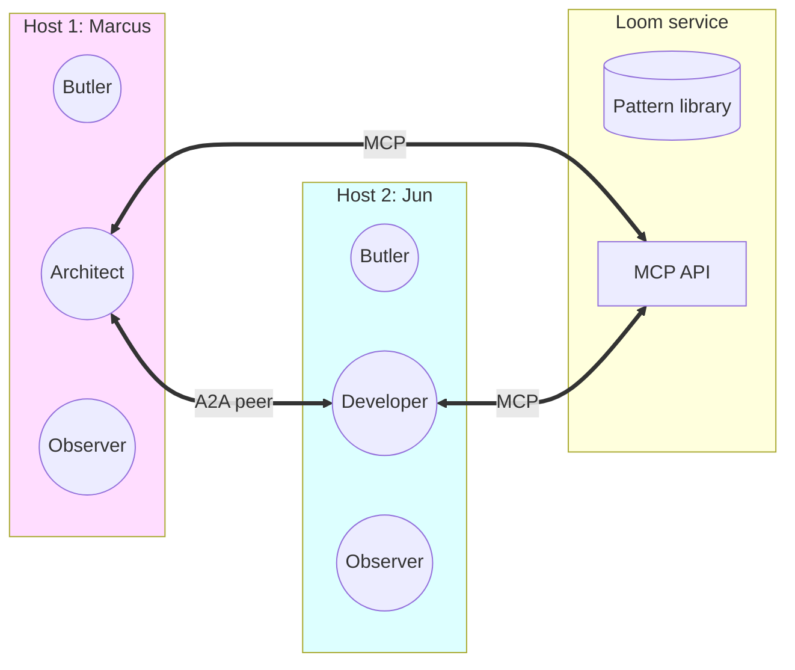

Marcus의 Architect와 Jun의 Developer는 A2A를 통해 피어 투 피어로 대화합니다. 두 Spirit은 서로 다른 Host 위에 있지만, MCP-Streamable-HTTP를 통해 Loom 서비스에 닿을 수 있습니다. Host 자체는 결코 결합되어 있지 않습니다 — Marcus의 Host가 크래시해도 Jun의 Host에 영향이 없으며, 진행 중인 A2A 컨설팅만 중단되고 재시도됩니다.

### 5.6 수용한 것과 거부한 것

**수용한 것:**
- 핫스왑은 클래스 호환성 봉투(envelope) 안에서 허용됩니다(Mira 클래스는 Nash 클래스로 스왑할 수 있지만, Mira 클래스는 Butler로는 스왑할 수 없습니다 — 캐퍼빌리티 표면이 너무 다름). 호환성 검사는 엄격합니다.
- 서브 Spirit 좁히기는 강제됩니다. 자식은 부모의 캐퍼빌리티 표면을 초과할 수 없습니다. 즉, 악의적인 자식 Spirit은 부모가 이미 할 수 있었던 것만 할 수 있습니다.

**거부한 것:**
- Host 횡단 핫스왑(대체로 마이그레이션과 같음). Spirit X의 Host에서 Y로 옮기는 마이그레이션을 지원합니다. 한 연산으로 "Host X의 A를 Host Y의 B로 스왑"하는 것은 지원하지 않습니다. 두 개의 별도 연산입니다: 마이그레이션 후 로컬 스왑. 추론하기가 더 쉽습니다.

---

## 6장 — 개발 방법론

> *새 Spirit 클래스는 커널 변경이 아닙니다. 매니페스트, 시스템 프롬프트, 선택적인 구현 크레이트, 테스트 하네스입니다. 방법론은 커널이 세부를 알 필요 없이 각 Spirit을 좋게 유지하는 것입니다.*

### 6.1 새 Spirit 클래스의 라이프사이클

작성자가 실제로 마주하는 순서로 안내하겠습니다.

**1단계 — 명세 (~몇 시간).** 이 Spirit이 *무엇을 위한 것*인지 결정합니다. 어떤 사용자 작업을 하는가? 인지 프레임워크는(선제적/탐색적/진단적/생성적)? 시스템 프롬프트를 스케치합니다. 출력 형식을 스케치합니다(인용? 신뢰도 점수? 코드 패치?). 이 단계는 코드가 아니라 마크다운 파일에 삽니다.

**2단계 — 매니페스트 (~몇 시간).** TOML을 작성합니다. 메모리 범위, 캐퍼빌리티 표면, 자세 프리셋, 샌드박스 프로필, 훅. 매니페스트를 스키마에 대해 검증합니다. 검증기는 커널이 제공합니다. 실행에 라이브 커널이 필요하지 않습니다.

**3단계 — 구현 (~몇 시간에서 며칠).** 두 경로:
- **서브프로세스 Spirit:** Spirit Wire Protocol을 말할 수 있는 어떤 언어로든 구현합니다. 스켈레톤 라이브러리는 Rust, TypeScript, Python으로 제공됩니다.
- **인프로세스 Rust Spirit:** Rust 크레이트 안에서 `Spirit` 트레이트를 구현합니다. 더 빠른 런타임, 더 단단한 결합.

훅(`on_load`, `on_idle`, `on_swap_in` 등)은 여기서 구현됩니다. 시스템 프롬프트 템플릿은 디스크에서 로드됩니다(`spirits/<class>.system.md`).

**4단계 — 단위 테스트 (~몇 시간).** Spirit ABI를 모킹하고, 훅을 호출하고, 동작을 검증합니다. Spirit 하네스 라이브러리가 이를 저렴하게 만듭니다. 캐퍼빌리티 요청은 모의 토큰으로 반환되고, 캐퍼빌리티 호출은 스크립트된 응답을 받으며, 매니페스트 검증은 스키마에 대해 실행됩니다.

**5단계 — 통합 테스트 (~몇 시간에서 며칠).** 테스트 모드(인프로세스, 샌드박스 없음)의 커널을 띄웁니다. Spirit을 로드합니다. 스크립트된 사용자 입력 시나리오를 엔드 투 엔드로 실행합니다. 출력 형식, 캐퍼빌리티 사용, IAC 프레임을 검증합니다.

**6단계 — 평가 (~며칠).** Spirit을 평가 스위트(eval suite)에 대해 실행합니다. 평가 스위트는 Spirit 클래스별로 다릅니다.
- Researcher: 합성 품질, 인용 정확도, 가설 신선도(루브릭 기반 LLM 심판).
- Architect: 코드 정확성, 테스트 커버리지, ADR 명료성.
- Diagnostic Engineer: 가설 정밀도, 거짓 양성률, 정확 진단까지의 시간.
- Butler: 알림 관련성, 거짓 트리거율, 사용자 행동 채택 비율.

평가 스위트는 버전이 매겨지며, Spirit 버전 간 비교가 내장되어 있습니다.

**7단계 — 베타 (~며칠에서 몇 주).** Spirit을 자기 Host에 유일한 소비자로 로드합니다. 실제 작업을 실행합니다. Telemetry Stream을 지켜봅니다. 측정합니다: 캐퍼빌리티 사용 분포, 승인 프롬프트 빈도, 오류율, Spirit 출력에 대한 사용자 편집률.

**8단계 — 배포 (~몇 시간).** 매니페스트 + 구현 크레이트(또는 서브프로세스 바이너리)를 레지스트리에 푸시합니다. 버전 태그. 배포의 일부로 매니페스트 스키마를 문서화합니다.

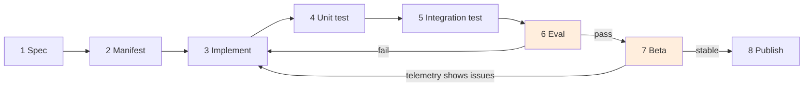

### 6.2 테스팅 피라미드

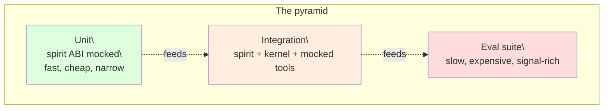

각 계층은 서로 다른 인센티브를 가집니다.

- **단위 테스트**는 훅의 정확성을 검증합니다. *`on_swap_in`은 전임자의 상태를 올바로 병합했는가? `on_idle`은 올바른 알림을 만들었는가? 매니페스트 검증기는 이 잘못된 범위를 거부했는가?* 저렴, 빠름, 매 커밋에서 실행.
- **통합 테스트**는 커널 안에서 Spirit의 동작을 검증합니다. *Spirit은 주어진 사용자 입력에 대해 올바른 캐퍼빌리티 요청을 발급하는가? 거부된 승인에 올바르게 응답하는가? 발신하는 IAC 프레임은 올바른 형식을 가지는가?* 더 느림, PR에서 실행.
- **평가 스위트**는 벤치마크에 대한 Spirit의 *품질*을 검증합니다. *Researcher는 관련 인용을 만드는가? Architect의 코드는 사용자 테스트를 통과하는가? Mira의 가설 정밀도는 시간이 갈수록 향상되는가?* 비쌈(실 LLM 호출), 야간 또는 릴리스 전에 실행.

### 6.3 평가가 실제로 측정하는 것

품질 차원은 클래스별로 다릅니다. Spirit별 시작 세트는 다음과 같습니다.

| 클래스 | 품질 차원 |
|---|---|
| Butler | 알림 정밀도(% 사용자가 행동), 알림 재현율(관련 순간 포착 %), 사용자 정정률, 행동까지 시간 절감 |
| Researcher | 합성 정확도(심판), 인용 정확도, 가설 신선도(가설 모드일 때), 미해결 질문의 품질 |
| Diagnostic Engineer | 가설 정밀도, 텔레메트리 알림의 거짓 양성률, 정확 진단까지의 시간, 에스컬레이션 증거 완전성 |
| Senior Architect | 코드 정확성(테스트 통과율), 테스트 커버리지 변화량, ADR 명료성(심판), 피드백 루프 회전(배포 후 이슈가 얼마나 빨리 다시 접히는가) |
| Enterprise | 컴플라이언스 위반율(0이어야 함), 정책 결정 지연, 팀 횡단 워크플로 완료율 |
| Observer | 이상 정밀도, 이상 재현율, 알림 피로(이상당 알림 수), 지각 커버리지 |

**평가는 커널이 아니라 Spirit의 일부입니다.** 커널은 Architect Spirit의 코드가 좋은지 판단하지 않습니다. 단지 평가 스위트가 실행되도록 하고 결과를 표면화할 뿐입니다.

### 6.4 도구

새로운 Spirit 클래스 작성자는 세 도구가 필요합니다.

- **`maosctl`** — CLI. `maosctl load`, `maosctl swap`, `maosctl tail-telemetry`, `maosctl audit`, `maosctl publish`. 로컬 Host 또는 컨트롤 플레인 API를 통해 동작.
- **`spirit-test`** — 하네스 라이브러리. Spirit의 언어(Rust, TS, Python)에 거주. Spirit ABI를 모킹하고, 테스트 스캐폴딩을 제공.
- **`maos-registry`** — 배포된 매니페스트 + 구현 산출물을 보관하는 서버. 버전이 매겨짐. 조직별 또는 팀별.

v1.5의 위시리스트 항목: **`spirit-eval`** 러너 — 매니페스트의 평가 스위트 디스크립터를 읽어 Spirit 클래스 횡단으로 평가를 일반화합니다. 평가의 진입 장벽을 낮춥니다. "Spirit 작성자는 YAML과 몇 개의 프롬프트를 작성하고 벤치마크 보고서를 받는다."

### 6.5 "모든 Spirit은 초기 인스턴스이다" 방법론

서두에 명명한 일곱 에이전트 클래스는 초기 인스턴스입니다. **방법론은 더 많은 것이 올 것임을 가정합니다.**

이는 두 구체적 실천을 추동합니다.

- **매니페스트 스키마는 한 메이저 안의 커널 버전 횡단으로 추가만 가능해야 합니다.** 새 매니페스트 필드를 추가할 수 있고, 기존 필드는 의미를 바꿀 수 없습니다. 이것이 옛 Spirit 매니페스트가 새 커널에서 계속 작동하게 합니다.
- **평가 스위트는 클래스별이지만 합성 가능합니다.** Tutor Spirit의 평가 스위트는 "설명 품질"과 "스캐폴딩 효과성"을 포함합니다. Negotiator Spirit의 그것은 "원칙 협상 패턴 사용"과 "결과 공정성"을 포함합니다. 마스터 평가는 없습니다 — 평가 스위트의 레지스트리가 있을 뿐입니다.

기반이 어떤 *종류*의 Spirit을 호스팅할 수 있는지를 의도적으로 제약하지 않습니다. 커널은 인지 프레임워크(어떤 것이든), 메모리 아키텍처(어떤 것이든), 오케스트레이션 패턴(어떤 것이든), 보안 자세(6 클래스 분류 어디서든), 핫스왑 메커니즘(호환되는 캐퍼빌리티 표면을 가진 어떤 클래스든)을 제공합니다. **범용성은 모든 가능한 Spirit을 예측함으로써가 아니라 기반의 중립성으로 강제됩니다.**

### 6.6 수용한 것과 거부한 것

**수용한 것:**
- 평가 비용은 실제입니다. 실 LLM에 대해 평가 스위트를 실행하는 일은 비쌉니다. 신중한 예산 관리가 필요합니다(샘플링, 프롬프트 캐싱 재사용, 기본은 릴리스 전에만 실행).
- Spirit 작성에는 학습 곡선이 있습니다. 여섯 장의 설계 컨텍스트와 사소하지 않은 매니페스트 스키마가 있고, 새 작성자에게는 튜토리얼이 필요합니다. (v1.0 문서 위시리스트.)

**거부한 것:**
- 배포 전 의무 "Spirit 인증". 평가 스위트 점수가 임계값 이상이어야 Spirit이 레지스트리에 배포될 수 있도록 요구하는 안을 검토했습니다. 거부했습니다 — 그것이 레지스트리를 품질 판단의 위치에 두기 때문입니다. 공개적으로 배포하고, 평가 결과를 표면화하며, 소비자가 결정하도록 두는 편이 낫습니다.

---

## ☼ 아직 존재하지 않는 세 Spirit

> *아키텍처의 성공 기준은 범용성입니다. 여기 — Negotiator(협상가), Tutor(튜터), Wet-Lab Coordinator(습식 실험실 조정자) — 커널이 어떤 수정도 없이 우아하게 호스팅하는 세 Spirit이 있습니다.*

### ☼.1 Negotiator Spirit

**역할.** 갈등하는 목표를 가진 인간 당사자(또는 에이전트) 사이를 중재합니다. 제안을 작성하고, 공유 이해관계를 표면화하며, 원칙 협상 패턴을 적용합니다. 유용한 곳: 계약서 레드라인, 대인 분쟁, 다자 일정 조정, 인수합병 회담.

**인지 프레임워크.** 주로 *생성적*(제안 작성), 부수적으로 *탐색적*(과거 유사 분쟁 서베이), 드물게 *선제적*(가끔 "다음에 이 반론을 마주할 수 있다"고 사전 준비). SRE 의미의 *진단적*은 분명히 아닙니다 — 분쟁에는 찾을 한 가지 근본 원인이 없습니다.

**메모리 아키텍처.**
- *작업* — 활성 협상 스레드.
- *일화* — 모든 제안의 발의·수락·거부에 대한 전체 기록.
- *의미* — `memory.md`는 당사자들의 진술된 이해관계와 제약을 담습니다. 공유 계층은 분쟁 이력을 담습니다. 집단 계층은 `negotiation.patterns` 파티션(BATNA 프레임워크, 원칙 협상 전술, 일반적 함정)에서 읽습니다.
- *절차* — "구조화된 제안", "공통 기반 탐색기", "에스컬레이션 핸들러" 스킬 팩.

**매니페스트 단편:**

```toml
[identity]
class = "negotiator"
display = "Principled Mediator"

[cognitive]
default_model = "claude-opus-4-7"   # depth needed
system_prompt = "spirits/negotiator.system.md"

[memory]
private = { transcript = "rolling-90-days", vector = true }
shared = { read = ["dispute_history"], write = ["proposals_drafted"] }
collective = { read = ["negotiation.patterns"], write = [] }

[capabilities.required]
"provider.stream"  = { models = ["claude-opus-4-7"] }
"fs.read"          = { roots = ["./contracts"] }
"a2a.send"         = { peers = ["any-by-explicit-consent"] }

[posture]
preset = "trusted-mediator"
prompt_on = ["mutating", "exec_capable", "control_plane", "interactive"]
silent_allow = ["readonly_*"]

[sandbox]
profile = "t1"   # no exec needed
```

**아키텍처가 환영하는 이유.** Negotiator 클래스가 필요로 한 것:
- 새 시스템 프롬프트(Spirit 작성자가 작성).
- 집단의 새 메모리 파티션 `negotiation.patterns`(Loom 측; 커널 변경 없음).
- 새 자세 프리셋 `trusted-mediator`(여섯 승인 클래스로부터 합성).
- 기존 캐퍼빌리티, 기존 IAC, 기존 핫스왑 메커니즘.

**커널은 바뀌지 않았습니다.** Negotiator는 그저 끼워 맞춰집니다.

### ☼.2 Tutor Spirit

**역할.** 주제를 상호작용적으로 가르치고, 학습자에 적응합니다. 학습자 응답에 따라 깊이를 조정합니다. 분산 반복 알림. 세션 횡단으로 주제를 연결합니다.

**인지 프레임워크.** 주로 *생성적*(설명·연습·예시 작성)과 *선제적*(유휴 시 분산 반복 일정). 학습자가 "이것과 관련된 다른 것은 무엇인가?"를 물을 때 *탐색적*도 일부.

**메모리 아키텍처.**
- *작업* — 활성 세션.
- *일화* — 모든 이전 세션, 무엇이 가르쳐졌는지, 학습자가 어디서 어려움을 겪었는지, 어디서 잘했는지. **학습자별 사적 메모리**(이상적으로는 학습자당 하나의 Tutor 인스턴스).
- *의미* — 커리큘럼 그래프(개념 의존성); 주제에 대한 학습자의 진화하는 모델.
- *절차* — 설명 패턴(유추 라이브러리, 연습 생성기), 세션을 거치며 정제됨("이 유추가 이 학습자에게 통했다 — 다음에 다시 시도").

**핵심 디테일: 유휴 훅.** Tutor Spirit은 분산 반복을 위해 `on_idle`을 많이 사용합니다. 사용자가 유휴이고 라이트너(Leitner) 일정으로 어떤 개념이 "기한"일 때, Tutor는 알림을 표면화합니다: "잠깐 점검 — 지난주의 X를 기억하시나요?" 이는 *정확히* Butler의 선제적 메커니즘을 학습에 적용한 것입니다.

**캐퍼빌리티 표면.** `provider.stream`, `mcp.call(knowledge-graph)`, `mcp.call(exercise-generator)`. `bash.exec` 없음. `git` 없음. Tutor는 대화와 `memory.md`에 살며, 그 외에는 살지 않습니다.

**아키텍처가 환영하는 이유.** Tutor가 필요로 한 것:
- 새 시스템 프롬프트.
- 커리큘럼 그래프를 위한 MCP 서버(제삼자).
- 연습 생성을 위한 MCP 서버(제삼자).
- Butler보다 더 적극적으로 `on_idle`을 운영하는 새 자세 프리셋.
- 기존 메모리 계층, 기존 캐퍼빌리티, 기존 라이프사이클.

**커널은 바뀌지 않았습니다.** 그리고 절차 기억 패턴(학습자별로 정제되는 Tutor의 유추 라이브러리)은 정확히 openclaw의 `memory-host-sdk`와 gemini-cli의 `memory-manager-agent`가 이미 예시한 패턴입니다.

### ☼.3 Wet-Lab Coordinator Spirit

**역할.** 로봇 기기(Opentrons, 실험실 자동화 리그, 플레이트 리더)를 통해 물리 실험을 오케스트레이션합니다. 프로토콜을 합성하고, 안전을 검증하고, 기기로 디스패치하고, 진행을 모니터링하고, 실패를 처리합니다.

**인지 프레임워크.** *생성적*(프로토콜 합성), *진단적*(기기가 오류를 던질 때), *선제적*(소모품 사전 준비, 시약 사전 가온).

**메모리 아키텍처.**
- *작업* — 진행 중인 실험.
- *일화* — 모든 이전 실험의 데이터와 결과(실패한 실행 포함 — 실패는 금입니다).
- *의미* — 실험실의 시약 재고; 안전 데이터 시트; 표준 운영 절차.
- *절차* — 프로토콜 라이브러리(재사용 가능한 템플릿), 새 기법이 검증됨에 따라 정제됨.
- *집단* — 실험실 횡단(또는 팀 횡단) 부정적 결과 아카이브 — "베를린에서 이 접근을 시도했고 X 때문에 실패했다" — 매우 가치 있지만 다른 곳에서는 거의 공유되지 않음.

**캐퍼빌리티 표면(이건 흥미롭습니다):**

```toml
[capabilities.required]
"provider.stream"   = { models = ["claude-opus-4-7"] }
"fs.read"           = { roots = ["./protocols", "./inventory"] }
"fs.write"          = { roots = ["./experiments"] }
"mcp.call"          = { servers = ["opentrons", "plate-reader", "inventory-mgmt", "msds-lookup"] }
"mcp.call.streaming" = { servers = ["opentrons"] }   # long-running tool calls

[capabilities.optional]
"mcp.call" = { servers = ["safety-officer-on-call"] }   # human escalation MCP

[sandbox]
profile = "t4-wasm"   # third-party instrument plugins run in WASM cap-sandbox
```

**핵심 디테일: 매우 높은 승인 임계값.** 모든 비가역적 행동(샘플 실행, 시약 소진)은 프롬프트합니다. 기본 자세(`safety-critical`)는 `assistive`보다 `cautious`에 더 가깝고, 다른 Spirit과 비교해도 그렇습니다. 일부 프롬프트는 단순 디프뿐 아니라 **예측된 자원 소비**를 포함합니다("이 실행은 항체 A를 12 mL 사용; 현재 재고 18 mL").

**아키텍처가 환영하는 이유.**
- 스트리밍 MCP 캐퍼빌리티(`opentrons`는 몇 시간 실행)는 아키텍처가 처음부터 요구하는 MCP-Streamable-HTTP가 지원합니다.
- 제삼자 기기 플러그인을 위한 T4 WASM 샌드박스는 ironclaw의 WIT 설계가 다루는 *바로 그* 위협 모델이며, 우리는 v1.0에서 T4를 출하하기로 한 아키텍처의 선택으로부터 이를 얻습니다.
- 집단 부정적 결과 아카이브는 Loom 파티션입니다. 커널 변경 없음.
- 매우 높은 승인 자세는 기존 6 클래스로부터 합성됩니다 — `exec_capable`을 `prompt_with_predicted_consumption`(매니페스트가 선언한 자세 확장 정책)으로 설정.

**커널은 여전히 바뀌지 않았습니다.** 그리고 "도구 호출"이 무엇인지에 대한 커널의 중립성이야말로 Wet-Lab Coordinator가 Architect가 GitHub와 통신하는 데 쓰는 같은 `mcp.call` 메커니즘을 사용할 수 있게 하는 정확한 이유입니다.

### ☼.4 이 연습이 보여 주는 것

세 Spirit, 완전히 다른 세 도메인, 완전히 다른 세 인지 프레임워크. **커널 변경은 0.** 각각이 같은 원시들로부터 합성됩니다. 이것이 아키텍처의 범용성 주장을, 구체화한 것입니다.

다음 Spirit이 올 때 — **연구실 데이터 분석가**, **개인 재무 자문가**, **법률 계약 감사자**, **임상시험 조정자** — 방법론은 같습니다: 명세, 매니페스트, 구현, 테스트, 평가, 베타, 배포. 여섯 장의 설계 컨텍스트, 하나의 기반, 무한히 많은 Spirit.

---

## ⌘ 일관성 — 여섯 주제는 어떻게 서로를 보강하는가

> *어느 주제도 홀로 서지 않습니다. 인지 프레임워크는 메모리 아키텍처를 필요로 하고, 메모리 아키텍처는 오케스트레이션 패턴을 가능하게 하며, 오케스트레이션 패턴은 보안을 제약하고, 보안은 핫스왑 의미론을 정의하며, 핫스왑은 개발 방법론을 추동하고, 방법론은 평가를 통해 인지 프레임워크로 되먹임됩니다.*

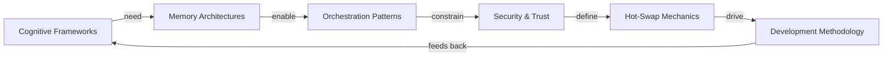

이 사이클을 읽으면:

- **인지 프레임워크는 메모리 아키텍처를 필요로 합니다.** Researcher의 탐색적 모드는 집단 계층의 의미 기억 없이는 불가능합니다(그렇지 않으면 모든 연구 세션이 같은 논문을 다시 발견할 것입니다). Diagnostic Engineer의 진단적 모드는 과거 이상에 대한 일화 기억(패턴 라이브러리) 없이는 불가능합니다. 인지 프레임워크가 *어떤 종류의 메모리가 중요한지*를 고르고, 메모리 아키텍처가 그 기반을 제공합니다.
- **메모리 아키텍처는 오케스트레이션 패턴을 가능하게 합니다.** 블랙보드 오케스트레이션은 *바로 그* 메모리 아키텍처 패턴 — 집단 계층이 블랙보드입니다. 슈퍼바이저/워커는 일화 기억 패턴 — 슈퍼바이저가 서브 Spirit 트랜스크립트로부터 워커 결과를 재구성합니다. 피어 투 피어는 각 피어의 사적-공유 메모리 위에서의 IAC 패턴입니다.
- **오케스트레이션 패턴은 보안을 제약합니다.** 슈퍼바이저/워커는 서브 Spirit 토큰 좁히기를 요구합니다(보안 메커니즘 없이는 오케스트레이션 없음). 피어 투 피어는 동의 게이트를 요구합니다(신뢰 없이는 오케스트레이션 없음). 오케스트레이션 선택이 특정 보안 메커니즘을 존재로 강제합니다.
- **보안이 핫스왑 의미론을 정의합니다.** 토큰은 후임자가 진행 중인 작업을 어떻게 상속하는지를 보여 줍니다. 자세 변경은 스왑이 어떻게 감사 추적되는지를 보여 줍니다. 캐퍼빌리티 토큰 없이는 핫스왑은 너무 위험하거나(입자도 없는 권한 전체 양도) 너무 쓸모없을(모든 것을 다시 요청) 것입니다.
- **핫스왑이 개발 방법론을 추동합니다.** 새 Spirit 클래스는 *스왑 대상*과 *스왑 출처*로서 모두 테스트되어야 합니다. 테스트 피라미드의 2층(통합)이 스왑 상호작용이 운동되는 곳입니다. 스왑 메커니즘 없이는 방법론은 더 단순하지만 — 동시에 표현력도 떨어집니다.
- **방법론은 평가를 통해 인지 프레임워크로 되먹임됩니다.** 평가 스위트는 Spirit 버전에 걸쳐 반복적으로 실행되며, 어느 인지 패턴이 어느 클래스에 통하는지 가르쳐 줍니다. 가설 모드가 버전을 거치며 더 나은 가설을 만들어 내는 Researcher는 방법론을 통해 관찰되는 인지 프레임워크 진화를 반영합니다.

여섯 주제는 닫힌 루프를 이룹니다. 어느 하나를 당기면 나머지로 되감겨 갑니다. 이것은 의도된 것입니다. 주제들이 독립적인 아키텍처는 사실 아키텍처가 아니라 기능 목록입니다.

---

## 용어집 (Glossary)

처음 읽는 분을 위해, 제가 입으로 말할 법한 방식으로 정의했습니다.

**A2A** — Agent-to-Agent 프로토콜. Host 횡단 피어 투 피어 통신. MAOS에서는 mTLS로 보호된 HTTPS 위의 JSON-RPC. 본래 Google이 주도했고, 우리는 `@a2a-js/sdk` 스타일 의미론을 사용합니다.

**ACP** — Agent Client Protocol. Zed와 같은 에디터들이 에이전트 프로세스를 띄우고 통신하는 데 쓰는 프로토콜. 로컬 에이전트는 stdio 위의 JSON-RPC. MAOS Spirit은 Zed에 의해 띄워지기 위해 ACP를 말할 수 있습니다.

**승인 클래스 (Approval class)** — 캐퍼빌리티 요청이 사람의 프롬프트가 필요한지를 결정하는 데 커널이 쓰는 6개 카테고리 중 하나. 가장 덜 민감한 것에서 가장 민감한 것 순으로: `readonly_scoped`, `readonly_search`, `mutating`, `exec_capable`, `control_plane`, `interactive`.

**블랙보드 (Blackboard)** — Spirit들이 직접 메시지가 아니라 공유 구조화 메모리를 통해 협업하는 오케스트레이션 패턴. Loom이 블랙보드입니다.

**캐퍼빌리티 (Capability)** — Spirit이 취할 수 있는 타입 지정된 행동(예: `bash.exec`, `provider.stream`, `mcp.call`). Capability Registry가 매개합니다.

**캐퍼빌리티 토큰 (Capability Token)** — Spirit의 캐퍼빌리티 요청이 승인되면 커널이 발급하는 위조 불가능한 핸들. Spirit에 바인딩되고, 범위 제한, 시간 제한.

**인지 프레임워크 (Cognitive framework)** — Spirit의 추론 자세(선제적/탐색적/진단적/생성적). 매니페스트와 시스템 프롬프트와 도구 표면이 함께 결정. 커널이 선택하지 않습니다.

**집단 계층 (Collective tier)** — Loom 안에 사는 Host 횡단 메모리. 패턴, ADR, 수정 템플릿, 회귀 테스트, 보관된 인시던트. 어떤 개별 Host보다도 오래 살아남는 "팀의 두뇌".

**컴팩션 (Compaction)** — LLM 컨텍스트 윈도에 맞도록 오래된 일화 기억을 요약. 전략은 Spirit별이고, 커널은 tool_use/tool_result 짝짓기 불변량만 강제합니다.

**일화 기억 (Episodic memory)** — 특정 사건의 시간 도장 로그. JSONL 트랜스크립트와 롤아웃으로 뒷받침. Spirit별 사적; LLM 컨텍스트 리셋을 가로질러 살아남음.

**핫스왑 (Hot-swap)** — 같은 Host 위에서 캐퍼빌리티 토큰과 (선택적으로) 작업 기억을 보존하면서 한 Spirit 클래스 인스턴스를 다른 것으로 런타임에 교체.

**Host** — MAOS 커널을 실행하는 하나의 OS 프로세스. 배포의 단위.

**IAC** — Inter-Agent Communication. 동일 Host: 직접 메일박스. Host 횡단: A2A.

**커널 (Kernel)** — 모든 Host가 동일하게 노출하는 7개 불변 서비스(Spirit Scheduler, Memory Manager, Security Manager, I/O Subsystem, IAC Bus, Capability Registry, Telemetry Stream).

**Loom** — 집단 계층을 큐레이션하는 사용자 공간 서비스 — 패턴, 수정 템플릿, ADR 레지스트리, 인시던트 횡단 상관. 본래 여정 12의 Cortex에서.

**메일박스 (Mailbox)** — Spirit이 소유하고 `SpiritId`로 주소 지정 가능한 경계가 있는 mpsc 채널. 동일 Host IAC 원시.

**매니페스트 (Manifest)** — Spirit 클래스를 선언하는 TOML/JSON 파일: 정체성, 역할, 모델, 메모리 범위, 캐퍼빌리티 표면, 자세, 샌드박스 프로필, 라이프사이클 훅.

**MCP** — Model Context Protocol. 에이전트가 도구 서버를 호출하는 데 쓰는 프로토콜. 세 트랜스포트: stdio(로컬), Streamable HTTP(원격에 권장), SSE(레거시 원격).

**Memory.md** — 모든 Spirit의 사적 계층이 관례로 포함하는 의미 메모리 파일. 작성자 통제. 시작 시 로드; Spirit이 작성.

**자세 (Posture)** — Spirit의 자율성 입장: 어느 승인 클래스가 프롬프트하고, 어느 것이 무성인지. 매니페스트의 천장 안에서 런타임에 가변.

**절차 기억 (Procedural memory)** — "어떻게(how to)" 지식. 스킬, 슬래시 명령, 런북. 시작 시 로드; 실시간으로는 거의 작성되지 않음.

**의미 기억 (Semantic memory)** — 사실 형태의 지식. 프로젝트 컨텍스트, 캘린더, ADR, 패턴. 대부분 공유/집단 계층.

**Spirit** — 로드되어 실행 중인 에이전트. 상태 = (매니페스트 + 인지 상태 + 메모리 페이지 + 자세 + 캐퍼빌리티 토큰 집합).

**Spirit ABI** — 커널과 Spirit 사이의 안정 계약. 핫스왑 가능한 봉합선. 메이저 커널 버전 안에서 버전 매김.

**Spirit Wire Protocol** — 서브프로세스 Spirit이 커널과 통신하는 데 쓰는 stdio 위의 JSON-RPC 방언.

**Telemetry Stream** — 모든 측정 가능한 Host 이벤트의 커널 브로드캐스트 스트림. Spirit은 필터로 구독.

**계층 (Tier)** — 세 메모리 범위 중 하나: 사적(Spirit 1개), 공유(Host 1개), 집단(Loom을 통한 Host 횡단).

**TOFU** — Trust-on-First-Use. 원격 피어의 인증서가 첫 접촉에서 수용되고 이후 접촉을 위해 핀 고정되는 패턴. v1.0 MAOS A2A에서 전체 PKI 대신에 사용.

**투명성 로그 (Transparency Log)** — 모든 IAC 상호작용, 모든 승인 결정, 모든 캐퍼빌리티 사용, 모든 retract의 커널 관리 추가 전용 감사 로그. 사용자에게 개인용; 피어에게는 보이지 않음.

**작업 기억 (Working memory)** — 능동적인 스크래치패드 — LLM 컨텍스트 윈도, 작업 상태, 열린 캐퍼빌리티 토큰. Spirit별. 스냅샷되지 않으면 스왑에서 사라짐.

---

## 닫는 말

이 보고서를 쓴 이유는, 신중한 독자 — 향후 기여자, 회의적인 검토자, 코퍼스를 읽는 향후 LLM 에이전트 — 가 아키텍처 문서로부터 설계를 도출할 필요 없이 MAOS를 이해할 수 있도록 하기 위해서입니다. 아키텍처는 **무엇을 결정했는가**를 말하고, 본 보고서는 **그것을 어떻게 사고했는가**를 말합니다. 둘 다 참이고, 둘 다 필요합니다.

만약 보고서의 직관이 아키텍처의 처방과 어긋나는 곳을 발견하시면, 아키텍처가 이깁니다. (제가 아키텍처로부터 보고서를 만들었습니다 — 아키텍처가 진실의 원천입니다.) 그러나 만약 제 설명이 아키텍처의 그것보다 더 명확한 곳을 발견하시면, 부디 그 설명을 위로 옮겨 주십시오. 독자의 시간을 얻어내는 문서는 읽히는 문서입니다.

여섯 장, 아직 오지 않은 세 Spirit, 하나의 닫는 루프. 기반은 우리가 가진 것을 호스팅하고, 기반은 우리가 아직 상상하지 못한 것을 환영하며, 기반은 작게 머무는 동안 Spirit들은 자랍니다.

그것이 설계입니다.

— *Paige*
