# MAOS — Design Report

> **A note from your writer.** This report is a companion to the architecture document, not a replacement for it. Where Winston's architecture says **what we're building and why**, this report explains **the reasoning behind the pieces** so a reader who has never seen MAOS can understand it on first reading. The two documents disagree about nothing. They differ only in their job. Read this when you want intuition; read the architecture when you want decisions.

---

## How to read this report

This report is six chapters and a coda. Each chapter answers one question:

| # | Chapter | Question |
|---|---|---|
| 1 | Cognitive Frameworks | *How does each Spirit think differently, and how does the kernel allow that?* |
| 2 | Memory Architectures | *What does a Spirit know, what does it remember, and what survives a swap?* |
| 3 | Multi-Agent Orchestration Patterns | *How do Spirits work together, and how does the kernel let them choose how?* |
| 4 | Security & Trust Model | *How do we make the substrate safe by construction, not by hope?* |
| 5 | Modularity & Hot-Swap Mechanics | *What is a Spirit, mechanically, and how does it come and go without breaking things?* |
| 6 | Development Methodology | *How do you build a new Spirit responsibly?* |
| ☼ | Three Spirits That Don't Exist Yet | *Does the architecture welcome agents we haven't imagined?* |
| ⌘ | Coherence | *Do the six themes reinforce each other?* |

**You can read chapters in any order.** Each chapter opens with a one-sentence claim and a diagram; each chapter closes with the **trade-offs we accepted** so a reviewer knows where to push back. Long-form chapters carry boxed examples. Short paragraphs introduce diagrams; diagrams do the heavy lifting.

I use a few visual conventions throughout:

- **Boxed quotes** introduce a concrete scenario from one of the journeys (Nexus, Mira & Nash, Cortex).
- *Italicized terms* on first use are defined in the glossary at the end.
- Code fences with `mermaid` are diagrams; if your reader doesn't render Mermaid, they should at least read clearly as text.

---

## Chapter 1 — Cognitive Frameworks

> *Spirits don't think in a single way. The kernel doesn't pick the way. The Spirit's manifest, system prompt, and tool surface together select a posture toward thinking — and that posture is what we mean by "cognitive framework."*

### 1.1 The four reasoning patterns

Cognitive scientists have long known that **what counts as "good thinking" depends on what you're trying to do**. Anticipating a friend's birthday is not the same kind of reasoning as diagnosing why your car won't start. Searching for relevant papers is not the same as drafting a new architecture.

MAOS classifies Spirit reasoning along **two axes** and recognizes **four patterns**, one per quadrant.

**The two axes:**

- **Reactive ↔ Proactive.** Does the Spirit respond when triggered, or initiate when conditions warrant?
- **Convergent ↔ Divergent.** Does the Spirit narrow toward a single answer, or open toward many possibilities?

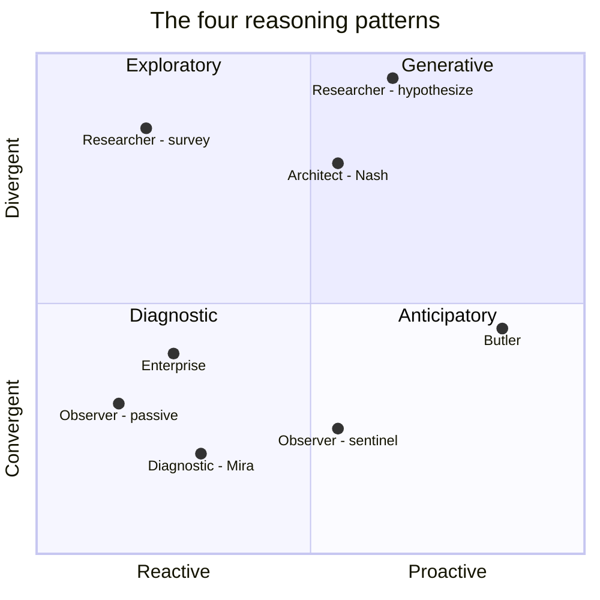

The placement of each Spirit on this map is **not where they live forever** — it's where their default posture sits. Posture changes during a session can shift a Spirit from one quadrant to another. (When a Researcher toggles into hypothesize-mode, it slides from Exploratory toward Generative. When an Observer escalates posture to `sentinel`, it slides from Reactive toward Proactive.)

### 1.2 What each pattern actually means

I'll explain each pattern the way I'd explain it to a friend who's curious about how agents differ.

**Anticipatory** *(reactive→proactive, convergent)* asks: *"Given what I'm seeing, what is most likely to be needed soon?"* It's the reasoning of a good butler who notices you've been working past 6 PM three days running and quietly cancels your 7 PM dinner plans before you remember them. **It converges** — there's a small set of plausible needs to consider, and the Spirit's job is to pick the most likely. **It is proactive** — nobody asked.

The Butler's `on_idle` lifecycle hook is the kernel's way of saying *"yes, anticipatory thinking is allowed; here is when to do it."* Without that hook, anticipatory reasoning has nowhere to live; the Spirit would just sit there waiting for prompts.

**Exploratory** *(reactive, divergent)* asks: *"What's out there that I should know about?"* It's how a Researcher works in survey mode — given a topic, fan out across sources, gather, deduplicate, summarize. **It diverges** — many sources, many perspectives, many weights of evidence to balance. **It is reactive** — the user asked the question.

The kernel supports exploratory reasoning by giving Researcher Spirits broad MCP capabilities (web-search, academic search, github search) and high parallelism in tool dispatch. The cognitive *style* lives in the system prompt; the cognitive *capacity* (parallelism, recall depth) lives in the manifest.

**Diagnostic** *(reactive, convergent)* asks: *"What's the smallest hypothesis that explains all this evidence?"* This is Mira's reasoning. Given thread dumps, metrics, deployment diffs, and time correlations, a diagnostic Spirit narrows toward the single most parsimonious cause. **It converges** — Occam's razor; the goal is one root cause, not a survey. **It is reactive** — telemetry triggered the investigation.

The kernel supports diagnostic reasoning through the **Telemetry Stream** (so the Spirit has perception), **read-only capability scope on production runtime** (so it can investigate without breaking things), and the **mandatory confidence-scoring output predicate** in Mira's manifest (so the Spirit's output shape forces explicit hypothesis articulation, not vague "looks like" handwaving).

**Generative** *(proactive, divergent)* asks: *"What new artifact would solve this problem?"* This is Nash's reasoning when drafting an ADR or a new pattern. **It diverges** — many possible designs to consider, many trade-offs. **It is proactive** — the Spirit is ahead of immediate needs, designing for problems that don't yet exist.

The kernel supports generative reasoning through long context windows (Opus default), aggressive prompt caching (so iterating on a draft is cheap), and **collective memory writes** (so the artifact lives somewhere — Loom — beyond the Spirit's session).

### 1.3 How the kernel composes patterns

A Spirit isn't *one* reasoning pattern. A real Spirit composes several in a single session:

> **Mira & Nash, Journey 11, Act 3** — Nash receives Mira's escalation. He starts in **Diagnostic** mode (confirm the bug Mira found). He shifts to **Exploratory** mode (search the codebase for the same pattern). He returns to **Diagnostic** (does the dormant pattern matter?) — he requests Mira's telemetry. He then shifts to **Generative** (write the fix, write the regression test, draft the ADR).

Four patterns in one session. The kernel doesn't know about any of them. What the kernel *does* know:

- Each pattern needs different capabilities. Nash's Diagnostic phase needs `fs.read` on source. His Exploratory phase needs cross-repo search. His Generative phase needs `fs.write`, `git.commit`, `mcp.call(adr-registry)`.
- Each pattern has different output shapes. Confidence scores in Diagnostic. Citations in Exploratory. Tested code in Generative.
- Each pattern interacts with memory differently. Diagnostic reads heavily, writes sparingly. Generative writes heavily, often to the collective tier.

**The kernel's role is to make all four cheap and safe in the same Spirit session.** It does this by:

1. Issuing capabilities at the granularity of *acts*, not *sessions*. Nash's `fs.write` is scoped to the files he's editing for this fix, not "any file ever".
2. Letting the Spirit's manifest declare an **output shape predicate** that the Capability Registry checks before emitting a typed frame — Mira's confidence-scoring requirement, the Researcher's "Open Questions + Confidence Map" close, etc.
3. Enabling cheap pattern transitions through prompt caching and small-token model routing for routine sub-steps.

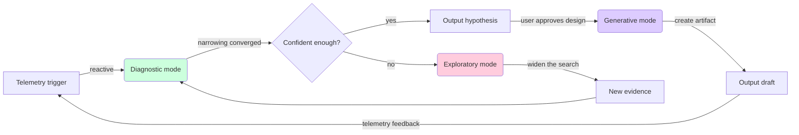

The same trio — Diagnostic → Exploratory → Generative — describes most software engineering work. Most agent classes spend most of their time in this loop.

The Butler's loop is different — it's `on_idle → Anticipatory → notification → user response → archive` — and so its diagram looks different. But the kernel mechanism for shifting between modes is identical: the Spirit's system prompt names what it's doing now, the Capability Registry enforces what's allowed in that mode, and the Telemetry Stream reports what happened.

### 1.4 What we accepted, what we didn't

**We accepted:**
- Cognitive style is **manifest + prompt + tool choice**, not a kernel feature. There is no `KernelCognitiveSelector::pick(reasoning_pattern)` API. We considered one — and rejected it. Forcing the kernel to know about cognitive patterns would make every new pattern a kernel change.
- The Spirit must self-declare output shape via the manifest. This is a small tax for the Spirit author and a large win for downstream consumers (peers, the user, evaluation suites). Confidence scores on diagnostics, citations on research, tested code on generation — all enforced at the kernel boundary.

**We didn't accept:**
- A "reasoning composer" abstraction that mixes patterns automatically. The architecture's general-purpose claim survives because we let the Spirit be an opaque thinker; if we tried to compose its thinking from primitives, every new agent class would force us to expand the primitives.

### 1.5 Formal cognitive frameworks behind each pattern

The four reasoning patterns above (anticipatory, exploratory, diagnostic, generative) are **operational labels** — they describe what the Spirit is doing, not the formal cognitive science underneath. For Spirit authors who want to ground a new class in established theory, this section names the frameworks that fit each pattern. **The kernel knows none of these names** — they live in system prompts and implementation crates. But naming them gives Spirit authors a vocabulary, an evaluation literature, and a community of prior art to draw from.

This subsection is the response to a parallel reading of the design space (the Gemini report at `_bmad-output/planning-artifacts/report-gemini.md`), which arrives at the same architectural conclusions but adds formal cognitive-framework labels MAOS had not yet committed to.

#### Anticipatory → Active Inference (Free Energy Principle)

The Butler (architecture §6.1) and Tutor (design report ☼.2) both reason anticipatorily: maintain an internal model of the user's goals and likely needs, observe sensor-like inputs (calendar, inbox, idle telemetry), and act when prediction error rises. This is the reasoning shape captured by **Active Inference** — the Free Energy Principle as applied by Karl Friston and the active-inference community. The Spirit's working memory holds beliefs over hidden states (the user's goals); the `event/telemetry` wire calls (architecture §5.2) are sensory observations; the `on_idle` lifecycle hook (architecture §5.3) is when the Spirit minimizes free energy by either updating beliefs or planning actions.

The Active Inference framework gives Spirit authors:
- A precise mathematical objective (free-energy minimization) to optimize for, instead of ad-hoc heuristics.
- A vocabulary for separating *perception* (belief update) from *action* (intervention) — both reduce free energy, the Spirit chooses which is cheaper.
- A literature for handling uncertainty quantitatively (precision-weighted belief updates).
- An efficiency claim: AIF agents reportedly need substantially less data to adapt than reinforcement-learning-style agents (cited in the Gemini report's §"능동적 추론" / Active Inference section).

The Butler's `[epistemic_policy]` (architecture §5.1) interacts cleanly with AIF: when the Spirit's belief variance grows beyond threshold, the Spirit halts (via `epistemic.halt`, architecture §4.6.1) instead of acting on uncertain beliefs. This is *exactly* the AIF-prescribed behavior — minimize free energy by gathering more evidence rather than committing prematurely.

**Where Spirit authors should look:** Friston, Active Inference: The Free Energy Principle in Mind, Brain, and Behavior (2022); the active-inference Python library; the spm12 toolbox.

#### Anticipatory (decision side) → Bayesian / POMDP

Anticipatory reasoning splits into *belief update* (handled by AIF perceptual side) and *act-now-or-wait?* (handled by Bayesian decision theory, often formalized as a Partially Observable Markov Decision Process). The Butler's question "should I notify the user?" is a POMDP: hidden state is the user's actual need; observations are partial (calendar entries, recent file activity); actions have costs (notification fatigue) and benefits (timely help); rewards arrive as user feedback (acknowledgment, retract, ignore).

The Spirit's manifest captures the POMDP parameters declaratively:
- `[capabilities].telemetry.subscribe` (architecture §5.1) — the observation space.
- `[budget]` with `warn_at_pct` (architecture §5.1, post-edit) — the cost ceiling on actions.
- `[explanation_shape]` (architecture §5.1) — the reward signal: the user reads the "because" line and decides whether to accept or retract; the Spirit learns from this in its `private` semantic memory.

**Where Spirit authors should look:** Sutton & Barto, Reinforcement Learning (2nd ed.) Ch. 17 on POMDPs; pomdp.org for solver libraries.

#### Diagnostic → Epistemic Verbalization (now mechanized in MAOS)

Mira-class diagnostic reasoning (architecture §6.3, design report Chapter 1.2 "Diagnostic" subsection) requires the Spirit to **separate procedural reasoning from epistemic claims** — to know what it knows, distinguish that from what it's guessing, and surface the gap when evidence is insufficient. This is **Epistemic Verbalization** as a cognitive framework, drawn from dynamic epistemic logic and the meta-cognition literature.

Until the recent architecture edit, MAOS supported this only via system prompts and the static `output_shape` predicate. **As of architecture §4.6.1 (Epistemic halt mechanics)**, MAOS now provides a kernel-level primitive for the dynamic case: when a Spirit detects evidence conflict or confidence below threshold, `epistemic.halt(payload)` is invoked, the Spirit transitions to the `EpistemicHalt` lifecycle sub-state, and the user resolves with `provided_context`, `accepted_halt`, or `authorized_override`.

This is the architectural move that converts hallucination from a Spirit failure mode into a user-mediated, audit-trailed event. Spirit authors implementing diagnostic reasoning should treat `[epistemic_policy]` as mandatory, not optional: configuring `halt_on_evidence_conflict = true` and an appropriate `halt_on_confidence_below` threshold is the cheapest way to honor epistemic verbalization without re-implementing it in every system prompt.

**Where Spirit authors should look:** van Ditmarsch et al., Dynamic Epistemic Logic (2007); the meta-cognition / metareasoning literature in cognitive science (e.g., Ackerman & Thompson on meta-reasoning).

#### Generative → no single canonical framework, but two useful lenses

Generative reasoning (Nash-class architecture, drafting ADRs, fix templates, code patches; architecture §6.4) is the least theoretically-mapped of the four patterns — there is no single "active inference for generation." Two useful lenses:

- **Inductive Logic Programming (ILP) + LLM hybrid.** Used in the Researcher's hypothesize mode (architecture §6.2): combine ILP's structured rule discovery with LLM's pattern completion, then submit the joint output to a Critic Spirit for refinement. Cited in the Gemini report's §"제너레이터 에이전트" / Generator Agent.
- **Iterative refinement via retriever-generator-critic loops.** A multi-Spirit pattern (Retriever spawns sub-Spirits to gather; Generator drafts; Critic scores and either approves or sends back with notes). Architecture supports this natively via `subspirit.spawn` (Layer-1 capability, architecture §4.6) and IAC mailbox round-trips. No new kernel work needed.

**Where Spirit authors should look:** the BioDisco, AstroAgents, and RHG papers cited in the Gemini report (Works Cited #56); the agentic RAG literature.

#### Cross-cuts: cognitive frameworks compose

A real Spirit composes frameworks the same way it composes reasoning patterns. Mira's session in §1.3 of this report — Diagnostic → Exploratory → Diagnostic → Generative — uses Epistemic Verbalization for the diagnostic phases, AIF-style belief updates as new telemetry arrives, and ILP-flavored generation when proposing fixes. **The kernel never has to know any of this**; the Spirit's manifest, system prompt, and implementation crate together encode the framework choices. Naming them in this report is for the Spirit author's benefit, not the kernel's.

---

## Chapter 2 — Memory Architectures

> *In MAOS, memory is the two-by-four matrix where cognitive science meets systems engineering: four kinds × three tiers × the swap operator. What survives a swap is what was planned to survive.*

### 2.1 Four kinds of memory

Cognitive science distinguishes four broad memory systems. They're useful here because each has different access patterns, different lifetimes, and different things that should happen on a Spirit swap.

**Working memory** is the active scratchpad — what's in the LLM's context window right now, plus the Spirit's currently-running task state, plus open Capability Tokens. It's *fast*, *small*, and *fragile*: lost on swap unless explicitly snapshotted.

**Episodic memory** is the time-stamped log of specific events — "I ran this command at 14:32, here's what stdout said, here's how I interpreted it." It's typically backed by JSONL transcripts and rollouts. Big, append-only, queryable.

**Semantic memory** is fact-shaped knowledge — "the production database is in eu-west-2, the team standup is Tuesdays at 10:00, the architecture forbids direct JDBC connections." It's slow to write, fast to read, and shared between Spirits more than transcripts ever should be.

**Procedural memory** is "how to" knowledge — "to deploy a service, run X, then Y, then watch Z." Skills, slash commands, runbooks. Loaded at Spirit start, sometimes refined during a session, but rarely written from scratch in real time.

### 2.2 Three tiers, four kinds — the matrix

MAOS has three memory tiers (private / shared / collective). Crossed with the four kinds, you get a 12-cell matrix. **Most cells are populated**, but with very different intensity:

| Memory kind   | Private (one Spirit)               | Shared (one Host)                          | Collective (cross-Host, Loom)              |
|---------------|-----------------------------------|--------------------------------------------|--------------------------------------------|
| **Working**   | Full — context window, task state | None — never crosses Spirit boundaries     | None — never crosses Host boundaries       |
| **Episodic**  | Full — transcript, rollout JSONL  | Some — broadcast events, IAC frames        | Some — incident archive, retro data         |
| **Semantic**  | Some — `memory.md`, scratchpad    | Heavy — project context, calendar, ADRs    | Heavy — patterns, fix templates, standards |
| **Procedural**| Some — Spirit-specific routines   | Heavy — skills, slash commands             | Heavy — Loom-curated cross-team skills     |

A few things this table makes obvious:

- **Working memory is always private.** If two Spirits share working memory, they're not really two Spirits. (They might share *episodic* notes through IAC, but that's different.)
- **Semantic and procedural memory live mostly outside the Spirit.** This is a positive design choice: facts and procedures should outlive any individual Spirit instance. They're the substrate that makes hot-swap interesting.
- **Episodic memory has a privacy spectrum.** A Spirit's full transcript is private; specific events broadcast as IAC frames are shared; resolved incidents in the Loom archive are collective.

### 2.3 What lives where in concrete terms

Drawing on the cohort survey: each Spirit on a Host has a directory tree like this.

```
~/.maos/
├── transparency/
│   ├── log.db                   # all IAC, approvals, capabilities (kernel-wide)
│   └── frames/                  # spilled large frames
├── shared/
│   ├── shared.db                # shared memory tier, Host-wide
│   └── pgvector/                # optional embedded vector
└── spirits/
    ├── butler-001/
    │   ├── manifest.toml
    │   ├── memory.md            # semantic, Spirit-authored
    │   ├── private.db           # episodic transcript, working state, scratchpad
    │   ├── rollout.jsonl        # append-only episodic log
    │   └── snapshot/<id>/       # snapshot bundles for hot-swap
    └── architect-007/
        ├── ...
```

The cross-Host **collective tier** lives elsewhere — typically a Loom service running on shared infrastructure (Postgres + pgvector + Loom indices).

```
loom-server/
├── postgres/
│   ├── patterns                 # detection patterns, fix templates, regression tests
│   ├── adrs                     # Architecture Decision Records
│   ├── incidents                # archived incident chains (Mira→Nash escalations)
│   └── pgvector indices
└── api/                         # MCP-Streamable-HTTP endpoint
```

### 2.4 Persistence — what gets written when

Different memory kinds get persisted on different triggers:

**Working memory** lives in RAM and the kernel's own task state. It's **persisted only on snapshot**. A Spirit can be paused without snapshotting (working memory survives in RAM) but cannot be migrated or hot-swapped without one (the destination needs the state blob).

**Episodic memory** is persisted *continuously* — every LLM round-trip, every tool call, every IAC frame writes a JSONL line and updates the rollout SQLite index. This is the codex/claudian pattern, and it's load-bearing for crash recovery: a kernel that dies and restarts can rehydrate every Spirit from its rollout.

**Semantic memory** is persisted on Spirit-authored writes. The Spirit chooses when to update `memory.md` (typically end-of-task or when it learns something durable). Shared semantic memory (project context, ADRs) is persisted on whatever schedule the writing Spirit chooses; the kernel makes no guarantees about freshness.

**Procedural memory** is persisted at *publish time* — when a skill, command, or runbook is added to a registry. Spirits read procedural memory; they only rarely write to it (and when they do, it's typically through a high-friction path like "this skill should be added to the team library; sending an A2A request to the team's curator Spirit for review").

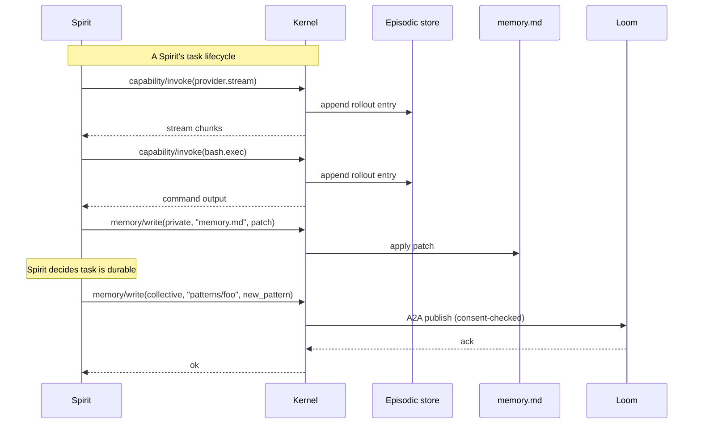

### 2.5 Retrieval — how the Spirit gets memory back

Retrieval is *pull-based* and *layered*. A Spirit asks the Memory Manager for what it needs; the Memory Manager checks the Spirit's manifest scope before returning anything.

The order a typical Spirit hits memory tiers, on a fresh task:

1. **memory.md** loads at Spirit start. It's small and durable — the equivalent of "I'm a senior architect at company X; I prefer Rust over Go for systems code; here's the team's design principles."
2. **Recent episodic memory** — the last N items from the rollout. Useful for "remember what we just did three turns ago."
3. **Shared semantic memory** — on demand, when the Spirit needs project context or calendar info. Mediated by the manifest's read scope.
4. **Collective semantic memory** — when the Spirit hits a hard problem. The Architect Spirit asks Loom *"is there a pattern for this?"* via an MCP call. Pgvector + reciprocal-rank-fusion under the hood; the Spirit doesn't know.

Retrieval is **never automatic via prompt-injection**. The kernel will not silently shove memory into the Spirit's context. The Spirit must explicitly request memory through the Memory Manager API. This is essential for Journey 10's transparency: a peer can audit *exactly* what their Spirit retrieved and when.

### 2.6 Crossing a swap — what survives

This is the hard part. A swap takes Spirit A out and puts Spirit B in. What does B inherit?

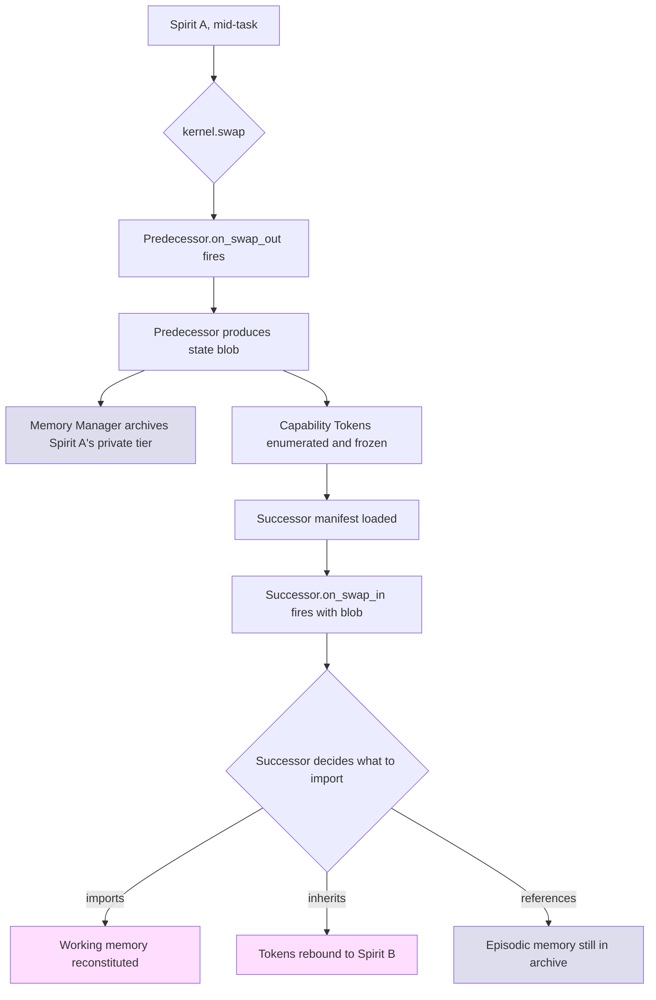

Three tiers of inheritance, each different:

- **Working memory** is *handed over* via the state blob. The successor decides whether to import the full context window or a digest. Think of it like a doctor handoff at shift change — the new doctor gets a summary, not the full chart.
- **Capability Tokens** are *rebound*, not re-issued. The successor inherits Spirit A's open tokens; its first use of any token logs a `posture_change` audit event so the human can see "Spirit B used a token Spirit A obtained."
- **Episodic memory** is *referenced, not imported*. Spirit A's full transcript stays in `archive/spirit-a-001/` for the configured retention period (default 30 days). The successor can read this archive (subject to manifest scope) but doesn't load it as its own memory. Two Spirits never claim the same transcript.

**Semantic and procedural memory** typically don't need swap-time handling because they live at the shared or collective tier — both Spirits can read the same `memory.md` if their manifests permit. The exception is Spirit-private semantic memory (a custom scratchpad), which is treated like episodic — archived, referenceable, not silently transferred.

> **Mira → Nash hot-swap, in detail.** Imagine for a moment that Mira and Nash were postures of one Spirit (in a single-Host configuration). The "swap" is more accurately a posture change, but mechanically: Mira's working memory (current investigation, open hypotheses) is captured. Mira's open Capability Tokens (read-only handles to thread dump files, telemetry queries) are frozen. The posture change to `principal-architect` triggers — Nash inherits the tokens, gains source-code read-write capability, loses production-mutation capability. Nash's `on_swap_in` decides which working memory to import (the diagnostic conclusions, not the raw thread dumps). The transparency log records every step. **Mira's investigation continues seamlessly under Nash's name.**

In Journey 11's actual cross-Host case, the mechanism is different — escalation is an A2A frame, not a swap — but the underlying primitive is the same: state blob + token inheritance + manifest-scoped import. Whether it's same-Host (cheap, in-process) or cross-Host (A2A-mediated, mTLS-protected) is a deployment detail.

### 2.7 The compaction problem

LLM context windows are finite. Episodic memory grows without bound. Sooner or later, a Spirit must **compact** — summarize the old, keep the recent, preserve the structure.

MAOS leaves compaction strategy to the Spirit's manifest, but the kernel enforces one invariant: **tool_use and tool_result blocks always come paired in compaction output.** This is openclaw's hard-won lesson: an LLM that sees a `tool_result` without its matching `tool_use` (or vice versa) gets confused and recovers slowly. The Memory Manager's compaction service knows this constraint and will refuse to emit a compacted transcript that breaks pairing.

Three reference compaction strategies ship with v1.0, each suitable for different Spirit classes:

- **`adaptive-chunk-ratio`** — openclaw-style adaptive summarization that balances summary detail against the size of the chunk being summarized. Default for Researcher and Architect.
- **`head-tail-protected`** — hermes-style, where the first N and last M turns are protected verbatim and only the middle is summarized. Default for Diagnostic Engineer (the initial hypothesis and the latest evidence are both load-bearing).
- **`journal-only`** — no LLM summarization; old turns are simply pruned with markers ("turns 1-50 archived to rollout.jsonl"). Default for Observer (cheap, doesn't need long-context reasoning).

A Spirit class can also implement a custom compactor by exporting one in its implementation crate. The Memory Manager calls into it through a typed trait. The kernel doesn't know what's "good summarization"; it just provides the pairing-integrity guard and lets the Spirit decide everything else.

### 2.8 What we accepted, what we didn't

**We accepted:**
- Working memory is per-Spirit and rebuilt on every swap. We thought about a kernel-level "shared working memory" but it broke isolation — two Spirits would have to coordinate context-window allocation, and that coordination is exactly what the IAC mailbox is for.
- The Spirit decides what to import on swap-in. The kernel could try to be smart about transferring context, but every smart heuristic we considered would surprise the Spirit author.

**We didn't accept:**
- Auto-import of predecessor working memory. A successor that *automatically* gets its predecessor's full context is one feature away from a Spirit silently inheriting a peer's secrets. The friction of explicit import is what keeps the trust model crisp.

---

## Chapter 3 — Multi-Agent Orchestration Patterns

> *Spirits don't all coordinate the same way. The kernel offers a small set of primitives; orchestration patterns are how applications compose those primitives. Picking the right pattern is more about the work than the agent.*

### 3.1 Four classical patterns, one substrate

The orchestration literature recognizes (broadly) four patterns. MAOS supports all four with the same primitives — IAC mailbox, A2A peer mesh, capability scoping, memory tiers — and lets the application choose.

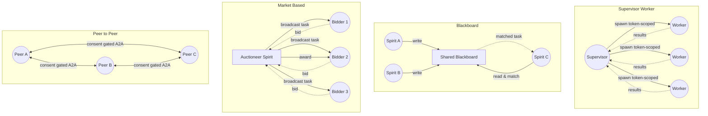

I'll describe each in turn, in plain English.

### 3.2 Supervisor / worker

**The pattern.** One Spirit (the supervisor) breaks a problem into sub-problems and dispatches them to subordinate Spirits. Workers receive their inputs, work in parallel, and return results. The supervisor synthesizes.

**Where it fits.** Tasks where (a) there is a clear hierarchy of responsibility and (b) sub-tasks are *mostly* independent. The canonical example is the codex multi-agent pattern: an Architect Spirit fans out apply-patch sub-Spirits across N files, each editing one file, all reporting back.

**Kernel primitives used.**

| Need | MAOS primitive |
|---|---|
| Spawn a sub-Spirit with restricted scope | `subspirit/spawn(manifest, scope)` from §5.2 of architecture |
| Dispatch a sub-task | IAC mailbox |
| Limit recursion | `max_subspirit_depth` in manifest, hermes-style |
| Token-scope sub-Spirit work | Capability Tokens issued at narrower scope than the supervisor's |

**Strengths.** Clear authority. Each worker has a small token surface (only what it needs to do its sub-task). Supervisor can cancel workers cleanly — token revocation is atomic.

**Weaknesses.** The supervisor is the bottleneck for synthesis. If the supervisor's reasoning is wrong, the workers do beautiful but wasted work. **The supervisor must be smarter than the workers** — or at least know how to recognize bad sub-results.

### 3.3 Blackboard

**The pattern.** A shared structured memory ("the blackboard"). Spirits read from it and write to it asynchronously. A Spirit can match against the blackboard's current state and decide unprompted to take action. Nobody owns the blackboard; nobody's in charge.

**Where it fits.** Many specialists with overlapping or complementary expertise; problems whose decomposition isn't known in advance. Loom is a blackboard. The collective memory tier — patterns, ADRs, fix templates — is a blackboard.

**Kernel primitives used.**

| Need | MAOS primitive |
|---|---|
| Shared structured memory | Collective tier (Loom) or shared tier (Host) |
| Asynchronous writes/reads | `memory/write` and `memory/read` against the tier |
| Pattern matching to trigger action | Spirit subscribes to telemetry events on memory writes; manifest matchers |
| Discovery — "is there work I can do?" | Spirit polls or subscribes to specific blackboard partitions |

**Strengths.** Adds new specialists without re-architecting. A new Spirit class declares "I read from these blackboard partitions, I write to those" — done. Resilient: if a Spirit dies, the work it was about to do remains visible.

**Weaknesses.** Coordination is implicit. Two Spirits can race to handle the same task. Solutions involve token-based locking on blackboard partitions (Loom's "claim this incident" semantics), which adds complexity.

### 3.4 Market-based

**The pattern.** A coordinator (the auctioneer) broadcasts a task descriptor. Eligible Spirits respond with bids — typically (cost, expected quality, ETA). The auctioneer picks a winner. Optionally, multiple winners for parallel work.

**Where it fits.** Heterogeneous Spirits with different specializations or different load levels. Cross-Host scenarios where some Hosts are idle and others are overloaded. Federations of organizations sharing agent capacity.

**Kernel primitives used.**

| Need | MAOS primitive |
|---|---|
| Task broadcast | A2A peer mesh, role queries, `kind: auction` IAC frame |
| Bidder responses | Reply IAC frames |
| Award and dispatch | Standard A2A frame to the winning peer |
| Settlement / accountability | Transparency Log entries documenting the auction |

**Strengths.** Naturally handles heterogeneity. Hosts opt in to bidding on tasks they can do well. Adapts to load — a busy Host bids unfavorably, automatically shedding work.

**Weaknesses.** Auction overhead matters when tasks are small. Bid quality is hard to evaluate (a Spirit can over-promise). Vulnerable to "bidding rings" in untrusted federations — three Spirits colluding to bid favorably for each other.

We don't ship a Market-based reference Spirit class in v1.0. **The substrate supports it** — every primitive needed already exists — but we wait for Rule of Three before we add it as a default. (When three real customers want capacity-aware federation, we'll add it. Until then, anyone who needs it can build it on the substrate.)

### 3.5 Peer-to-peer

**The pattern.** Equal Spirits collaborate without hierarchy. Communication is consent-gated — every cross-peer message requires both ends to allow it. No central coordinator.

**Where it fits.** This is **Journey 10**. It's also **Mira & Nash** (peers despite asymmetric capability). It's the dominant pattern for human-team augmentation, where every human's agent represents that human, and no human's agent owns another's.

**Kernel primitives used.**

| Need | MAOS primitive |
|---|---|
| Authenticated peer communication | A2A over mTLS with TOFU, `a2a.json` discovery |
| Consent gates | Frame-level approval at both sender and receiver |
| Role-based addressing | Role queries against current Spirit roster |
| Transparency | Transparency Log writes before delivery; retract primitive |
| No silent action | Kernel-rendered notification surface |

**Strengths.** Maximally respects autonomy. Naturally fits human team structures. Resilient — no SPOF. Privacy-friendly — every peer controls what they expose.

**Weaknesses.** Coordination overhead — broadcasting a sprint update means N consent gates. Slower for high-volume work. Vulnerable to free-rider problems if you're trying to optimize for collective output.

### 3.6 Choosing a pattern (a small decision tree)

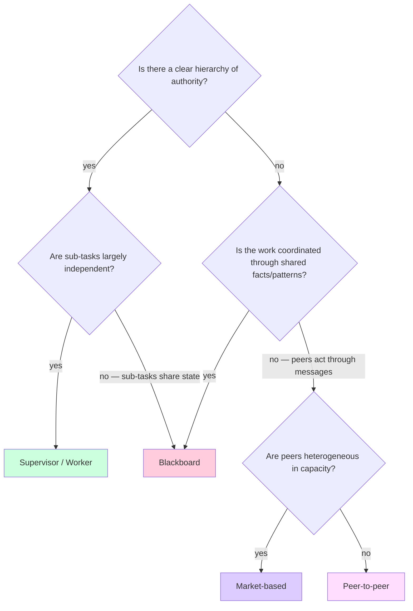

In practice, real systems combine patterns. The **Cortex** (Journey 12) is fundamentally peer-to-peer (28 Hosts in A2A mesh) with a blackboard overlay (Loom curates patterns) and supervisor/worker pockets (an Artisan-class Spirit fans out apply-patch sub-Spirits across files). All three coexist.

### 3.7 How the kernel arbitrates

**It doesn't.** That's the point.

The kernel provides primitives — IAC, capability tokens, memory tiers, telemetry — and stays neutral on which orchestration pattern an application uses. A given Host might run:

- A Butler Spirit using *no orchestration* (single-Spirit task).
- An Architect supervising apply-patch sub-Spirits (*supervisor/worker*).
- An Observer subscribing to the shared memory tier for project-context updates (*blackboard*).
- A Diagnostic Engineer in A2A peering with an Architect on another Host (*peer-to-peer*).
- Simultaneously.

Each pattern uses the same kernel primitives differently. The kernel doesn't arbitrate between them because it never has to choose — Spirits coexist; their orchestration patterns coexist.

**The one place the kernel does arbitrate** is when patterns conflict on resources. If two patterns both want to spawn workers and the Host's `parallel_subspirit_cap` is reached, the kernel queues. If two patterns both want to broadcast on the same A2A mesh and the bandwidth budget is reached, the kernel rate-limits. These are scheduling concerns, not orchestration concerns; they apply uniformly.

### 3.8 What we accepted, what we didn't

**We accepted:**
- Pattern selection is the application's job. The kernel's neutrality is a feature.
- Hybrid patterns are the norm, not the exception. The substrate has to make all patterns cheap enough that mixing them doesn't hurt.

**We didn't accept:**
- A "kernel orchestrator service" that picks patterns automatically. We prototyped one mentally; it kept becoming a worse version of whatever pattern the user actually wanted. The kernel that knows orchestration patterns is the kernel that resists new patterns.

---

## Chapter 4 — Security & Trust Model

> *Make the substrate safe by construction. Capability tokens are not optional decoration; they are the only way Spirits act. Sandbox is the floor; approvals are the ceiling. Every step writes an audit entry before it succeeds.*

### 4.1 Capability-based permissions

Every action a Spirit takes — reading a file, calling a provider, sending an IAC frame, spawning a sub-Spirit — flows through a **Capability Token**. There is no other way.

The lifecycle of a single capability is a four-step dance:

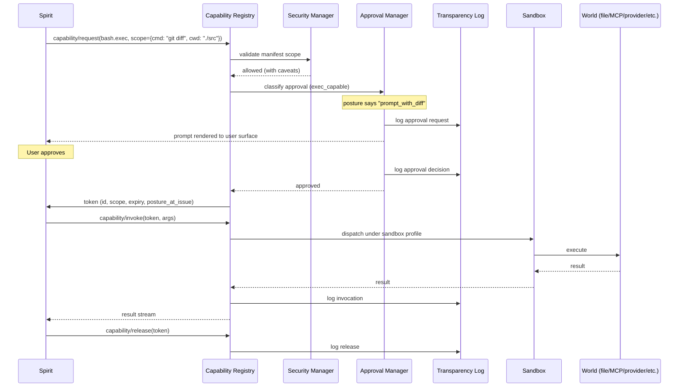

Five things this diagram makes mandatory:

1. **Tokens are unforgeable.** They carry a 128-bit unguessable ID, are signed by the kernel, bound to the Spirit that requested them.
2. **Scope is granular.** A token doesn't say "the Spirit can run shell commands"; it says "this token authorizes one execution of `git diff` in `./src`, expiring in 60 seconds."
3. **Approval lives in front of issuance, not in front of invocation.** Once a token exists, the Spirit can use it without re-prompting (subject to the token's expiry). Re-prompting on every invocation would create approval fatigue; pre-approving with explicit scope solves the same safety problem.
4. **Every step writes the Transparency Log before delivery.** Even a denied approval writes an entry. The log is the audit trail; it can't be reconstructed after the fact.
5. **The world only sees what the sandbox lets through.** The Capability Registry never hands raw file handles or process control to the Spirit; it always wraps them in the sandbox profile.

### 4.2 The six approval classes

Approvals come in six classes, lifted from openclaw's classifier:

| Class | Examples | When the kernel prompts |
|---|---|---|
| `readonly_scoped` | Read this file, this URL, this MCP resource | Only if posture says `prompt` (rare) |
| `readonly_search` | Grep / glob / repo-wide search | Only if posture says `prompt` (rare) |
| `mutating` | Write file, edit file, modify shared memory | Default `prompt` for cautious posture; `silent_allow` for autonomous posture in declared scope |
| `exec_capable` | Run shell command, container, any code | Default `prompt_with_diff` for cautious; `prompt` for assistive; `silent_allow` only for autonomous in known-safe whitelist |
| `control_plane` | Spawn sub-Spirit, alter capability scope, modify posture | Almost always `prompt`; only `silent_allow` for explicitly trusted Spirits in tightly-scoped contexts |
| `interactive` | IAC frame requiring peer ACK | Routed to peer's posture; sender-side typically `silent_allow` |

Posture is a projection: each class maps to one of `silent_allow`, `notify_and_log`, `prompt`, `prompt_with_diff`, `deny`. A Spirit's manifest declares its posture preset; the user can shift posture at runtime within the manifest's ceiling.

This gives the kernel a clean way to say "this Spirit class is more autonomous" or "this Spirit class is more cautious" without the kernel knowing what the Spirit is *for*. **Generality survives** — a future Spirit class chooses its posture from the same six-class taxonomy; no kernel change needed.

### 4.3 Sandbox tiers

We ship five tiers (T0–T4); a Spirit's manifest declares its profile, the Security Manager refuses to load a Spirit whose declared profile can't be satisfied.

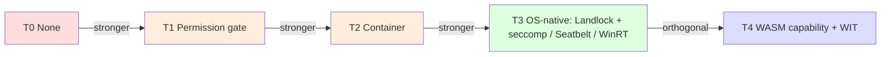

T3 and T4 are not strictly ordered — they protect different things. T3 protects the host filesystem and process space against compromised generated commands; T4 protects against compromised tool plugins (a malicious MCP server, a third-party skill pack). **The default v1.0 stack is T3 + T4** — OS-native sandbox for shell, WASM capability sandbox for tool plugins.

### 4.4 Inter-agent authentication

Same-Host and cross-Host have very different trust models, and the kernel uses different mechanisms for each.

**Same-Host: kernel-mediated.** Spirits on a Host are loaded by the same kernel; the kernel knows everyone. Every IAC mailbox send carries the sender's `SpiritId`, signed by the kernel internally. There's no cryptography on the wire because there's no wire — it's a `tokio::sync::mpsc::Sender`.

**Cross-Host: mTLS + TOFU + per-frame consent.** A2A traffic between Hosts uses mutual TLS. First contact uses Trust-on-First-Use: the user confirms a peer's certificate fingerprint once, and the kernel pins it. Every A2A frame goes through both ends' Approval Manager — sender-side outbound policy, receiver-side inbound policy — before delivery.

> **Why TOFU, not a traditional CA?** In v1.0, MAOS targets single-user and team-mesh deployments where central PKI is overkill. An enterprise Cortex deployment in v2.0 will introduce an org-internal CA, but that's enterprise infrastructure, not architecture. TOFU is the right answer for "Marcus's laptop wants to talk to Lena's laptop"; CA is the right answer for "every employee's laptop must trust the company's certificate authority."

**Role queries.** A frame's recipient field can be a *role* (`role: "architect"`) instead of a SpiritId. The receiving Host resolves the role locally — whichever Spirit currently holds the role gets the frame. This keeps Journey 10's "ask the architect" pattern working when the architect changes (sabbatical, new hire) without re-distributing addresses.

### 4.5 Audit trails

Two audit logs. They serve different purposes.

**Transparency Log** *(personal, kernel-mandated for IAC).* Every IAC frame, every approval prompt, every capability invocation, every retract — append-only entries before the action succeeds. Visible only to the owning user. This is the journal that lets a user say "I want to know everything that happened on my Host this week."

**Approval Decision Log** *(deeper, queryable).* Every approval prompt's `(actor, target, capability, intent, decision, reasoning_if_any)`. Queryable for analytics and for compliance. In Enterprise deployments, streamed to the org SIEM via OpenTelemetry.

Both are SQLite databases in v1.0. Both can be exported to JSONL for archival. **Both are kernel-managed, not Spirit-managed.** A Spirit cannot delete or mutate either log; it can only append (and indirectly, by retracting a frame, which itself is a new appended entry referencing the original).

Why two logs instead of one? Because they're queried differently. The Transparency Log is asked *"what happened?"* The Approval Decision Log is asked *"why did we let it?"* Conflating them muddies both queries.

### 4.6 Human-in-the-loop checkpoints

The user's trust in the system depends on **knowing when their attention is needed and when it isn't.** MAOS exposes three checkpoint surfaces:

1. **The approval prompt.** Triggered by capability requests whose class matches the Spirit's posture's `prompt` set. Synchronous: the Spirit blocks until the user responds (or until a posture-cached decision applies). Renders in the TUI, in the editor (via ACP), or as a A2A push to the user's preferred Host (e.g., their phone).
2. **The notification.** Triggered by `notify_and_log` actions. Asynchronous: the action proceeds, but the user is informed. Three urgency levels (immediate / queue / digest) per Journey 10.
3. **The retract.** Triggered by the user noticing something was sent in their name they want to take back. The kernel sends a structured retract frame to the recipient; the recipient's UI shows the retracted message marked as such.

The substrate also exposes a fourth, less-discussed surface: **the posture shift.** A user can tell their Butler "be more cautious for the next hour" — the Butler's posture shifts; the kernel logs the shift; subsequent capability requests prompt that wouldn't have. This is the runtime equivalent of "supervised mode."

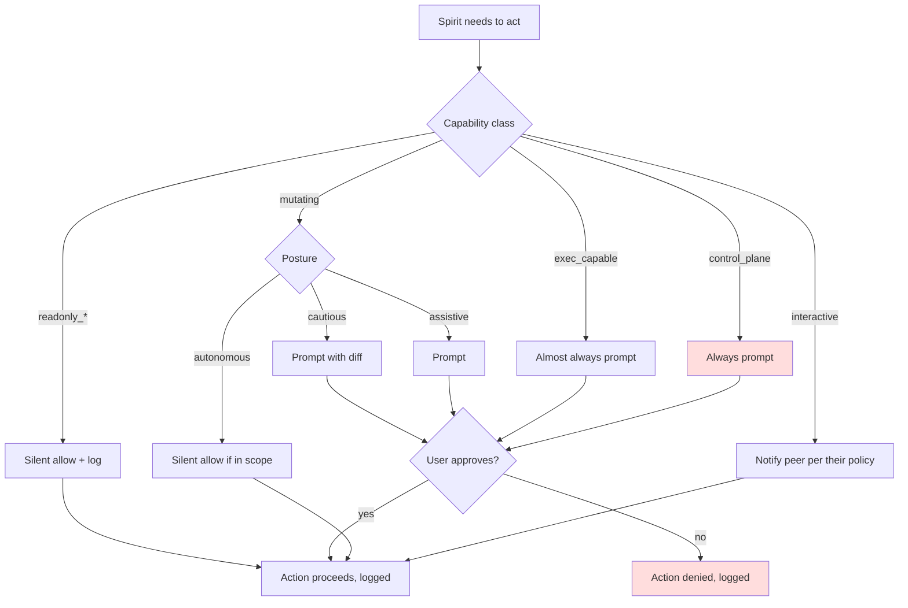

### 4.7 What we accepted, what we didn't

**We accepted:**
- Capability tokens are mandatory for everything. There is no fast-path that skips the Capability Registry, even for "the Spirit's own scratchpad". This adds overhead; it also makes the audit and security claims credible.
- Approval prompts can fatigue users, and we can't fully solve that with mechanism. We mitigate (`prompt_with_diff`, persistent allowlists per scope, posture-cached decisions) but the underlying problem is product-design, not architecture.

**We didn't accept:**
- "Trusted Spirits" with bypass rights. Every Spirit goes through the same gates. A Spirit author can pre-declare a posture that's `silent_allow` for many things, but the user always has the audit trail to verify what happened.
- A fingerprint-only authentication for A2A (no consent gates). Without consent gates, an authenticated peer can send anything; that breaks Journey 10's "no asymmetric knowledge" guarantee.

---

## Chapter 5 — Modularity & Hot-Swap Mechanics

> *A Spirit is a manifest plus state. The manifest is what makes it a class; the state is what makes it an instance. Hot-swap exchanges the class while preserving the parts of state that should outlive the swap. Composition is many Spirits coexisting on the same kernel.*

### 5.1 What a Spirit *is*, mechanically

When you say "load a Butler", here's what mechanically appears in the kernel:

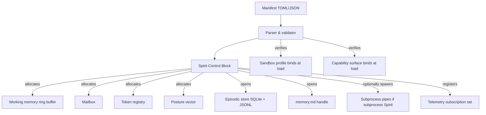

The Spirit Control Block (SCB) is the OS-style PCB analog: one struct per Spirit instance, owned by the kernel, holding all the state needed to schedule, supervise, snapshot, and unload. The SCB is **never visible to the Spirit itself**; the Spirit only sees its handle through the Spirit ABI.

A Spirit's *class* (Butler, Architect, Mira-class) is fixed at load. A Spirit's *posture* is mutable — a Butler can shift from `assistive` to `cautious`, but it cannot become an Architect without unloading and reloading. **Class identity is a kernel invariant; posture identity is not.**

### 5.2 Lifecycle states

A Spirit lives through eight states. Transitions are journaled (Invariant I10) so a kernel restart can rehydrate where it left off.

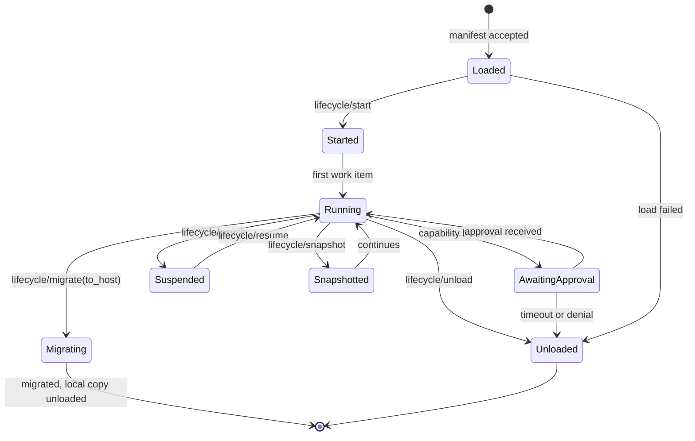

A few details worth flagging:

- **Loaded ≠ Started.** Loading is parsing the manifest, validating capability scopes, opening memory handles. Starting is when the Spirit becomes runnable. This split lets the kernel detect "your manifest doesn't make sense on this Host" before the Spirit ever generates a token.
- **Suspended ≠ Snapshotted.** Suspended keeps working memory in RAM (cheap to resume; survives kernel restart only if the kernel was clean-shutdown). Snapshotted serializes working memory to disk (durable, more expensive, required for migration).
- **AwaitingApproval is a real state, not a transient.** The kernel knows the Spirit is paused waiting for a human, and budgets accordingly.

### 5.3 The hot-swap operation

A hot-swap takes Spirit A out and puts Spirit B in, on the same Host, with state preserved. Mechanically:

```mermaid
sequenceDiagram
    participant U as User / Control plane
    participant K as Kernel (Scheduler)
    participant A as Spirit A
    participant TR as Token registry
    participant MM as Memory Manager
    participant B as Spirit B

    U->>K: kernel.swap(spirit_id=A_id, new_manifest=B.toml)
    K->>K: validate B's manifest
    K->>K: confirm capability surface compatibility
    K->>A: lifecycle/swap_out
    A->>K: state blob (working mem + open token IDs)
    K->>TR: freeze tokens (no new invocations)
    K->>MM: archive A.private to archive/A_id/
    K->>K: instantiate Spirit B (Loaded state)
    K->>B: lifecycle/start
    K->>B: lifecycle/swap_in(predecessor_blob)
    B->>K: import decisions (which working mem, which tokens)
    K->>TR: rebind tokens to B (audit posture_change events)
    K->>U: swap complete, swap_id logged
    Note over A,B: A is fully unloaded; B continues
```

Three guarantees the kernel makes:

1. **No work happens on the swapped tokens between A's swap_out and B's first import.** Tokens are frozen during the gap. A frozen token can't be used by anyone; if it expires before B picks it up, it's gone, and B has to re-request.
2. **B's import decisions are journaled.** What B chose to inherit is in the audit trail; the user can verify whether Nash-class Spirit B inherited Mira-class Spirit A's diagnostic context, or chose to start clean.
3. **A's archived memory is retained for the configured TTL.** Default 30 days. B (or a future Spirit) can read it through the Memory Manager API, subject to manifest scope.

**What hot-swap does *not* do:**

- It doesn't transfer in-flight LLM streams. If A had a partial response in flight when swap fired, the partial response is dropped (and logged). B starts fresh.
- It doesn't rewrite history. A's transcripts in `archive/A_id/` are immutable.
- It doesn't change the Host's other Spirits. Hot-swap is one-Spirit-at-a-time.

### 5.4 Composition: many Spirits coexisting

A Host runs many Spirits concurrently. They share kernel resources but not memory or tokens.

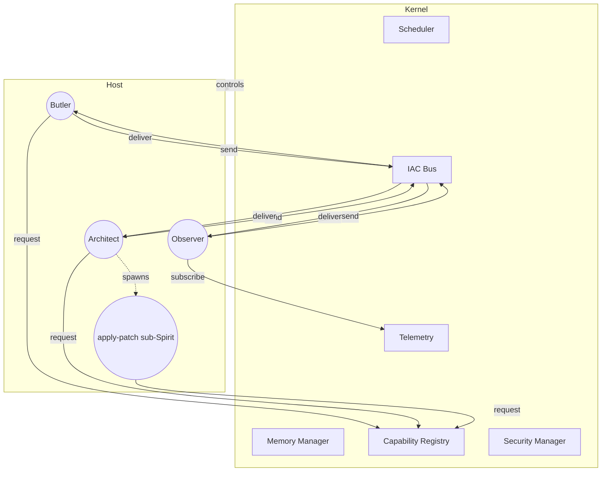

A few points the diagram makes concrete:

- **All Spirits share one IAC Bus.** Mailbox routing within the Host is cheap; cross-Spirit messages have no cryptography overhead.
- **All Spirits share one Telemetry Stream.** Subscribers filter on topic. The Observer subscribes broadly; the Butler subscribes narrowly (calendar/inbox/idle); a Researcher subscribes to almost nothing.
- **Sub-Spirits inherit a *narrower* capability scope than their parent.** Architect's apply-patch sub-Spirits get `fs.write` for one file each, no `provider.stream`, no `mcp.call`. The kernel enforces the narrowing.
- **Each Spirit has its own private memory.** Cross-Spirit information sharing happens through the shared/collective tier or through IAC frames — never through direct memory access.

### 5.5 Composition across Hosts

Beyond the single Host, composition uses A2A. A multi-Host configuration is the same kernel, replicated, with A2A peering configured.

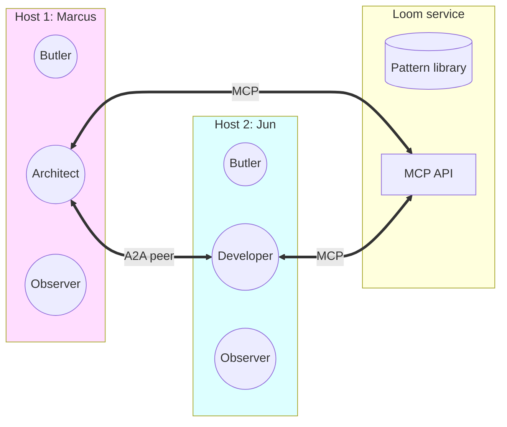

Marcus's Architect and Jun's Developer talk peer-to-peer over A2A. Both Spirits, on different Hosts, can hit the Loom service over MCP-Streamable-HTTP. The Hosts themselves are never coupled — Marcus's Host can crash without affecting Jun's; only the in-flight A2A consultations are interrupted, and they retry.

### 5.6 What we accepted, what we didn't

**We accepted:**
- Hot-swap is allowed within a class compatibility envelope (a Mira-class can swap to a Nash-class, but a Mira-class cannot swap to a Butler — too different in capability surface). The compatibility check is strict.
- Sub-Spirit narrowing is enforced; a child cannot exceed its parent's capability surface. This means a malicious child Spirit can do only what its parent could already do.

**We didn't accept:**
- Cross-Host hot-swap (same as migrate, mostly). We support migrate, which moves a Spirit from Host X to Host Y; we don't support a "swap A on Host X to a B on Host Y" in one operation. Two distinct operations: migrate, then local swap. Easier to reason about.

---

## Chapter 6 — Development Methodology

> *A new Spirit class isn't a kernel change. It's a manifest, a system prompt, an optional implementation crate, and a test harness. The methodology is what keeps each Spirit good without the kernel having to know the details.*

### 6.1 The lifecycle of a new Spirit class

I'll walk through it in the order an author actually faces.

**Phase 1 — Specification (~hours).** Decide what this Spirit is *for*. What user task does it serve? What's its cognitive framework (anticipatory / exploratory / diagnostic / generative)? Sketch the system prompt. Sketch the output shape (citations? confidence scores? code patches?). This phase lives in a markdown file, not in code.

**Phase 2 — Manifest (~hours).** Author the TOML. Memory scope, capability surface, posture preset, sandbox profile, hooks. Validate the manifest against the schema. The validator is provided by the kernel; running it requires no live kernel.

**Phase 3 — Implementation (~hours to days).** Two paths:
- **Subprocess Spirit:** Implement in any language that can speak the Spirit Wire Protocol. Skeleton libraries provided in Rust, TypeScript, Python.
- **In-process Rust Spirit:** Implement the `Spirit` trait in a Rust crate. Faster runtime, tighter coupling.

The hooks (`on_load`, `on_idle`, `on_swap_in`, etc.) get implemented here. The system prompt template is loaded from disk (`spirits/<class>.system.md`).

**Phase 4 — Unit tests (~hours).** Mock the Spirit ABI; call into hooks; verify behavior. The Spirit harness library makes this cheap. Capability requests get returned as mock tokens; capability invocations get scripted responses; manifest validation runs against the schema.

**Phase 5 — Integration tests (~hours to days).** Spin up a kernel in test mode (in-process, no sandbox). Load the Spirit. Run scripted user-input scenarios end-to-end. Verify output shape, capability usage, IAC frames.

**Phase 6 — Eval (~days).** Run the Spirit against an eval suite. Eval suites are Spirit-class-specific:
- Researcher: synthesis quality, citation accuracy, hypothesis novelty (LLM-as-judge with rubric).
- Architect: code correctness, test coverage, ADR clarity.
- Diagnostic Engineer: hypothesis precision, false-positive rate, time-to-correct-diagnosis.
- Butler: notification relevance, false-trigger rate, user-actioned suggestion rate.

Eval suites are versioned; comparison across Spirit versions is built-in.

**Phase 7 — Beta (~days to weeks).** Load the Spirit into your own Host as the only consumer. Run real tasks. Watch the Telemetry Stream. Measure: capability usage distribution, approval prompt frequency, error rates, user-edit rate on Spirit outputs.

**Phase 8 — Publish (~hours).** Push the manifest + implementation crate (or subprocess binary) to a registry. Version-tag. Document the manifest schema as part of the publish.

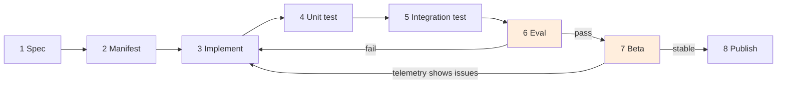

### 6.2 The testing pyramid

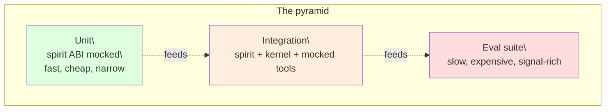

Each layer has different incentives:

- **Unit tests** verify hook correctness. *Did `on_swap_in` correctly merge the predecessor's state? Did `on_idle` produce the right notification? Did the manifest validator reject this malformed scope?* Cheap, fast, run on every commit.
- **Integration tests** verify the Spirit's behavior in the kernel. *Does the Spirit issue the right capability requests for a given user input? Does it respond correctly to a denied approval? Does the IAC frame it sends have the right shape?* Slower; run on PR.
- **Eval suite** verifies the Spirit's *quality* on a benchmark. *Does the Researcher produce relevant citations? Does the Architect's code pass the user's tests? Does Mira's hypothesis precision improve over time?* Expensive (real LLM calls); run nightly or before release.

### 6.3 What evaluation actually measures

Quality dimensions vary by class. Here's a starting set, by Spirit:

| Class | Quality dimensions |
|---|---|
| Butler | Notification precision (% acted on), notification recall (% of relevant moments caught), user-correction rate, time-to-action savings |
| Researcher | Synthesis accuracy (judged), citation correctness, novelty of hypotheses (when in hypothesize mode), open-question quality |
| Diagnostic Engineer | Hypothesis precision, false-positive rate on telemetry alerts, time-to-correct-diagnosis, escalation evidence completeness |
| Senior Architect | Code correctness (test pass rate), test coverage delta, ADR clarity (judged), feedback-loop turnaround (how fast post-deploy issues fold back) |
| Enterprise | Compliance violation rate (should be 0), policy decision latency, cross-team workflow completion rate |
| Observer | Anomaly precision, anomaly recall, alert fatigue (alerts per anomaly), perceptual coverage |

**Evaluation is part of the Spirit, not the kernel.** The kernel doesn't judge whether an Architect Spirit's code is good. It just enables the eval suite to run, and surfaces the results.

### 6.4 Tooling

A new author of a Spirit class needs three tools:

- **`maosctl`** — CLI. `maosctl load`, `maosctl swap`, `maosctl tail-telemetry`, `maosctl audit`, `maosctl publish`. Operates on the local Host or via control-plane API.
- **`spirit-test`** — harness library. Lives in the language of the Spirit (Rust, TS, Python). Mocks the Spirit ABI; provides test scaffolding.
- **`maos-registry`** — a server that holds published manifests + implementation artifacts. Versioned. Per-org or per-team.

A v1.5 wishlist item: a **`spirit-eval`** runner that generalizes evaluation across Spirit classes by reading an eval-suite descriptor from the manifest. Reduces the bar to evaluation; "Spirit author can write a YAML and a few prompts, get a benchmark report."

### 6.5 The "every Spirit is an early instance" methodology

The seven agent classes named at the start are early instances. **The methodology assumes more will come.**

This drives two specific practices:

- **The manifest schema must be additive-only across kernel versions within a major.** New manifest fields can be added; existing fields can't change meaning. This lets old Spirit manifests continue to work on new kernels.
- **Eval suites are per-class but composable.** A Tutor Spirit's eval suite includes "explanation quality" and "scaffolding effectiveness"; a Negotiator Spirit's includes "principled-negotiation pattern usage" and "outcome fairness." There's no master eval; there's a registry of eval suites.

We deliberately don't constrain *what kinds of Spirits* the substrate can host. The kernel offers cognitive frameworks (any), memory architectures (any), orchestration patterns (any), security postures (any from the six-class taxonomy), hot-swap mechanics (any class with compatible capability surface). **Generality is enforced by the substrate's neutrality, not by anticipation of every possible Spirit.**

### 6.6 What we accepted, what we didn't

**We accepted:**
- Eval cost is real. Running eval suites against real LLMs is expensive; we'll need careful budget management (sampling, prompt-caching reuse, run-on-release-only by default).
- Spirit authoring has a learning curve. There are six chapters of design context and a non-trivial manifest schema; new authors need a tutorial. (Wishlist for v1.0 docs.)

**We didn't accept:**
- A mandatory "Spirit certification" before publish. We considered requiring eval-suite scores above a threshold before a Spirit could be published to the registry. We rejected because it puts the registry in the position of judging quality; better to publish openly, surface eval results, let consumers decide.

---

## ☼ Three Spirits That Don't Exist Yet

> *The architecture's success criterion is generality. Here are three Spirits — Negotiator, Tutor, Wet-Lab Coordinator — that the kernel hosts elegantly without any modification.*

### ☼.1 The Negotiator Spirit

**The role.** Mediates between human parties (or agents) with conflicting goals. Drafts proposals, surfaces shared interests, applies principled-negotiation patterns. Useful for: contract redlines, interpersonal disputes, multi-party scheduling, M&A talks.

**Cognitive framework.** Primarily *generative* (drafts proposals); secondarily *exploratory* (surveys past similar disputes); rarely *anticipatory* (occasionally pre-stages "you might face this objection next"). Definitely not *diagnostic* in the SRE sense — disputes don't have one root cause to find.

**Memory architecture.**
- *Working* — the active negotiation thread.
- *Episodic* — full record of every proposal made, accepted, declined.
- *Semantic* — `memory.md` carries the parties' stated interests and constraints; shared tier carries the dispute's history; collective tier reads from a `negotiation.patterns` partition (BATNA frameworks, principled-negotiation tactics, common pitfalls).
- *Procedural* — skill packs for "structured proposal", "common-ground finder", "escalation handler".

**Manifest fragment:**

```toml
[identity]
class = "negotiator"
display = "Principled Mediator"

[cognitive]
default_model = "claude-opus-4-7"   # depth needed
system_prompt = "spirits/negotiator.system.md"

[memory]
private = { transcript = "rolling-90-days", vector = true }
shared = { read = ["dispute_history"], write = ["proposals_drafted"] }
collective = { read = ["negotiation.patterns"], write = [] }

[capabilities.required]
"provider.stream"  = { models = ["claude-opus-4-7"] }
"fs.read"          = { roots = ["./contracts"] }
"a2a.send"         = { peers = ["any-by-explicit-consent"] }

[posture]
preset = "trusted-mediator"
prompt_on = ["mutating", "exec_capable", "control_plane", "interactive"]
silent_allow = ["readonly_*"]

[sandbox]
profile = "t1"   # no exec needed
```

**Why the architecture welcomes it.** The Negotiator class needed:
- A new system prompt (Spirit author writes it).
- A new memory partition `negotiation.patterns` in collective (Loom-side; no kernel change).
- A new posture preset `trusted-mediator` (composes from the six approval classes).
- Existing capabilities, existing IAC, existing hot-swap mechanics.

**The kernel didn't change.** The Negotiator slots in.

### ☼.2 The Tutor Spirit

**The role.** Teaches a topic interactively, adapts to learner. Adjusts depth based on learner responses. Spaced-repetition reminders. Connects topics across sessions.

**Cognitive framework.** Primarily *generative* (drafts explanations, exercises, examples) and *anticipatory* (idle-time spaced-repetition scheduling). Some *exploratory* when the learner asks "what else relates to this?"

**Memory architecture.**
- *Working* — the active session.
- *Episodic* — every previous session, what was taught, what the learner struggled with, what they aced. **Per-learner private memory** (one Tutor instance per learner, ideally).
- *Semantic* — curriculum graph (concept dependencies); learner's evolving model of the topic.
- *Procedural* — explanation patterns (analogy library, exercise generators), refined over sessions ("this analogy worked for this learner; try it again next time").

**Critical detail: idle hooks.** The Tutor Spirit uses `on_idle` heavily for spaced-repetition. When the user is idle and a concept is "due" per a Leitner schedule, the Tutor surfaces a notification: "Quick check — do you remember X from last week?" This is *exactly* the Butler's anticipatory mechanism, applied to learning.

**Capability surface.** `provider.stream`, `mcp.call(knowledge-graph)`, `mcp.call(exercise-generator)`. No `bash.exec`. No `git`. The Tutor lives in conversation and `memory.md`, nothing else.

**Why the architecture welcomes it.** The Tutor needed:
- A new system prompt.
- An MCP server for the curriculum graph (third-party).
- An MCP server for exercise generation (third-party).
- A new posture preset that runs `on_idle` more aggressively than Butler's.
- Existing memory tiers, existing capabilities, existing lifecycle.

**The kernel didn't change.** And the procedural-memory pattern (the Tutor's analogy library, refined per learner) is exactly the pattern openclaw's `memory-host-sdk` and gemini-cli's `memory-manager-agent` already exemplify.

### ☼.3 The Wet-Lab Coordinator Spirit

**The role.** Orchestrates physical experiments via robotic instruments (Opentrons, lab automation rigs, plate readers). Synthesizes a protocol, verifies safety, dispatches to instruments, monitors progress, handles failures.

**Cognitive framework.** *Generative* (protocol synthesis), *diagnostic* (when an instrument throws an error), *anticipatory* (pre-staging consumables, pre-warming reagents).

**Memory architecture.**
- *Working* — the running experiment.
- *Episodic* — every prior experiment's data and outcomes (including failed runs — failures are gold).
- *Semantic* — the lab's reagent inventory; safety data sheets; standard operating procedures.
- *Procedural* — protocol library (reusable templates), refined as new techniques are validated.
- *Collective* — cross-lab (or cross-team) negative-results archive — "we tried this approach in Berlin, it failed because of X" — extremely valuable, rarely shared elsewhere.

**Capability surface (this one's interesting):**

```toml
[capabilities.required]
"provider.stream"   = { models = ["claude-opus-4-7"] }
"fs.read"           = { roots = ["./protocols", "./inventory"] }
"fs.write"          = { roots = ["./experiments"] }
"mcp.call"          = { servers = ["opentrons", "plate-reader", "inventory-mgmt", "msds-lookup"] }
"mcp.call.streaming" = { servers = ["opentrons"] }   # long-running tool calls

[capabilities.optional]
"mcp.call" = { servers = ["safety-officer-on-call"] }   # human escalation MCP

[sandbox]
profile = "t4-wasm"   # third-party instrument plugins run in WASM cap-sandbox
```

**Critical detail: very high approval thresholds.** Every irreversible action (running a sample, depleting a reagent) prompts. The default posture (`safety-critical`) is closer to `cautious` than to `assistive`, even compared to other Spirits. Some prompts include not just diff but **predicted resource consumption** ("This run will use 12 mL of antibody A; current inventory is 18 mL").

**Why the architecture welcomes it.**
- The streaming MCP capability (`opentrons` runs for hours) is supported by MCP-Streamable-HTTP, which the architecture already requires from day one.
- The T4 WASM sandbox for third-party instrument plugins is the *exact* threat model ironclaw's WIT design addresses; we get it from the architecture's choice to ship T4 in v1.0.
- The collective negative-results archive is a Loom partition; no kernel change.
- The very-high-approval posture is composed from the existing six classes — `exec_capable` set to `prompt_with_predicted_consumption` (a posture-extension policy declared in the manifest).

**The kernel still didn't change.** And the kernel's neutrality on what counts as a "tool call" is precisely why a Wet-Lab Coordinator can use the same `mcp.call` mechanism that an Architect uses to talk to GitHub.

### ☼.4 What this exercise demonstrates

Three Spirits, three completely different domains, three completely different cognitive frameworks. **Zero kernel changes.** Each one composes from the same primitives. This is the architecture's generality claim, made concrete.

When the next Spirit comes — the **research-lab data analyst**, the **personal financial advisor**, the **legal contract auditor**, the **clinical-trial coordinator** — the methodology is the same: spec, manifest, implementation, test, evaluate, beta, publish. Six chapters of design context, one substrate, infinitely many Spirits.

---

## ⌘ Coherence — How the six themes reinforce each other

> *No theme stands alone. Cognitive frameworks need memory architectures; memory architectures enable orchestration patterns; orchestration patterns constrain security; security defines hot-swap semantics; hot-swap drives development methodology; methodology feeds back to cognitive frameworks via evaluation.*

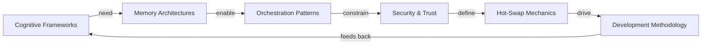

Reading the cycle:

- **Cognitive frameworks need memory architectures.** A Researcher's exploratory mode is impossible without semantic memory at the collective tier (else every research session re-discovers the same papers). A Diagnostic Engineer's diagnostic mode is impossible without episodic memory of past anomalies (the patterns library). The cognitive framework chooses *what kind of memory matters*; the memory architecture provides the substrate.
- **Memory architectures enable orchestration patterns.** Blackboard orchestration is *the* memory architecture pattern — the collective tier is a blackboard. Supervisor/worker is an episodic-memory pattern — the supervisor reconstitutes worker results from sub-Spirit transcripts. Peer-to-peer is an IAC pattern over private-and-shared memory at each peer.
- **Orchestration patterns constrain security.** Supervisor/worker requires sub-Spirit token-narrowing (no orchestration without security mechanism). Peer-to-peer requires consent gates (no orchestration without trust). The orchestration choice forces specific security mechanisms into existence.
- **Security defines hot-swap semantics.** Tokens are how a successor inherits work-in-progress. Posture changes are how a swap is audit-trailed. Without capability tokens, hot-swap would be either too dangerous (full transfer of authority with no granularity) or too useless (everything must be re-requested).
- **Hot-swap drives development methodology.** A new Spirit class must be tested *as a swap target* and *as a swap source*. Test pyramid layer 2 (integration) is where swap interactions get exercised. Without the swap mechanism, the methodology would be simpler — but also less expressive.
- **Methodology feeds back to cognitive frameworks via evaluation.** The eval suite, run repeatedly across Spirit versions, teaches us which cognitive patterns work for which classes. A Researcher whose hypothesis-mode generates better hypotheses over versions reflects cognitive-framework evolution, observed through methodology.

The six themes form a closed loop. Pulling on any one rewinds back through the others. This is intended: an architecture whose themes are independent isn't really an architecture, it's a list of features.

---

## Glossary

For first-time readers; defined the way I'd say them out loud.

**A2A** — Agent-to-Agent protocol. Cross-Host peer-to-peer communication. JSON-RPC over mTLS-secured HTTPS in MAOS. Originally Google-led; we use the `@a2a-js/sdk`-style semantics.

**ACP** — Agent Client Protocol. The protocol Zed and other editors use to launch and talk to agent processes. JSON-RPC over stdio for local agents. MAOS Spirits can speak ACP to be launched by Zed.

**Approval class** — One of six categories the kernel uses to decide whether a capability request needs a human prompt. From least sensitive to most: `readonly_scoped`, `readonly_search`, `mutating`, `exec_capable`, `control_plane`, `interactive`.

**Blackboard** — An orchestration pattern where Spirits coordinate through shared structured memory rather than through direct messages. Loom is a blackboard.

**Capability** — A typed action a Spirit can take (e.g., `bash.exec`, `provider.stream`, `mcp.call`). Mediated by the Capability Registry.

**Capability Token** — An unforgeable handle the kernel issues when a Spirit's capability request is approved. Bound to the Spirit, scope-limited, time-limited.

**Cognitive framework** — The Spirit's reasoning posture (anticipatory / exploratory / diagnostic / generative). Determined by the manifest, system prompt, and tool surface together; not chosen by the kernel.

**Collective tier** — Cross-Host memory, lives in Loom. Patterns, ADRs, fix templates, regression tests, archived incidents. The "team brain" that survives any individual Host.

**Compaction** — Summarization of old episodic memory to fit within an LLM context window. Strategy is per-Spirit; the kernel only enforces the tool_use/tool_result pairing invariant.

**Episodic memory** — Time-stamped log of specific events. Backed by JSONL transcripts and rollouts. Per-Spirit private; survives across LLM context resets.

**Hot-swap** — Replace one Spirit class instance with another at runtime, on the same Host, preserving capability tokens and (selectively) working memory.

**Host** — One OS process running the MAOS kernel. The unit of deployment.

**IAC** — Inter-Agent Communication. Same-Host: direct mailbox. Cross-Host: A2A.

**Kernel** — The seven invariant services (Spirit Scheduler, Memory Manager, Security Manager, I/O Subsystem, IAC Bus, Capability Registry, Telemetry Stream) that every Host exposes identically.

**Loom** — The user-space service that curates the collective tier — patterns, fix templates, ADR registry, cross-incident correlation. Originally from Journey 12's Cortex.

**Mailbox** — A bounded mpsc channel owned by a Spirit, addressable by `SpiritId`. The same-Host IAC primitive.

**Manifest** — The TOML/JSON file that declares a Spirit class: identity, role, model, memory scope, capability surface, posture, sandbox profile, lifecycle hooks.

**MCP** — Model Context Protocol. The protocol agents use to call tool servers. Three transports: stdio (local), Streamable HTTP (preferred remote), SSE (legacy remote).

**Memory.md** — The semantic memory file every Spirit's private tier includes by convention. Author-controlled. Loaded at start; written by the Spirit.

**Posture** — A Spirit's autonomy stance: which approval classes prompt, which are silent. Mutable at runtime within the manifest's ceiling.

**Procedural memory** — "How to" knowledge. Skills, slash commands, runbooks. Loaded at start; rarely written in real time.

**Semantic memory** — Fact-shaped knowledge. Project context, calendar, ADRs, patterns. Mostly shared/collective tier.

**Spirit** — A loaded, running agent. State = (Manifest + Cognitive State + Memory Pages + Posture + Capability Token Set).

**Spirit ABI** — The stable contract between kernel and Spirit. The hot-swappable seam. Versioned within a major kernel version.

**Spirit Wire Protocol** — The JSON-RPC dialect over stdio that subprocess Spirits use to talk to the kernel.

**Telemetry Stream** — The kernel-broadcast stream of all measurable Host events. Spirits subscribe with filters.

**Tier** — One of three memory scopes: private (one Spirit), shared (one Host), collective (cross-Host via Loom).

**TOFU** — Trust-on-First-Use. The pattern where a remote peer's certificate is accepted on first contact and pinned for future contacts. Used in MAOS A2A v1.0 in lieu of full PKI.

**Transparency Log** — The kernel-managed append-only audit log of every IAC interaction, every approval decision, every capability use, every retract. Personal to the user; not visible to peers.

**Working memory** — The active scratchpad — LLM context window, task state, open Capability Tokens. Per-Spirit. Lost on swap unless snapshotted.

---

## Appendix A — 12-Factor Alignment

The [12-Factor App](https://12factor.net/) methodology defined a set of disciplines for building scalable, maintainable web applications. The Gemini report (`_bmad-output/planning-artifacts/report-gemini.md` §"클라우드 네이티브와 12-요소 에이전트 원칙") argues that the 12-factor methodology applies — almost line-for-line — to multi-agent systems. This appendix maps each of the twelve factors to its MAOS realization, and flags the two places where MAOS deliberately reinterprets the original.

This is **descriptive**, not prescriptive: MAOS did not set out to be 12-factor-compliant; it became so by independent design. The mapping is useful as a sanity check for reviewers from web-app backgrounds — "yes, the discipline you know transfers."

| # | 12-Factor principle | MAOS realization | Cross-reference |
|---|---|---|---|
| 1 | **Codebase** — One codebase tracked in version control, many deploys | Spirit class = one manifest + one implementation crate, versioned. Many Hosts can deploy the same Spirit class. | Architecture §5.1 (Spirit Manifest), §11 (Deployment Topologies) |
| 2 | **Dependencies** — Explicitly declare and isolate | Spirit Manifest's `[capabilities.required]` and `[capabilities.optional]` are explicit, scope-bound, kernel-validated. Layer 1 vs Layer 2 boundary (architecture §4.6) prevents implicit-dependency drift. | Architecture §4.6, §5.1 |
| 3 | **Config** — Store config in environment | MAOS goes further: secrets via OS keychain or pluggable provider, never in env or files. Configuration via `[capabilities].*` scoped tokens, not env vars. | Architecture §4.3.4 (Secrets) |
| 4 | **Backing services** — Treat as attached resources | MCP servers are the canonical backing-service form. Provider drivers, sandbox backends, Loom — all interchangeable per environment. | Architecture §4.6 (Layer 2 capabilities), §9.3 (Loom) |
| 5 | **Build, release, run** — Strictly separate | Manifest validation at build (kernel schema check), release at registry publish, run at `lifecycle/load`. Three distinct phases; the kernel refuses runs that skip validation. | Architecture §4.1 (Spirit Scheduler), §13 (Roadmap, v0.5 lifecycle pipeline) |
| 6 | **Processes** — Stateless, share-nothing | **MAOS reinterprets.** Spirits are stateful (working memory, posture, open tokens), but persisted state lives outside the process (rollout JSONL, SQLite, Loom). Stateless-restart is a kernel guarantee (Invariant I10) even though the Spirit itself is logically stateful. **The discipline survives; the implementation differs.** | Architecture §3.2 (I10), §4.2 (Memory Manager) |
| 7 | **Port binding** — Self-contained services | Hosts bind their own ports (HTTP for control plane, A2A peer port, MCP client connections). Hosts are self-contained — no external web server needed to run a Host. | Architecture §4.4 (I/O Subsystem), §11 (Deployment Topologies) |
| 8 | **Concurrency** — Scale out via the process model | Two axes of horizontal scale: (a) more Spirits per Host (Spirit Scheduler), (b) more Hosts in A2A mesh. Both are kernel-supported; both compose. Cortex deployment (Journey 12) demonstrates the second axis at 28-Host scale. | Architecture §4.1 (Scheduler), §11.4 (Cortex Topology), §7.2 (A2A) |
| 9 | **Disposability** — Fast startup, graceful shutdown | Kernel cold-start measured in seconds (read journal, instantiate manifests, no network calls until first capability request). Graceful shutdown via `lifecycle/unload` + transcript flush + token release. Crash recovery via journal rehydration. | Architecture §4.1 (Spirit Scheduler), §3.2 (I10) |
| 10 | **Dev/prod parity** — Keep development, staging, production as similar as possible | Single-user laptop (§11.1) and Enterprise Cortex (§11.4) run **the same kernel binary** — only Spirit count, A2A configuration, and Loom presence differ. Sandbox tier T0 (laptop dev) and T3+T4 (production) are configuration, not code. | Architecture §11 (Deployment Topologies) |
| 11 | **Logs** — Treat logs as event streams | Telemetry Stream **is** an event-stream substrate. Spirits subscribe with filters; Observer Spirit aggregates; daily-rotated `traces.jsonl` for offline analysis; OpenTelemetry export for Enterprise. | Architecture §4.7 (Telemetry Stream) |
| 12 | **Admin processes** — Run admin tasks as one-off processes | `maosctl invoke <spirit>` for one-off Spirit invocation; `maosctl audit` for one-off log queries; `maosctl publish` for one-off Spirit-class registry pushes. Each is a fresh process against the same kernel. | Architecture §6.1 (Butler-as-Routing-Spirit recovery), §6.4 of Chapter 6 (Tooling — `maosctl`) |

### The two places MAOS reinterprets the original

**Factor 6 (Processes — Stateless).** The original 12-factor mandates stateless workers. MAOS Spirits are stateful by design — working memory, posture, open Capability Tokens are all in-process. The reinterpretation: *persisted state lives outside the process, even though the running process is stateful.* The kernel's journal-based recovery (Invariant I10) gives the same operational property — "any Spirit can be killed and restarted from durable state" — that pure statelessness provides for web workers. We pay the implementation cost of journal+rehydrate to get the design benefit of long-context Spirit reasoning.

**Factor 12 (Admin Processes).** The original 12-factor envisions admin tasks as one-off scripts. MAOS reinterprets: many admin tasks are *first-class Spirit invocations* — `maosctl invoke researcher --prompt "analyze this"` is a Spirit lifecycle event, not a script. The discipline (admin tasks should be scoped, audit-trailed, capability-bounded) carries over; the implementation is "spawn a short-lived Spirit," not "run a script outside the kernel." This is what makes admin operations auditable in the Transparency Log without needing a separate audit channel.

### What this mapping is not

- **Not a marketing claim.** Saying "MAOS is 12-factor compliant" invites unhelpful arguments about whether Factor 6 *really* counts. The mapping is for reviewers' orientation, not for procurement.
- **Not a constraint we'll defend forever.** If a future requirement (e.g., kernel-level shared working memory across Spirits, deferred to v2.0+ open question §14) breaks Factor 6's reinterpretation, we'll revisit. 12-factor is a starting discipline, not a prison.
- **Not exhaustive.** The 12-factor methodology has been extended (15-factor, beyond-12-factor) for cloud-native and serverless contexts. We track the original twelve and acknowledge the extensions exist.

---

## Closing

I wrote this report so a careful reader — a future contributor, a skeptical reviewer, a future LLM agent reading the corpus — can understand MAOS without having to derive the design from the architecture document. The architecture says **what we decided**; this report says **how we thought about it**. Both are true; both are needed.

If you find a place where the report's intuition disagrees with the architecture's prescription, the architecture wins. (I made the report from the architecture; the architecture is the source of truth.) But if you find a place where my explanation is clearer than the architecture's, please port the explanation up. Documentation that earns its readers' time is documentation that gets read.

Six chapters, three Spirits-yet-to-come, one closing loop. The substrate hosts what we have; the substrate welcomes what we don't yet imagine; the substrate stays small while the Spirits grow.

That's the design.

— *Paige*
