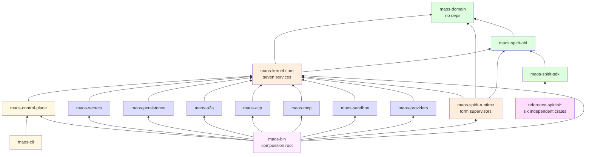
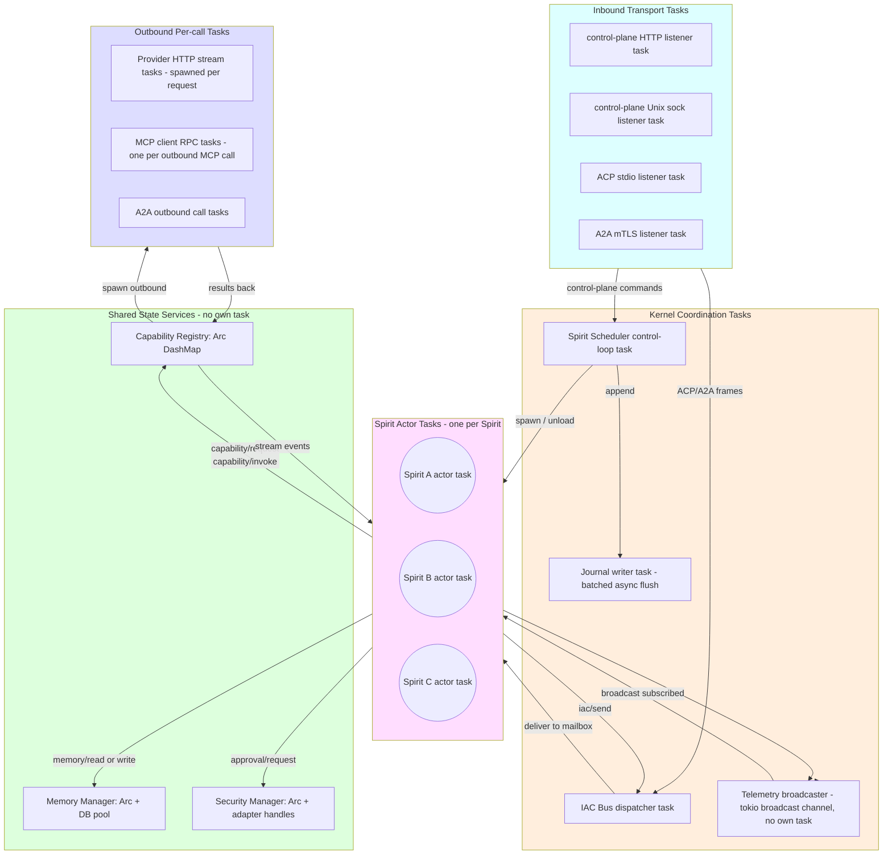
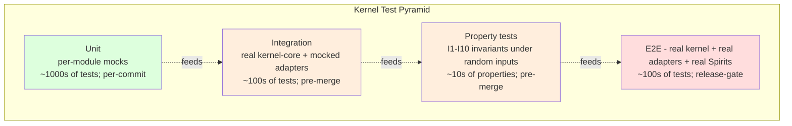

# MAOS — Kernel Implementation Guide

> **A note from your writer.** This document is for the people writing the kernel — the Rust+Tokio code inside the `maos` binary. It is **not** for Spirit authors (read `spirit-development-and-sharing.md` for that), and it is **not** the architectural decision source (read `architecture-maos.md`). It is the bridge between architecture and code: which crates exist, what each one owns, how they fit together, and what runs as a Tokio task vs what lives as shared state.
>
> If you're about to type your first `cargo new` for a MAOS crate, this is the doc you want next to your editor.

---

## Read order before you start coding

You should already have absorbed three documents before you read this one. They form a strict prerequisite chain:

1. **`architecture-maos.md` §3 (Vocabulary & Invariants) and §4.0 (Kernel Internal Architecture)** — the source of truth for what the kernel is and isn't. Especially Invariants I1–I10 and the three-band layout. Without these, this guide reads as arbitrary structure choices.
2. **`architecture-maos.md` §4.1–§4.7** — the seven kernel services and their responsibilities. This guide assumes you can answer "what does the Capability Registry do?" without flipping back.
3. **`maos-design-report.md` Chapter 5 (Modularity & Hot-Swap)** — the conceptual companion that explains *why* the actor model and lifecycle states are shaped the way they are.

Once you've absorbed those, the architectural decisions in **ADR-001 through ADR-011** in `architecture-maos.md` §12 give you the ten-point summary of what we committed to and what we'd revisit. ADR-001 (Rust+Tokio), ADR-010 (hexagonal), and ADR-011 (actor model) are the most load-bearing for this guide.

This guide is organized so a reader can land on it cold and find the section they need. If you want to know what's in `maos-domain` and how it's tested, jump to §5.1. If you want to understand the full task topology, jump to §6.

Visual conventions:

- **Mermaid diagrams** show static dependencies and runtime topology — they should also read clearly as text.
- **`toml` and `rust` blocks** are skeletons, not implementations. Don't paste them as-is; they're shape references.
- **"Hot path"** marks code that runs on every Spirit→world interaction and deserves performance attention.
- **"Cold path"** marks code that runs at lifecycle transitions or operator commands; correctness over speed.

---

## §1 The crate inventory

The kernel is a **Cargo workspace** with 15 first-class crates plus 6 reference-Spirit crates. The structure mirrors the three-band hexagonal layout from architecture §4.0.2 — domain core innermost, kernel services in the middle, adapter ring outermost, plus the runtime, control plane, CLI, and binary.

```
maos/                                   # Cargo workspace root
├── Cargo.toml                          # workspace manifest
├── wit/spirit.wit                      # WIT contract (v2.0)
└── crates/
    │
    ├── maos-domain/                    #  1. Domain core — pure types, no I/O
    │
    ├── maos-spirit-abi/                #  2. ABI: traits + wire schemas
    ├── maos-spirit-sdk/                #  3. SDK Spirit authors depend on
    │
    ├── maos-kernel-core/               #  4. Kernel services (the seven, sub-modules)
    ├── maos-spirit-runtime/            #  5. Spirit form supervisors (in-proc, subprocess, wasm)
    │
    ├── maos-providers/                 #  6. Provider drivers (feature-gated per provider)
    ├── maos-sandbox/                   #  7. Sandbox backends (feature-gated per OS)
    ├── maos-mcp/                       #  8. MCP client (stdio + SSE + StreamableHTTP)
    ├── maos-acp/                       #  9. ACP server (stdio JSON-RPC)
    ├── maos-a2a/                       # 10. A2A peer (mTLS + TOFU + per-frame consent)
    ├── maos-persistence/               # 11. SQLite + Postgres (feature-gated)
    ├── maos-secrets/                   # 12. Keyring + encrypted-file (feature-gated)
    │
    ├── maos-control-plane/             # 13. Operator surface (HTTP + Unix socket)
    ├── maos-cli/                       # 14. `maosctl`
    ├── maos-bin/                       # 15. Composition root — the `maos` binary
    │
    └── reference-spirits/              # 16-21. The six factory-default Spirits
        ├── spirit-architect/
        ├── spirit-butler/
        ├── spirit-researcher/
        ├── spirit-observer/
        ├── spirit-diagnostic-engineer/
        └── spirit-enterprise/
```

### Why this granularity

I considered three alternatives and rejected each:

- **One mega-crate.** Compiles fastest, easy to refactor, but loses the layered-dependency invariant the architecture relies on. The compiler can't enforce that the domain core has no I/O if everything's in one crate. **Rejected.**
- **One crate per service per band.** Maximally granular (~40 crates). Compiler enforces every invariant. But the build graph becomes painful for new contributors and `cargo build` becomes slow on cold caches. **Rejected as overkill.**
- **The 15-crate structure above.** Bands are crate boundaries (domain / abi / kernel-core / runtime / adapters / control-plane / cli / bin). Adapters are split by *port* (one crate per port type), not by implementation (multiple impls per port live behind feature flags inside the port crate). **Recommended.**

The feature-flag-per-implementation approach keeps cold-build dependency closures small. A v0.1 build that only needs Anthropic + Linux sandbox + SQLite + keyring compiles roughly seven crates' worth of dependencies — a few hundred crates total via Cargo.lock — not the full multi-vendor SDK universe.

---

## §2 Dependency graph and build order

### §2.1 The dependency graph



**Key invariants the dependency graph enforces:**

- `maos-domain` has zero deps. No `tokio`, no `reqwest`, no `serde_json` even (use `serde` only). This forces I/O-free domain types — the compiler's enforcement of Invariant I9.
- `maos-spirit-abi` is the *only* crate both kernel and Spirits depend on transitively. It's the API boundary; treat it like a stable public interface.
- Adapter crates (blue) implement traits defined in `maos-kernel-core`. They depend *up* into kernel-core, not the reverse. This is the hexagonal "ports defined by the inner ring, adapters by the outer" rule made structural.
- `maos-bin` is the only crate that knows about everything. Composition lives there; nowhere else.
- Reference Spirits depend only on `maos-spirit-sdk` — never on the kernel directly. This proves the SDK boundary is right.

### §2.2 Build order (cold cache)

When `cargo build` starts from a cold target directory, the topological order is:

```
Tier 1:  maos-domain
Tier 2:  maos-spirit-abi
Tier 3:  maos-spirit-sdk          maos-kernel-core
Tier 4:  reference-spirits/*      maos-spirit-runtime
                                  maos-providers, maos-sandbox, maos-mcp,
                                  maos-acp, maos-a2a, maos-persistence,
                                  maos-secrets
Tier 5:                           maos-control-plane
Tier 6:                           maos-cli
Tier 7:                           maos-bin
```

Tier-3 onward parallelizes naturally — Cargo discovers it. The slow tier is **Tier 4 adapters**, because they have heavy external dependencies (HTTP libraries, sandbox bindings). On a cold build, expect ~60% of compilation time to live there.

### §2.3 Build order during development

For day-to-day work, you only rebuild what changed:

| Working on | Crates that recompile |
|---|---|
| Domain types or invariants | everything (rare; should be slow on purpose, signal of a major change) |
| Spirit ABI | spirit-sdk, kernel-core, spirit-runtime, all reference Spirits, bin |
| Spirit SDK only | reference Spirits, bin |
| One kernel-core service | spirit-runtime, control-plane, bin |
| One adapter | bin only |
| Control plane | cli, bin |
| One reference Spirit | bin only (other Spirits unaffected) |
| Composition (bin) | bin only |

This is the normal Rust workspace experience. Plan PRs and refactors so the rebuild closure stays small.

### §2.4 Phased build plan (mapping to architecture §13)

Not all crates ship at once. The architecture's phased roadmap maps to this build plan:

**v0.1 — Bootstrap (minimum viable kernel):**

| Crate | Status | Notes |
|---|---|---|
| `maos-domain` | full | the foundation; can't skip |
| `maos-spirit-abi` | full | the contract; can't skip |
| `maos-spirit-sdk` | full | needed for the Architect Spirit |
| `maos-kernel-core` | scheduler + memory + iac + capability_registry + telemetry; security stub; io minimal | the seven services; some functionally minimal in v0.1 |
| `maos-spirit-runtime` | rust-inproc only | subprocess and wasm deferred |
| `maos-providers` | Anthropic only (`anthropic` feature) | other providers deferred |
| `maos-sandbox` | T0/T1 only (no real OS-native sandbox) | T2/T3 deferred to v0.5 |
| `maos-mcp` | basic stdio client | for tool-server smoke tests |
| `maos-persistence` | SQLite only | Postgres deferred to v2.0 |
| `maos-secrets` | keyring only | encrypted-file deferred to v0.5 |
| `maos-control-plane` | HTTP only | Unix socket deferred to v0.5 |
| `maos-cli` | full | needed to drive the kernel |
| `maos-bin` | wires the above | the binary |
| `spirit-architect` | full | the validation milestone |

That's 14 crates worth of work for v0.1. Realistic for one focused implementer or a small team.

**v0.5 adds:**

- T2/T3 sandbox in `maos-sandbox` (Linux: bwrap+Landlock+seccomp; macOS: Seatbelt; Windows: restricted-token)
- Five more reference Spirits — Butler, Researcher, Observer, Diagnostic Engineer (sketched), Enterprise (stub)
- Approval Manager UX in `maos-kernel-core::security::approval`
- Transparency Log persistence in `maos-persistence::transparency_log`
- `maos-secrets` encrypted-file backend
- `maos-control-plane` Unix socket

**v1.0 adds:**

- `maos-spirit-runtime::subprocess` — first third-party-shippable Spirit form
- `maos-a2a` — peer mesh with mTLS + TOFU + per-frame consent
- `maos-acp` — editor-bridged Spirit invocation
- T4 WASM **tool** sandbox in `maos-sandbox` (tools, not Spirits yet)
- All six reference Spirits in production-ready form
- Kernel-rendered notification surface

**v1.5 adds:**

- Diagnostic Engineer with full asymmetric capability gates and per-tag epistemic policy
- Loom-lite (single-instance Postgres-backed pattern library; itself an MCP server, not a kernel module)
- `maos-persistence` Postgres support (used by Loom-lite)

**v2.0 adds:**

- `maos-spirit-runtime::wasm` — the third Spirit form
- The Spirit registry as an MCP server (decision per ADR-008; the kernel's `maos-mcp` already handles it)
- WIT contract for `maos:spirit@1.0`
- Enterprise Spirit with PDP integration
- Multi-instance Loom with cross-region replication
- More providers in `maos-providers` (OpenAI, Google, Bedrock, etc.)

The phasing respects ADR-007's commitment: the three Spirit forms appear at v0.1 / v1.0 / v2.0 respectively.

---

## §3 Per-crate guide (the foundation tier)

This section walks each crate. For each, you'll find: purpose, public API surface, dependency budget, internal modules, test strategy, hot-path/cold-path notes, and v-phase status. Skim until you find the crate you're starting on; read that one carefully.

### §3.1 `maos-domain` — the foundation

**Purpose.** Pure types and invariants. The innermost band of the hexagonal layout. **No async runtime, no I/O, no HTTP, no database** — those are out of scope here, enforced by zero dependencies on `tokio`, `reqwest`, or `sqlx`.

**Public API surface (representative):**

```rust
// crates/maos-domain/src/lib.rs (skeleton)

pub mod spirit;
pub mod capability;
pub mod manifest;
pub mod frame;
pub mod posture;
pub mod invariants;

pub use spirit::{SpiritId, SpiritState, SpiritControlBlock};
pub use capability::{Capability, CapabilityScope, CapabilityToken, TokenId};
pub use manifest::{Manifest, ManifestError, validate};
pub use frame::{IacFrame, FrameId, FrameKind, FrameOrigin, Recipient};
pub use posture::{PostureName, ApprovalClass, ApprovalAction};
```

**Dependency budget:**

```toml
[dependencies]
serde = { version = "1", features = ["derive"] }
thiserror = "1"
# That's it. No tokio, no async, no I/O.
```

**Internal modules:**

- `spirit.rs` — `SpiritId` (newtype around UUID), `SpiritState` (enum: Loaded, Started, Running, AwaitingApproval, EpistemicHalt, Suspended, Migrating, Snapshotted, Unloaded), `SpiritControlBlock` (the OS-style PCB analog).
- `capability.rs` — the closed `Capability` enum (Layer-1 only; per ADR-007), `CapabilityScope`, `CapabilityToken`, `TokenId` (unguessable 128-bit).
- `manifest.rs` — TOML schema types matching architecture §5.1, plus `validate(manifest) → Result<(), ManifestError>`.
- `frame.rs` — `IacFrame` shape, `FrameKind` (closed enum: Request, Response, Notification, Escalation, Retract), `FrameOrigin`, `Recipient` (SpiritId | RoleQuery | Broadcast).
- `posture.rs` — `PostureName`, the six `ApprovalClass` variants, the five `ApprovalAction` variants.
- `invariants.rs` — Compile-time and runtime checks for I1–I10. For example, `IacFrame::new()` is the only constructor and it always sets `id`; the Transparency Log writer takes a `FrameSealed` newtype that proves logging happened.

**Test strategy:**

- **Unit tests** for every type's serde round-trip (TOML → struct → TOML).
- **Property tests** (proptest crate) for invariants — `every IacFrame::id is unique within a session`, `every CapabilityToken's expires_at is in the future at issuance time`, etc. Property tests catch the cases hand-written tests miss.
- **No integration tests** — this crate has no I/O to integrate with.

**Hot/cold path:**

- All cold path. Domain types are constructed once at lifecycle transitions, used many times via reference. No allocation-sensitive code lives here.

**v-phase status:** Full from v0.1. Zero deferred.

### §3.2 `maos-spirit-abi` — the contract

**Purpose.** Define the contract both kernel and Spirits depend on. Two surfaces: the in-process Rust trait (for `rust-inproc` Spirits) and the wire schema (for `subprocess` Spirits, JSON-RPC over stdio per architecture §5.2).

**Public API surface:**

```rust
// crates/maos-spirit-abi/src/lib.rs

pub mod trait_def;        // for rust-inproc form
pub mod wire;             // for subprocess form
pub mod handle;           // SpiritHandle (kernel→Spirit + Spirit→kernel calls, abstract)

pub use trait_def::Spirit;
pub use wire::{KernelToSpirit, SpiritToKernel, WireMessage};
pub use handle::SpiritHandle;
```

```rust
// crates/maos-spirit-abi/src/trait_def.rs (skeleton)

#[async_trait::async_trait]
pub trait Spirit: Send + 'static {
    async fn on_load(&mut self, handle: SpiritHandle) -> Result<(), Error>;
    async fn on_start(&mut self, snapshot: Option<Vec<u8>>) -> Result<(), Error>;
    async fn on_frame(&mut self, frame: IacFrame) -> Result<(), Error>;
    async fn on_telemetry(&mut self, event: TelemetryEvent) -> Result<(), Error>;
    async fn on_idle(&mut self) -> Result<(), Error>;
    async fn on_swap_in(&mut self, predecessor_state: Option<Vec<u8>>) -> Result<(), Error>;
    async fn snapshot(&mut self) -> Result<Vec<u8>, Error>;
    async fn epistemic_resolve(&mut self, halt_id: HaltId, resolution: Resolution) -> Result<(), Error>;
    async fn on_pause(&mut self) -> Result<(), Error>;
    async fn on_resume(&mut self) -> Result<(), Error>;
    async fn on_unload(&mut self) -> Result<(), Error>;
}
```

**Dependency budget:**

```toml
[dependencies]
maos-domain = { path = "../maos-domain" }
async-trait = "0.1"
serde = { version = "1", features = ["derive"] }
serde_json = "1"
thiserror = "1"
```

`async-trait` is unavoidable for trait objects with async methods. `serde_json` is for the wire layer.

**Internal modules:**

- `trait_def.rs` — the `Spirit` trait above.
- `wire.rs` — message envelopes for the JSON-RPC dialect; one struct per method, serde-deriving JSON.
- `handle.rs` — `SpiritHandle` is the Spirit→kernel API. In v0.1 it holds an `Arc<dyn KernelHandle>` so the kernel can implement it; the Spirit author sees only the trait methods.

**Test strategy:**

- **Unit tests** for wire-schema serialization round-trips. Every method has a "test_serializes" and "test_deserializes" pair.
- **Property tests** for ABI compatibility — manifests with random valid fields must validate; manifests with random invalid fields must not.
- **No integration tests** — that's the SDK's job.

**Hot/cold path:**

- The `Spirit` trait methods are called per-event; the wire serialization (subprocess form) is hot path.

**v-phase status:** Full from v0.1. The wire surface for `subprocess` exists in the type definitions but isn't *used* until v1.0 ships subprocess Spirits.

**ABI additions for the distillation pattern (ADR-013, ADR-014, ADR-015).** The `SpiritHandle` (Spirit→kernel API) gains two new methods plus a kernel-side hook:

```rust
#[async_trait::async_trait]
pub trait KernelHandle: Send + Sync {
    // ... existing methods (capability invocation, IAC send, fs.read, fs.write, memory.share, etc.)

    // ADR-013: kernel-mediated Transparency Log recall, scoped to participant frames.
    async fn log_recall(&self, filter: LogFilter, limit: usize, cursor: Option<Cursor>)
        -> Result<LogRecallPage, Error>;
    async fn log_fetch(&self, frame_id: FrameId) -> Result<FramePayload, Error>;
}

pub struct LogFilter {
    pub since: Option<Timestamp>,
    pub until: Option<Timestamp>,
    pub kind: Option<FrameKind>,           // e.g., task_complete, halt, decision
    pub peer: Option<PeerIdentity>,
    pub addressed_to_role: Option<Role>,
}

pub struct LogRecallPage {
    pub headers: Vec<FrameHeader>,         // payloads fetched on demand
    pub next_cursor: Option<Cursor>,
}
```

Headers carry `frame_id`, timestamps, sender, receiver, kind, and `source_log_ref` if the frame is itself a digest. Payloads are fetched on demand via `log_fetch` to keep Spirit context windows small.

**ADR-014 / I11 enforcement is kernel-side.** When a Spirit calls existing `fs.write` (private tier) or `memory.share` (shared/collective tier) with a payload tagged `kind: digest`, the Capability Registry's enforcement layer validates that `source_log_ref` is non-empty and `distillation_depth` is present and monotonic. Rejection is a typed error `EDigestAuditChainMissing` — Spirit retries with the missing fields populated. No new ABI verb; the existing memory writes carry the new validation.

**ADR-015 / I12 enforcement is kernel-side.** When a Spirit emits any frame typed `decision.*` (consent, halt, dispatch, task.assign, task.complete) via the IAC bus, the Capability Registry attaches `working_memory_digest_refs` populated from the Spirit's declared in-context digests (tracked by the registry as a side-effect of `log_recall` calls). The Spirit's behavior code sees nothing new; the kernel does the bookkeeping.

### §3.3 `maos-spirit-sdk` — what Spirit authors depend on

**Purpose.** Re-exports the ABI plus convenience: the `runSpirit()` / `declare_spirit!()` macros, the `spirit-test` harness for unit testing, and ergonomic wrappers around the wire protocol.

**This is the only crate Spirit authors should ever depend on.** It re-exports the ABI types they need; it provides the harness library; it's published to crates.io independently.

**Public API surface:**

```rust
// crates/maos-spirit-sdk/src/lib.rs

pub use maos_spirit_abi::{Spirit, SpiritHandle, IacFrame, Capability, ...};

#[macro_export]
macro_rules! declare_spirit {
    ($t:ty) => { /* generates the C-style entry the kernel looks for in rust-inproc Spirits */ };
}

pub fn run_spirit<S: Spirit + Default>() -> ! {
    // For subprocess Spirits: the JSON-RPC stdio loop.
    // Reads from stdin, dispatches to S, writes to stdout.
}

pub mod test {
    pub struct SpiritTestHarness<S: Spirit> { /* mocks Spirit ABI */ }
    impl<S: Spirit> SpiritTestHarness<S> {
        pub fn new() -> Self;
        pub fn mock_capability(&mut self, cap: Capability, args: Value, response: Value);
        pub async fn send_frame(&mut self, frame: IacFrame) -> IacFrame;
        // ... more mocks
    }
}
```

**Dependency budget:**

```toml
[dependencies]
maos-spirit-abi = { path = "../maos-spirit-abi" }
maos-domain = { path = "../maos-domain" }
async-trait = "0.1"
tokio = { version = "1", features = ["macros", "rt"] }   # for the subprocess stdio loop
serde_json = "1"
```

**Internal modules:**

- `lib.rs` — re-exports + the `declare_spirit!` macro.
- `runtime.rs` — `run_spirit()` for subprocess.
- `test.rs` — `SpiritTestHarness` + mocks.

**Test strategy:**

- **Unit tests** for the test harness itself (yes — mocking the harness, recursively).
- **Integration tests** that load a tiny sample Spirit through the harness and verify behavior.
- **Doctest examples** — every public API has a runnable doc example.

**Hot/cold path:**

- The subprocess stdio loop is hot path; the harness is cold (test-time only).

**v-phase status:** Full from v0.1. The test harness must work day one — every kernel implementer also wants to use it.

---

## §4 Per-crate guide (the kernel core and runtime tier)

### §4.1 `maos-kernel-core` — the seven services

**Purpose.** The middle band of the hexagonal layout. Implements all seven kernel services as submodules. This is the bulk of the kernel logic.

**Module layout:**

```
crates/maos-kernel-core/src/
├── lib.rs                            # public API surface
├── scheduler/
│   ├── mod.rs                        # SpiritScheduler service
│   ├── journal.rs                    # I10: append-only lifecycle journal
│   ├── lifecycle.rs                  # state transitions, FSM enforcement
│   └── budget.rs                     # per-Spirit token/dollar/parallelism accounting
├── memory/
│   ├── mod.rs                        # MemoryManager service
│   ├── tier.rs                       # private/shared/collective dispatch
│   ├── compaction.rs                 # tool_use/tool_result pairing-integrity guard
│   └── archive.rs                    # swap-out archival to disk
├── security/
│   ├── mod.rs                        # SecurityManager service
│   ├── sandbox.rs                    # T0–T4 profile binding + Spirit-load refuse
│   ├── approval.rs                   # ApprovalManager (synchronous user-facing surface)
│   ├── trust_tier.rs                 # ADR-009: the strictest-of rule
│   └── secrets.rs                    # JIT secret materialization (no storage)
├── io/
│   ├── mod.rs                        # I/O Subsystem
│   ├── inbound.rs                    # receives from control plane, ACP, A2A, browser
│   ├── outbound.rs                   # dispatches to providers, MCP, A2A peers
│   └── streams.rs                    # tokio::sync::broadcast / mpsc primitives wrappers
├── iac/
│   ├── mod.rs                        # IAC Bus
│   ├── mailbox.rs                    # per-Spirit mpsc inbox
│   ├── transparency_log.rs           # I2: log before deliver
│   ├── log_recall.rs                 # ADR-013: kernel-mediated participant-scoped recall
│   └── retract.rs                    # the retract primitive
├── capability_registry/
│   ├── mod.rs                        # Capability Registry
│   ├── token.rs                      # issuance, scoping, expiry, freeze
│   ├── enforcement.rs                # output_shape, explanation_shape, epistemic_policy
│   ├── digest_audit_chain.rs         # I11: validate source_log_ref + distillation_depth on memory writes
│   ├── working_memory_refs.rs        # I12: track per-Spirit in-context digests; attach refs to decision frames
│   ├── adapter_dispatch.rs           # routes to the adapter ring
│   └── decision_log.rs               # Approval Decision Log
└── telemetry/
    ├── mod.rs                        # Telemetry Stream
    ├── topics.rs                     # typed topic registry
    └── subscriber.rs                 # filtered subscription matching
```

**Dependency budget:**

```toml
[dependencies]
maos-domain = { path = "../maos-domain" }
maos-spirit-abi = { path = "../maos-spirit-abi" }

tokio = { version = "1", features = ["full"] }
tokio-stream = "0.1"
async-trait = "0.1"
serde = { version = "1", features = ["derive"] }
serde_json = "1"
thiserror = "1"
tracing = "0.1"
arc-swap = "1"          # for hot-swap of provider drivers (rustain pattern)
dashmap = "6"           # sharded lock-free map for token storage
parking_lot = "0.12"    # faster RwLock for cold-path shared state
uuid = { version = "1", features = ["v4"] }
```

**Note:** `maos-kernel-core` does *not* depend on any adapter crate. Adapters depend on `maos-kernel-core` (they implement traits defined here). This is the hexagonal port-defined-by-inner-ring rule.

**Service-by-service detail:**

#### Scheduler (`scheduler/`)

- **State:** `Arc<DashMap<SpiritId, SpiritControlBlock>>`, journal handle, resource budgets per Spirit.
- **Tasks:** one async control-loop task per Host (listens for control-plane commands like Load/Swap/Unload).
- **Hot path:** `journal.append(transition)` on every state transition. Must be fast (sub-millisecond) — append-only writer with a small ring buffer flushed in background.
- **Cold path:** budget enforcement (checked on every capability request, but cheap — just integer increments).
- **Trickiest piece:** swap. State blob handoff + token freeze + memory archive + successor instantiation, all atomic.

#### Memory Manager (`memory/`)

- **State:** `Arc<dyn PersistenceBackend>` (trait from this crate; implemented by `maos-persistence`), per-Spirit memory namespaces.
- **Tasks:** none of its own. Operations run inline in the calling task; database I/O via the persistence backend's task pool.
- **Hot path:** `read(tier, key)` and `write(tier, key, value)`. Cache hot keys in-memory (LRU bounded). On `write`, if the payload is tagged `kind: digest`, defer to `capability_registry::digest_audit_chain::validate` (I11) before persisting; reject with `EDigestAuditChainMissing` if `source_log_ref` is missing/empty or `distillation_depth` is missing.
- **Cold path:** compaction (fires asynchronously when transcript exceeds threshold).
- **Trickiest piece:** the tool_use/tool_result pairing-integrity guard during compaction. Get this wrong and Spirits regress confusingly. The I11 enforcement is structurally simple (field presence + non-emptiness + type check) and pattern-agnostic — it must NOT inspect digest content.

#### Security Manager (`security/`)

- **State:** sandbox profile registry, approval policy per Spirit, secret store handle.
- **Tasks:** Approval Manager runs as one task that owns the prompt-to-user channel.
- **Hot path:** posture lookup + approval-class classification on every capability request. Should be O(1) — `Arc<HashMap<SpiritId, Posture>>` with read-only after Spirit load.
- **Cold path:** sandbox profile binding (once per Spirit load); secret materialization (rare).
- **Trickiest piece:** the strictest-of (manifest, trust-tier) enforcement (ADR-009). One bug here, and a public-untrusted Spirit gets autonomous posture.

#### I/O Subsystem (`io/`)

- **State:** transport task handles, broadcast channel for events.
- **Tasks:** one inbound listener per transport (HTTP, Unix sock, ACP stdio, A2A). Outbound calls are spawned per request.
- **Hot path:** outbound call dispatch — most goes through the adapter ring; this layer just routes and logs.
- **Cold path:** transport setup at Host start.
- **Trickiest piece:** error propagation across transport boundaries. An adapter HTTP failure must surface as a typed `CapabilityError` to the calling Spirit, not as a panic.

#### IAC Bus (`iac/`)

- **State:** per-Spirit mailbox handles (`tokio::sync::mpsc::Sender<IacFrame>`), Transparency Log writer, per-Spirit recall-cursor cache.
- **Tasks:** one IAC dispatcher task per Host. Receives outbound frames, routes to recipient mailboxes, writes the Transparency Log entry **before** delivery (Invariant I2). One recall service that handles `log_recall` / `log_fetch` requests (ADR-013).
- **Hot path:** `iac/send` from any Spirit. Must be: log-before-deliver, FIFO per (sender, recipient), bounded-mailbox-backpressure on full.
- **Cold path:** retract; `log_recall` queries (themselves logged as `log.recall` IAC frames per ADR-013, producing the recall-of-recall chain).
- **Trickiest piece:** the log-before-deliver guarantee. If we deliver and then the log write fails, Invariant I2 is broken. Implement as: log first (sync write to a memory buffer; durable batched flush), then deliver. If the log write panics, kernel panics — better than silent log loss. For `log_recall`, the participant-scoping filter must validate ADR-012 typed-intent consent envelopes for A2A frames (omit frames whose consent didn't permit participant-recall; elide payloads of header-only-recall frames).

#### Capability Registry (`capability_registry/`)

- **State:** `Arc<DashMap<TokenId, CapabilityToken>>` (sharded, lock-free reads), per-Spirit manifest scope handles, adapter dispatch table, per-Spirit working-memory digest-ref set (I12 — populated as a side-effect of `log_recall` calls, evicted on context-window pressure or explicit Spirit clear).
- **Tasks:** none of its own — operations run inline in the calling Spirit's task.
- **Hot path:** *everything*. Token issuance, scope validation, posture lookup, approval classification, adapter dispatch. Performance attention concentrates here.
- **Cold path:** Approval Decision Log writes (batched async); I11 audit-chain validation on memory writes (`digest_audit_chain::validate` checks `source_log_ref` non-emptiness and `distillation_depth` presence on payloads tagged `kind: digest`); I12 decision-context attachment (on emit of any `decision.*`-typed frame, attach `working_memory_digest_refs` from the per-Spirit set).
- **Trickiest piece:** the enforcement layer for `output_shape`, `explanation_shape`, and `epistemic_policy` predicates. Must be cheap on the success path (predicate matched → emit immediately) and clear on the failure path (predicate failed → typed error to Spirit). I11 / I12 enforcement is structural and cheap by design (no content inspection), but the I12 working-memory-refs tracking must be careful about eviction policy — too aggressive and decision-context becomes lossy; too retentive and the set grows unbounded. v0.1 default: track up to 256 refs per Spirit; LRU eviction; emit telemetry when eviction happens.

#### Telemetry Stream (`telemetry/`)

- **State:** `tokio::sync::broadcast::Sender<TelemetryEvent>`, topic registry.
- **Tasks:** none. Pure broadcast channel — sender writes, receivers filter.
- **Hot path:** the broadcast `send` itself; sub-microsecond.
- **Cold path:** subscriber registration.
- **Trickiest piece:** lagged subscribers. Tokio broadcast has a configurable channel size; if a subscriber is slow, it will receive `RecvError::Lagged(n)` indicating skipped events. Handle this gracefully — log and continue, don't kill the kernel.

**Test strategy across `maos-kernel-core`:**

- **Per-service unit tests:** mock all dependencies (adapters, persistence, transports). Test each service's contract independently. Each submodule's `mod.rs` has a sibling `tests/` directory.
- **Cross-service integration tests:** real Capability Registry + real Memory Manager + real IAC Bus + mocked adapters. Test invariants across services (I1: every world-touching operation hits the registry; I2: every IAC frame is logged before delivery; I10: every lifecycle transition is journaled).
- **Property tests:** I1-I10 expressed as proptest properties. Random capability requests; assert audit log invariants hold.
- **Benchmarks (Criterion):** capability token issuance latency, IAC frame delivery throughput, telemetry broadcast fan-out scale. These are the hot-path numbers we must defend.

**v-phase status:** Full from v0.1, but with stubs for what isn't wired yet (e.g., A2A inbound is a stub in v0.1; subprocess Spirit dispatch in `capability_registry::adapter_dispatch` is stubbed until v1.0).

### §4.2 `maos-spirit-runtime` — Spirit form supervisors

**Purpose.** Per-form supervisors that instantiate, supervise, and clean up Spirits. Three implementations, one per Spirit form (architecture §3 in the development guide).

**Module layout:**

```
crates/maos-spirit-runtime/src/
├── lib.rs                # public API: SpiritSupervisor trait
├── inproc.rs             # rust-inproc supervisor (function-pointer dispatch)
├── subprocess.rs         # subprocess supervisor (stdio JSON-RPC pump)
├── wasm.rs               # wasm-component supervisor (Wasmtime + WIT, v2.0)
└── supervision.rs        # Tokio task supervision; panic-catching; crash recovery hooks
```

**Public API surface:**

```rust
pub trait SpiritSupervisor: Send + Sync {
    async fn instantiate(&self, manifest: &Manifest) -> Result<SpiritActor, Error>;
    async fn unload(&self, spirit_id: SpiritId) -> Result<(), Error>;
}

pub struct SpiritActor {
    pub id: SpiritId,
    pub inbox: mpsc::Sender<IacFrame>,
    pub task_handle: JoinHandle<()>,    // supervised; panic-catching wrapped
    pub state: Arc<RwLock<SpiritState>>,
}
```

**Dependency budget:**

```toml
[dependencies]
maos-domain = { path = "../maos-domain" }
maos-spirit-abi = { path = "../maos-spirit-abi" }
maos-kernel-core = { path = "../maos-kernel-core" }

tokio = { version = "1", features = ["full"] }
async-trait = "0.1"
thiserror = "1"
tracing = "0.1"

# v0.1+: rust-inproc only
# v1.0+: add subprocess support
serde_json = "1"
# v2.0+: add wasm-component support
# wasmtime = { version = "...", optional = true, features = ["component-model"] }
# wasmtime-wasi = { version = "...", optional = true }

[features]
default = ["inproc"]
inproc = []
subprocess = []          # v1.0
wasm = []                # v2.0
```

**Tasks:** one Tokio task per Spirit. The task runs the actor loop: read inbox → dispatch to Spirit handler → repeat. Wrapped in a panic-catching supervisor that converts panic into a `Spirit::Crashed` lifecycle event journaled by the Scheduler.

**Test strategy:**

- **Per-form unit tests:** mock kernel handle; instantiate Spirit; send synthetic frames; verify behavior.
- **Integration tests:** load → start → frame → unload lifecycle for each form. Subprocess form additionally tests subprocess crash recovery (kill the child; verify the supervisor detects it and respawns from the journal).

**Hot/cold path:** the actor loop is hot path. Inbox dispatch, frame deserialization (subprocess form), behavior method invocation — all sub-microsecond per iteration on common hardware.

**v-phase status:** v0.1 ships `inproc` only. v1.0 adds `subprocess`. v2.0 adds `wasm`. The trait is stable from v0.1; new variants don't break old ones.

---

## §5 Per-crate guide (the adapter tier)

Adapter crates implement port traits defined in `maos-kernel-core`. Each crate is independent of the others — they only share `maos-kernel-core` as a dependency. This makes them parallel-developable.

For brevity I'll cover the structure pattern once (it's the same shape across all adapters) and then list the per-adapter specifics.

### §5.1 The adapter crate pattern

Every adapter crate looks like this:

```
crates/maos-{adapter}/src/
├── lib.rs                 # `pub use` of impl(s); register fn that hooks into the kernel
├── trait_impl.rs          # implements the port trait from maos-kernel-core
└── (specific modules per adapter)
```

```rust
// crates/maos-{adapter}/src/lib.rs (skeleton)

use maos_kernel_core::ports::{SomePort, SomePortError};

pub struct ConcreteAdapter { /* ... */ }

#[async_trait::async_trait]
impl SomePort for ConcreteAdapter {
    async fn do_thing(&self, args: Args) -> Result<Output, SomePortError> {
        // ...
    }
}

pub fn register(registry: &mut PortRegistry) {
    registry.register(Arc::new(ConcreteAdapter::new()));
}
```

The `register()` function is what `maos-bin` calls during composition.

### §5.2 `maos-providers` — LLM provider drivers

**Purpose.** Drives `provider.complete` and `provider.stream` capabilities. Multiple drivers behind feature flags.

**Features:**

```toml
[features]
default = ["anthropic"]
anthropic = ["dep:anthropic-sdk"]      # v0.1
openai    = ["dep:async-openai"]       # v2.0
google    = ["dep:google-generative-ai"]  # v2.0
bedrock   = ["dep:aws-sdk-bedrockruntime"] # v2.0+
```

**Hot path:** the streaming method. SSE chunks parsed and forwarded; latency to first token matters.

**Test strategy:**

- Unit tests with `httpmock` (real HTTP server in test mode; no network).
- Integration tests using cassette-based recording (`vcr`-style) — record real provider responses once; replay deterministically in CI.
- Manual smoke tests against real provider sandboxes before each release (not in CI; cost-bound).

**v-phase:** Anthropic only at v0.1. Add OpenAI and Google at v2.0 when more provider diversity matters.

### §5.3 `maos-sandbox` — sandbox backends

**Purpose.** Implements T0–T4 sandbox profiles. Per-OS implementations behind cfg flags + features.

**Features:**

```toml
[features]
default = []                  # T0/T1 only — no platform-specific code
linux   = ["dep:landlock", "dep:seccompiler"]
macos   = []                  # uses sandbox-exec via Command; no extra deps
windows = ["dep:windows"]
wasm    = ["dep:wasmtime", "dep:wasmtime-wasi"]   # T4 — for tools, not Spirits in v1.0
```

**Hot path:** sandbox-process spawn for `bash.exec`. ~20–40ms typical on Linux (bwrap setup overhead). Optimize by reusing the bwrap profile per Spirit when possible.

**Test strategy:**

- Linux/macOS/Windows-specific unit tests behind cfg flags.
- Integration tests that actually run sandboxed processes — verify they cannot escape.
- Negative tests: try to escape; assert escape fails.

**v-phase:** T0/T1 in v0.1. T2 (containers) and T3 (OS-native) at v0.5. T4 (WASM, tool-only) at v1.0. WASM Spirit form lives in `maos-spirit-runtime::wasm`, not here.

### §5.4 `maos-mcp` — MCP client

**Purpose.** Drive `mcp.call` capability. Three transports: stdio, SSE, Streamable HTTP.

**Hot path:** `call(server, tool, args)` — tens of milliseconds typical (MCP server compute + RPC overhead).

**Test strategy:**

- Unit tests with stdio JSON-RPC mocks (spawn a fake child process; pipe scripted responses).
- Integration tests against a real MCP server — Anthropic publishes a few simple ones suitable for CI.

**v-phase:** Full from v0.1.

### §5.5 `maos-acp` — ACP server

**Purpose.** ACP server (stdio JSON-RPC). Lets editors (Zed, etc.) launch the kernel as their agent backend.

**Hot path:** ACP request/response per editor interaction.

**Test strategy:** unit tests with stdio JSON-RPC mocks.

**v-phase:** v1.0+.

### §5.6 `maos-a2a` — A2A peer

**Purpose.** Cross-Host peer mesh: mTLS HTTPS + TOFU + per-frame consent.

**Hot path:** outbound `a2a.send` (mTLS handshake amortized over per-peer connection); inbound A2A frame delivery.

**Test strategy:** unit tests with mTLS mocks; integration tests with two-Host loopback (run two kernels on the same machine, peer them, exchange frames).

**v-phase:** v1.0+.

### §5.7 `maos-persistence` — SQLite + Postgres

**Purpose.** Implement the `PersistenceBackend` port. SQLite for single-user; Postgres for multi-tenant deployments and Loom.

**Features:**

```toml
[features]
default = ["sqlite"]
sqlite   = ["dep:rusqlite", "dep:r2d2", "dep:r2d2_sqlite"]  # v0.1
postgres = ["dep:tokio-postgres", "dep:deadpool-postgres", "dep:refinery"]  # v1.5+ (used by Loom-lite)
```

**Hot path:** episodic transcript appends and lifecycle journal writes. Should be batched + async-flushed to amortize write cost.

**Test strategy:** unit tests against in-memory SQLite (`:memory:`); property tests for transaction integrity (concurrent writes, partial failures).

**v-phase:** SQLite at v0.1; Postgres at v1.5.

### §5.8 `maos-secrets` — secret store

**Purpose.** Just-in-time secret materialization. Never stores secrets in kernel memory longer than a single invocation.

**Features:**

```toml
[features]
default = ["keyring"]
keyring         = ["dep:keyring"]                # v0.1
encrypted-file  = ["dep:aes-gcm", "dep:argon2"]  # v0.5
vault           = ["dep:vaultrs"]                # v2.0+
```

**Test strategy:** mock-keychain backend for unit tests; per-platform integration tests for real keychain access.

**v-phase:** keyring at v0.1; encrypted-file at v0.5; Vault/cloud secret managers at v2.0.

---

## §6 The Tokio task topology

The architecture's actor-model commitment (ADR-011) translates into a concrete Tokio task layout. This section names every task type that runs in a healthy MAOS Host and explains who owns it.

### §6.1 Task topology diagram



### §6.2 Task types and ownership

| Task type | Count per Host | Owner crate | Lifecycle |
|---|---|---|---|
| Spirit Scheduler control loop | 1 | `maos-kernel-core::scheduler` | Host-lived |
| IAC Bus dispatcher | 1 | `maos-kernel-core::iac` | Host-lived |
| Journal writer | 1 | `maos-kernel-core::scheduler::journal` | Host-lived (batched flush) |
| Spirit actor task | one per Spirit | `maos-spirit-runtime` | Spirit-lived (load → unload) |
| Inbound HTTP listener | 1 (or 0 if disabled) | `maos-control-plane` | Host-lived |
| Inbound Unix sock listener | 1 (or 0) | `maos-control-plane` | Host-lived |
| ACP stdio listener | 1 (or 0) | `maos-acp` | Host-lived |
| A2A mTLS listener | 1 (or 0) | `maos-a2a` | Host-lived |
| Outbound HTTP request | one per provider/MCP/A2A call | `maos-providers` / `maos-mcp` / `maos-a2a` | Per-call |
| Persistence writer | 1 (per backend) | `maos-persistence` | Host-lived |

In a healthy v0.5 single-user Host running six Spirits:

- ~5 long-lived coordination tasks (Scheduler, IAC, Journal, control-plane HTTP, persistence).
- ~6 Spirit actor tasks (one per Spirit).
- 0–N transient outbound tasks (depends on activity).

Total task count: ~10–20 active concurrently, peaking to ~50 during heavy LLM streaming. Tokio handles this trivially on a multi-core machine. The architecture isn't task-count-limited.

### §6.3 What's *not* a task

Worth being explicit:

- **The Capability Registry is not a task.** It's a shared `Arc` data structure with methods that run inline in the calling task. This avoids a single-task bottleneck on the busiest service.
- **The Memory Manager is not a task.** Same reasoning; it's a service-as-functions over a database pool.
- **The Security Manager is not a task** (except for the Approval Manager prompt-pumping subtask, which is one task).
- **The Telemetry broadcaster is not a task.** It's a `tokio::sync::broadcast` channel; sender writes, receivers consume. No central task to bottleneck on.

These services are *types with methods* held in `Arc`, called from any task. Lock contention is managed via `DashMap` (sharded) or `parking_lot::RwLock` (faster than std). Read-heavy paths (manifest scope lookup, posture lookup) are essentially lock-free.

### §6.4 Tokio runtime configuration

The kernel uses a **single multi-threaded Tokio runtime** with worker count = number of CPU cores. We do *not* split into separate runtimes for I/O vs CPU work — Tokio's default scheduler handles mixed workloads well, and splitting introduces cross-runtime communication overhead.

```rust
// crates/maos-bin/src/main.rs (skeleton)

#[tokio::main(flavor = "multi_thread")]
async fn main() -> Result<(), Box<dyn std::error::Error>> {
    // ... composition root wiring ...
}
```

For deployments where Spirits do significant CPU-bound work (rare; LLM inference happens at the provider, not the kernel), use `tokio::task::spawn_blocking` for the CPU section; don't reach for a separate runtime.

### §6.5 Cancellation discipline

Every long-lived task takes a `CancellationToken` (from `tokio-util`). On Host shutdown, the composition root cancels the root token; tasks unwind cleanly via select-on-cancellation patterns:

```rust
// pattern repeated in every long-lived task
loop {
    tokio::select! {
        _ = cancel_token.cancelled() => break,
        msg = mailbox.recv() => {
            match msg {
                Some(m) => handle(m).await,
                None => break,
            }
        }
    }
}
```

This is non-negotiable. A kernel that doesn't shut down cleanly on signal is a kernel that loses Transparency Log entries on every SIGTERM. Implement cancellation discipline from day one.

---

## §7 Cross-cutting concerns

Three concerns cut across all crates. Get them wrong consistently and the kernel feels broken; get them right and the rest of the implementation feels easy.

### §7.1 Error handling

**Convention: every fallible kernel function returns `Result<T, KernelError>`** where `KernelError` is a top-level enum derived from `thiserror` that wraps subsystem-specific errors.

```rust
// crates/maos-domain/src/error.rs (skeleton)

#[derive(Debug, thiserror::Error)]
pub enum KernelError {
    #[error("manifest validation failed: {0}")]
    Manifest(#[from] ManifestError),
    #[error("capability denied: {0}")]
    Capability(#[from] CapabilityError),
    #[error("memory operation failed: {0}")]
    Memory(#[from] MemoryError),
    #[error("sandbox enforcement: {0}")]
    Sandbox(#[from] SandboxError),
    #[error("IAC delivery failed: {0}")]
    Iac(#[from] IacError),
    #[error("persistence: {0}")]
    Persistence(#[from] PersistenceError),
    #[error("transport error: {0}")]
    Transport(#[from] TransportError),
    #[error("internal invariant violated: {0}")]
    Invariant(String),
}
```

**Rules:**

- `panic!` is reserved for invariant violations the kernel cannot recover from (e.g., the journal write fails irrecoverably). Tokio task panics are caught by the supervisor and converted to `Spirit::Crashed` lifecycle events.
- `unwrap()` and `expect()` are forbidden in production code paths; allowed in test code and in domain-init code where failure is impossible-by-construction.
- Errors carry context. If a capability invocation fails because the sandbox refused, the error chain shows: `KernelError::Sandbox(SandboxError::ProcessRefused { reason: "seccomp denied syscall write" })`. Spirits and operators see useful messages.

### §7.2 Telemetry instrumentation

**Convention: every kernel service emits `tracing` spans for its operations.** The `tracing` crate's spans become OpenTelemetry traces via the optional OTLP exporter; locally they pretty-print to the daily-rotated log file (rustain pattern).

```rust
#[tracing::instrument(skip(self, args))]
async fn capability_invoke(&self, token: TokenId, args: Value) -> Result<Stream, KernelError> {
    // ...
}
```

**Rules:**

- Every public service method is `#[instrument]`-annotated.
- Sensitive arguments are skipped (`skip(args)` for arguments that may contain user data).
- Error paths emit `tracing::error!` with structured fields.
- The Telemetry Stream is for *observable events* (broadcast to subscribers); `tracing` is for *internal traces* (debug, post-mortem). Both exist and serve different purposes.

### §7.3 Async patterns

A small set of idioms appears repeatedly. Use them consistently.

- **Bounded channels for backpressure.** Always `tokio::sync::mpsc::channel(N)`; never `unbounded_channel`. Backpressure is a feature, not a bug.
- **Broadcast for fan-out.** `tokio::sync::broadcast::channel(N)` for telemetry and notifications. Lagged subscribers are real; handle `RecvError::Lagged(n)`.
- **`Arc<RwLock<T>>` for read-heavy shared state, `DashMap` for high-contention sharded maps.** Profile before reaching for either; sometimes a plain `Mutex` is fine.
- **`async fn in trait` via `async-trait`** at trait boundaries; the once-stabilized native syntax can be migrated to later.
- **`select!` for multi-source loops.** Always include the cancellation arm.
- **`spawn_blocking` for CPU-bound work** that exceeds tens of microseconds. Database I/O, large JSON parsing, cryptographic operations — all candidates.

### §7.4 Logging and the Transparency Log distinction

Three logs coexist. Don't conflate them.

| Log | What's in it | Audience | Backend |
|---|---|---|---|
| `tracing` (internal) | Spans, debug events, error contexts | Developers post-mortem | rotated `.log` files, optional OTLP |
| Telemetry Stream | Typed events for subscribers (Spirits, control plane) | Other Spirits, dashboards, OpenTelemetry | `tokio::sync::broadcast` channel |
| Transparency Log | Every IAC frame, approval, capability use, retract | The user; auditing | SQLite append-only table (durable) |

A Spirit's `tracing::info!("hello")` is internal; it doesn't appear in the Transparency Log. A Spirit's `iac.send(frame)` is logged in the Transparency Log *before* delivery. They are distinct.

---

## §8 Testing strategy across the workspace

The architecture's design report Chapter 6 describes the testing pyramid for Spirit authors. The kernel needs the same discipline at greater rigor.

### §8.1 The pyramid (kernel edition)



### §8.2 Per-tier guidance

**Unit (T1).** Per crate, per module. Mocks at the trait boundary. Run on every commit. ~1 second per test. The bulk of the test suite lives here.

**Integration (T2).** Real `maos-kernel-core` instance in test mode (no real adapters; no real persistence — in-memory backends). Test cross-service interactions: capability request → approval → token → invoke → Transparency Log entry. Run on every PR. ~10 seconds per test.

**Property (T3).** Use `proptest` to express invariants I1–I10 as testable properties. Examples:

- I1 (no Spirit bypasses the registry): given any sequence of Spirit-issued ABI calls, every world-touching operation has a Capability Registry entry.
- I2 (every IAC frame logged before delivery): given any IAC traffic pattern, every delivered frame has a Transparency Log entry timestamped before delivery.
- I10 (every lifecycle transition journaled): given any sequence of Spirit lifecycle events, the journal contains all of them in order.

Property tests catch the cases hand-written tests miss. They're slower (each property runs hundreds of randomized cases) but catch concurrency bugs, edge cases, and ABI violations.

**E2E (T4).** Spin up a real kernel binary with real adapters (Anthropic in test mode, Linux sandbox, SQLite); load a reference Spirit; drive it through realistic scenarios. Run on release gates only — these are slow (~minutes) and expensive (real LLM calls).

### §8.3 What gets tested at each tier

| Crate | Unit | Integration | Property | E2E |
|---|---|---|---|---|
| `maos-domain` | ★★★ | — | ★★★ (invariants) | — |
| `maos-spirit-abi` | ★★★ | ★ (round-trip) | — | — |
| `maos-spirit-sdk` | ★★★ | ★★ (harness against sample Spirit) | — | — |
| `maos-kernel-core` | ★★★ | ★★★ | ★★★ | — |
| `maos-spirit-runtime` | ★★★ | ★★★ (per-form lifecycle) | ★ | ★ |
| Adapter crates | ★★★ | ★★ (per-adapter integration) | — | — |
| `maos-control-plane` | ★★★ | ★★★ | — | ★ |
| `maos-cli` | ★★ (parsing) | — | — | ★★ |
| `maos-bin` | — | ★ (composition smoke test) | — | ★★★ |
| Reference Spirits | ★★★ | ★★★ (against real kernel) | — | ★★ (eval suite) |

Three-star = primary investment. One-star = thin coverage (some tests; not the focus).

### §8.4 CI structure

The Cargo workspace builds and tests in CI in three passes:

1. **Per-crate tests** (parallel, ~3 minutes total). `cargo test -p <crate>` for each crate. Catches per-crate regressions.
2. **Workspace tests** (~5 minutes). `cargo test --workspace`. Catches cross-crate regressions.
3. **Property tests + E2E** (~15 minutes; nightly + release-gate). Property tests run with extra-large case counts; E2E runs against real adapters.

Total CI time: ~10 minutes for PRs, ~25 minutes for nightly/release. Acceptable.

---

## §9 Performance budgets

The kernel has a few hot paths where performance matters. Naming budgets up front prevents the death-by-a-thousand-cuts pattern where every commit adds a small cost and the kernel ends up slow.

| Hot path | Target | Measurement |
|---|---|---|
| `iac/send` (same-Host) | < 10 μs (P99) | Criterion benchmark |
| Capability token issuance (cached posture, no prompt) | < 5 μs (P99) | Criterion benchmark |
| Capability invocation dispatch (excluding adapter cost) | < 5 μs (P99) | Criterion benchmark |
| `memory/read` (cached) | < 50 μs (P99) | Criterion benchmark |
| `memory/read` (uncached, SQLite) | < 5 ms (P99) | Criterion benchmark |
| Transparency Log append (batched flush) | < 1 ms (P99 to durability) | Criterion benchmark |
| Spirit cold-load (rust-inproc) | < 10 ms | E2E test timing |
| Spirit cold-load (subprocess) | < 100 ms | E2E test timing |
| Hot-swap (rust-inproc) | < 50 ms (P99) | E2E test timing |
| Hot-swap (subprocess) | < 500 ms (P99) | E2E test timing |
| Telemetry broadcast (one event, 10 subscribers) | < 1 μs | Criterion benchmark |

These are *targets*, not invariants. Missing them by 2x is a yellow flag worth investigating; missing by 10x is a red flag worth fixing immediately.

The budgets are deliberately tight. They give the implementer room to grow without ever feeling slow at human-perceptible scale: a Spirit doing one capability request per turn (the common case) sees < 100 μs of kernel overhead, which is invisible against the LLM's 100ms+ latency.

---

## §10 Phased build plan (mapped to architecture §13)

A focused implementer or small team should aim for these milestones:

**v0.1 (Bootstrap)** — ~6 weeks for one focused implementer:

- Week 1: `maos-domain` + `maos-spirit-abi` + `maos-spirit-sdk` skeleton; CI green.
- Week 2: `maos-kernel-core::scheduler` + `maos-kernel-core::iac` + `maos-kernel-core::telemetry`. Sample Spirit can load and exchange IAC frames.
- Week 3: `maos-kernel-core::capability_registry` + `maos-kernel-core::memory` + `maos-persistence` (SQLite). Spirit can do capability/request/invoke against a stub adapter.
- Week 4: `maos-providers` (Anthropic feature) + `maos-mcp` + `maos-secrets` (keyring). Real LLM streaming works.
- Week 5: `maos-spirit-runtime::inproc` + `maos-control-plane` + `maos-cli` + `maos-bin`. End-to-end works from `maosctl invoke`.
- Week 6: `spirit-architect` reference Spirit. Validation milestone: Architect can drive a real coding task on a local repo with approval prompts.

That's the v0.1 ship. A team of two to three doing this can shorten it to ~4 weeks; one person can stretch to ~10 weeks if they're learning Rust+Tokio simultaneously.

**v0.5 (Realistic single-user Host)** — ~6 more weeks:

- T2/T3 sandbox in `maos-sandbox`.
- Five more reference Spirits (Butler, Researcher, Observer, Diagnostic Engineer skeleton, Enterprise stub).
- Approval Manager prompt UX in `maos-kernel-core::security::approval`.
- Transparency Log persistence in `maos-persistence`.
- `maos-secrets` encrypted-file backend.
- `maos-control-plane` Unix socket.

**v1.0 (Team-ready)** — ~8 more weeks:

- `maos-spirit-runtime::subprocess`. The big lift; involves stdio JSON-RPC pumping, child-process supervision, crash recovery.
- `maos-a2a` (peer mesh). mTLS+TOFU+per-frame consent.
- `maos-acp` (editor server).
- T4 WASM tool sandbox in `maos-sandbox` (tools, not Spirits).
- Six reference Spirits in production-ready form, both `inproc` and `subprocess` where appropriate.
- Kernel-rendered notification surface (across TUI, ACP, control-plane HTTP).

**v1.5 and v2.0** are smaller deltas; each adds one major capability (Mira-Nash pair / Loom-lite at v1.5; WASM Spirits + registry + Enterprise + Cortex at v2.0).

These estimates assume a focused implementer, a steady cadence, and that the architectural decisions in `architecture-maos.md` don't change midway. Each phase has its validation milestone (architecture §13); ship when that milestone is provable, not when the to-do list is empty.

---

## §11 Glossary additions

For first-time readers; defined the way I'd say them out loud. The architecture, design report, and Spirit dev guide each have their own glossaries; entries below are specific to this implementation guide.

**Adapter ring** — the outer band of the hexagonal layout. Crates that implement port traits defined by `maos-kernel-core`. Swappable per deployment.

**Composition root** — `crates/maos-bin/src/main.rs`. The only place that knows about all crates and wires them together.

**Cold path** — code that runs at lifecycle transitions or operator commands. Correctness over speed.

**Hot path** — code that runs on every Spirit→world interaction or every IAC frame. Performance attention concentrates here.

**Per-call task** — a Tokio task spawned to handle one outbound request (provider HTTP stream, MCP RPC, A2A call). Lives only as long as the call.

**Port** — a trait defined by `maos-kernel-core` that an adapter crate implements. The hexagonal vocabulary for "we depend on an interface, not a concrete type."

**Service-as-functions** — a kernel service implemented as a struct with methods, called from any task, rather than as an actor task on its own. Capability Registry, Memory Manager, Security Manager (mostly), and Telemetry Stream all use this pattern.

**Spirit actor task** — the Tokio task that runs one Spirit's behavior loop. One per Spirit, lives load → unload, supervised against panic.

**Tier (build order tier)** — a level in the topological build order. Tier 1 has no dependencies; Tier 7 (`maos-bin`) depends on everything.

---

## Closing

The kernel is a substrate. Its job is to make a small set of guarantees so loud that nothing built on top can violate them by accident. Get the eight kernel guarantees from §A right (architecture §4.0.1) and the rest of the system gets built on solid ground. Get them wrong — leak a capability past the registry, lose a Transparency Log entry on shutdown, let a Spirit panic crash the kernel — and every future bug investigation has an extra layer of "is the kernel even doing what it claims?"

So: write the small things carefully. Test the invariants exhaustively. Cancel cleanly. Log before delivering. Append, never mutate. Hot-swap by replacing behavior while preserving state.

The crate inventory above takes ~14 crates to a working v0.1. That's manageable. Six weeks for one focused implementer; less for a small team. The architecture has been load-bearing-tested by every walkthrough in this guide and the three companions. The remaining work is typing, testing, and the slow accumulation of trust that the substrate does what it claims.

Build the smallest kernel you can. Validate v0.1's milestone (Architect drives a real coding task with approval prompts). Tune the hot paths. Add forms in order: in-proc → subprocess → wasm. The substrate grows slowly so the ecosystem can grow fast.

— *Paige*
