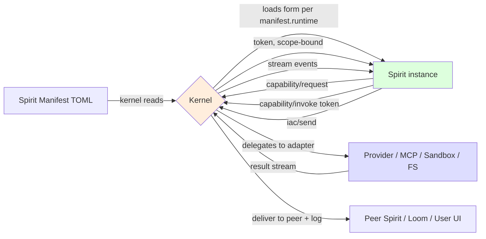
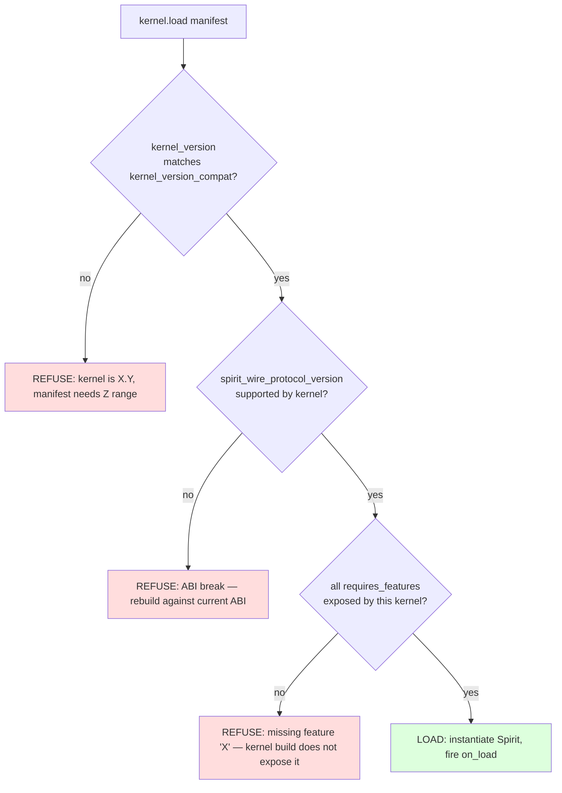

# MAOS — Spirit Development & Sharing

> **A note from your writer.** This document is practical. The architecture says **what** we built; the design report explains **how we thought about it**; this guide tells you **how to ship a Spirit on it**. If you have an idea for an agent and a toolchain you like, you should be able to read this end-to-end in an afternoon and have a working Spirit by the next.

> **Actor's framing (founder, 2026-05-06).** *"MAOS kernel and sub-modules are the grand theater. Spirits are actors in the play. The user is the director of the play."* If the kernel is the theater (stage, lighting, sound, audit-trail, exits), **your Spirit is an actor on it**. This guide teaches actor craft: how to take direction from the user (the director), how to perform within the manifest's declared scope (your character's blocking), how to invoke the skills you know (your scripts), how to signal back to the director when you need direction (`epistemic.halt`), and how to leave the stage cleanly at the end of the scene. The director may run the play autonomously while at dinner — your Spirit's posture (`autonomous-with-halt`) lets the director step away — or step in scene-by-scene to direct in detail (`assistive` posture; every action approved). **Your job as a Spirit author is to write actors who serve the director's intent and are pleasant to direct.** Theater provides the conditions; you write the performance.

> **📍 Phasing reconciled (2026-05-06).** This guide's Spirit-form references (rust-inproc / subprocess / wasm-component, §4.1–§4.3) and Spirit-author tutorials are reconciled with the PRD Step 8 canonical 8-phase structure: **v0.1 Foundational** (kernel + placeholder Spirit only) → **v0.3 Butler** (anticipatory single-Spirit) → **v0.5 Researcher + Observer** (exploratory single-Spirit + first opt-in distillation) → **v0.8 Founder Loop** (multi-Spirit Orchestrator+Worker wedge demo) → **v1.0 Team-ready** (subprocess Spirit form publicly shippable; third-party authors land here) → **v1.5 Diagnostic-Architect** → **v2.0 Technical** (WASM Spirit form) → **v2.5 Ecosystem-adoption**.
>
> **Spirit-author reading order:** **Butler (v0.3) is the first reference Spirit to study** for anticipatory single-Spirit patterns + on_idle hook + epistemic_policy mechanics. **Researcher (v0.5) is the second** for exploratory patterns + parallelism + first opt-in §9.5 distillation. **Worker + Orchestrator examples** in this guide become directly applicable at v0.8 and beyond — the multi-Spirit pattern this guide's later sections assume only ships at v0.8. **Subprocess form is v1.0+** (the first form a third-party author can publish independently); **rust-inproc** is available v0.1+ but is for kernel-bundled reference Spirits, not third-party publishing. Skill-package authoring methodology (§13) and ABI usage (§5) are canonical and stable across phases.

---

## How to read this document

Find your entry point:

| You are here | Start at |
|---|---|
| *"I want to build my first Spirit. What language? What contract?"* | §2 → §3 → §4 |
| *"I want to ship my Spirit. What artifact? Where does it go?"* | §3 → §7 → §9 |
| *"I want to install someone else's Spirit. How do I trust it?"* | §7 → §8 |
| *"My Spirit broke when MAOS upgraded. What did I forfeit?"* | §6 → §11 |
| *"Just walk me through the whole thing"* | Read top-to-bottom |

The document mirrors the architecture's vocabulary precisely. When something is contested — when a choice has trade-offs — I cite the architecture's section so you can read the rationale alongside the recipe.

Visual conventions:

- **Boxed quotes** are scenarios — concrete situations a Spirit author lives through.
- *Italicized terms* on first use appear in the glossary at the end.
- Code fences with `mermaid` are diagrams that should also read clearly as text.
- Code fences with `toml`, `rust`, `typescript`, etc. are runnable in the version of MAOS they target — I'll mark the version.

---

## §1 The four-question entry point

Before any code, answer four questions for your Spirit. Most authoring failures trace back to skipping one of these.

| Question | Why it matters |
|---|---|
| *What does my Spirit **do**?* (one sentence) | If you can't compress it to one sentence, it's two Spirits. The substrate prefers many small specialized Spirits to one large generalist; sub-Spirit composition is cheap. |
| *What **memory** does it need?* (working / episodic / semantic / procedural; private / shared / collective) | Memory scope is declared in the manifest and enforced by the kernel. Get it wrong and the Spirit silently fails to read the data it needs. (Design report §2 covers the matrix.) |
| *What **capabilities** does it need?* (which Layer-1 primitives, which MCP servers) | Capabilities are tokens the kernel issues, not libraries you import. A Spirit asks for `provider.stream`, `mcp.call(github)`, `bash.exec` — not `import Anthropic` or `axios`. |
| *What **posture** is appropriate?* (cautious / assistive / autonomous, plus per-class custom presets) | Posture maps approval classes to behaviors. Get it wrong and either every action prompts (annoying) or nothing prompts (dangerous). |

If you have answers to all four, write them at the top of your Spirit's README before you write any TOML. They become the manifest's identity, memory, capabilities, and posture sections respectively.

---

## §2 The Spirit contract — language-agnostic, by design

The most important sentence in this entire document is the one Winston etched into the architecture: **a Spirit is *behavior*, not *infrastructure*.**

What that means in practice: **your Spirit binary does not bundle an LLM SDK, an HTTP client, an MCP client, or a sandbox runtime.** All of that work flows through the kernel via Layer-1 capabilities (architecture §4.6). Your code contains lifecycle hook handlers, IAC frame handlers, decision logic, the system-prompt template, and predicate callbacks. That's it.

The implications are large enough to dwell on:

- **Your Spirit stays small.** The reference Rust Spirits target hundreds of KB to a few MB. Subprocess Spirits in TypeScript come in around the same. WASM components (v2.0) will be even tighter.
- **You can use any language with a JSON-RPC client.** The Spirit Wire Protocol (architecture §5.2) is JSON-RPC over stdio; TypeScript, Python, Rust, C#, Go, Ruby — anything that can `read line, write line` to stdio works.
- **Every external call is uniformly audited.** Because all I/O flows through the Capability Registry, the user can audit *exactly* what your Spirit asked for and when. This is what makes "no invisible actions" (Journey 10's invariant) achievable.
- **The same source code can target multiple binary forms.** A behavior module compiled to a Rust crate is the same behavior compiled to a `wasm32-wasip2` component. The wire-protocol-to-WIT translation is mechanical; the behavior is the same.



The Spirit (green) is a behavior module. The kernel (yellow) is infrastructure. The adapters (blue) are kernel-managed. The Spirit never reaches outside the green box; the kernel never reaches inside it.

If you're tempted to add `import openai` or `import { anthropic } from "@anthropic-ai/sdk"` to your Spirit, stop. The architecture is telling you it's the wrong layer. Use `provider.stream` instead.

---

## §3 The three Spirit forms

A Spirit's *form* is the binary shape it ships in. Three forms exist or are planned. They share the same TOML manifest, the same lifecycle hooks, the same capability surface — only the binding differs.

| Form | `runtime` value | Available in | Best for |
|---|---|---|---|
| **In-process Rust crate** | `rust-inproc` | v0.1 onward | Factory-default Spirits compiled with the kernel. Highest performance. Rust only. Trust is implicit (the binary is part of MAOS). |
| **Subprocess binary** | `subprocess` | v1.0 onward | Third-party Spirits in any language with a JSON-RPC client. Per-platform binary. Process-isolated. The first form a third party can ship without contributing to MAOS itself. |
| **WASM component** | `wasm-component` | v2.0 onward | Capability-isolated by construction. Single portable artifact. The form that powers the third-party Spirit ecosystem at scale. WIT contract `maos:spirit@1.0`. |

Architecture §13 (Phased Roadmap) commits to this timeline — v0.1 ships only `rust-inproc`; v1.0 introduces `subprocess`; v2.0 introduces `wasm-component`. **Choose your form based on when you're shipping.** If your Spirit needs to ship before v1.0 lands, it has to be `rust-inproc`. If you're shipping in 2026 alongside the v1.0 release, `subprocess` is the practical choice. If you're targeting the v2.0+ ecosystem, design for `wasm-component`.

The good news: **the manifest and behavior are portable across forms.** A Spirit you write in Rust today as `rust-inproc` can be repackaged as `subprocess` later (compile to a binary; replace the trait with the wire protocol; manifest's `runtime` field changes; nothing else does).

### Trade-offs at a glance

| Property | rust-inproc | subprocess | wasm-component |
|---|---|---|---|
| Languages supported | Rust only | any with JSON-RPC client | any compiling to wasm32-wasip2 |
| Binary form | source crate (git URL + commit) | per-platform binary (×4 typical) | single `.wasm` artifact |
| Trust ceiling | implicit (compiled with kernel) | configurable per manifest | capability-isolated by WIT |
| Hot-swap cost | trait-replacement; in-process | process restart; ~20–50ms | component re-instantiation; ~ms |
| IPC cost on hot path | function call | JSON over stdio | WIT typed call |
| Build complexity | `cargo build` | `cargo build` / `npm run build` / etc. | language-specific WASM toolchain |
| Distribution | crates.io or git URL | per-platform binary tree in registry | single artifact in registry |

You're not picking a form for life. You're picking the cheapest path to your first user.

---

## §4 Build your first Spirit

Three walkthroughs, one per form. They build the same Spirit — a deliberately small one called `wordcount` that responds to a word and returns the count of times it appears in a file. Tiny but realistic: it asks for `fs.read`, calls `provider.stream` for natural-language summarization, emits a typed output frame, and respects the Spirit Wire Protocol.

### §4.1 Tutorial — Rust in-process Spirit

This is the v0.1+ form. Compile-time linked into the kernel; ships as part of MAOS or as a downstream Rust crate the kernel pulls.

#### Project layout

```
spirits/wordcount/
├── Cargo.toml
├── manifest.toml
├── system-prompt.md
└── src/
    └── lib.rs
```

#### `Cargo.toml`

```toml
[package]
name = "spirit-wordcount"
version = "0.1.0"
edition = "2024"

[dependencies]
maos-spirit-sdk = "0.1"   # provided by MAOS; the only dependency a Spirit needs
serde = { version = "1", features = ["derive"] }
serde_json = "1"
```

Note what's *not* here: no `anthropic`, no `reqwest`, no `tokio` (the kernel provides the runtime), no `tracing` (telemetry goes through the Telemetry Stream). The `maos-spirit-sdk` crate is your single dependency; it brings the trait definitions and the kernel-imported capability handles.

#### `manifest.toml`

```toml
[identity]
class = "wordcount"
version = "0.1.0"
display = "Word Count Spirit"
maintainer = "Lunarpulse <lunarpulse@gmail.com>"

[implementation]
runtime = "rust-inproc"
crate = "spirit-wordcount"
spirit_wire_protocol_version = "1.0"

[compatibility]
kernel_version_compat = "^0.1"
spirit_wire_protocol_version = "1.0"
requires_features = ["provider.stream", "fs.read", "output_shape"]

[cognitive]
default_model = "claude-haiku-4-5"
system_prompt = "spirits/wordcount/system-prompt.md"
prompt_caching = false

[memory]
private = { transcript = "rolling-7-days", vector = false }

[capabilities.required]
"provider.stream" = { models = ["claude-haiku-4-5"] }
"fs.read"         = { roots = ["./"] }

[posture]
preset = "assistive"
prompt_on = ["readonly_scoped"]   # we'll prompt before reading any file — small Spirit, cautious by default
silent_allow = []

[sandbox]
profile = "t1"   # no exec; just reads and provider calls
network = "allowlist"
allowed_hosts = ["api.anthropic.com"]

[budget]
tokens_per_hour = 50_000
parallel_tool_calls = 1

[output_shape]
predicates = [
  { kind = "json_schema", tags = ["wordcount.result"], schema = "schemas/wordcount.result.json" },
]
```

#### `src/lib.rs`

```rust
use maos_spirit_sdk::*;

pub struct WordcountSpirit {
    handle: SpiritHandle,
}

impl Spirit for WordcountSpirit {
    fn on_load(handle: SpiritHandle) -> Result<Self, Error> {
        Ok(Self { handle })
    }

    fn on_frame(&mut self, frame: IacFrame) -> Result<(), Error> {
        // The frame's payload carries {word: string, file_path: string}
        let req: WordCountRequest = serde_json::from_value(frame.payload.clone())?;

        // Ask the kernel for permission to read the file.
        let read_token = self.handle.capability_request(
            Capability::FsRead,
            CapabilityScope::path(&req.file_path),
        )?;

        // Invoke the capability; the kernel returns a stream.
        let mut stream = self.handle.capability_invoke(
            &read_token,
            json!({ "path": req.file_path }),
        )?;

        let mut content = String::new();
        while let Some(chunk) = stream.next()? {
            if let Event::Data(bytes) = chunk {
                content.push_str(std::str::from_utf8(&bytes)?);
            }
        }

        let count = content.split_whitespace()
            .filter(|w| w.eq_ignore_ascii_case(&req.word))
            .count();

        // Emit a typed result frame back to the requester.
        self.handle.iac_send(IacFrame {
            recipient: frame.sender.clone(),
            kind: FrameKind::Response,
            tags: vec!["wordcount.result".into()],
            payload: json!({ "word": req.word, "count": count }),
            response_to: Some(frame.id),
            ..Default::default()
        })?;

        // Token is dropped at end of scope; kernel auto-releases.
        Ok(())
    }
}

#[derive(serde::Deserialize)]
struct WordCountRequest {
    word: String,
    file_path: String,
}

// Kernel-discoverable entry: the manifest's `crate = "spirit-wordcount"` looks for this.
maos_spirit_sdk::declare_spirit!(WordcountSpirit);
```

#### Run it

```bash
$ maosctl load spirits/wordcount/manifest.toml
loaded spirit: wordcount-001 (class: wordcount, version: 0.1.0)

$ maosctl invoke wordcount-001 --payload '{"word": "the", "file_path": "./README.md"}'
sent frame frame-abc123
received frame frame-abc124 in 1.2s
{ "word": "the", "count": 47 }
```

That's it. No HTTP, no SDK, no socket code. The kernel handled the file read, the provider call (had we needed one for summarization), the audit logging, the sandbox enforcement.

### §4.2 Tutorial — Subprocess Spirit (TypeScript)

This is the v1.0+ form. Your Spirit ships as a per-platform binary. The kernel spawns it as a child process; you communicate via JSON-RPC over stdio.

We'll write the same Spirit in TypeScript with sidebars showing equivalent fragments in Python and Rust.

#### Project layout

```
spirits/wordcount-ts/
├── package.json
├── manifest.toml
├── system-prompt.md
├── tsconfig.json
└── src/
    └── index.ts
```

#### `package.json`

```json
{
  "name": "spirit-wordcount-ts",
  "version": "0.1.0",
  "main": "dist/index.js",
  "bin": {
    "spirit-wordcount": "dist/index.js"
  },
  "dependencies": {
    "@maos/spirit-sdk": "^1.0"
  },
  "scripts": {
    "build": "tsc"
  }
}
```

Again — only one MAOS dependency. The SDK provides the JSON-RPC plumbing and typed bindings for the Spirit Wire Protocol.

#### `manifest.toml`

The only differences from §4.1 are the `[implementation]` block:

```toml
[implementation]
runtime = "subprocess"
binary = "dist/index.js"
spirit_wire_protocol_version = "1.0"
```

…and the `[compatibility]` section's `kernel_version_compat = "^1.0"` (since subprocess Spirits are a v1.0+ feature). Everything else identical.

#### `src/index.ts`

```typescript
import { Spirit, SpiritHandle, IacFrame, Capability } from "@maos/spirit-sdk";

interface WordCountRequest {
  word: string;
  file_path: string;
}

class WordcountSpirit implements Spirit {
  constructor(private handle: SpiritHandle) {}

  async onLoad(): Promise<void> {
    // No setup needed for this Spirit.
  }

  async onFrame(frame: IacFrame): Promise<void> {
    const req = frame.payload as WordCountRequest;

    const readToken = await this.handle.capabilityRequest({
      capability: Capability.FsRead,
      scope: { path: req.file_path },
    });

    let content = "";
    for await (const chunk of this.handle.capabilityInvoke(readToken, { path: req.file_path })) {
      if (chunk.type === "data") content += chunk.bytes.toString("utf8");
    }

    const count = content
      .split(/\s+/)
      .filter((w) => w.toLowerCase() === req.word.toLowerCase()).length;

    await this.handle.iacSend({
      recipient: frame.sender,
      kind: "response",
      tags: ["wordcount.result"],
      payload: { word: req.word, count },
      response_to: frame.id,
    });
  }
}

import { runSpirit } from "@maos/spirit-sdk";
runSpirit(WordcountSpirit);
```

#### Sidebar — same logic in Python

```python
from maos_spirit_sdk import Spirit, SpiritHandle, run_spirit, Capability

class WordcountSpirit(Spirit):
    def __init__(self, handle: SpiritHandle):
        self.handle = handle

    async def on_frame(self, frame):
        req = frame.payload
        token = await self.handle.capability_request(Capability.FS_READ, {"path": req["file_path"]})
        content = ""
        async for chunk in self.handle.capability_invoke(token, {"path": req["file_path"]}):
            if chunk.type == "data":
                content += chunk.bytes.decode("utf-8")
        count = sum(1 for w in content.split() if w.lower() == req["word"].lower())
        await self.handle.iac_send(
            recipient=frame.sender,
            kind="response",
            tags=["wordcount.result"],
            payload={"word": req["word"], "count": count},
            response_to=frame.id,
        )

run_spirit(WordcountSpirit)
```

#### Sidebar — same logic in Rust as a subprocess Spirit (note the `runtime = "subprocess"` change)

The same Rust code from §4.1 works, with one change to its top-level entry: instead of `declare_spirit!()` (which exports the in-proc trait), use `run_subprocess_spirit::<WordcountSpirit>()`. The SDK auto-detects the form from the build target. Same business logic; different binding.

#### Build and run

```bash
$ npm install && npm run build
$ maosctl load spirits/wordcount-ts/manifest.toml
loaded spirit: wordcount-002 (class: wordcount, version: 0.1.0, runtime: subprocess, pid: 47821)

$ maosctl invoke wordcount-002 --payload '{"word": "the", "file_path": "./README.md"}'
sent frame frame-def456
received frame frame-def457 in 1.4s
{ "word": "the", "count": 47 }
```

Notice the kernel printed the subprocess PID. You can kill that process and the kernel will detect it (subprocess Spirit crash → kernel logs `spirit_crash` telemetry → respawns from the journal).

### §4.3 Sketch — WASM-component Spirit (v2.0)

WASM component Spirits arrive in v2.0. The contract is mostly settled; the toolchain is what we're waiting on. Below is the WIT contract sketch and a glimpse at the build flow.

#### `wit/spirit.wit` (sketch — finalized for v2.0)

```wit
package maos:spirit@1.0;

interface lifecycle {
  load: func(manifest: string) -> result<unit, error>;
  start: func(snapshot: option<bytes>) -> result<unit, error>;
  swap-in: func(predecessor-state: option<bytes>) -> result<unit, error>;
  on-idle: func();
  on-frame: func(frame: iac-frame);
  on-telemetry: func(event: telemetry-event);
  snapshot: func() -> bytes;
  unload: func();
}

interface kernel-imports {
  capability-request: func(cap: capability, scope: string) -> result<token, error>;
  capability-invoke: func(token: token, args: string) -> stream<event>;
  capability-release: func(token: token);
  iac-send: func(target: recipient, frame: iac-frame, mode: send-mode) -> result<frame-id, error>;
  iac-retract: func(message-id: frame-id, reason: string) -> result<unit, error>;
  memory-read: func(tier: memory-tier, key: string) -> result<bytes, error>;
  memory-write: func(tier: memory-tier, key: string, value: bytes) -> result<unit, error>;
  approval-request: func(cls: approval-class, intent: string, payload: bytes) -> approval-decision;
  posture-propose: func(new-posture: posture) -> result<unit, error>;
  subspirit-spawn: func(manifest: string, scope: string) -> result<spirit-id, error>;
  epistemic-halt: func(payload: epistemic-payload) -> halt-id;
}

world spirit {
  export lifecycle;
  import kernel-imports;
}
```

#### Build flow (v2.0 sketch)

```bash
$ cargo component build --release --target wasm32-wasip2
$ maos-publish spirits/wordcount-wasm/manifest.toml \
    --artifact target/wasm32-wasip2/release/spirit_wordcount.wasm \
    --sign keys/publisher.ed25519
```

The output is a single `.wasm` file portable across Linux/macOS/Windows on x86_64/aarch64 — one artifact, all platforms. The kernel verifies the signature, instantiates the component, and loads it under capability-isolated execution.

WASM Spirits are **the form for the third-party ecosystem** because they make publication safe at scale. Until they land in v2.0, subprocess is the workable bridge.

---

## §5 The Spirit Wire Protocol — consumer view

Architecture §5.2 specifies the protocol formally. This section is the consumer-friendly version: what calls a Spirit author makes and receives.

### Calls the kernel makes *into* your Spirit

Your Spirit implements these — they're the lifecycle and event hooks.

| Method | When the kernel calls it | What you do |
|---|---|---|
| `lifecycle/load(manifest)` | Once, after the kernel parses your manifest | Allocate any per-Spirit state. Return `ok` or fail fast. |
| `lifecycle/start(snapshot?)` | Once, after load | Begin processing. If you were resumed from a snapshot, rehydrate from `snapshot`. |
| `lifecycle/swap_in(predecessor_state)` | If your Spirit was hot-swapped onto an existing instance | Decide what state to import (working memory, open token IDs). |
| `event/inbound(frame)` | Whenever an IAC frame arrives | Handle it. Your business logic lives here. |
| `event/telemetry(event)` | Whenever a telemetry event matches your subscription filters | React, accumulate, or ignore — your call. |
| `lifecycle/snapshot()` → `state` | Before swap_out, migrate, or snapshot | Return a serializable state blob. |
| `lifecycle/pause()` / `lifecycle/resume()` | User-initiated | Persist what you need; resume cleanly. |
| `lifecycle/unload()` | Before shutdown | Final transcript flush. Don't acquire new tokens. |
| `epistemic/resolve(halt_id, resolution)` | If you previously halted and the user resolved | Decide whether to resume, halt again, or accept termination. |

### Calls your Spirit makes *into* the kernel

You call these — they're the requests for capabilities, IAC, memory, etc.

| Method | What it does |
|---|---|
| `capability/request(cap, scope)` → `token` | Ask the kernel for permission to do X. Returns a token (or fails if your manifest doesn't permit it, or the user denied). |
| `capability/invoke(token, args)` → `stream<event>` | Use the token. Kernel dispatches to the appropriate adapter; you consume the stream. |
| `capability/release(token)` | Drop a token early. Otherwise tokens auto-release on expiry. |
| `iac/send(target, frame, mode)` | Send a frame to a peer or to the user's notification surface. |
| `iac/retract(message_id, reason)` | Take back something you said. |
| `memory/read(tier, key)` / `memory/write(tier, key, value)` | Access memory in scope. |
| `approval/request(class, intent, payload)` → `decision` | Explicit human-in-the-loop checkpoint. Blocks. |
| `posture/propose(new_posture)` | Ask the kernel to shift your posture; kernel decides per its rules. |
| `subspirit/spawn(manifest, scope)` → `spirit_id` | Spawn a child Spirit with narrower capability surface. |
| `epistemic/halt(payload)` → `halt_id` | Declare you cannot proceed; freeze in-flight tokens; surface to user. |

### One worked example — a streaming provider call

```typescript
// Ask for permission
const token = await handle.capabilityRequest({
  capability: "provider.stream",
  scope: { model: "claude-sonnet-4-6", max_tokens: 4000 },
});

// Invoke; consume the stream
let response = "";
for await (const event of handle.capabilityInvoke(token, {
  messages: [{ role: "user", content: "Summarize: " + content }],
})) {
  switch (event.type) {
    case "content_delta":
      response += event.text;
      break;
    case "stop":
      break; // stream ended
    case "error":
      // The kernel's audit caught something. Surface to user; don't retry blindly.
      throw new Error(event.message);
  }
}

// Token can be released early or left to expire; either is fine.
await handle.capabilityRelease(token);
```

You wrote no HTTP. You wrote no SDK setup. You handled streaming with a typed event union the SDK gives you. The kernel handled the actual Anthropic API call, the streaming response parsing, the audit logging, and the budget accounting.

### Stability promise

Architecture §5.2 commits: this method set is **stable across kernel minor versions within a major**. v1.0 Spirits run on v1.7 kernels. New methods, removed methods, or changed signatures are major-version breaks (v1.x → v2.0). Your Spirit declares `spirit_wire_protocol_version` so the kernel can refuse to load Spirits whose ABI requirements exceed what it can satisfy.

In practical terms: code against v1.0 once; ride minor releases without changes; expect to recompile against the v2.0 ABI when WASM Spirits arrive.

---

## §6 Compatibility resolution

Three independent constraints govern whether a kernel can load your Spirit:

```toml
[compatibility]
kernel_version_compat        = "^1.0"          # semver range
spirit_wire_protocol_version = "1.0"           # exact ABI
requires_features            = [               # feature names
  "epistemic.halt",
  "explanation_shape",
  "output_shape.callback",
  "subspirit.spawn"
]
```

The kernel checks all three at load. The check is fail-fast and produces actionable error messages.



### What goes in `requires_features`

Architecture-specified feature names that may or may not be present in a kernel build:

- `epistemic.halt` — the Layer-1 capability and `[epistemic_policy]` enforcement (architecture §4.6.1)
- `explanation_shape` — kernel-enforced "because" payload for proactive actions (architecture §5.1)
- `output_shape.callback` — the callback predicate kind (`json_schema` and `regex_required` are always available)
- `subspirit.spawn` — child Spirit spawning
- `posture.propose` — runtime posture change
- `wasm-component` — WASM Spirit form (only present from v2.0)
- `loom.publish` — collective-tier writes via Loom MCP server
- `a2a.send` — cross-Host peer mesh

This list grows as the kernel does. A Spirit that needs only `provider.stream`, `fs.read`, `iac.send` declares no `requires_features` — those are baseline since v0.1. A Spirit that uses epistemic halt explicitly lists it so a hypothetical v0.5 kernel (pre-halt) refuses cleanly instead of crashing later.

### When the kernel says no

The error tells you which check failed:

```
$ maosctl load my-spirit/manifest.toml
ERROR: cannot load spirit
  reason: kernel does not satisfy compatibility constraints
  detail: requires_features=["epistemic.halt"], not exposed by this kernel build (you are running 0.5.2; epistemic.halt requires ^1.5)
  suggestion: upgrade the kernel to >=1.5, or remove epistemic.halt from this Spirit's manifest
```

The Spirit isn't broken; the environment can't host it. Same mechanism would catch a v2.0 manifest run against a v1.0 kernel — the wire-protocol version mismatch refuses cleanly.

---

## §7 The Spirit registry

The registry is **an MCP server** (architecture decision per Winston's Pass 5 contemplation). It's exposed over MCP-Streamable-HTTP — the same transport your kernel already speaks for tool servers and Loom. Operationally, this means: the kernel pulls Spirits the same way it pulls tool catalogs.

### Endpoints (MCP tools the registry exposes)

| Tool | Purpose |
|---|---|
| `registry.search(query, filters)` | Discovery. Returns Spirit-class summaries with capability surface, license, eval results, signature info. |
| `registry.manifest(class, version)` | Pulls just the TOML manifest for inspection. Cheap; lets you read what the Spirit asks for *before* committing. |
| `registry.artifact(class, version, form)` | Pulls the implementation artifact. `form` is one of `rust-source`, `subprocess-{platform}-{arch}`, or `wasm-component`. |
| `registry.verify(class, version, signature_id)` | Verifies the artifact's signature against the publisher's pinned key. |
| `registry.publish(package, signature)` | Uploads a new version. Publisher auth required. |
| `registry.deprecate(class, version, reason)` | Marks a version as unsafe to install fresh. Existing installs keep working. |

### Publish flow

```mermaid
sequenceDiagram
    participant D as Developer
    participant L as Local Spirit project
    participant K as Local kernel (test)
    participant R as Registry (MCP server)
    participant H as Other user's Host

    D->>L: write manifest, code, schemas
    D->>K: maosctl load manifest.toml (smoke test)
    K-->>D: load ok; smoke test passes
    D->>L: cargo build / npm run build
    D->>L: maos-package . (bundles per §9 layout)
    D->>L: maos-sign --key publisher.ed25519
    D->>R: registry.publish(package, signature)
    R-->>D: published: my-spirit-v0.2.0
    Note over D,R: time passes; another user wants the Spirit
    H->>R: registry.search(query="word count")
    R-->>H: [my-spirit-v0.2.0, ...]
    H->>R: registry.manifest("my-spirit", "0.2.0")
    R-->>H: manifest TOML
    Note over H: User reviews capability surface, license, signatures
    H->>R: registry.artifact("my-spirit", "0.2.0", "subprocess-linux-x86_64")
    R-->>H: binary + signature
    H->>R: registry.verify(...)
    R-->>H: signature valid (publisher_key_id: ...)
    H->>H: kernel.load(manifest)
```

### Install flow — what a Spirit consumer does

```bash
# Browse
$ maosctl registry search "word count"
my-spirit  0.2.0  by lunarpulse  MIT  fs.read,provider.stream  trust=public-untrusted

# Inspect
$ maosctl registry manifest my-spirit@0.2.0
[identity] class = "wordcount" ...
[capabilities.required] ...
[posture] preset = "assistive" ...

# Install
$ maosctl install my-spirit@0.2.0
fetched my-spirit-v0.2.0 (subprocess, linux-x86_64, 1.4 MB)
signature valid (publisher: lunarpulse, key id: ed25519:abc123...)
trust tier: public-untrusted (sandbox forced to T2; posture forced to cautious)
manifest reviewed: capabilities will prompt on first use
loaded as: wordcount-003

# Use
$ maosctl invoke wordcount-003 --payload '{"word": "the", "file_path": "./README.md"}'
PROMPT: Spirit 'wordcount' wants fs.read on './README.md'. allow / allow-always / deny / cancel?
> allow
{ "word": "the", "count": 47 }
```

### Pin or follow

A Host's manifest of installed Spirits records a version constraint per Spirit:

```toml
# ~/.maos/installed.toml
[[installed]]
class = "wordcount"
version = "0.2.0"             # exact pin
source = "registry://main"

[[installed]]
class = "research-helper"
version = "^1.0"              # auto-update within compatible range
source = "registry://main"
channel = "stable"

[[installed]]
class = "experimental-thing"
version = "latest"            # always grab newest from this channel
source = "registry://internal-only"
channel = "nightly"
```

The default is exact pin. Auto-update is opt-in per Spirit and only available on registries the user trusts. The `channel` knob lets a publisher ship `stable` / `beta` / `nightly` lines independently.

---

## §8 Trust and signing

This section is where the entire ecosystem's safety lives. Read it twice.

### Four trust tiers

| Tier | What it is | Sandbox floor | Posture floor |
|---|---|---|---|
| **Local** | Manifest on disk; no registry origin. The Spirit you're developing right now. | T0 / T1 (whatever your dev environment uses) | Whatever you set |
| **Org-internal** | Registry whose root cert is in your org-trust list. | Whatever the manifest declares (T2/T3 typical) | Manifest's declared posture honored |
| **Public-untrusted** | Public registry; valid signature; not reviewed. The default for anything you `install` from outside your org. | **T2 minimum (forced container) regardless of manifest** | **Forced `cautious` regardless of manifest preset** |
| **Public-vetted** | Public + reviewed by community/MAOS-team via meta-signature attestation. | Manifest's declared sandbox honored | Manifest's declared posture honored, with user's posture-ceiling clamps |

The kernel always applies the **strictest of (manifest's declared, tier's enforced)**. A `public-untrusted` Spirit cannot opt out of T2 sandbox even if its manifest says T0. A `public-vetted` Spirit that requests `autonomous` posture can still be clamped down by the user's overriding `posture.ceiling = "assistive"` setting.

This bounds the worst-case bad-Spirit blast radius **without** requiring central review of every Spirit ever published.

### Why the floor matters

> **A scenario.** A new Spirit appears in the public registry called `helpful-organizer`. The manifest claims `posture.preset = "autonomous"`, sandbox `T0`, capabilities including `fs.write` to `~/`, and `bash.exec` with no whitelist.
>
> Without the trust tier system, a user who installed it would be one approval-fatigue moment away from `rm -rf ~`.
>
> With the trust tier system, the kernel sees `public-untrusted`, forces sandbox to T2 (container), forces posture to `cautious` (every action prompts). The user has to consciously approve each `bash.exec`. The malicious behavior is exposed, not auto-executed. The user can audit the Transparency Log to see the Spirit's pattern and uninstall.

The trust floor is the difference between *npm-style ecosystem* (where typo-squatted packages exfiltrate credentials) and *MAOS-style ecosystem* (where typo-squatted Spirits get caught at the prompt boundary).

### Signing: Ed25519 publisher keypairs

Every published artifact is signed by its publisher.

- A publisher generates an **Ed25519 keypair** (`maos-keygen` produces one; you can also bring your own).
- At publish time, the publisher signs the package — manifest, implementation artifact, schemas — producing a single `publisher.sig`.
- The registry stores `(artifact_hash, signature, publisher_key_id)` together.
- Every Host has a **trust list** mapping publisher key fingerprints to trust tiers.
- The kernel verifies the signature on every install and refuses to load Spirits with invalid or missing signatures.

```bash
# Publisher side — once
$ maos-keygen --out keys/lunarpulse.ed25519
generated keypair, fingerprint: ed25519:abc123def456...

$ maos-publish my-spirit/ --key keys/lunarpulse.ed25519
package: my-spirit-v0.2.0
signed: ed25519:abc123...
published to registry://main
```

```bash
# Consumer side
$ maosctl trust add ed25519:abc123def456 --tier public-vetted
added trust: ed25519:abc123... → public-vetted

$ maosctl install my-spirit@0.2.0
signature valid; publisher trust tier: public-vetted
loaded with manifest's declared posture and sandbox.
```

### What signing does *not* do

Signing proves a specific publisher key produced this artifact. **It does not prove the Spirit is good.** A trusted publisher can ship a buggy Spirit; a vetted Spirit can have a regression. Signing is identity, not quality. Quality comes from the trust tier (`public-vetted` implies a review attestation), the eval results in the package, and the user's own audit of the Transparency Log after installation.

### Vetting attestations (for the `public-vetted` tier)

A Spirit becomes `public-vetted` when a vetting authority (community group, MAOS team, or org's internal review board) signs an **attestation** that links the publisher's signature to a review outcome:

```jsonc
{
  "package": "my-spirit-v0.2.0",
  "publisher_signature": "ed25519:abc123...",
  "attestation_kind": "manual-code-review",
  "reviewed_by": "maos-community-vetting-board",
  "reviewed_at": "2026-05-04T14:00:00Z",
  "outcome": "passed",
  "notes": "Capability surface matches declared behavior. No known supply-chain risks.",
  "attestation_signature": "ed25519:def456..."
}
```

Hosts that trust the attestation signer treat the Spirit as `public-vetted`. Hosts that don't fall back to `public-untrusted`. Vetting is decentralized — anyone can run a vetting authority; users choose which to trust.

### The audit you should always do

Before you install a third-party Spirit, even one signed by a publisher you trust, run:

```bash
$ maosctl registry inspect my-spirit@0.2.0
class: wordcount
version: 0.2.0
publisher: ed25519:abc123... (trust tier: public-vetted)
license: MIT
capabilities.required:
  - provider.stream (models: claude-haiku-4-5)
  - fs.read (roots: ./)
posture.preset: assistive
sandbox.profile: t1
eval-results: 4/4 tests passing (last run 2026-04-15)
attestations: 1 (community-vetting-board, 2026-05-04)
```

What to look for:
- **Capabilities.** Are they appropriate for what the Spirit claims to do? A "calculator" Spirit that requests `fs.write` and `bash.exec` is suspicious.
- **Sandbox profile.** Lower tiers (T0/T1) are okay for `public-vetted` Spirits doing read-only work; demand T2+ for anything writing or exec-ing.
- **Posture.** `autonomous` is fine for trusted Spirits in tightly-scoped contexts; treat it as a yellow flag otherwise.
- **License.** MIT/Apache-2.0/etc. should be present and SPDX-formatted.
- **Attestations.** Who vetted it? Do you trust the vetter?

If anything feels off, install with `--force-tier public-untrusted` even if the registry tier is higher. The kernel will apply stricter floors. You can always loosen later once you've audited the Transparency Log for a few sessions.

---

## §9 The package layout

A published Spirit is a directory tree. The structure is **fixed** so tooling can rely on it.

```
my-spirit-v1.2.3/
├── manifest.toml                    # Spirit Manifest (architecture §5.1) — required
├── README.md                        # human-readable description — required
├── LICENSE                          # SPDX identifier — required
├── changelog.md                     # required for any version > 0.1
├── system-prompt.md                 # the Spirit's system prompt template — required if cognitive.system_prompt is set
├── implementation/                  # at least one form required
│   ├── rust-inproc.crate.toml       # for rust-inproc: { git = "...", commit = "...", crate = "..." }
│   ├── subprocess/                  # for subprocess form
│   │   ├── linux-x86_64/
│   │   │   └── spirit-mything
│   │   ├── linux-aarch64/
│   │   │   └── spirit-mything
│   │   ├── darwin-arm64/
│   │   │   └── spirit-mything
│   │   └── windows-x86_64/
│   │       └── spirit-mything.exe
│   └── wasm-component/              # for wasm-component form (v2.0+)
│       └── spirit-mything.wasm
├── schemas/                         # all referenced JSON schemas
│   ├── output.schema.json
│   ├── explanation.schema.json
│   └── ...
├── eval-results/                    # optional but strongly recommended
│   ├── 2026-04-15-claude-sonnet-4-6.json
│   └── README.md
├── signatures/
│   ├── publisher.sig                # Ed25519 over the package — required
│   └── attestations/                # optional vetting attestations
│       └── community-board-2026-05-04.attest
└── docs/                            # optional further docs
    └── ...
```

Most Spirits ship one form. Only ship multiple forms if you have a reason to support all of them — most authors will pick subprocess (v1.0+) or wasm-component (v2.0+) and stop there. The reference Spirits ship `rust-inproc` because they're factory-default; nobody else needs to.

### What goes in `eval-results/`

The directory holds JSON files produced by `spirit-eval`. Each file represents one eval run. Format:

```jsonc
{
  "spirit_class": "wordcount",
  "spirit_version": "0.2.0",
  "kernel_version": "1.0.3",
  "model": "claude-haiku-4-5",
  "eval_suite": "wordcount.v1",
  "ran_at": "2026-04-15T10:00:00Z",
  "summary": { "passed": 4, "failed": 0, "skipped": 0 },
  "details": [
    { "case": "small-file", "outcome": "passed", "latency_ms": 1100, "tokens": 220 },
    { "case": "unicode-content", "outcome": "passed", "latency_ms": 1240, "tokens": 240 }
  ]
}
```

Consumers see the eval summary in `registry.search` results. It's how a quick browser distinguishes a Spirit that's been tested from one that hasn't.

### What's checked at publish time

The `maos-publish` command runs a series of checks before uploading:

1. **Manifest schema validation.** Every section conforms to the v1.0 manifest schema.
2. **Compatibility self-consistency.** `kernel_version_compat` and `spirit_wire_protocol_version` are not contradictory; `requires_features` references known feature names.
3. **License presence.** A SPDX-format LICENSE file exists.
4. **Schema files exist.** Every schema referenced in the manifest is present in `schemas/`.
5. **System prompt exists** (if referenced).
6. **Implementation exists** for at least one form, matching the `runtime` declared in `[implementation]`.
7. **Signature.** The package is signed; signature verifies.
8. **Eval results** (warn-only). If absent, publish proceeds with a warning.

A failed check blocks publish. The error tells you what's missing.

---

## §10 Authoring per-Spirit policies — the manifest sections that need real care

Five manifest sections deserve more editorial attention than the rest. Each is a place where misconfiguration costs the most: too lax and the Spirit harms its user; too strict and the Spirit refuses to function. This section walks each one with a bad example, a good example, and the reasoning.

### `[output_shape]` — what the Spirit promises about its output

**What it does.** Declares predicates that every output frame matching a tag must satisfy. The kernel rejects frames that fail; the Spirit must re-emit. Ensures downstream consumers can rely on a structural shape.

**Bad — over-constrained:**

```toml
[output_shape]
predicates = [
  { kind = "regex_required", tags = ["*"], pattern = "^Final answer:" },
]
```

This forces every single output frame — including conversational chitchat, status updates, intermediate thoughts — to start with "Final answer:". The Spirit becomes unusable; even greetings get rejected.

**Bad — under-constrained:**

```toml
# (no [output_shape] at all)
```

For a Spirit whose downstream consumers expect citations or confidence scores, omitting this means the Spirit can silently regress in some session and ship un-cited claims. There's no kernel-side guarantee.

**Good:**

```toml
[output_shape]
predicates = [
  # Only the "research.report" tagged frames need the strict shape.
  { kind = "json_schema",
    tags = ["research.report"],
    schema = "schemas/research-report.json" },
  # The "research.summary" tag has a lighter requirement: must end with Open Questions.
  { kind = "regex_required",
    tags = ["research.summary"],
    pattern = "## Open Questions" },
]
```

**The principle.** Predicates are tag-scoped. Tag your important outputs; leave casual outputs untagged. The kernel only checks predicates against tagged frames matching their `tags` list.

### `[explanation_shape]` — required for proactive Spirits

**What it does.** Forces a structured "because" payload alongside any proactive (origin = `spirit-auto`) action with mutating, interactive, or exec-capable consequences. The user sees *why* the agent acted.

**When to omit it.** When your Spirit's posture has no `silent_allow` or `notify_and_log` on the listed classes. A Spirit that always prompts on these classes has no proactive surface to gate.

**When you must include it.** When your Spirit ever takes mutating, interactive, or exec-capable actions without per-action user confirmation. This includes the Butler, the Tutor, the Wet-Lab Coordinator (proactive reagent prep), and any Sentinel-like Spirit that auto-contains anomalies.

**Good (Butler-style):**

```toml
[explanation_shape]
required_for_origins = ["spirit-auto"]
required_for_classes = ["mutating", "interactive", "exec_capable"]
schema = "schemas/butler-explanation.json"
```

The default schema (`maos.explanation.default.schema.json`) requires `{evidence, rule, prior_preference}` and is fine for most Spirits. Override only when your domain needs more (Wet-Lab might add `predicted_consumption`; Mira might add `confidence_score`).

**Bad — forgotten:**

A proactive Spirit ships without `[explanation_shape]`. The user gets notifications like "Butler did X" with no reason. Within a week, the user is annoyed enough to disable Butler. The Butler is now useless not because it was wrong but because it was inscrutable.

**The principle.** If your Spirit acts unprompted, the user must always see *why*. There is no "best-effort" mode. Build the explanation into your output frames or accept that your Spirit will be dismissed.

### `[epistemic_policy]` — the per-tag rules

**What it does.** Maps output frame tags to one of three actions: `verbalize_only` (the Spirit's own prose handles uncertainty), `flag` (output carries an `epistemic_marker`; delivered; logged; UI surfaces uncertainty), `halt` (Spirit transitions to `EpistemicHalt`; in-flight tokens freeze; user must resolve).

**The right mental model.** Halts are alarms, not doorbells. A well-tuned Spirit emits dozens of `verbalize_only` frames per session, a few `flag` frames, and at most one `halt` per session.

**Bad — over-halting (the catastrophe):**

```toml
[epistemic_policy]
default_action = "halt"               # halts on EVERY frame that doesn't match a rule
[[epistemic_policy.rules]]
tag = "claim.load_bearing"
on_confidence_below = 0.95            # halts on practically every claim
action = "halt"
```

Result: the Spirit halts on its first conversational message. Unusable.

**Bad — under-halting (the silent failure):**

```toml
# (no [epistemic_policy])
```

For a Researcher or Diagnostic Engineer, this is a regression to "hallucinate freely." The Spirit's confident-sounding wrong answer goes through unchallenged.

**Good — Researcher-style:**

```toml
[epistemic_policy]
default_action = "verbalize_only"

[[epistemic_policy.rules]]
tag = "claim.load_bearing"
on_confidence_below = 0.7
action = "halt"
on_evidence_conflict = "halt"

[[epistemic_policy.rules]]
tag = "claim.exploratory"
on_confidence_below = 0.3
action = "flag"
on_evidence_conflict = "flag"

[[epistemic_policy.rules]]
tag = "speculation"
action = "verbalize_only"

[[epistemic_policy.rules]]
tag = "conversational"
action = "verbalize_only"
```

**The principle.** Tag your output deliberately. Halt only on load-bearing claims. Flag (don't halt) on exploratory ones. Verbalize on conversation, observation, speculation. The kernel fails *open* — `default_action = "verbalize_only"` is the right baseline.

### `[budget]` — the monthly-bill protector

**What it does.** Caps token spend, dollar spend, and parallelism per Spirit. Warns at `warn_at_pct`; takes action at 100% per `on_breach`. Prevents the well-known agent failure of an LLM falling into a loop and burning the user's monthly budget in twenty minutes.

**Bad — too generous:**

```toml
[budget]
tokens_per_hour = 10_000_000          # an Opus runaway can spend hundreds of dollars per hour
spend_per_day_usd = 500.00
parallel_tool_calls = 50
on_breach = "log_only"                # never actually stops
```

Result: one bad day, $500 burned. The user uninstalls.

**Bad — too tight:**

```toml
[budget]
tokens_per_hour = 1_000               # not enough for a single research query
spend_per_day_usd = 0.10
parallel_tool_calls = 1
```

Result: the Spirit stops being useful before completing its first task.

**Good (Researcher-style for personal use):**

```toml
[budget]
tokens_per_hour = 200_000
spend_per_day_usd = 5.00
parallel_tool_calls = 3
warn_at_pct = 0.80
on_breach = "stop"
```

**The principle.** Set a hard ceiling that prevents disasters; warn early enough that the user can extend if they want; default `on_breach = "stop"` because the alternative (`throttle`, `log_only`) is for research/sandbox use only.

### `[posture]` — the autonomy stance

**What it does.** Maps the six approval classes (`readonly_scoped`, `readonly_search`, `mutating`, `exec_capable`, `control_plane`, `interactive`) to behaviors. Posture restricts; it cannot expand the manifest's declared capability ceiling.

**Bad — too autonomous for the trust context:**

```toml
[posture]
preset = "autonomous"
silent_allow = ["readonly_scoped", "readonly_search", "mutating", "exec_capable"]
prompt_on = []
```

For a `public-untrusted` Spirit, the kernel will clamp this anyway. But even for a trusted Spirit, this is a foot-gun: any tool the Spirit asks to invoke runs without prompt, including potentially destructive ones.

**Bad — too cautious for utility:**

```toml
[posture]
preset = "cautious"
prompt_on = ["readonly_scoped", "readonly_search", "mutating", "exec_capable", "control_plane", "interactive"]
silent_allow = []
```

The Spirit becomes unusable: every read requires user approval. Even glancing at a config file requires a click.

**Good (Architect-style):**

```toml
[posture]
preset = "principal-architect"        # Spirit-class-specific preset (architecture §6.4)
silent_allow = ["readonly_scoped", "readonly_search", "mutating"]   # source mutations within scope ok
prompt_on = ["exec_capable", "control_plane", "interactive"]         # deploys, sub-Spirit spawns, peer ACKs all prompt
prompt_with_diff_on = ["mutating"]    # show diff before silently approving (or override)
```

**The principle.** Match posture to the Spirit's role and the trust context. Prefer named presets over hand-rolled posture vectors. Test the posture against your own usage for a week; tune.

### One closing rule

When in doubt, **start strict and loosen**. A Spirit that prompts too often is annoying; a Spirit that fails closed is annoying for one session. A Spirit that's too autonomous can do real damage in one session.

---

## §11 Versioning and releases

Spirits use **semver** discipline — Major . Minor . Patch.

| Bump | When | Compatible with |
|---|---|---|
| **Patch** (1.2.3 → 1.2.4) | Bug fixes; no manifest changes; no behavior changes that could surprise consumers. | All consumers on `^1.2`. |
| **Minor** (1.2.x → 1.3.0) | New behavior, new tags, new optional manifest fields. Existing consumers unaffected. | All consumers on `^1.0`. |
| **Major** (1.x.x → 2.0.0) | Breaking changes: removed tags, changed output schema, removed capabilities, changed posture defaults. | New consumers only. Pinned consumers continue on the prior major. |

### Release channels

Most Spirits ship one channel. Larger Spirits may ship multiple.

| Channel | What's in it | Who consumes it |
|---|---|---|
| `stable` | The reviewed, eval-tested, public release. Default. | Most users. |
| `beta` | New functionality, eval-tested, but not yet stable-bumped. | Adventurous early adopters. |
| `nightly` | Latest commit; may be broken. | Only the publisher and CI. |

A consumer's `installed.toml` selects channel:

```toml
[[installed]]
class = "research-helper"
version = "^1.0"
channel = "stable"
```

Channels are independent. `1.3.0-beta.2` may exist on `beta` while `1.2.4` is the latest `stable`. Bumping to a new major version typically goes through a beta cycle before promoting to stable.

### Deprecation

A version can be `deprecated` (warning at install) or `withdrawn` (refuse install for fresh consumers; existing installs unaffected). Both states are advisory metadata in the registry; neither breaks already-installed Spirits.

```bash
$ maos-publish --deprecate my-spirit@1.0.0 --reason "security fix in 1.0.1; please upgrade"
```

The reason becomes visible in `registry.inspect` and in the install-time warning.

### Yanked vs withdrawn

The two are different:

- **Withdrawn** (registry-level): the registry still serves the artifact for already-installed consumers but won't serve it to new ones.
- **Yanked** (consumer-level): a consumer's `installed.toml` removes it; installs roll forward to the next compatible version.

Withdrawn is for "we found a security issue; please upgrade." Yanked is the consumer's local action.

---

## §12 Eval and CI

Architecture §6 of the design report covers the testing pyramid in depth. This section is the practical companion: what the canonical Spirit CI pipeline looks like.

### The pipeline


### Per-stage detail

**Lint and typecheck.** Standard. `cargo clippy`, `tsc --noEmit`, `mypy`, etc. Cheap; runs on every commit.

**Unit tests.** Use `spirit-test` to mock the Spirit ABI. Each lifecycle hook gets its own test. Mock capability requests return scripted tokens; mock capability invocations return scripted streams. Test that your `on_frame` handler returns the right output frames for the right inputs.

```typescript
// example unit test in TS
import { spiritTest } from "@maos/spirit-test";
import { WordcountSpirit } from "../src";

test("on_frame returns correct count for simple input", async () => {
  const harness = spiritTest(WordcountSpirit);
  harness.mockCapability("fs.read", { path: "test.md" }, { data: "the quick brown the fox" });

  const response = await harness.sendFrame({
    payload: { word: "the", file_path: "test.md" },
  });

  expect(response.payload.count).toBe(2);
});
```

**Integration tests.** Spin up a real kernel in test mode (in-process, no sandbox). Load your Spirit. Run scripted scenarios end-to-end. Verify output frames have the right shape, capability tokens are released, IAC frames go to the right recipients.

**Eval suite.** Real LLM calls against scripted scenarios with rubric-based grading. The output is `eval-results/<date>-<model>.json`, included in the package. Eval cost is real — run nightly or on release-candidate branches, not on every commit.

### What `spirit-test` does for you

The harness mocks the entire Spirit Wire Protocol. You don't need a kernel to unit-test a Spirit. The mocks let you script:

- Capability request/invoke returning specific data
- IAC frames arriving from "peers"
- Telemetry events arriving on subscribed topics
- Time advancing (for `on_idle` testing)
- Lifecycle transitions (load → start → swap → unload)

If a test needs the real kernel — say, to test sandbox enforcement — graduate to integration tests.

### What the eval suite enforces (per Spirit class)

| Class | Eval dimensions |
|---|---|
| Researcher | Synthesis accuracy, citation correctness, hypothesis novelty (rubric-judged) |
| Architect | Code correctness (test pass rate), test coverage delta, ADR clarity |
| Diagnostic Engineer | Hypothesis precision, false-positive rate, time-to-correct-diagnosis |
| Butler | Notification precision, false-trigger rate, user-actioned suggestion rate |
| Generic | Output-shape conformance, latency, token efficiency |

You ship eval results in the package. Consumers see them in the registry. Eval isn't a publish gate — but a Spirit without eval results gets a `eval-results: missing` flag in `registry.search`, and most consumers will pass.

---

## §13 Distillation-pattern Spirits and the Orchestrator class

Some Spirits — Orchestrators running an epic loop, Mira at the production edge ingesting telemetry from many sub-services, a Cortex node aggregating peer reports across a federation, Loom curating signals across institutions — face a problem that no single-task Spirit has: they consume from many peers over a long time horizon, and naively appending peer results into the LLM's context will overflow the model's context window long before the work completes. The substrate's answer is the **distillation pattern**, anchored by kernel primitives (Transparency Log + I11 + I12 + `log.recall`) and composed by the Spirit author. This section is for you if you're authoring one of those aggregating Spirits.

If you're writing a single-task worker (Coder, Reviewer, Researcher), this section is **not** for you — your Spirit's working memory is bounded by the task. Skip ahead to §14.

### §13.1 The pattern

```
                ┌─────────────────────────────────────┐
                │  HOT (active LLM context — bounded) │
                │  - current decision state           │
                │  - digested results from peers      │
                │  - in-flight task frames            │
                │  - recent LLM I/O                   │
                │  - queued user input pending        │
                └────────────┬────────────────────────┘
                             │ append digestate
                             ▲
                  ┌──────────┴───────────┐
                  │ distillation step    │
                  │ (Spirit-side LLM     │
                  │  summarizes raw      │
                  │  result into the     │
                  │  decision-relevant   │
                  │  fragment)           │
                  └──────────┬───────────┘
                             ▲ recall raw on demand
                ┌────────────┴────────────────────────┐
                │  COLD (Transparency Log + memory)   │
                │  - full Worker result payloads      │
                │  - all IAC frames (I2)              │
                │  - persisted digests with refs (I11)│
                └─────────────────────────────────────┘
```

**Step by step:**

1. A peer Spirit emits `task.complete` (or any other large payload) addressed to your aggregating Spirit. The kernel writes the full payload to the Transparency Log (Invariant I2) and routes it to your mailbox.
2. Your Spirit's `on_frame` handler **does not** append the raw payload to its LLM context. Instead, it triggers a distillation step: a small LLM call (Spirit-chosen model, prompt, token budget) that summarizes the raw payload into a ~150-token decision-relevant digest.
3. The digest is written to working memory (in-process Spirit state — no kernel involvement) tagged `kind: digest`. Optionally elevated to **episodic memory** (call existing `fs.write` on the private tier) for cross-session retention or **shared memory** (call `memory.share`) for inter-Spirit dissemination. Per Invariant I11, every persisted digest MUST carry `source_log_ref: [frame_id, ...]` and `distillation_depth: N`. Per Invariant I13 (ADR-018), every digest MUST also carry `intent_lineage: [intent_class, ...]` — the union of `intent` field values from all input frames it summarizes. The kernel rejects writes that lack `source_log_ref`, `distillation_depth`, or `intent_lineage` with `EDigestAuditChainMissing`. Consumers under intent `Y` admit the digest only if `intent_lineage ⊆ allowed-promotion-set(Y)` declared in their manifest (typed error `EIntentPromotionDenied` on rejection — closes consent-laundering through distillation).
4. Your Spirit's active LLM context contains: digests + decisions + recent I/O + queued external input. Raw payloads are *not* in active context.
5. When a downstream decision needs full evidence (e.g., the digest hedged a finding and you want to read the original Reviewer output), call `log.recall(filter)` to fetch frame headers, then `log.fetch(frame_id)` to materialize a payload (ADR-013). Recall queries are themselves logged.
6. When you emit any `decision.*`-typed frame (`task.assign`, halt, dispatch, consent), the kernel attaches `working_memory_digest_refs` populated from your declared in-context digests (I12). You don't write this field — the kernel does.
7. **Queue user-input frames.** Human-originated frames arriving during in-flight work should be buffered by your persona logic and processed at safe sequence points (between task completions, before new dispatches). Don't preempt in-flight delegations.

### §13.2 Multi-hop distillation (Cortex-class)

If your Spirit aggregates from peer Spirits that themselves aggregate (e.g., Loom curating institution-level digests), you're producing digest-of-digests. Per ADR-014, **`source_log_ref` flattens transitively at write time** — your hop-N digest references the *original raw frames*, not intermediate digests. The Spirit producing the higher-tier digest unions its inputs' refs and persists the unioned set. `distillation_depth` is monotonic; auditors and downstream Spirits walk a single hop from any digest back to raw evidence.

Loom patterns may decide policy on max acceptable depth (e.g., halt-and-escalate at depth 3+). The kernel doesn't enforce a max; it just requires the field be present and monotonic.

### §13.3 The four-metric benchmark suite (ship gate)

If your Spirit ships distillation, you MUST meet five metrics across an appropriate corpus before publishing:

| Metric | Floor | What you measure |
|---|---|---|
| **Digest-recall** (decision-equivalent recall) | ≥ 0.90 | Take a corpus of `(raw, ground-truth-decision)` pairs. Distill the raw. Hand a held-out replicator LLM the digest only. Measure whether it replicates the ground-truth decision. Pass if ≥ 90%. |
| **Digest-faithfulness** (no-contradiction rate) | ≥ 0.98 unflagged | Judge-LLM (different model family from your distiller, to avoid shared blindspots) checks `(raw, digest)` pairs for contradictions. Sample 1-in-100 in production via async audit. Flag rate above 2% blocks ship. |
| **Digest-hedge-preservation** | ≥ 0.95 | Corpus includes hedged statements ("possibly," "60% confident," "needs verification," "edge case"). Distill. Check whether the digest preserves the hedge or flattens it to certainty. The silent-killer metric — fight for it. |
| **Digest-traceability** | 100% (kernel-enforced) | Every digest carries non-empty `source_log_ref` and `distillation_depth`. The kernel enforces I11; failures here are kernel bugs, not Spirit bugs. Should always be 100%. |
| **Digest-secret-leakage** | 0% (zero-tolerance) | Corpus includes 10⁵ synthetic frames with planted secrets (API keys, capability tokens, private-key bytes). Distill. Verify no digest contains any planted secret. The kernel's pre-write redaction filter catches secret patterns at the IAC boundary; this metric verifies that distillation also does not leak. **Any false negative is a P0 ship-blocker.** |

**Corpus expectations:** at least 100 calibration cases plus 10⁵ synthetic-secret cases, hybrid:

- **50 synthetic cases** with hand-authored payloads containing planted critical findings (security vulnerabilities, test-failure-misreports, hedged-but-critical observations, contradicted-prior-findings). Include at least 10 hedge-preservation cases, 10 contradiction cases, and 10 planted-secret cases. These are calibration cases with ground-truth decisions.
- **50 real cases** drawn from your Spirit's actual usage history with retrospective labels.
- **10⁵ synthetic-secret cases** for the secret-leakage metric — auto-generated payloads with embedded API keys / tokens / cryptographic-key patterns; the kernel's redaction filter is exercised in addition to your distiller.

These thresholds are **uniform** across all distillation-shipping Spirits. The corpus per Spirit may differ (Mira uses telemetry; Orchestrator uses Worker `task.complete` payloads; Loom uses cross-institutional reports); the metrics and floors do not.

**Blocking criteria — ship gate:**

- Digest-recall < 0.85: do not ship. Hard floor.
- Digest-recall 0.85–0.90: ship-with-warning, document as known limitation, mandatory raw-recall on any decision frame.
- Digest-faithfulness unflagged-contradiction rate > 5%: do not ship.
- Hedge-preservation < 0.90: do not ship.
- Traceability < 100%: kernel bug, do not ship.
- **Secret-leakage > 0%: do not ship. Zero-tolerance.** A single planted secret reaching a digest is a P0 — fix the redaction filter or the distiller prompt before ship.

### §13.4 Authoring an Orchestrator Spirit — recipe

The Orchestrator class is the canonical reference Spirit for the distillation pattern. Recipe:

1. **Posture.** `autonomous-with-halt`. The Orchestrator runs a multi-hour epic loop without per-step human intervention; it halts on epistemic-policy triggers.

2. **Capability scope (manifest).** `fs.rw` on the project root; `fs.read` on skill search paths (`~/.maos/skills/`, `_bmad/skills/`, configured registries); `mcp.tools.invoke` on configured tool servers; `iac.send` for delegating tasks to Worker Spirits via local IAC bus or A2A; `provider.stream` for the distillation LLM and the Orchestrator's own reasoning; `log:recall:self` for raw-payload retrieval.

3. **Epistemic policy.** Per-tag rules, halt-recall preferred over halt-precision (the founder's preference; configurable). Tags include `story.acceptance_criterion.ambiguous`, `test.persistent_failure` (threshold: 3 consecutive iterations), `scope.expansion_detected`, `architecture.novel_decision_required`, `security.finding`. Default action: `verbalize_only`.

4. **Delegation primitive.** Emit `task.assign` IAC frames addressed by role (`@developer-spirit`, `@reviewer-spirit`) or specific instance ID. Frame names the skill explicitly (`skill: "bmad-dev-story"`, `target: "stories/7-1.md"`, `posture: "..."`). The kernel routes locally (kernel-internal IAC) or cross-host (A2A with ADR-012 typed-intent consent) per topology.

5. **Distillation step.** On every Worker `task.complete` frame, run an LLM-mediated distillation into a ~150-token digest. Persist the digest to episodic memory with `source_log_ref` and `distillation_depth`. Append digest to active context. Make the next decision based on digests.

6. **Recall on demand.** On any decision where the digest hedged a finding or where a downstream task needs full evidence, call `log.recall` to fetch raw frame headers and `log.fetch` to materialize payloads. Pull raw into context only for the duration of that decision.

7. **User-input queue.** Buffer human-originated frames in the Spirit's persona logic. Process at safe sequence points (between task completions, before new dispatches). Don't preempt in-flight Workers.

8. **Lifecycle hooks.** `on_swap_in` should restore the in-context digest set from episodic memory (so an Orchestrator can resume an epic across kernel restarts). `on_swap_out` should persist the digest set to episodic memory.

The reference Orchestrator Spirit (`spirit-orchestrator-bmad`) ships in v1.0 alongside the existing six classes. Third-party orchestrators (scrum-flavored, kanban-flavored, continuous-deployment-flavored) replace it without kernel changes — they're just different persona skills + different epistemic policies.

### §13.5 What this section is NOT

- It is not a how-to for the distillation prompt itself. The prompt is your design choice; the architecture takes no position on it (per ADR-006). Iterate on your prompt with your benchmark suite as ground truth.
- It is not a guarantee that the distillation pattern is required. Single-task Spirits with bounded contexts don't need it. The pattern shows its value at long-running, many-peer aggregation; below that threshold, the audit-chain overhead may not be worth the LLM-cost overhead.
- It is not a place to bake LLM provider choice into the contract. Choose your distiller model per cost / latency / hedge-fidelity trade-off; document the choice in your eval results.

### §13.6 Hermes-informed conventions for distillation Spirit-authors

Three conventions distillation-shipping Spirit-authors SHOULD adopt, drawn from [hermes-agent's `trajectory_compressor.py`](https://github.com/NousResearch/hermes-agent/blob/main/trajectory_compressor.py) reference implementation and codified in architecture §9.5:

1. **First-turn / last-turn anchoring.** Preserve the original task statement and the final output uncompressed in your digest. Compress only the middle. Hermes' compressor explicitly protects the first turns (system, human, first gpt, first tool) and the last N turns (final actions and conclusions). The v0.5 ship-gate measures task-preservation via cosine-similarity ≥ 0.95 between digest and original task statement; without first-turn anchoring, you fail this gate.

2. **Target token budget.** Declare `target_max_tokens` per distillation invocation. Default `max(2048, 0.15 × original_tokens)`, overridable per Spirit class via manifest `[distillation].target_max_tokens`. Compression ratios outside `[0.05, 0.25]` indicate either a compressor that's dropping content or not compressing — both fail the v0.5 ship-gate.

3. **Compressor model class.** Use a model class ≥ Sonnet-tier or 70B+ open-weights, with temperature ≤ 0.3. The v0.5 ship-gate's digest-recall floor (≥ 0.90 of hermes baseline on 100-trajectory corpus) effectively enforces this via outcome — if you compress with a 7B model, you fail.

The kernel does not enforce any of these conventions (per ADR-006, kernel takes no position on prompt structure or model choice). They are Spirit-author craft. But the v0.5 ship-gate corpus benchmarks against hermes' implementation — if your distillation underperforms hermes by more than 10%, you ship hermes' compressor wrapped instead of inventing.

### §13.7 Halt-and-resolve recipe (clarify_tool pattern)

When your Spirit needs the director's input — ambiguous task, contradictory evidence, missing context, methodology dispute — emit `epistemic.halt` with structured options. This is the actor signaling back to the director: *"I need direction here."* The pattern, drawn from [hermes-agent's `clarify_tool.py`](https://github.com/NousResearch/hermes-agent/blob/main/tools/clarify_tool.py) but operationalized at the kernel level via MAOS' built-in halt mechanism:

```
spirit emits:
  halt_type: epistemic.halt
  tag: <[epistemic_policy] tag matched>
  reason_summary: "<one-line description of what's ambiguous>"
  options:
    - id: a, label: "Snooze X for 75 min", action: <structured_action>
    - id: b, label: "Reschedule X now", action: <structured_action>
    - id: c, label: "Keep working", action: <structured_action>
  resolution_paths: [provided_context, accepted_halt, authorized_override]
```

Director sees the halt notification, picks an option (or types `provided_context` to override). Kernel journals the resolution; Spirit resumes with the resolution payload in working memory. **The structure matters:** options must be concrete (not "tell me what to do"), the reason must be one-line scannable on a phone, and the resolution must produce forward progress (Murat's stall-detector test: post-halt resumption produces forward progress on ≥ 90% of correct halts; otherwise the halt was a stall regardless of how it was framed).

The halt is the actor's most important interaction with the director. Treat it as performance, not as a function call.

### §13.8 Skill package interop (agentskills.io stance)

Skill package format is MAOS-native at v0.3/v0.5. Interop with external skill standards (agentskills.io and others) is a v1.0 decision; until then we focus on getting MAOS' native format right. A future ADR (TBD) will specify whether MAOS adopts agentskills.io as a bidirectional adapter (importable + exportable, with documented lossy round-trips), defines its own format and accepts ecosystem fragmentation, or stays silent until the wider ecosystem stabilizes. **Do not assume agentskills.io compatibility in v0.3/v0.5 Spirit-author work**; if your Spirit needs to interop with hermes-class skill packages, write the adapter as a Spirit-side skill and cite it in your manifest's `[skills.imports]` table.

---

## §14 Glossary

For first-time readers; defined the way I'd say them out loud. The architecture and design report each have their own glossaries; the entries below are specific to this development guide.

**Artifact** — The implementation file (or set of files) that ships with a manifest. Per form: a Rust source crate reference, a per-platform binary tree, or a `.wasm` component file.

**Channel** — A release line within a Spirit's version history (`stable`, `beta`, `nightly`). Independent — `1.3.0-beta.2` and `1.2.4-stable` can coexist.

**Form** — The binary shape a Spirit ships in. One of `rust-inproc`, `subprocess`, or `wasm-component`.

**Implementation** — The code that backs a Spirit's behavior. Distinct from the manifest, which is the contract.

**Manifest** — The TOML file that fully declares a Spirit class. The single source of truth across forms.

**Package** — A directory tree (or tarball) holding manifest + implementation + schemas + signatures + optional eval results. The unit of registry distribution.

**Publisher** — The identity that signs packages. Identified by an Ed25519 public key fingerprint.

**Registry** — An MCP server that holds Spirit packages, signed and versioned. Public, org-internal, or private.

**Signature** — An Ed25519 signature by the publisher over the package contents. Verifies integrity, not quality.

**Spirit Wire Protocol** — The JSON-RPC dialect over stdio that subprocess Spirits use to talk to the kernel. The architecture's §5.2 specifies it formally.

**Trust tier** — One of four classifications the kernel applies to a Spirit at load: `local`, `org-internal`, `public-untrusted`, `public-vetted`. Determines sandbox and posture floors.

**Vetting attestation** — A signed statement from a vetting authority that a specific Spirit version has passed a defined review. Promotes the Spirit from `public-untrusted` to `public-vetted` for Hosts that trust the vetter.

**Withdrawn** vs **Yanked** — Withdrawn is registry-level (not served to fresh consumers); yanked is consumer-local (removed from this Host's installed list).

**WIT contract** — The `maos:spirit@1.0` interface definition that v2.0 WASM Spirits export and import. WebAssembly Interface Types — the typed contract that lets WASM components interoperate.

---

## Closing

Build the smallest Spirit you can. Ship it to one user. Watch the Transparency Log together. Read the user's eyes when something works and when something annoys them. Tune the manifest. Iterate.

The substrate is built so the cost of your first Spirit is small — a manifest, a system prompt, maybe a few hundred lines of behavior code. The cost of your hundredth Spirit is also small, because the contract didn't change. **The kernel grows slowly so the ecosystem can grow fast.**

If the Spirit you want to build doesn't exist yet, that's the best reason to build it. The architecture is designed to welcome agents we haven't imagined; the methodology in this guide is how you bring them into being responsibly.

Ship something small this week. Tune it next week. Publish it when you're ready.

— *Paige*
