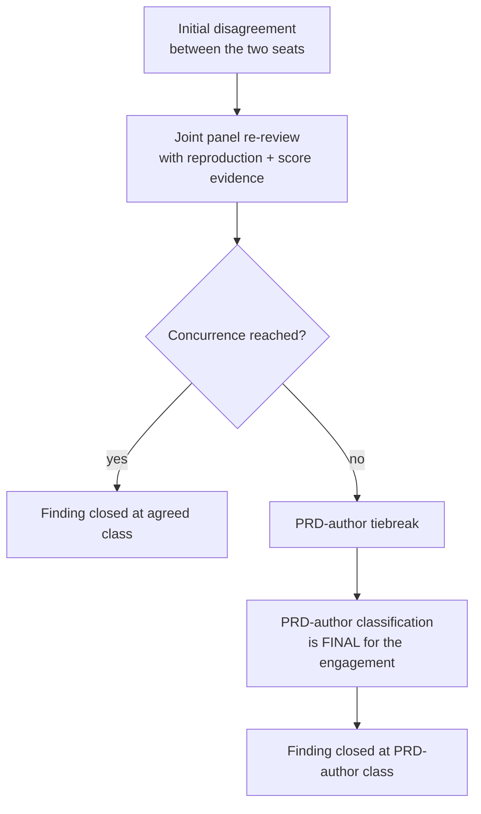

# MAOS Pen-Test Finding Triage Protocol

| | |
|---|---|
| **Engagement** | MAOS v1.0 Ship-Gate Pen-Test (Story 10.1b) |
| **Document** | Finding Triage Protocol |
| **Status** | Frozen for the engagement |
| **Governs** | How raw pen-test findings become classified, committed, and dispositioned before the v1.0 ship gate |
| **Companion docs** | [`engagement-manifest.toml`](engagement-manifest.toml) · [`owasp-risk-rating-v1.0-frozen.md`](owasp-risk-rating-v1.0-frozen.md) · [`findings/summary-schema.toml`](findings/summary-schema.toml) |

## 1. Purpose & Scope

This protocol defines the single, repeatable process by which every finding
produced during the MAOS pen-test engagement is **classified**, **committed**,
and **dispositioned** before MAOS may ship v1.0. It exists so that two
independently-reasoning parties — the external pen-test lead and the MAOS
security owner — cannot reach v1.0 with an unresolved disagreement about whether
a finding blocks the release.

The protocol is binding for the duration of the engagement. Any change to it
during the engagement is itself a configuration change and must be recorded in
[`engagement-manifest.toml`](engagement-manifest.toml).

**In scope:** every finding arising from the attack surfaces enumerated in the
engagement scope (Spirit admission & ComplianceClaim verification, capability
mediation, namespace isolation, A2A frame integrity, daemon admission, sandbox
enforcement, cryptographic operations, Transparency Log integrity, skill queue
persistence, and mTLS transport).

**Out of scope:** findings about operator-supplied configuration, third-party
deployments, or compliance-scope declarations (operator responsibility per
`STABILITY.md`). Such findings are recorded as informational and not
dispositioned by this protocol.

## 2. Joint Panel Composition

Every finding is dispositioned by a **joint panel** of exactly two voting
members:

| Seat | Held by | Responsibility |
|---|---|---|
| **Pen-test lead** | External tester of record | Brings the finding, the reproduction, and the technical risk argument. Advocates the attacker's perspective. |
| **MAOS security owner** | MAOS project security lead | Brings the MAOS threat model, the trust/sandbox tier definitions (ADR-004, ADR-009), and the substrate invariants (I1–I14). Advocates the defender's perspective. |

Both seats must concur on the final classification for a finding to be closed.

### 2.1 Tiebreak authority

If the two seats cannot agree on the classification of a finding after
evidence-backed re-review (see [§6 Escalation Path](#6-escalation-path)), the
disagreement is escalated to the **PRD author**, who holds the tiebreak vote.
The PRD author's classification decision is **final** for the engagement: it
binds both seats and is not subject to further appeal within this protocol.

The PRD author is engaged **only** on classification disagreement, never on
routine findings. Routine concurrence never invokes the tiebreak.

### 2.2 Conflict of interest

No seat may classify a finding against code they personally authored for this
engagement. If a finding implicates a panel member's own work, that seat
recuses from the classification vote and the PRD-author tiebreak is invoked
directly with the remaining seat.

## 3. Classification Process

### 3.1 Methodology

Each finding is classified using the **OWASP Risk Rating Methodology**, as
frozen for this engagement in
[`owasp-risk-rating-v1.0-frozen.md`](owasp-risk-rating-v1.0-frozen.md). The
frozen document — not any upstream or future OWASP revision — is the sole
authority for likelihood and impact scoring, factor weights, and the mapping
from score to severity class. Both panel seats score independently, then
reconcile; the reconciled score determines the severity class per the table
below.

### 3.2 Severity classes and ship disposition

| Severity | Class | OWASP risk band | Disposition | v1.0 ship effect |
|---|---|---|---|---|
| **P0** | Critical | Critical | Generates a **BLOCKING** remediation story | **Must be resolved before v1.0 ships.** Any open P0 fails the ship gate. |
| **P1** | High | High | Generates a **BLOCKING** remediation story | **Must be resolved before v1.0 ships.** Any open P1 fails the ship gate. |
| **P2** | Medium | Medium | Tracked as **advisory** | May be deferred past v1.0 at the panel's discretion; recorded with a deferred-remediation rationale. |
| **P3** | Low | Low | Tracked as **advisory** | Tracked; no remediation commitment required for v1.0. |

**P0 and P1 are ship-blocking.** The v1.0 ship gate reads `p0_open` and
`p1_open` from [`findings/summary.toml`](findings/summary.toml) and fails if
either is greater than zero. A finding cannot be "demoted" from P0/P1 to P2/P3
to clear the gate without a concurred re-classification recorded in the finding
writeup.

**P2 and P3 are advisory.** They do not block v1.0, but every P2/P3 finding is
still committed (see [§5 Findings Commitment Process](#5-findings-commitment-process))
so the advisory backlog is visible and traceable, not silently dropped.

### 3.3 Classification steps

For each finding, the panel:

1. **Reproduces** the finding against the pinned source commit
   (`environment.pinned_commit_sha` in
   [`engagement-manifest.toml`](engagement-manifest.toml)). A finding that
   cannot be reproduced against the pinned commit is recorded as
   *non-reproducible* and held open pending evidence, not silently closed.
2. **Scores** likelihood and impact per the frozen OWASP factors, independently
   per seat, then reconciles to a single score.
3. **Maps** the reconciled score to a severity class (P0–P3) per the table
   above.
4. **Dispositions** the finding per its class: BLOCKING story (P0/P1) or
   advisory entry (P2/P3).
5. **Records** the classification, the score breakdown, and both seats' names in
   the individual finding writeup.

## 4. P0 / P1 Classification Examples

The examples below are **reference precedents** for calibrating the panel's
classification judgement. They map OWASP impact/likelihood to concrete MAOS
trust-model consequences. Severity reflects the *worst realistic outcome* if the
finding were exploited against a correctly-configured v1.0 deployment, not the
narrowest reproduction.

> **Sandbox-tier ladder (ADR-004):** `kernel > T0 (trusted) > T1 (UID
> separation) > T2 (Landlock+seccomp) > T3 (T2 + container)`. Privilege
> increases leftward; any rightward→leftward movement across a tier boundary is
> a privilege escalation.

### 4.1 P0 — Critical (ship-blocking)

| # | Finding | Affected surface | Why P0 |
|---|---|---|---|
| P0-1 | **RCE via Spirit manifest parsing.** A crafted `manifest.toml` achieves arbitrary code execution in the manifest-parsing/ComplianceClaim-evaluation path (`maos-compliance` `evaluator.rs`, `maos-manifest`), which runs in the privileged daemon process *before* any sandbox tier (T1–T3) is applied to the Spirit. | Spirit admission & ComplianceClaim | Total pre-sandbox compromise: attacker code executes with daemon authority at Spirit-admission time, before the security boundary that is supposed to contain it even exists. Totality of impact (full host) + high likelihood (manifest parsing is an unauthenticated input boundary). |
| P0-2 | **Auth bypass on daemon admission.** A Spirit that *should* be rejected (missing/invalid ComplianceClaim envelope, untrusted vetter key, or a trust-tier that fails the strictest-of floor) is admitted and executed anyway via the daemon admission path (`maos-bin` `main.rs`, admission view). | Daemon admission | The admission gate is the root trust decision: it decides whether unvetted third-party code may run at all. Bypassing it means arbitrary attacker-authored code runs on the host with no attestation. Catastrophic impact, breaks the foundational invariant. |
| P0-3 | **Privilege escalation T0 → kernel.** A Spirit admitted at the T0 (trusted) tier — or any process within the T0 envelope — escapes the last sandbox envelope and gains kernel/host-OS privilege (e.g., reaches kernel memory/state, subverts the daemon process that holds kernel authority). | Sandbox enforcement; kernel boundary | T0 is the highest-privilege sandbox tier; breaking out of it reaches the kernel and the daemon authority that mediates every other boundary. Total substrate compromise; no further boundary remains to contain the attacker. |
| P0-4 | **Transparency Log forgery.** An attacker or adversarial Spirit can insert, alter, reorder, or delete rows in the per-Host SQLite Transparency Log (`maos-iac` `transparency_log.rs`) such that forged entries are accepted or the append-only/tamper-evident chain is broken without detection. | Transparency Log integrity | The Transparency Log is the audit spine every other invariant appeals to (I2, I4, erasure cascade, sealed-export, regulator-ready evidence). Forging it defeats accountability retroactively across the whole substrate and cannot be detected by any upstream control. |

### 4.2 P1 — High (ship-blocking)

| # | Finding | Affected surface | Why P1 (and not P0) |
|---|---|---|---|
| P1-1 | **Sandbox escape within the same host, T2 → T1.** A Spirit confined at the T2 tier (Landlock+seccomp) breaks the syscall filter / filesystem policy and gains the privileges of the T1 tier (UID separation only), remaining on the same host but with a widened syscall/filesystem surface. | Sandbox enforcement | A genuine upward privilege escape across a tier boundary — but the blast radius is bounded to the same host and the escape stops short of the kernel/daemon authority. Severe, ship-blocking, but not total substrate compromise. |
| P1-2 | **Information disclosure of another Spirit's memory.** A Spirit reads another Spirit's private memory or writes outside its declared namespace (invariant **I5**), via a bypass of `validate_namespace_read` / `validate_namespace_write` or a cross-tier read. | Namespace isolation | Cross-Spirit confidentiality breach violates the multi-Spirit isolation guarantee, but is a read/disclosure (not code execution) and does not by itself grant privilege escalation. Integrity of the victim's data is not necessarily lost. |
| P1-3 | **Capability mediation bypass for read-only operations.** A Spirit performs a capability-gated read-only operation (e.g., log-recall, memory scan) without a valid capability token, or with a token whose TTL / intent-class / posture-snapshot binding is wrong, circumventing the capability registry (`maos-kernel-core` `capability/`, `security_manager.rs`). | Capability mediation | The capability model is subverted, but the affected operations are read-only / low-integrity-impact, so the immediate damage is unauthorized reads rather than arbitrary write or execution. Still breaks a core mediation invariant → ship-blocking. |
| P1-4 | **Consent enforcement bypass for low-privilege intents.** A cross-Host A2A frame carrying a low-privilege intent (e.g., `Readonly` / `standard`) is delivered without a valid consent envelope, TOFU pin, or allowlist match, circumventing the receiver-side intake consent decision (`maos-a2a-core` `router.rs` intake). | A2A frame integrity | Cross-Host isolation is subverted, but only for low-impact intent classes — no high-privilege operation is authorised and no mTLS identity forge occurs. Breach of the cross-Host consent boundary, bounded impact → High, not Critical. |

> **Calibration note.** The P0↔P1 line tracks whether the failure grants the
> attacker **arbitrary execution or root audit-forgery authority** (P0) versus a
> **bounded escalation, disclosure, or mediation breach** that stops short of
> full substrate control (P1). When in doubt, the panel scores both and escalates
> a disagreement per [§6](#6-escalation-path) rather than defaulting down.

## 5. Findings Commitment Process

All findings are committed to the repository so the engagement's evidence and
dispositions are durable, reviewable, and machine-checkable by the ship gate.
Nothing is tracked only in conversation, tickets, or external tools.

### 5.1 Individual finding writeups

Every finding — P0 through P3 — is documented in its own writeup under
[`docs/pen-test/findings/`](findings/). Each writeup records, at minimum: the
finding id and title, the affected attack surface and crate/file, the
reproduction (steps + pinned commit), the OWASP likelihood/impact score and the
severity class assigned, both panel seats' names, and the disposition (BLOCKING
story link for P0/P1, or advisory rationale for P2/P3).

### 5.2 Summary file

The engagement's findings are aggregated in
[`findings/summary.toml`](findings/summary.toml), whose format is defined by
[`findings/summary-schema.toml`](findings/summary-schema.toml) — a single
`[gate]` table carrying exactly the open-count and provenance fields the v1.0
ship gate reads: `p0_open`, `p1_open`, `engagement_start`, `engagement_end`,
and `owasp_methodology_commit`.

Provenance is anchored in two places:

- **`owasp_methodology_commit`** *(in `summary.toml`, required)* — the commit
  SHA that froze the OWASP methodology document
  ([`owasp-risk-rating-v1.0-frozen.md`](owasp-risk-rating-v1.0-frozen.md)).
  This pins *which* scoring methodology the panel used; the CI gate additionally
  asserts the frozen file's SHA-256 digest at that commit. It is `summary.toml`'s
  sole commit-SHA field.
- **Pinned engagement source commit** *(system of record:
  [`engagement-manifest.toml`](engagement-manifest.toml)
  `environment.pinned_commit_sha`)* — the pinned source commit against which
  every finding was reproduced. `summary.toml` references this commit through
  the engagement manifest rather than duplicating it, so the manifest remains
  the single source of truth for the pinned source and the two artifacts cannot
  drift.

Together these pin *what code* the findings describe (engagement manifest) and
*which methodology* scored them (`summary.toml`), so a finding cannot be
silently invalidated by a later refactor between engagement and ship, nor
re-scored under a different OWASP revision.

### 5.3 Commitment lifecycle

1. A finding is raised → the panel classifies it ([§3](#3-classification-process)).
2. The individual writeup is committed under `findings/`.
3. `summary.toml` is updated with the finding's contribution to the open counts
   and (on re-classification or remediation) its resolution.
4. The ship gate fails on any non-zero `p0_open` / `p1_open` until every P0/P1
   finding is resolved and the counts return to zero.

A P0/P1 finding is "resolved" only when its BLOCKING story is merged *and* the
panel re-confirms the resolution against the (possibly updated) pinned commit;
the count decrement is not automatic on story merge.

## 6. Escalation Path

A classification dispute follows a single, bounded path. There is no parallel
appeal channel.

1. **Initial disagreement.** The two seats produce different classifications for
   the same finding.
2. **Joint panel re-review with evidence.** Both seats re-present the
   reproduction against the pinned commit, the OWASP score breakdown, and the
   MAOS trust-model consequence argument. The goal is concurrence, not
   compromise — a finding is not downgraded to split the difference.
3. **PRD-author tiebreak (final).** If concurrence is still not reached, the
   PRD author reviews the evidence and assigns the classification. This decision
   is **final** for the engagement: it binds both seats, is recorded in the
   finding writeup as tiebreak-resolved, and is not subject to further appeal
   within this protocol.

The escalation path is invoked only when concurrence genuinely fails. Findings
that the two seats agree on at initial classification never enter it.
