# ENT-1 — Enterprise-governed `cohort-a2a-daemon` posture

**Applies to:** v2.2 and later, `network`-feature builds only.
**Decision record:** [ADR-057](../adr/ADR-057-enterprise-governance-is-a-daemon-posture.md).
**Gate:** `check-multi-tenant-loom` legs `enterprise-governance-reaches-cohort-daemon`, `enterprise-governance-daemon-dead-wire-negative`, `enterprise-governance-daemon-dispatch-threaded` (blocking at v2.2).

There is no enterprise Spirit. The "enterprise-governed Spirit class" is a **posture you instantiate on the collective daemon**, and it attaches to a reference Spirit you already run. This runbook is the template.

---

## 1. What the posture does

With the posture attached, every collective operation the `cohort-a2a-daemon` serves — a cross-team cohort digest read — runs the full chain before it is admitted:

```mermaid
flowchart LR
  A["inbound cohort:digest-read<br/>(TLS-pinned peer)"] --> B["cohort consent gate<br/>(manifest accept tuple)"]
  B --> C["SSO principal<br/>MAOS_SSO_*"]
  C --> D["Enterprise PDP<br/>MAOS_PDP_POLICY*"]
  D --> E["kernel mint<br/>Scope::LoomRead"]
  E --> F["identity.asserted<br/>kind-30 TL row"]
  F --> G["at-rest seal<br/>MAOS_KMS_MASTER_KEY"]
  G --> H["SIEM forward<br/>MAOS_SIEM_FILE"]
  H --> I["request admitted<br/>reply obligation minted"]
```



Any refusal in **SSO / PDP / mint / at-rest** turns the pending ACK into a NACK: no grant, no reply obligation, no cohort audit row. A SIEM sink failure is reported to the operator and the record stays buffered in the Transparency Log — it does not refuse the read (the record is already durable; see §6).

Without the posture the daemon serves those same reads with none of it. That was the state of every release before v2.2.

---

## 2. The four environment groups

Set as many groups as your deployment governs. Setting **none** leaves the daemon byte-for-byte in its pre-v2.2 behaviour, and the daemon says so on stderr at boot.

### SSO — who is asking

| Variable | Required | Meaning |
|---|---|---|
| `MAOS_SSO_JWKS` | yes | static JWKS document (JSON) for signature verification |
| `MAOS_SSO_ISSUERS` | yes | comma-separated trusted `iss` values |
| `MAOS_SSO_AUDIENCE` | yes | expected `aud` |
| `MAOS_SSO_ALGS` | no | allowed algorithms; default `RS256,ES256` |
| `MAOS_SSO_ASSERTION` | yes | the OIDC assertion the daemon presents at issuance |

Any `MAOS_SSO_*` variable being present turns the SSO arm on. If the verifier then cannot be built or is unhealthy, the subsystem is demoted to *configured-down* and **denies** issuance — it never falls open.

### PDP — may they

| Variable | Required | Meaning |
|---|---|---|
| `MAOS_PDP_POLICY_FILE` | one of | path to a Cedar policy set |
| `MAOS_PDP_POLICY_INLINE` | one of | inline Cedar policy text |
| `MAOS_PDP_REFRESH_INTERVAL_MS` | no | reconciler cadence, default 30 000 |
| `MAOS_PDP_STALENESS_TTL_MS` | no | fail-closed TTL, default 300 000 |

The daemon evaluates one issuance per collective operation with the authenticated principal's attributes (`sub`, `iss`, `aud`, plus any claim attributes) as PDP request attributes.

### At-rest — sealed

| Variable | Required | Meaning |
|---|---|---|
| `MAOS_KMS_MASTER_KEY` | yes | hex-encoded 32-byte org master key |

The daemon takes its sealer from the *same* hook the collective store uses. Unset ⇒ the governed record is byte-identical plaintext (the v1.5 default). Set-but-unhealthy ⇒ the read is refused; a sealed posture never degrades to plaintext.

### SIEM — exported

| Variable | Required | Meaning |
|---|---|---|
| `MAOS_SIEM_FILE` | yes | localhost sink path for the redacted NDJSON/CEF projection |

---

## 3. The daemon attach pattern

The posture binds to the `control_spirit` already named in your daemon TOML. That Spirit's manifest must declare the collective read grant, because the kernel mints `Scope::LoomRead` only for a Spirit whose manifest declared it:

```toml
# spirits/<control_spirit>/manifest.toml
[capabilities.required.loom]
read = true
```

The composition root admits that Spirit through the ordinary admission path at daemon start. Nothing seeds the policy table by hand.

Boot output tells you exactly which posture you got:

```
maos: cohort-a2a-daemon collective reads are ENTERPRISE-GOVERNED (Story 13.5a) —
      control spirit researcher pid 0, sso=true, pdp=true, at-rest-seal=true, siem=true
```

or, if no group is set:

```
maos: cohort-a2a-daemon collective reads are UNGOVERNED — set
      MAOS_SSO_*/MAOS_KMS_*/MAOS_SIEM_* (and MAOS_PDP_POLICY*) to attach the
      enterprise daemon posture (Story 13.5a)
```

**Read that line on every deploy.** It is the difference between governed and silently ungoverned.

---

## 4. Worked example — governing `researcher` under the collective daemon

`researcher` is an existing reference Spirit; its manifest already declares `loom.read`. No new crate, no scaffold, no `maos-spirit-cli` generation step is needed — the posture attaches to what you run today. (When you *do* need a fresh Spirit for other reasons, the real scaffold is `maos-spirit-derive`'s `#[spirit]` + `maos-spirit-sdk` / `spirit_test`, with `examples/example-spirit` and `cargo run -p xtask -- example-spirit-regen` as the living template — not ADR-008, which is the registry publish/discover protocol.)

`daemon.toml`:

```toml
manifest_path   = '/etc/maos/cohort-manifest.toml'
authority_keys  = ['<hex ed25519 authority pubkey>']
local_host      = 'host-a'
control_spirit  = 'researcher'
peers           = [ ... ]

[tcp]
listen_addr     = '0.0.0.0:8443'
own_cert_chain  = '/etc/maos/tls/host-a.chain.pem'
own_private_key = '/etc/maos/tls/host-a.key.pem'
peer_pins       = [ ... ]

[digest_summary]
frames    = 0
halts     = 0
conflicts = 0
```

Launch:

```sh
export MAOS_SSO_JWKS="$(cat /etc/maos/idp-jwks.json)"
export MAOS_SSO_ISSUERS='https://idp.example.com'
export MAOS_SSO_AUDIENCE='maos-cohort-daemon'
export MAOS_SSO_ASSERTION="$(cat /run/secrets/daemon-oidc-assertion)"

export MAOS_PDP_POLICY_FILE=/etc/maos/policy.cedar

export MAOS_KMS_MASTER_KEY="$(cat /run/secrets/org-master-key.hex)"

export MAOS_SIEM_FILE=/var/log/maos/siem.ndjson

export MAOS_COHORT_DAEMON_CONFIG=/etc/maos/daemon.toml
export MAOS_ONE_SHOT=cohort-a2a-daemon
maos
```

Verify a governed read afterwards:

```sh
# the provenance row for the principal that authorized the read
maosctl audit query --kind identity.asserted

# the sealed governed-collective-read record, correlated to the digest request_id
maosctl audit query --intent-contains cohort:digest-read-governed
```

---

## 5. Failure modes and what they mean

| Symptom | Cause | Action |
|---|---|---|
| Boot log says **UNGOVERNED** | no enterprise env group set, or `MAOS_COHORT_DAEMON_CONFIG` absent | set the groups; re-deploy |
| Boot fails: `control Spirit manifest ... is unreadable` | `control_spirit` has no `spirits/<id>/manifest.toml` under the process CWD | run `maos` from the workspace/install root, or fix `control_spirit` |
| Every collective read NACKs with `kernel capability mediation failed` | control Spirit does not declare `[capabilities.required.loom] read = true` | add the grant, re-admit |
| Every collective read NACKs with `enterprise SSO is configured but MAOS_SSO_ASSERTION is absent` | SSO group set without an assertion | supply `MAOS_SSO_ASSERTION` |
| Every collective read NACKs with `enterprise PDP denied capability issuance for loom.read` | a Cedar `forbid` fires for the control-Spirit subject | fix the policy, or accept the deny |
| Every collective read NACKs with `at-rest seal refused` | `MAOS_KMS_MASTER_KEY` set but the KMS is unhealthy | repair the KMS; the daemon will not write plaintext under a sealed posture |
| `SIEM export ... failed — records buffered` | snapshot, projection, or sink I/O failed | repair the local sink or inspect filesystem/SQLite health; reads keep flowing and records remain buffered |

---

## 6. Known limitations (v2.2)

- **Live-WAL SIEM export uses a consistent snapshot.** `maos-audit::query_with_redaction` still requires a quiesced database for deterministic projection. The enterprise runtime therefore creates a transactionally consistent `VACUUM INTO` snapshot for each live forward, projects that snapshot, and removes it afterwards. Snapshot creation failure is surfaced as sink-down and leaves the source log untouched.
- **The SIEM watermark is process-local.** Once-per-record holds within one daemon lifetime. After a restart the tail may be re-projected; deduplicate downstream.
- **PDP subject granularity is per-posture.** The daemon governs under one control-Spirit pid, so a Cedar subject-deny binds to the daemon, not to an individual tenant Spirit.
- **Air-gap builds cannot take this posture.** `maos-sso`, `maos-secrets`, and `maos-siem` are optional dependencies behind the `network` feature and are compiled out of `air-gap` builds. `maos-pdp` is non-optional, so PDP mediation remains available there; SSO, at-rest seal, and SIEM do not.
